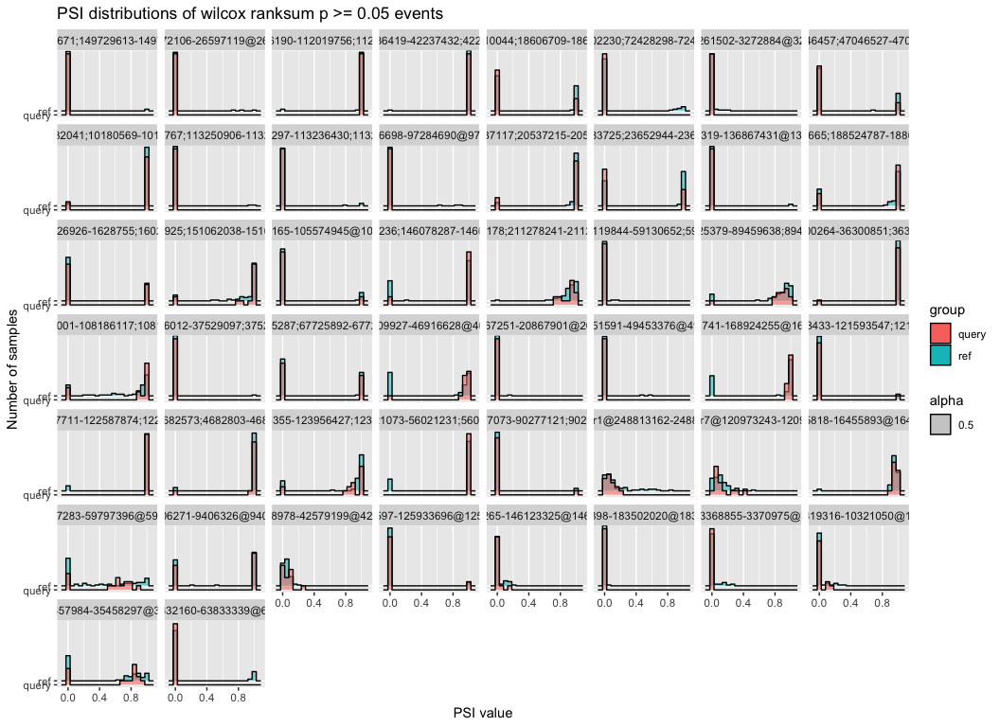
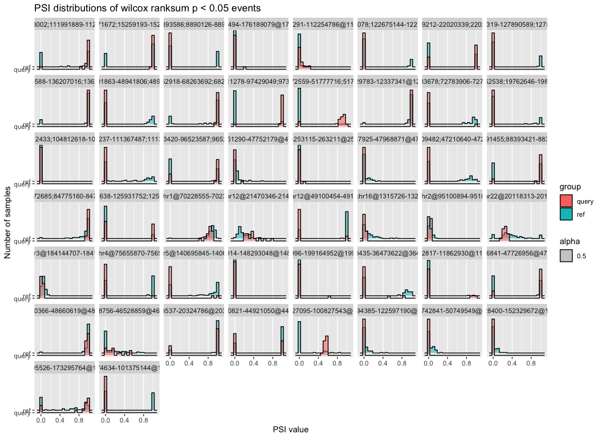

# Test Wilcoxon ranksums on TARGET subset
Cindy Liang (celiang@ucsc.edu)
2026-03-06

## Set up

## load libraries

``` r
# load libraries
library(ggplot2)

set.seed(1)

# define global size for plots
global_size <- 20

# define plot theme (size) presets
plot_theme = list(
 theme_bw(),
 theme(
   legend.position = "right",
   axis.title = element_text(size = global_size),
   plot.title = element_text(size = global_size),
   axis.text = element_text(size = global_size),
   axis.text.x = element_text(
     hjust = 1,
     margin = margin(t = 0, r = 80, b = 0, l = 0),
     size = global_size
   ),
   legend.title = element_text(size=global_size),
   legend.text=element_text(size=global_size - 8)
 )
)
```

## Directories and files

``` r
# find the root-level repo directory
repo_root <- rprojroot::find_root(rprojroot::is_git_root)

# define the data directories
# exploration dir
exploration_dir <- file.path(repo_root, "exploration/compare_psi_distributions")
data_dir <- file.path(exploration_dir, "data")

# target subset metadata
target_metadata_file <- file.path(data_dir, "SraRunTable-TARGET.csv")
# target subset combined psi results
combined_psi_file <- file.path(data_dir, "combined_psi_results.rds")
```

## read in files

``` r
# read in TARGET sample metadata
target_metadata <- readr::read_csv(target_metadata_file)
```

    Warning: One or more parsing issues, call `problems()` on your data frame for details,
    e.g.:
      dat <- vroom(...)
      problems(dat)

    Rows: 27279 Columns: 119
    ── Column specification ────────────────────────────────────────────────────────
    Delimiter: ","
    chr  (75): Run, analyte_type, Assay Type, BioProject, BioSample, biospecimen...
    dbl  (19): Bytes, Consent_Code, Bases, AvgSpotLen, version, AvgReadLength (r...
    num   (1): run (run)
    lgl  (22): data_type (run), research_project (exp), research_project (run), ...
    dttm  (2): ReleaseDate, create_date

    ℹ Use `spec()` to retrieve the full column specification for this data.
    ℹ Specify the column types or set `show_col_types = FALSE` to quiet this message.

``` r
# combined PSI results from notebook 01-target_subset_psi_value_comparison
psi_combined <- readRDS(combined_psi_file)
```

## Combine PSI table with TARGET metadata to associate samples with cancer type

``` r
# We only care about body site and run fields in target metadata
filtered_target_metadata <- target_metadata |>
  dplyr::select(study_name, Run) |>
  dplyr::filter(grepl("TARGET", study_name)) |>
  dplyr::mutate(Run = paste0(Run, "_PSI"))

# we need to associate the body site with accession number, so first pivot the table longer (so that we are back to one column of just accession IDs)
cancer_type_psi_table <- psi_combined |>
  tidyr::pivot_longer(
    cols = contains("_PSI"),
    names_to = "Run",
    values_to = "PSI"
    ) |>
  dplyr::inner_join(
    filtered_target_metadata, 
    by = c("Run")) |>
  # assign group type (ref vs query)
    dplyr::mutate(
    group = dplyr::case_when(
      study_name ==  "TARGET: Kidney\\, Wilms Tumor (WT)" ~ "query",
      study_name !=  "TARGET: Kidney\\, Wilms Tumor (WT)" ~ "ref"
    )
  )
```

Calculate Wilcoxon ranksum for PSI distributions

``` r
# then pivot wider by Run (accession) so that we can calculate all PSI values for a given pos_id
wide_cancer_type_psi <- cancer_type_psi_table |>
  dplyr::select(Run, group, gene_id, pos_id, label, event_type, PSI) |>
  tidyr::pivot_wider(
    names_from = c(Run, group),
    values_from = PSI
  )
```

Run wilcoxon ranksum test

``` r
# for now convert NA PSI values to 0 (otherwise will get "not enough y observations" in wilcoxon test)
wide_cancer_type_psi[is.na(wide_cancer_type_psi)] <- 0

wilcox_test_events <- wide_cancer_type_psi |>
  # subset randomly by 1000 events because wilcoxon test takes a really long time
  dplyr::slice_sample(n = 1000) |>
  # perform wilcoxon ranksum row by row (per pos_id PSI values)
  dplyr::rowwise() |>
  dplyr::mutate(wilcox_p =
                  wilcox.test(
                    dplyr::c_across(ends_with("_ref")),
                    dplyr::c_across(ends_with("_query"))
                  )$p.value) |>
  dplyr::ungroup()
```

Filter for distributions that failed the wilcoxon test to see if they
look like biologically interesting distributions Make series of
histograms faceted by pos_id

``` r
fail_wilcox_test_events <- wilcox_test_events |>
  dplyr::filter(wilcox_p >= 0.05) |>
  # arbitrarily grab a couple to plot distributions
 dplyr::slice_sample(n = 50)

# pivot longer so distribution can be plotted
long_fail_wilcox <- fail_wilcox_test_events |>
  tidyr::pivot_longer(
    contains("_PSI"),
    names_to = "sample", 
    values_to = "PSI"
  ) |>
  # extract group info
  dplyr::mutate(
    group = stringr::str_split_i(sample, "_", i = 3))

ggplot(long_fail_wilcox, aes(x = PSI, y = group, fill = group, alpha = 0.5)) +
  ggridges::geom_ridgeline(stat = "binline", bins = 20, scale = 0.8) + 
  facet_wrap(~ pos_id) + 
  labs(title = "PSI distributions of wilcox ranksum p >= 0.05 events",
       x = "PSI value",
       y = "Number of samples") 
```

<div id="fig-hist_fail_wilcox_test_dists">



Figure 1

</div>

These actually look fairly reasonable for a wilcox test to fail. Check
what it looks like when the wilcox test is successful

``` r
succeed_wilcox_test_events <- wilcox_test_events |>
  dplyr::filter(wilcox_p < 0.05) |>
  # arbitrarily grab a couple to plot distributions
 dplyr::slice_sample(n = 50)

# pivot longer so distribution can be plotted
long_succeed_wilcox <- succeed_wilcox_test_events |>
  tidyr::pivot_longer(
    contains("_PSI"),
    names_to = "sample", 
    values_to = "PSI"
  ) |>
  # extract group info
  dplyr::mutate(
    group = stringr::str_split_i(sample, "_", i = 3))

ggplot(long_succeed_wilcox, aes(x = PSI, y = group, fill = group, alpha = 0.5)) +
  ggridges::geom_ridgeline(stat = "binline", bins = 20, scale = 0.8) + 
  facet_wrap(~ pos_id) + 
  labs(title = "PSI distributions of wilcox ranksum p < 0.05 events",
       x = "PSI value",
       y = "Number of samples") 
```

<div id="fig-hist_sig_wilcox_test_dists">



Figure 2

</div>

I used ridgeplots because stacked histograms made it hard to figure out
where the ref and query distributions were
