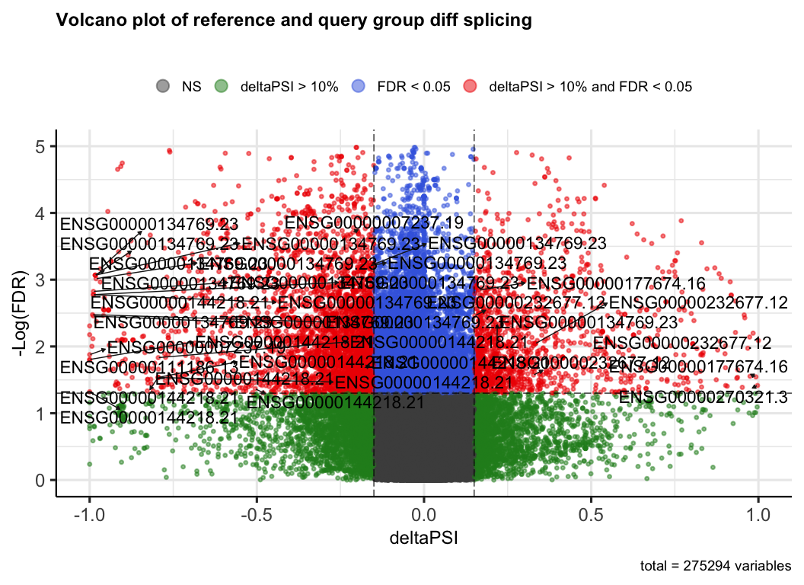

# Test Wilcoxon ranksums on TARGET subset
Cindy Liang (celiang@ucsc.edu)
2026-07-22

## Introduction

This notebook performs differential analysis on splice event usage (PSI)
values generated from the splice compendium workflow. The analyses
included in this notebook consist of:

1.  Statistical test for differential splicing: A Wilcoxon ranksum test
    is used to compare the PSI value distributions for splice events
    used in a reference and query group of samples. P-values are
    corrected for multiple testing using the Benjamini-Hochberg method.

2.  Calculating the magnitude of differential splicing: The magnitude of
    differential splicing is calculated for each splice event by taking
    the difference between the median PSI value between the query and
    reference group.

3.  Visualizing splice events by significance and magnitude of
    differential splicing: Volcano plots are created to plot the
    adjusted p-value and dPSI values of each splice event type between
    the query and reference groups. One Volcano plot is created for all
    splice event types, and separate volcano plots are provided to split
    splice event types by category.

4.  Filtering splice event types by significance score and ranking by
    magnitude of differential splicing: splice event position IDs, their
    dPSI, and adjusted p-values are finally exported as a TSV based on
    user-defined adjusted p-value and dPSI filters. These splice events
    are ranked in decreasing dPSI magnitude.

## Set up

## load libraries

``` r
# load libraries
library(ggplot2)

set.seed(1)

# define global size for plots
global_size <- 20

# define plot theme (size) presets
plot_theme = list(
 theme_bw(),
 theme(
   legend.position = "right",
   axis.title = element_text(size = global_size),
   plot.title = element_text(size = global_size),
   axis.text = element_text(size = global_size),
   axis.text.x = element_text(
     hjust = 1,
     margin = margin(t = 0, r = 80, b = 0, l = 0),
     size = global_size
   ),
   legend.title = element_text(size=global_size),
   legend.text=element_text(size=global_size - 8)
 )
)
```

## Directories and files

``` r
data_dir <- file.path("data")

# target subset metadata
target_metadata_file <- file.path(data_dir, "SraRunTable-TARGET.csv")
# target subset combined psi results
combined_psi_file <- file.path(data_dir, "combined_psi_results.rds")

# output
wilcox_results_file <- file.path(data_dir, "wilcox_test_results.tsv")
```

## read in files

``` r
# read in TARGET sample metadata
target_metadata <- readr::read_csv(target_metadata_file, col_types = c(.default = "c"))

# combined PSI results from notebook 01-target_subset_psi_value_comparison
psi_combined <- readRDS(combined_psi_file)
```

## Combine PSI table with TARGET metadata to associate samples with cancer type

``` r
# Filter for body site and run ID fields in target metadata
filtered_target_metadata <- target_metadata |>
  dplyr::select(study_name, Run) |>
  dplyr::filter(grepl("TARGET", study_name))

# Associate the body site with accession number
# first pivot the table longer 
# each row corresponds to PSI values for a single sample/accession ID 
# columns correspond to PSI quantification for a specific splice event position for that accession ID
cancer_type_psi_table <- psi_combined |>
  tidyr::pivot_longer(
    cols = contains("_PSI"),
    names_pattern = "(.*)_PSI",
    names_to = "Run",
    values_to = "PSI"
    ) |>
  dplyr::inner_join(
    filtered_target_metadata, 
    by = c("Run")) |>
  # assign group type (ref vs query)
    dplyr::mutate(
    group = dplyr::case_when(
      study_name ==  "TARGET: Kidney\\, Wilms Tumor (WT)" ~ "query",
      study_name !=  "TARGET: Kidney\\, Wilms Tumor (WT)" ~ "ref"
    )
  )

# Print column names of combined PSI table
colnames(cancer_type_psi_table)
```

    [1] "event_type" "pos_id"     "gene_id"    "label"      "Run"       
    [6] "PSI"        "study_name" "group"     

Filter to positions where there are sufficient samples.

``` r
# require at least min_samples for each group to have non-NA PSI values
cancer_type_psi_table_filtered <- cancer_type_psi_table |>
  tidyr::drop_na(PSI) |>
  dplyr::group_by(pos_id) |>
  dplyr::mutate(
    ref_count = sum(group == "ref"), 
    query_count = sum(group == "query")
  ) |>
  dplyr::filter(
    ref_count >= params$min_samples, 
    query_count >= params$min_samples
  )|>
  # filter out events where all PSI values are identical (nothing different to compare)
  dplyr::filter(any(PSI != PSI[1])) |>
  dplyr::ungroup()

# obtain list of unique position IDs in the table filtered for min_samples
filtered_events <- unique(cancer_type_psi_table_filtered$pos_id)

# subset PSI table for the first 100 events to save memory
cancer_type_psi_table_subset <- cancer_type_psi_table_filtered |>
  # I needed to lower this subset from 1:1000 to 1:100 due to memory limitations on my laptop
  dplyr::filter(pos_id %in% filtered_events[1:100])
```

### Calculate significance of differential splicing

Calculate Wilcoxon ranksum for PSI distributions

``` r
use_cached_wilcox <- file.exists(wilcox_results_file) && params$use_cache
```

Run wilcoxon ranksum test

``` r
if (use_cached_wilcox) {
  wilcox_test_events <- readr::read_tsv(wilcox_results_file)
} else {
wilcox_test_events <- cancer_type_psi_table_filtered |>
  dplyr::group_by(pos_id) |>
  rstatix::wilcox_test(
    PSI ~ group,
    ref.group = "ref"
  ) |>
  # add multiple testing adjustment
  dplyr::mutate(
    p_adj = p.adjust(p, method = "BH")
  )
  # write test results to output 
  readr::write_tsv(wilcox_test_events, wilcox_results_file)
}
```

    Rows: 275294 Columns: 9
    ── Column specification ────────────────────────────────────────────────────────
    Delimiter: "\t"
    chr (4): pos_id, .y., group1, group2
    dbl (5): n1, n2, statistic, p, p_adj

    ℹ Use `spec()` to retrieve the full column specification for this data.
    ℹ Specify the column types or set `show_col_types = FALSE` to quiet this message.

### Plot significant wilcox test distributions

Plot PSI distributions of splice events with significantly different
distributions between query and reference groups.

Doesn’t make sense to include these until we’ve resolved the redundant
IDs

``` r
pass_wilcox_test_events <- wilcox_test_events |>
  dplyr::filter(p_adj <= params$padj) |>
  # arbitrarily grab a couple to plot distributions
 dplyr::slice_min(p_adj, n = 36)

# pivot longer so distribution can be plotted
pass_wilcox_psi <- cancer_type_psi_table|>
  dplyr::filter(pos_id %in% pass_wilcox_test_events$pos_id) |>
  tidyr::drop_na(PSI)

ggplot(pass_wilcox_psi, aes(x = PSI, y = 0, fill = group)) +
  ggridges::geom_density_ridges(stat = "binline", bins = 20, alpha = 0.5) + 
  facet_wrap(~ pos_id) + 
  labs(title = "PSI distributions of wilcox ranksum smallest p_adjust events",
       x = "PSI value",
       y = "Density") 
```

<div id="fig-hist_sig_wilcox_test_dists">


Figure 1

</div>

### Calculate magnitude of differential splicing (dPSI) values

``` r
# Calculate median PSIs for each splice event, per group
dPSI_table <- cancer_type_psi_table_filtered |>
  dplyr::group_by(pos_id, group) |>
  dplyr::mutate(
    median_PSI =
      median(PSI)
      ) |>
  # Calculate dPSI values by taking the difference between the ref and query group medians
  dplyr::group_by(pos_id) |>
  dplyr::mutate(
    dPSI = unique(median_PSI[group == "query"]) - unique(median_PSI[group == "ref"])
  )
```

### Merge diff splicing test p values with dPSI table

``` r
# Merge dPSI values with p values from wilcox differential splicing test
p_dPSI_table <- wilcox_test_events |>
  # select for informative columns from wilcox test
  dplyr::select(pos_id, p, p_adj) |>
  # merge wilcox test p values with dPSI table
  dplyr::full_join(dPSI_table, by = "pos_id")
```

### Plot volcano plot of differentially spliced events

``` r
# create dataframe of values for volcano plot
for_plot_p_dPSI_table <- p_dPSI_table |>
  # take the negative log of p_adj for volcano plot
  dplyr::mutate(
    minus_log_padj = -log10(p_adj)
    ) |>
  # select only relevant columns for plotting
  dplyr::select(pos_id, dPSI, p_adj, minus_log_padj, gene_id) |>
  # Filter for unique row values for plotting
  # duplicates stem from the same dPSI and p values being present for a given pos_id 
  dplyr::distinct() |>
  # assign columns colors for volcano plot
  dplyr::mutate(
    colors = dplyr::case_when(
      dPSI > params$dPSI & p_adj < params$padj ~ "sig_and_diff_increase",
      dPSI < -params$dPSI & p_adj < params$padj ~ "sig_and_diff_decrease"
    )
  )

# rank significantly differentially spliced genes by dPSI magnitude
top_15_genes <- for_plot_p_dPSI_table |>
  dplyr::filter(p_adj < params$padj) |>
  dplyr::arrange(desc(abs(dPSI)), minus_log_padj) |>
  dplyr::slice(1:15)

# add gene label column for volcano plot
for_plot_p_dPSI_table <- for_plot_p_dPSI_table |>
  dplyr::mutate(gene_label = ifelse(
    # genes are only labeled if they are significantly differentially spliced and in the top 15 most differentially spliced in magnitude
    gene_id %in% top_15_genes$gene_id & 
      colors %in% c("sig_and_diff_increase", "sig_and_diff_decrease"),
    gene_id,
    # if not in these criteria, leave label as NA for enhancedvolcano to skip
    NA))

# print columns and one row as an example of final table contents
for_plot_p_dPSI_table |> head(n = 1)
```

| pos_id | dPSI | p_adj | minus_log_padj | gene_id | colors | gene_label |
|:---|---:|---:|---:|:---|:---|:---|
| AFE@GL000194.1@55676-55996@112850-114986;55676-112792 | 0 | 0.5955382 | 0.2250904 | ENSG00000274847.1 | NA | NA |

## Create volcano plots of splice events

Currently the code hangs here without printing (only occurs when I try
to label gene IDs, is fine when I just plot the points)

``` r
EnhancedVolcano::EnhancedVolcano(
  for_plot_p_dPSI_table,
  lab = for_plot_p_dPSI_table$gene_label,
  x = "dPSI",
  y = "p_adj",
  title = "Volcano plot of reference and query group diff splicing",
  subtitle = "",
  legendLabels = c(
    "NS", 
    "deltaPSI > 10%", 
    "FDR < 0.05", 
    "deltaPSI > 10% and FDR < 0.05"),
    pCutoff = params$padj,
    pCutoffCol = "p_adj",
    FCcutoff = params$dPSI,
    pointSize = 1.0,
    labSize = 6.0,
    xlim = c(-1,1),
    ylim = c(0,5),
    drawConnectors = TRUE,
    xlab = "deltaPSI",
    ylab = "-Log(FDR)"
    ) 
```

    Warning: Using `size` aesthetic for lines was deprecated in ggplot2 3.4.0.
    ℹ Please use `linewidth` instead.
    ℹ The deprecated feature was likely used in the EnhancedVolcano package.
      Please report the issue to the authors.

    Warning: The `size` argument of `element_line()` is deprecated as of ggplot2 3.4.0.
    ℹ Please use the `linewidth` argument instead.
    ℹ The deprecated feature was likely used in the EnhancedVolcano package.
      Please report the issue to the authors.

<div id="fig-all_events_volcano_plot">



Figure 2

</div>

Notes of decisions:

- Main plot for this notebook would be volcano plot

- Need to convert gene IDs to HUGO IDs

- For the biology vignette’s next step, I would export pos_id, gene_id,
  dPSI, padj, columns of `for_plot_p_dPSI_table` for ORA

## Supplemental

### Failed Wilcox test distributions

Filter for distributions that failed the wilcoxon test to see if they
look like biologically interesting distributions. Make a series of
histograms faceted by pos_id

``` r
fail_wilcox_test_events <- wilcox_test_events |>
  dplyr::filter(p >= 0.05) |>
  # arbitrarily grab a couple to plot distributions
 dplyr::slice_sample(n = 36)

# select data from original data
fail_wilcox_psi <- cancer_type_psi_table |>
  dplyr::filter(pos_id %in% fail_wilcox_test_events$pos_id) |>
  tidyr::drop_na(PSI)

ggplot(fail_wilcox_psi, aes(x = PSI, y = 0, fill = group)) +
  ggridges::geom_ridgeline(stat = "binline", bins = 20, scale = 1, alpha = 0.5) + 
  facet_wrap(~ pos_id, ncol = 6) + 
  labs(title = "PSI distributions of wilcox ranksum p >= 0.05 events",
       x = "PSI value",
       y = "Number of samples") 
```

<div id="fig-hist_fail_wilcox_test_dists">


Figure 3

</div>

These distributions look like reasonable examples with no differential
splicing
