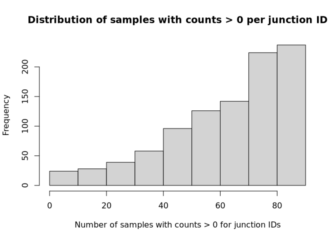
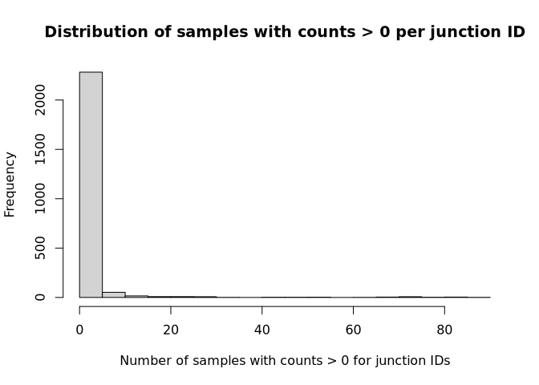
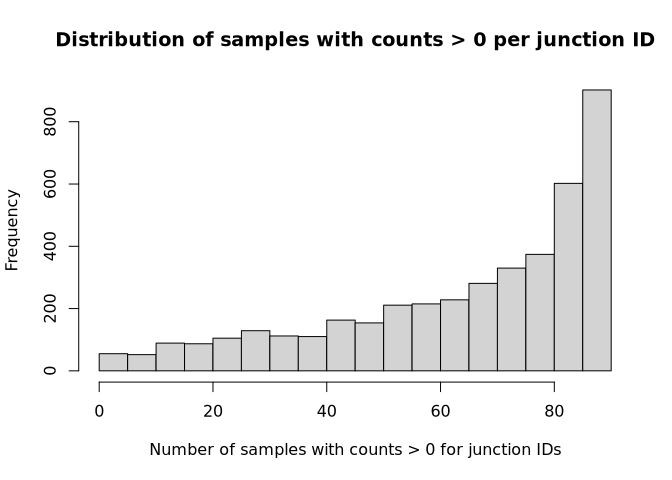
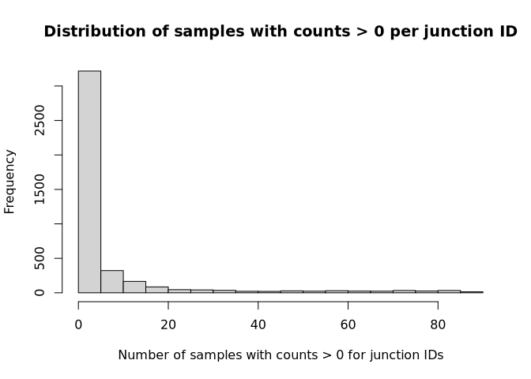

# Check Merged vs. Combined TARGET Pilot Junction files
Cindy Liang (celiang@ucsc.edu)
2026-06-20

## Background

This notebook checks junctions.bed files from two Shiba run methods for
differences. The goal is to get a sense of how close files that go into
calculating PSI values for events are to each other in the merged and
combined Shiba methods. Junctions files that are different would impact
PSI calculation, so I am mainly looking to see if mismatched junctions
are present and if present, how much of the data do they represent.

Files compared in this notebook are junction count bedfiles of 88 TARGET
pilot samples, produced from running Shiba with two different methods.

“Combined” refers to shiba splice analysis run with shiba in a canonical
way. Inputs of this method are .bam files of each sample and a reference
annotation GTF. In the combined method, unmodified Shiba scripts are run
on the input files using shiba.py, which calls on Shiba scripts that
generate intermediate files and perform the final PSI calculation. The
intermediate files that go into PSI calculation from this method are:

- GTF, which is made with
  [bam2gtf.py](https://github.com/Sika-Zheng-Lab/Shiba/blob/v0.8.1/src/bam2gtf.py).
  This script uses a stringtie merge command that merges GTFs made from
  individual samples together with the reference GTF

- junctions.bed, which is produced by
  [bam2junc.py](https://github.com/Sika-Zheng-Lab/Shiba/blob/v0.8.1/src/bam2junc.py).
  This script counts exon-exon (regtools) and exon-intron
  (featureCounts) junctions from each bam file given as input.

  - To count exon-intron junctions, Shiba uses `create_saf_file()`
    within `bam2junc.py` to create annotations of intron/exon boundaries
    to pass to featureCounts. The exon-intron boundaries are taken from
    the `ri_event` file generated from `gtf2events.py`.

  Then, `bam2junc.py` checks if exon-exon junctions are duplicated and
  deduplicates them. There is a bug in the deduplication step, such that
  junctions with invalid coordinates will still remain in the outputted
  junctions file. Finally, junctions files containing exon-exon and
  exon-intron junctions from all samples are merged together. Prior to
  reading the file in this notebook, the combined method junctions file
  is deduplicated with `deduplicate_shiba_junctions.sh`.

“Merged” refers to shiba splice analysis run with `merge_results.smk`.
The inputs of this method are junctions.bed and GTF files created by
Shiba run on each sample separately. `merge_results.smk` merges the GTFs
using the same stringtie merge command Shiba uses, then manually
combines the junction files after deduplicating any invalid junction
entries resulting from the `bam2junc.py` bug. The jobs for the merged
Shiba method were run in the following order, to generate the merged GTF
and junctions.bed files:

    [Mon Jun  1 03:46:24 2026]
    Finished jobid: 4 (Rule: merge_junctions)
    1 of 5 steps (20%) done
    [Mon Jun  1 04:07:03 2026]
    Finished jobid: 3 (Rule: merge_gtfs)
    2 of 5 steps (40%) done
    Select jobs to execute...
    Execute 1 jobs...
    [Mon Jun  1 04:07:03 2026]
    localrule gtf_to_events:
        input: results/merged_shiba/target_pilot/merged_gtf.gtf, references/gencode.v47.primary_assembly.annotation.gtf
        output: results/merged_shiba/target_pilot/events
        jobid: 2
        reason: Missing output files: results/merged_shiba/target_pilot/events; Input files updated by another job: results/merged_shiba/target_pilot/merged_gtf.gtf
        priority: 1
        threads: 10
        resources: tmpdir=/tmp
    [Mon Jun  1 04:43:48 2026]
    Finished jobid: 2 (Rule: gtf_to_events)

Because the junctions.bed files have exon-intron coordinates defined by
retained intron events files obtained from one sample only, some samples
will not have exon-intron counts from exon-intron boundaries that are
only present in other samples.

## Analysis outline:

We discovered that the largest source of difference between the merged
and combined method lies in how exon-intron junctions are defined and
counted. Shiba uses the retained intron events coordinates generated
from gtf2events.py to define intron-exon coordinates for counting. Since
the merged method only uses the events coordinates defined from one
sample at a time, junctions counted with this method are expected to
miss all exon-intron junctions that are not shared between samples.
Coming into this analysis, I expect all junction IDs that are different
between the methods to be exon-intron junctions.

Analysis questions in this notebook:

1.  How many junction positions (IDs) are different between bedfiles
    from each analysis method?

    1.  How many and what fraction of all IDs in each method are
        different?

    2.  Of IDs that are different, how many samples have nonzero
        junction counts in each analysis method?

    3.  Are junction IDs that are only found in one analysis always 1bp
        in length (exon-intron)?

2.  Of junction positions that are the same, how many IDs have different
    junction counts in the same samples in each analysis method?

    1.  How many and what fraction of all IDs have samples with
        different junction counts?

    2.  Of IDs that are different, how many samples have nonzero
        junction counts in each analysis method?

    3.  How many samples in each method have different junction counts
        for the same IDs? (Are there samples that consistently have
        different junction counts in each method?)

    4.  Are junction IDs that are only found in one analysis always 1bp
        in length (exon-intron)?

    5.  Are differences in junction counts always due to counts being 0
        in the merged method (due to us replacing junctions not shared
        between samples with 0)?

## Read in directories and files

Define directories and file paths

``` r
### Directories ###

# find the root-level repo directory so we can access the other files
repo_root <- rprojroot::find_root(rprojroot::is_git_root)

## combined shiba run results on target pilot samples ##
exploration_dir <- file.path(repo_root, "exploration")

# merged table eval dir
exploration_eval_dir <- file.path(exploration_dir, "merged-method-target-pilot-eval")

# shiba results dir
# target pilot exploration dir
target_pilot_dir <- file.path(exploration_dir, "merging-psi-tables", "target_pilot")
combined_results_dir <- file.path(target_pilot_dir, "shiba_combined")
# junctions dir
combined_junctions_dir <- file.path(combined_results_dir, "junctions")

## merged shiba run results on target pilot samples ##
# shiba results dir
merged_results_dir <- file.path(repo_root, "results", "merged_shiba", "target_pilot")

### Files ###
## combined shiba target pilot files
target_pilot_sample_sheet <- file.path(target_pilot_dir, "experiment.tsv")
# deduplicated combined junctions file - made by running bash scripts/deduplicated_shiba_junctions.sh
deduplicated_combined_junctions_file <- file.path(combined_junctions_dir, "deduplicated_junctions.bed")

## merged shiba target pilot files
merged_junctions_file <- file.path(merged_results_dir, "merged_junctions.bed")
```

Read in files

``` r
# list of target pilot sample IDs
target_pilot_samples <- readr::read_tsv(target_pilot_sample_sheet) |>
  dplyr::pull(sample)
```

    Rows: 88 Columns: 4
    ── Column specification ────────────────────────────────────────────────────────
    Delimiter: "\t"
    chr (4): sample, bam_path, group, technology

    ℹ Use `spec()` to retrieve the full column specification for this data.
    ℹ Specify the column types or set `show_col_types = FALSE` to quiet this message.

``` r
# read in combined junctions table that have been deduplicated
deduplicated_combined_junctions <- readr::read_tsv(
  deduplicated_combined_junctions_file,
  col_types = readr::cols(
    .default = "d",
    ID = "c",
    chr = "c",
    start = "d",
    end = "d"
  )
)

# read in files generated from merged shiba run
merged_junctions <- readr::read_tsv(
  merged_junctions_file,
  col_types = readr::cols(
    .default = "d",
    ID = "c",
    chr = "c",
    start = "d",
    end = "d"
  )
)
```

## Define functions

``` r
# filter junctions dataframes to junction IDs only present in either combined or merged junction dataframes and add column with length of junction
filter_ids_only_in_one_method <- function(df, id_vector) {
  df |>
  dplyr::filter(ID %in% id_vector) |>
  # calculate junction length of each junction ID
  dplyr::mutate(jcn_length = abs(end - start))
}

# pivot junctions dataframe long
pivot_junctions_long <- function(df) {
 df |>
  tidyr::pivot_longer(
    cols = dplyr::starts_with("SRR"),
    names_to = "sample",
    values_to = "count"
  )
}

# create histogram of the number of samples in each junction ID that has a count over 0
num_nonzero_samples_hist <- function(df) {
  summary_df <- df |>
  # pivot longer for ease of filtering by samples
  pivot_junctions_long() |>
  # summarize by how many samples in each junction ID have counts over 0
  dplyr::summarize(
    .by = ID,
    total = dplyr::n(),
    n_counts_over_zero = sum(count > 0)
  )

  # create histogram to spot-check
  hist(summary_df$n_counts_over_zero,
       main = paste("Distribution of samples with counts > 0 per junction ID"),
       xlab = "Number of samples with counts > 0 for junction IDs")
}

# print the top 6 samples with the most zero counts in a given set of junctions
samples_with_most_zeros <- function(df) {
  df |>
    pivot_junctions_long() |>
    # add a column that labels if the sample has a count of 0
    dplyr::mutate(is_zero = dplyr::if_else(count == 0, TRUE, FALSE)) |>
    # filter for samples with a count of zero for each junction
    dplyr::filter(is_zero == TRUE) |>
    # for each sample, count how many times it has zero junction counts
    dplyr::summarize(
      .by = sample,
      n_zero_junction_counts = dplyr::n()
    ) |>
    # arrange table so that sample with most zero counts is printed first, then print head
    dplyr::arrange(desc(n_zero_junction_counts)) |>
    head()
}
```

## Check tables for parsing errors

### Check for parsing errors in the merged and deduplicated junctions tables

``` r
readr::problems(merged_junctions)
```

| row | col | expected | actual | file |
|----:|----:|:---------|:-------|:-----|

``` r
readr::problems(deduplicated_combined_junctions)
```

| row | col | expected | actual | file |
|----:|----:|:---------|:-------|:-----|

No problems are present in merged_junctions file or deduplicated
junctions file (readr::problems prints out nothing)

## Subset junctions files for analysis

``` r
# Subset junctions files if the chromosome provided is not "all"

if(length(params$chromosome) > 1 || tolower(params$chromosome) != "all"){
  deduplicated_combined_junctions <- deduplicated_combined_junctions |>
    dplyr::filter(chr %in% params$chromosome)
}

if(length(params$chromosome) > 1 || tolower(params$chromosome) != "all"){
  merged_junctions <- merged_junctions |>
    dplyr::filter(chr %in% params$chromosome)
}

# Ensure sample columns are in the same order
merged_junctions <- merged_junctions |>
  dplyr::relocate(chr, start, end, ID, dplyr::all_of(target_pilot_samples))

# Check that columns are the same between both dataframes
setequal(colnames(deduplicated_combined_junctions), colnames(merged_junctions))
```

    [1] TRUE

## Check differences in junctions files

### How many junction positions (IDs) are different between bedfiles from each analysis method?

#### How many and what fraction of all IDs in each method are different?

``` r
# save vectors of junction IDs in each junction file being compared
combined_ids <- deduplicated_combined_junctions$ID
merged_ids <- merged_junctions$ID

# Obtain vector of junction IDs only in combined junctions bedfile
combined_only_ids <- setdiff(combined_ids, merged_ids)
# Save number of junctions only in the combined dataframe
num_combined_only <- length(combined_only_ids)

# Calculate fraction of junction IDs in the combined method that are only found in the combined method
frac_combined_only <- num_combined_only / length(combined_ids)

# Obtain vector of junction IDs only in combined junctions bedfile
merged_only_ids <- setdiff(merged_ids, combined_ids)
# Save number of junctions only in the merged dataframe
num_merged_only <- length(merged_only_ids)

# Calculate fraction of junction IDs in the merged method that are only found in the merged method
frac_merged_only <- num_merged_only / length(merged_ids)

# print results
summary_message <- c(
  paste0("Number of IDs different in combined junctions: ", num_combined_only),
  paste0("Fraction of IDs different in combined junctions: ", frac_combined_only),
  paste0("Number of IDs different in merged junctions: ", num_merged_only),
  paste0("Fraction of IDs different in merged junctions: ", frac_merged_only)
  )

summary_message
```

    [1] "Number of IDs different in combined junctions: 974"                  
    [2] "Fraction of IDs different in combined junctions: 0.00176054428654575"
    [3] "Number of IDs different in merged junctions: 2400"                   
    [4] "Fraction of IDs different in merged junctions: 0.00432694387953788"  

0.1760544% of the combined method junction IDs are missed in the merged
junctions file.

0.4326944% of the merged method junction IDs are not in the combined
junctions file.

#### Filter dataframes to contain IDs only present in combined or merged junctions tables

``` r
combined_only_jcn_id_df <- filter_ids_only_in_one_method(
  deduplicated_combined_junctions,
  combined_only_ids)

merged_only_jcn_id_df <- filter_ids_only_in_one_method(
  merged_junctions,
  merged_only_ids
)
```

#### Of IDs that are different, how many samples have nonzero junction counts in each analysis method?

##### Junction IDs only present in combined method

``` r
num_nonzero_samples_hist(combined_only_jcn_id_df)
```

<div id="fig-samples_with_nonzero_counts_combined_only_ids">



Figure 1

</div>

Most (more than half) of the junction IDs that are only found in the
combined junctions table have nonzero counts in over half of the
samples.

What samples have the highest number of zero junction counts?

``` r
samples_with_most_zeros(combined_only_jcn_id_df)
```

| sample     | n_zero_junction_counts |
|:-----------|-----------------------:|
| SRR2042845 |                    687 |
| SRR1797057 |                    517 |
| SRR1799059 |                    498 |
| SRR1799069 |                    484 |
| SRR1797053 |                    480 |
| SRR1799057 |                    467 |

SRR2042845 has the highest number of zero counts in junction IDs only
found in the combined method

##### Junction IDs only present in merged method

``` r
num_nonzero_samples_hist(merged_only_jcn_id_df)
```

<div id="fig-samples_with_nonzero_counts_merged_only_ids">



Figure 2

</div>

In IDs only found in the merged junctions table, most samples have count
values of 0

What samples have the highest number of zero junction counts?

``` r
samples_with_most_zeros(merged_only_jcn_id_df)
```

| sample     | n_zero_junction_counts |
|:-----------|-----------------------:|
| SRR2042845 |                   2380 |
| SRR1797057 |                   2379 |
| SRR1799041 |                   2376 |
| SRR1712459 |                   2374 |
| SRR1712461 |                   2373 |
| SRR1712464 |                   2373 |

SRR2042845 still has the highest number of junction counts that are 0 in
junction IDs only found in the merged method. So there are some samples
that consistently have unusually low numbers of counts.

#### Are all junction IDs only found in the combined table exon-intron (1bp in length) junctions?

##### Junction IDs only present in combined method

``` r
unique(combined_only_jcn_id_df$jcn_length)
```

    [1] 1

Yes, all junction IDs only present in the combined method junctions
table are exon-intron junctions.

##### Junction IDs only present in merged method

``` r
unique(merged_only_jcn_id_df$jcn_length)
```

    [1] 1

Yes, all junction IDs only present in the method method junctions table
are exon-intron junctions.

### How many shared junction IDs have different counts in the same samples in each analysis method?

#### Filter dataframes to contain IDs shared between combined and merged junctions tables but different counts

``` r
# filter out IDs only in combined or merged dataframes

combined_shared_id_df <- deduplicated_combined_junctions |>
  # filter out junction IDs that are only in combined df
  dplyr::filter(!ID %in% combined_only_ids) |>
  # calculate junction length of each junction ID
  dplyr::mutate(jcn_length = abs(end - start))

merged_shared_id_df <- merged_junctions |>
  # filter out junction IDs that are only in merged df
  dplyr::filter(!ID %in% merged_only_ids) |>
  # calculate junction length of each junction ID
  dplyr::mutate(jcn_length = abs(end - start))

# check that filtered dataframes have the same junction IDs (they should)
setequal(combined_shared_id_df$ID, merged_shared_id_df$ID)
```

    [1] TRUE

``` r
# Obtain subset of junction dataframes that contain junction IDs that are shared but have differing junction counts

combined_shared_id_counts_diff_df <- dplyr::setdiff(combined_shared_id_df, merged_shared_id_df)
merged_shared_id_counts_diff_df <- dplyr::setdiff(merged_shared_id_df, combined_shared_id_df)
```

#### How many and what fraction of all IDs in each method differ only in junction count values?

``` r
# Save number of junctions IDs with counts that differ in the combined dataframe
num_combined_counts_different <- length(combined_shared_id_counts_diff_df$ID)
# Save number of junctions IDs with counts that differ in the merged dataframe
num_merged_counts_different <- length(merged_shared_id_counts_diff_df$ID)

# Calculate fraction of junctions IDs with counts that differ in the combined dataframe
frac_combined_counts_different <- num_combined_counts_different / length(combined_ids)

# Calculate fraction of junction IDs in the merged method that are only found in the merged method
frac_merged_counts_different  <- num_merged_counts_different / length(merged_ids)

# print results
summary_message <- c(
  paste0("Number of junctions IDs with counts that differ in the combined dataframe: ",
         num_combined_counts_different),
  paste0("Fraction of junctions IDs with counts that differ in the combined dataframe: ",
         frac_combined_counts_different),
  paste0("Number of junctions IDs with counts that differ in the merged dataframe: ",
         num_merged_counts_different),
  paste0("Fraction of junctions IDs with counts that differ in the merged dataframe: ",
         frac_merged_counts_different)
  )

summary_message
```

    [1] "Number of junctions IDs with counts that differ in the combined dataframe: 4199"                 
    [2] "Fraction of junctions IDs with counts that differ in the combined dataframe: 0.00758986186776758"
    [3] "Number of junctions IDs with counts that differ in the merged dataframe: 4199"                   
    [4] "Fraction of junctions IDs with counts that differ in the merged dataframe: 0.00757034889590815"  

0.7589862% of the combined method junction IDs are missed in the merged
junctions file.

0.7570349% of the merged method junction IDs are not in the combined
junctions file.

#### Of IDs with different junction counts in samples in each method, how many samples have nonzero junction counts in each analysis method?

##### Junction IDs with different counts in combined method

``` r
num_nonzero_samples_hist(combined_shared_id_counts_diff_df)
```

<div id="fig-samples_with_nonzero_counts_combined_only_ids_diff_counts">



Figure 3

</div>

Similar to <a href="#fig-samples_with_nonzero_counts_combined_only_ids"
class="quarto-xref">Figure 1</a>, most junction IDs have nonzero
junction counts in at least half the samples.

What samples have the highest number of nzero junction counts?

``` r
samples_with_most_zeros(combined_shared_id_counts_diff_df)
```

| sample     | n_zero_junction_counts |
|:-----------|-----------------------:|
| SRR2042845 |                   2797 |
| SRR2239703 |                   1826 |
| SRR1799025 |                   1818 |
| SRR1797057 |                   1805 |
| SRR1799069 |                   1798 |
| SRR1799057 |                   1755 |

SRR2042845 is still the sample with the highest number of zeros in
junctions whose counts differ between the two methods.

##### Junction IDs with different counts in merged method

``` r
num_nonzero_samples_hist(merged_shared_id_counts_diff_df)
```

<div id="fig-samples_with_nonzero_counts_merged_only_ids_diff_counts">



Figure 4

</div>

Similar to <a href="#fig-samples_with_nonzero_counts_merged_only_ids"
class="quarto-xref">Figure 2</a>, most samples have counts of 0 in
junction IDs with differing counts in the merged table.

What samples have the highest number of zero junction counts?

``` r
samples_with_most_zeros(merged_shared_id_counts_diff_df)
```

| sample     | n_zero_junction_counts |
|:-----------|-----------------------:|
| SRR2042845 |                   4027 |
| SRR1712464 |                   3964 |
| SRR1799069 |                   3962 |
| SRR1799057 |                   3958 |
| SRR1796893 |                   3956 |
| SRR2083162 |                   3949 |

SRR2042845 is still the sample with the highest number of zeros in
junctions whose counts differ between the two methods.

#### Are all junction IDs with different counts in the combined table exon-intron (1bp in length) junctions?

##### Junction IDs with different counts in combined method

``` r
unique(combined_shared_id_counts_diff_df$jcn_length)
```

    [1] 1

Yes, all junction IDs with differing counts in the combined method
junctions table are exon-intron junctions.

##### Junction IDs with different counts in merged method

``` r
unique(merged_shared_id_counts_diff_df$jcn_length)
```

    [1] 1

Yes, all junction IDs with differing counts in the merged method
junctions table are exon-intron junctions.

### How many samples in each method have different junction counts for the same IDs?

Remove dataframes not used anymore to save memory

``` r
rm(list = c(
  "merged_shared_id_counts_diff_df",
  "combined_shared_id_counts_diff_df",
  "deduplicated_combined_junctions",
  "merged_junctions",
  "combined_ids",
  "merged_ids",
  "combined_only_jcn_id_df",
  "merged_only_jcn_id_df",
  "combined_only_ids",
  "merged_only_ids"
  )
)

# free up space with garbage collection
gc()
```

                used  (Mb) gc trigger   (Mb)   max used    (Mb)
    Ncells   1636872  87.5   10244247  547.2    9788599   522.8
    Vcells 111146864 848.0  887271084 6769.4 1386286171 10576.6

#### Count number of samples with different counts between the combined and merged tables

What types of counts differences are present in samples with different
junction counts? This section crashes when run on the full junctions
files

``` r
# pivot dataframes with differing counts longer
combined_shared_id_df <- pivot_junctions_long(combined_shared_id_df)
merged_shared_id_df <- pivot_junctions_long(merged_shared_id_df)

# join long tables on chr, start, end, id, sample so that sample counts can be compared
shared_id_counts_diff_df <- dplyr::full_join(
  combined_shared_id_df,
  merged_shared_id_df,
  by = c("chr", "start", "end", "ID", "sample"),
  suffix = c("_combined", "_merged")) |>
  # filter for only junctions where the same sample have different counts in each method
  dplyr::filter(count_combined != count_merged) |>
  # categorize counts by mismatch category
  dplyr::mutate(
    mismatch_type = dplyr::case_when(
      count_combined == 0 & count_merged != 0 ~ "combined_0_merged_nonzero",
      count_combined != 0 & count_merged == 0 ~ "combined_nonzero_merged_0",
      count_combined != 0 & count_merged != 0 ~ "both_nonzero"
    )
  )

shared_id_counts_diff_df |>
  # summarize each mismatch category
  dplyr::summarize(
    .by = mismatch_type,
    n = dplyr::n()
  )
```

| mismatch_type             |      n |
|:--------------------------|-------:|
| combined_nonzero_merged_0 | 237874 |

In chromosome 1, all mismatches are due to the combined exon-intron
junction having nonzero counts, while the merged exon-intron junction
has zero counts.

Remove dataframes not used anymore to save memory

``` r
rm(list = c(
  "combined_shared_id_df",
  "merged_shared_id_df"
  )
)

# free up space with garbage collection
gc()
```

              used (Mb) gc trigger    (Mb)   max used    (Mb)
    Ncells 1095635 58.6    4196045   224.1    9788599   522.8
    Vcells 8627737 65.9 1526124791 11643.5 1893560754 14446.8

Are there samples that consistently have different junction counts in
each method? This section crashes when run on the full junctions files

``` r
shared_id_counts_diff_df |>
  # summarize each mismatch category
  dplyr::summarize(
    .by = c(sample, mismatch_type),
    n_mismatch = dplyr::n()
    ) |>
  # sort by sample with most mismatches
  dplyr::arrange(dplyr::desc(n_mismatch)) |>
  head()
```

| sample     | mismatch_type             | n_mismatch |
|:-----------|:--------------------------|-----------:|
| SRR4419554 | combined_nonzero_merged_0 |       3103 |
| SRR1559075 | combined_nonzero_merged_0 |       3067 |
| SRR1797055 | combined_nonzero_merged_0 |       3047 |
| SRR1559100 | combined_nonzero_merged_0 |       3046 |
| SRR2083176 | combined_nonzero_merged_0 |       3042 |
| SRR1784865 | combined_nonzero_merged_0 |       3030 |

SRR4419554 has the highest number of junctions with mismatched counts
for chromosome 1
