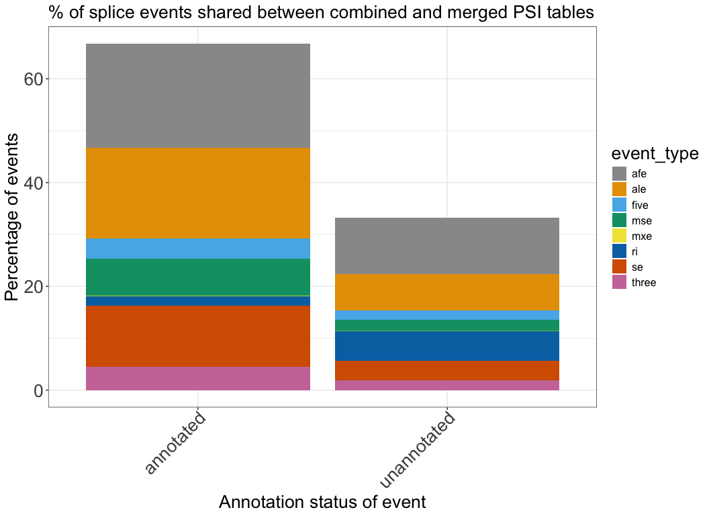
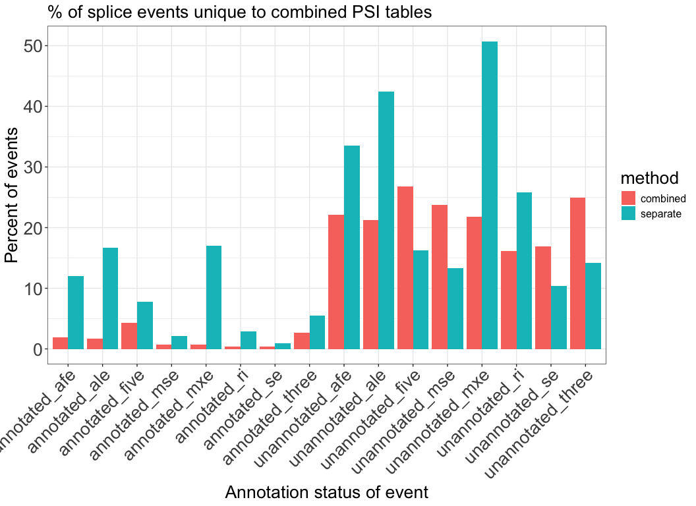
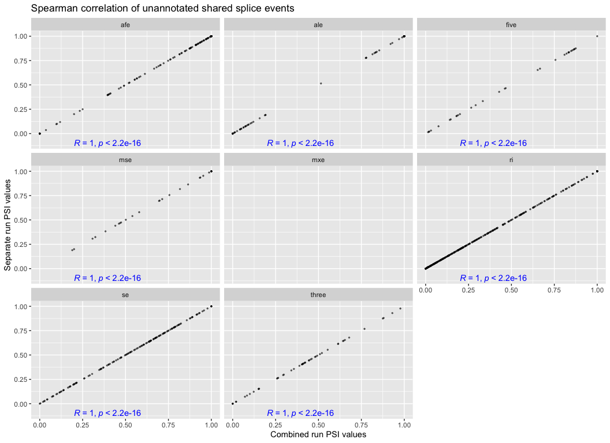
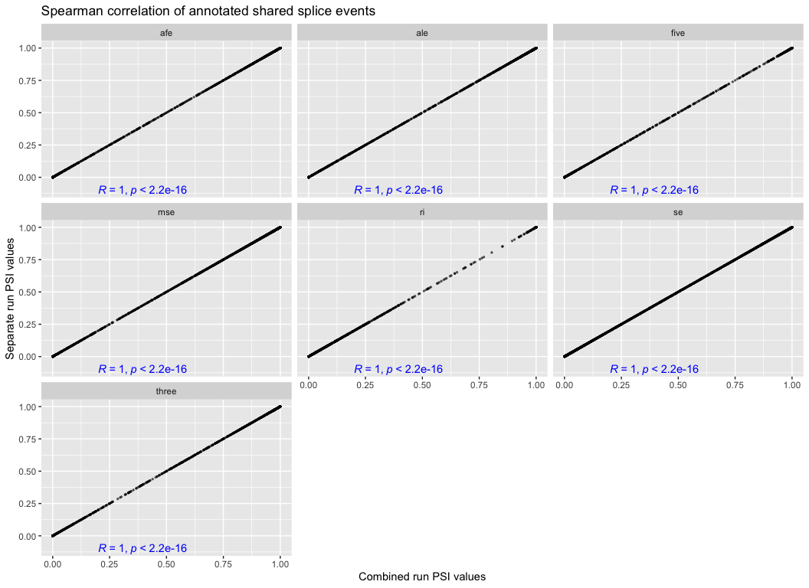

# Compare merged PSI table from TARGET pilot samples
Cindy Liang (celiang@ucsc.edu)
2026-04-05

As part of our pipeline, we plan to merge Shiba tables created for
individual samples to obtain a final PSI table of all samples. Before
doing so, we use this notebook to test that merging PSI tables from
separate runs will not introduce a large amount of untrustworthy splice
events or junction counts.

## Set up

## Directories and files

``` r
# define the data directories
# shiba results dir
shiba_dir <- file.path("shiba_results")

# directory of shiba results produced from the same shiba run
combined_dir <- file.path(shiba_dir, "combined_run", "target_pilot", "results")

# psi table directory
combined_splice_results_dir <- file.path(combined_dir, "splicing")

# Directory of PSI table, merged from separate shiba runs
separate_psi_table_dir <- file.path("target_pilot", "merged_results")

# merged PSI file of two samples obtained from merge-shiba-psi-tables.qmd
separate_psi_file <- file.path(separate_psi_table_dir, "merged_psi_table.tsv")

# define list of PSI results files corresponding to event types quantified by Shiba bulk analysis
psi_files <- c(
  se = "PSI_SE.txt",
  afe = "PSI_AFE.txt",
  ale = "PSI_ALE.txt",
  five = "PSI_FIVE.txt",
  three = "PSI_THREE.txt",
  mse = "PSI_MSE.txt",
  mxe = "PSI_MXE.txt",
  ri = "PSI_RI.txt"
)

# construct psi table paths of shiba results of two samples run together
shiba_psi_paths <-file.path(combined_splice_results_dir, psi_files)
names(shiba_psi_paths) <- names(psi_files)
```

Read in files

``` r
# read merged splice table from separate runs of Shiba on the TARGET pilot samples
separate_psi_table <- readr::read_tsv(separate_psi_file)
```

    Rows: 818412 Columns: 92
    ── Column specification ────────────────────────────────────────────────────────
    Delimiter: "\t"
    chr  (4): event_type, pos_id, gene_id, label
    dbl (88): SRR1559043_PSI, SRR1559044_PSI, SRR1559052_PSI, SRR1559054_PSI, SR...

    ℹ Use `spec()` to retrieve the full column specification for this data.
    ℹ Specify the column types or set `show_col_types = FALSE` to quiet this message.

``` r
# read in combined splice results to compare against separate results
combined_splice_results_paths <- shiba_psi_paths |>
  purrr::map(\(path){
    readr::read_tsv(path, col_types=readr::cols(.default = "c")) |>
      # select for columns that will be used in downstream analysis
      dplyr::select(pos_id, gene_id, label, contains("_PSI")) |>
      dplyr::mutate(across(contains("_PSI"), as.numeric))
  })

# combine psi values of samples run together into one dataframe to compare against separate PSI dataframe
combined_psi_table <- purrr::list_rbind(combined_splice_results_paths, names_to = "event_type")
```

### Obtain dimensions of each PSI table

``` r
# dimensions of separate PSI table 
dim(separate_psi_table)
```

    [1] 818412     92

``` r
# dimensions of combined PSI table
dim(combined_psi_table)
```

    [1] 746601     92

There are 71,811 more splice events in the separate PSI table than the
combined table.

## Examine splice events that are consistently present in both combined and separate splice tables

To help us prioritize what splice event types we may be the most
confident in after merging separate Shiba PSI tables, we are interested
in seeing a breakdown of what event types are most represented in both
PSI tables

``` r
# obtain df of splice events that are shared between both combined and separate tables
shared_events <- dplyr::full_join(
  combined_psi_table, 
  separate_psi_table,
  by = c("event_type", "pos_id", "gene_id", "label"),
  # label PSI values by table they came from 
  suffix = c("_combined", "_separate"))

# Previously we wanted to pivot this table longer so a "method" column tells us whether the values are from the combined or separate table
# however due to the size of the table, I receive a memory error: Error: vector memory limit of 16.0 Gb reached, see mem.maxVSize()
# I pivot the summary table later on instead
```

Print summary of event types in the shared events table

``` r
shared_events_summary <- shared_events |>
  dplyr::summarise(.by = c(event_type, label),
                   # count number of events in each event type and annotation category
                   count = dplyr::n()) |>
  # take the percent of shared events in each category and annotation type over all events in the shared table
  dplyr::mutate(percent = count / sum(count) * 100)

shared_events_summary
```

| event_type | label       |  count |    percent |
|:-----------|:------------|-------:|-----------:|
| se         | annotated   | 104872 | 11.6785135 |
| se         | unannotated |  32912 |  3.6650701 |
| afe        | unannotated |  97616 | 10.8704876 |
| afe        | annotated   | 180632 | 20.1151236 |
| ale        | annotated   | 156353 | 17.4114217 |
| ale        | unannotated |  62334 |  6.9414950 |
| five       | annotated   |  35556 |  3.9595052 |
| five       | unannotated |  16825 |  1.8736268 |
| three      | annotated   |  40691 |  4.5313372 |
| three      | unannotated |  17214 |  1.9169457 |
| mse        | annotated   |  64124 |  7.1408288 |
| mse        | unannotated |  19434 |  2.1641642 |
| mxe        | annotated   |    963 |  0.1072394 |
| mxe        | unannotated |    481 |  0.0535640 |
| ri         | unannotated |  51635 |  5.7500576 |
| ri         | annotated   |  16349 |  1.8206196 |

### Visualize breakdown of shared events with stacked bar plots

``` r
ggplot(shared_events_summary, aes(fill = event_type, x = label, y = percent)) +
  geom_bar(position = "stack", stat = "identity") +
  scale_fill_manual(values = cbPalette) +
  plot_theme +
  labs(
    title = "% of splice events shared between combined and merged PSI tables",
    x = "Annotation status of event",
    y = "Percentage of events"
  ) +
  scale_x_discrete(guide = guide_axis(angle = 45)) +
  plot_theme
```

<div id="fig-shared_splice_events">



Figure 1

</div>

Of the events that are the same between the combined and separate PSI
tables, annotated SE, AFE, and ALE events are the most abundant. These
may the the event types we want to prioritize in a biology vignette if
we decide to merge the PSI tables.

## Examine splice events only found in combined or separate splice tables

### Examine splice events only present in each PSI table

``` r
# produce dataframe of elements in combined splice results reference dataframe
combined_only_list <- setdiff(combined_psi_table$pos_id, separate_psi_table$pos_id)

# produce dataframe of elements in merged splice results dataframe but not in the reference df
separate_only_list <- setdiff(separate_psi_table$pos_id, combined_psi_table$pos_id)
```

### Obtain the number of splice events only found in each table

``` r
# events only present in separate tables
# Number of splice events only in separate PSI table 
length(separate_only_list)
```

    [1] 139412

``` r
# Number of splice events only in combined PSI table 
length(combined_only_list)
```

    [1] 72021

### Examine percentage of each splice event type in each PSI table

Print the number of annotated vs. unannotated events across all event
types in each table

``` r
# filter for pos_ids unique to the combined or separate dataframes
psi_summary <- shared_events |>
  dplyr::mutate(
    combined_only = pos_id %in% combined_only_list,
    separate_only = pos_id %in% separate_only_list
  ) |>
# print summary of how many unique events with values that are novel vs. unannotated
  dplyr::summarise(.by = c(label, event_type),
                   combined_only = sum(combined_only),
                   separate_only = sum(separate_only),
                   # dplyr::n() gives the size of the group 
                   # (annotated events or unannotated events of a given event type)
                   total = dplyr::n(),
                   # for each event type/annotation combination, 
                   # give % of events only in combined or separate tables
                   combined_percent = combined_only / total * 100,
                   separate_percent = separate_only / total * 100)

psi_summary            
```

| label | event_type | combined_only | separate_only | total | combined_percent | separate_percent |
|:---|:---|---:|---:|---:|---:|---:|
| annotated | se | 447 | 952 | 104872 | 0.4262339 | 0.9077733 |
| unannotated | se | 5564 | 3419 | 32912 | 16.9056879 | 10.3883082 |
| unannotated | afe | 21598 | 32698 | 97616 | 22.1254712 | 33.4965579 |
| annotated | afe | 3524 | 21661 | 180632 | 1.9509279 | 11.9917844 |
| annotated | ale | 2657 | 26164 | 156353 | 1.6993598 | 16.7339290 |
| unannotated | ale | 13237 | 26428 | 62334 | 21.2356018 | 42.3974075 |
| annotated | five | 1541 | 2757 | 35556 | 4.3340083 | 7.7539656 |
| unannotated | five | 4515 | 2727 | 16825 | 26.8350669 | 16.2080238 |
| annotated | three | 1068 | 2244 | 40691 | 2.6246590 | 5.5147330 |
| unannotated | three | 4284 | 2443 | 17214 | 24.8867201 | 14.1919368 |
| annotated | mse | 448 | 1383 | 64124 | 0.6986464 | 2.1567588 |
| unannotated | mse | 4614 | 2592 | 19434 | 23.7418956 | 13.3374498 |
| annotated | mxe | 7 | 164 | 963 | 0.7268951 | 17.0301142 |
| unannotated | mxe | 105 | 244 | 481 | 21.8295218 | 50.7276507 |
| unannotated | ri | 8343 | 13351 | 51635 | 16.1576450 | 25.8564927 |
| annotated | ri | 69 | 474 | 16349 | 0.4220442 | 2.8992599 |

There are much more splice events only present in only the combined or
separate PSI tables now The most abundant events present only in the
separate PSI table are unannotated ALE (42%) and MXE (51%) events.

### Visualize breakdown of unshared events with stacked bar plots

``` r
# prep summary data frame for plotting

plot_psi_summary <- psi_summary |>
  dplyr::select(label, event_type, combined_percent, separate_percent) |>
  # concatenate label and event type columns into one
  tidyr::unite(label_event_type, c("label", "event_type")) |>
  # pivot longer
  tidyr::pivot_longer(
    cols = c(combined_percent, separate_percent),
    names_to = "method",
    names_pattern = "(combined|separate)*",
    values_to = "percent"
  )

ggplot(plot_psi_summary, aes(fill = method, x = label_event_type, y = percent)) +
  geom_bar(position = "dodge", stat = "identity") +
  plot_theme +
  labs(
    title = "% of splice events unique to combined PSI tables",
    x = "Annotation status of event",
    y = "Percent of events"
  ) +
  scale_x_discrete(guide = guide_axis(angle = 45)) +
  plot_theme
```

<div id="fig-unshared_splice_events">



Figure 2

</div>

Merging separate PSI tables from many samples originating from diverse
cancer types appears to introduce many events that are only found in the
separate PSI tables that have been merged. When we take the fraction of
how many events are only found in the separate tables for each splice
event type + annotation status combination present in both separate and
combined tables, the majority of unique splice events in the separate
tables are labeled unannotated, which is suspicious. From the
exploration on IGV of unmatched unannotated events in the n = 2 case,
most of the unannotated events did not look like real splice events.

It is also concerning that we get around 20% of unannotated events that
are only found in the combined tables. We probably need to merge the
junctions and GTF files from each OpenStack’s shiba run in our
compendium pipeline.

### Check how similar PSI values of shared events are

Plot correlations of PSI values

pivot longer

``` r
long_shared_events <- shared_events |>
  # randomly subset 2000 events otherwise memory becomes an issue
  dplyr::slice_sample(n = 2000) |>
  tidyr::pivot_longer(
    cols = matches("_combined|_separate"),
    names_to = c("sample", "method"),
    values_to = "PSI",
    names_pattern = "(.*)_(combined|separate)"
  ) |>
  tidyr:: pivot_wider(
    names_from = method,
    values_from = PSI
  )
```

``` r
long_shared_unannotated <- long_shared_events |>
  dplyr::filter(label == "unannotated")

  ggplot(long_shared_unannotated) +
    aes(
      # read in columns to use for x and y from input
      x = combined,
      y = separate,
    ) +
    geom_point(size = 0.5, alpha = 0.5) +
    labs(
      title = "Spearman correlation of unannotated shared splice events",
      x = "Combined run PSI values",
      y = "Separate run PSI values") +
    facet_wrap(vars(event_type)) +
    
    ggpubr::stat_cor(method = "spearman", label.x = 0.2, label.y = -0.1, color = "blue")
```

    Warning: Removed 61776 rows containing non-finite outside the scale range
    (`stat_cor()`).

    Warning: Removed 61776 rows containing missing values or values outside the scale range
    (`geom_point()`).

<div id="fig-unannotated_psi_correlation">



Figure 3

</div>

Manipulate shared df to long format

``` r
long_shared_annotated <- long_shared_events |>
  dplyr::filter(label == "annotated")


  ggplot(long_shared_annotated) +
    aes(
      # read in columns to use for x and y from input
      x = combined,
      y = separate,
    ) +
    geom_point(size = 0.5, alpha = 0.5) +
    labs(
      title = "Spearman correlation of annotated shared splice events",
      x = "Combined run PSI values",
      y = "Separate run PSI values") +
    facet_wrap(vars(event_type)) +
    
    ggpubr::stat_cor(method = "spearman", label.x = 0.2, label.y = -0.1, color = "blue")
```

    Warning: Removed 85448 rows containing non-finite outside the scale range
    (`stat_cor()`).

    Warning: Removed 85448 rows containing missing values or values outside the scale range
    (`geom_point()`).

<div id="fig-annotated_psi_correlation">



Figure 4

</div>
