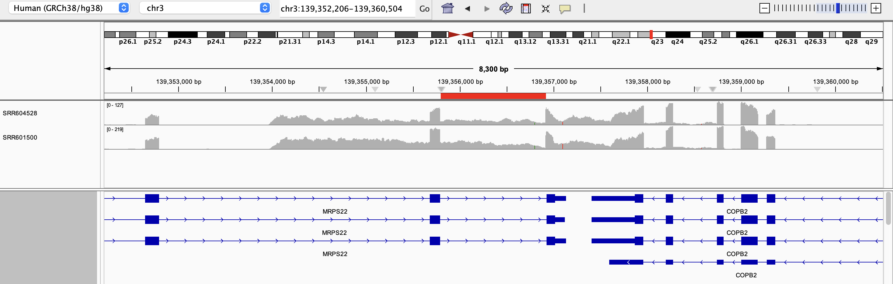
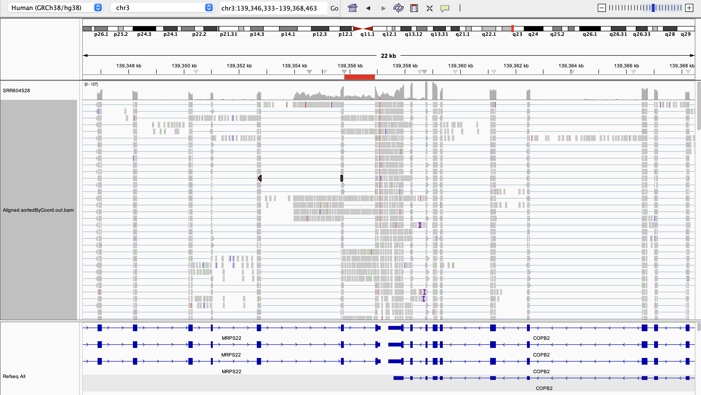
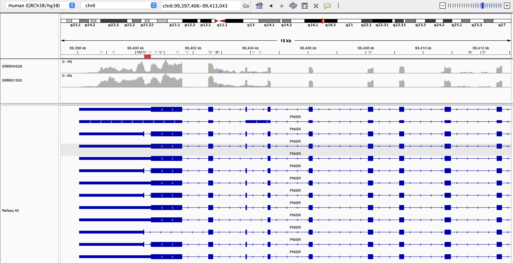
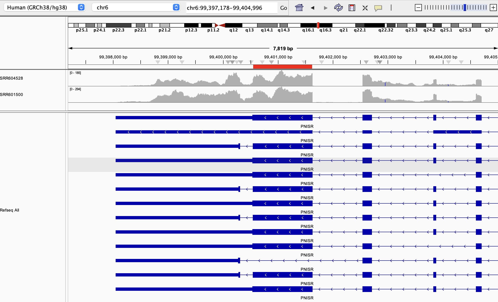

## Set up

## Directories and files

```{r}
# define samples list
samples <- c("SRR601500", "SRR604528")


# define the data directories
# psi table comparison dir
merging_dir <- file.path(base_dir, "exploration/merging-psi-tables")
# splice results dir
shiba_dir <- shiba_dir <- file.path(merging_dir, "shiba_results")

# separate runs dir
separate_dir <- file.path(shiba_dir, "separate_runs")

# shiba splice results directory of two samples run together
shiba_combined_dir <- file.path(shiba_dir, "combined_run")
shiba_splice_results_dir <- file.path(shiba_combined_dir, "splicing")
shiba_junctions_dir <- file.path(shiba_combined_dir, "junctions")

# merged PSI table of two samples run separately with shiba
merged_psi_table_dir <- file.path(merging_dir, "merged_results")

# Read in file paths

# merged PSI file of two samples obtained from merge-shiba-psi-tables.qmd
merged_psi_file <- file.path(merged_psi_table_dir, "merged_psi_table.tsv")

# shiba junctions file
shiba_junctions <- file.path(shiba_junctions_dir, "junctions.bed")

# define list of PSI results files corresponding to event types quantified by Shiba bulk analysis
psi_files <- c(
  se = "PSI_SE.txt",
  afe = "PSI_AFE.txt",
  ale = "PSI_ALE.txt",
  five = "PSI_FIVE.txt",
  three = "PSI_THREE.txt",
  mse = "PSI_MSE.txt",
  mxe = "PSI_MXE.txt",
  ri = "PSI_RI.txt"
)

# construct psi table paths of shiba results of two samples run together
shiba_psi_paths <-file.path(shiba_splice_results_dir, psi_files)
names(shiba_psi_paths) <- names(psi_files)

# make sample paths to the junctions.bed files for separate splice runs
junction_paths <- file.path(
  
  separate_dir,
  samples,
  "junctions"
)

```

Define function to read in junctions.bed files

```{r}
# Make function for reading event types for a single sample
read_junctions <- function(sample_id, junction_paths) {
  # construct file path for each sample
  file_paths <- file.path(junction_paths, "junctions.bed")
  # name each PSI table file path by event type
  names(file_paths) <- names(sample_id)
  
  # read in files
  purrr::map(file_paths, \(file) {
    read.table(file, 
               header = TRUE, 
               sep="\t",
               stringsAsFactors=FALSE, 
               quote="")
  }) |>
    # merge individual event type PSI tables to get one PSI table per sample
    dplyr::bind_rows(.id = "ID")
}
```

Read in files

```{r}
# read in manually combined splice table
merged_psi_table <- readr::read_tsv(merged_psi_file)

# read in manually merged junctions table
merged_junctions <- read_junctions(samples, junction_paths)

# read in shiba splice results to compare against manually combined results
shiba_splice_results_paths <- shiba_psi_paths |>
  purrr::map(\(path){
    readr::read_tsv(path, col_types=readr::cols(.default = "c")) |>
      # select for columns that will be used in downstream analysis
      dplyr::select(pos_id, gene_id, label, contains("_PSI")) |>
      dplyr::mutate(across(contains("_PSI"), as.numeric))
  })

# combine psi values of samples run together into one dataframe to compare against manually combined dataframe
shiba_psi_table <- purrr::list_rbind(shiba_splice_results_paths, names_to = "event_type")
```

## Obtain dimensions of the merged and shiba tables to compare values

```{r}
paste0("Merged PSI table dimensions ", 
       dim(merged_psi_table)[1], 
       "x", 
       dim(merged_psi_table)[2])

paste0("Shiba PSI table dimensions ", 
       dim(shiba_psi_table)[1],
       "x",
       dim(shiba_psi_table)[2])
```

## Obtain splice events unique to each table

```{r}
# produce dataframe of elements in combined splice results reference dataframe but not in merged psi df
unique_shiba <- setdiff(shiba_psi_table$pos_id, merged_psi_table$pos_id)

# produce dataframe of elements in merged splice results dataframe but not in the reference df
unique_merged <- setdiff(merged_psi_table$pos_id, shiba_psi_table$pos_id)
```

## Obtain dimensions of the merged and shiba tables to compare values

```{r}
paste0("Number of total unique merged events: ", 
       length(unique_merged))

paste0("Number of total unique Shiba events: ", 
       length(unique_shiba))
```

Print the number of unique annotated vs. unannotated events in each event type for the merged table

```{r}
# filter for pos_ids unique to the shiba dataframe
unique_shiba_psi_table <- shiba_psi_table |>
  dplyr::filter(pos_id %in% unique_shiba)

# print summary of how many unique events with values in both samples are novel vs. unannotated
unique_shiba_psi_table |> 
  dplyr::summarise(.by = c(event_type), 
                   count_annotated = sum(label == "annotated"),
                   frac_annotated = count_annotated / dplyr::n(),
                   count_unannotated = sum(label == "unannotated"),
                   frac_unannotated = count_unannotated / dplyr::n()
                     )
```

Print the number of unique annotated vs. unannotated events in each event type for the merged table

```{r}
# filter for the pos_ids in the merged df that are unique
unique_merged_psi_table <- merged_psi_table |>
  dplyr::filter(pos_id %in% unique_merged)

# print summary of how many unique events with values in both samples are novel vs unannotated
unique_merged_psi_table |> 
  dplyr::summarise(.by = c(event_type), 
                   count_annotated = sum(label == "annotated"),
                   frac_annotated = count_annotated / dplyr::n(),
                   count_unannotated = sum(label == "unannotated"),
                   frac_unannotated = count_unannotated / dplyr::n())

```

## Inspect individual position IDs of unique events

We are most concerned if unannotated events have altered positions in the merged table and are unmatched in the shiba table (is Shiba doing something strange to assign reads into position coordinates?)

Check for one event type.
From the table above, RI events are the simplest to spot-check on IGV that have unannotated and annotated events with PSI values in both samples in the merged table.

```{r}
# Filter for splice events that have real PSI values in all samples; start with skipped exon events for now
unique_se_in_merged <- unique_merged_psi_table |>
  dplyr::filter(event_type == "se",
                label == "unannotated")

unique_se_in_merged
```

## Search for the closest SE events in the shiba PSI table

### Look for SE events closest to SE@chr10@112448882-112449019@112447467-112460524

```{r}
shiba_psi_table |>
  dplyr::filter(gene_id == "ENSG00000151532.15")
```

SE@chr10@112448382-112448489@112447467-112448882 is the closest match.
Although it is the same pos_id as the unannotated event only found in the merged table, it is labeled as an annotated event in the shiba table and has no PSi values for either sample

#### Check junction counts for SE@chr10@112448382-112448489@112447467-112448882

```{r}
merged_junctions |>
  dplyr::filter(chr == "chr10",
                start == "112447467")
```

There are two entries for a junction at GL000219.1\@77669-78842.
One has a junction count of 14 for SRR601500, which would have received a PSI value score since it exceeds the threshold of 10 The second one for SRR604528 should not have received a PSI score since it is below 10 I wonder if shiba is counting both inclusion and exclusion junction reads together to calculate PSI values

#### IGV screenshots of GL000219.1\@77669-78842

Check on IGV - does this event look like an ALE or RI?


The red bar shows the GL000219.1\@77669-78842 region, which was called as a retained intron event in the merged table but looks like an unannotated ALE event (so was correctly called in the shiba table and incorrectly called in the merged table).

### Look for RI events in chr3\@139355790

```{r}
shiba_psi_table |>
  dplyr::filter(stringr::str_detect(pos_id, "chr3@139355790"))
```

There are also no RI events in the chr3\@139355790 region in the shiba PSI table.
Instead, these reads might be assigned to ALE events.

#### Check junction counts for RI\@chr3\@139355790-139356919

```{r}
merged_junctions |>
  dplyr::filter(chr == "chr3",
                start == "139355790",
                end == "139356919")
```

This is a good example of us probably needing to merge the junctions.bed files.
The junction counts for chr3 139355790-139356919 are high for both samples (\>\>10)

#### IGV screenshots of chr3\@139355790-139356919

Check on IGV - does this event look like an ALE or RI?



Interestingly, this event looks like a retained intron event and not an ALE event.



Looking at the alignments, there might actually be a fusion between MRPS22 and COPB2 in both samples (alignments for SRR601500 not shown).
Shiba doesn't handle fusions as far as I am aware, so it makes sense that it calls the event as an ALE event instead (it would be an ALE for MRPS22 if the alignments were more separated between the genes).
I am inclined to agree with the Shiba call on this one also.

### Look for RI events in chr6\@99400311

This is the only unmatched RI annotated event in the merged table.

```{r}
shiba_psi_table |>
  dplyr::filter(stringr::str_detect(pos_id, "chr6@99400"))
```

There are no events in the Shiba PSI table with the start coordinate chr6\@99400311.
The closest event is a skipped exon event at chr6\@99400544-99401630

#### Check junction counts for RI\@chr6\@99400311-99400544

```{r}
merged_junctions |>
  dplyr::filter(chr == "chr6",
                start == "99400311",
                end == "99400544")
```

This looks like another example of an event with strong junction support in both samples

#### IGV screenshots of chr6\@99400311-99400544

Check on IGV - does this event look like an ALE or RI?



This looks like areal event

### IGV screenshots of chr6\@99400544-99401630

This is the region of the closest splice event detected in the Shiba table to chr6\@99400311-99400544, which was categorized as a skipped exon event that had high inclusion levels in both samples.

I think I agree with it, it seems to be saying that transcripts with two last exons (3rd, 6th, 8th, and 11th rows of RefSeq isoforms) are abundant in these samples, which makes more sense than a retained intron.
The "retained intron" being called in the merged table is likely reads from PNISR transcripts that only have one last exon (2nd row in Refseq isoforms).



## Conclusions

I generally agree with the calls in the Shiba table more than the merged table, so I think we should merge the bed files.
