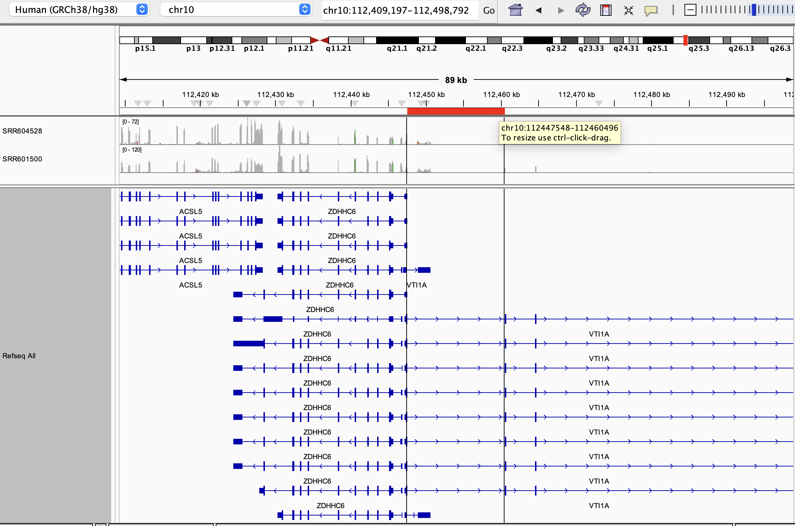
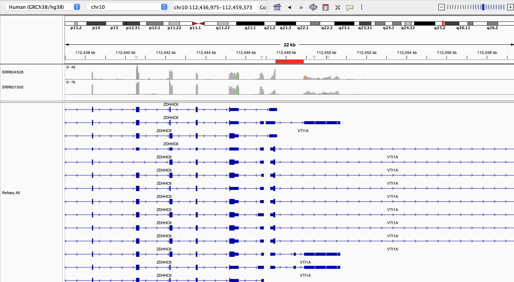
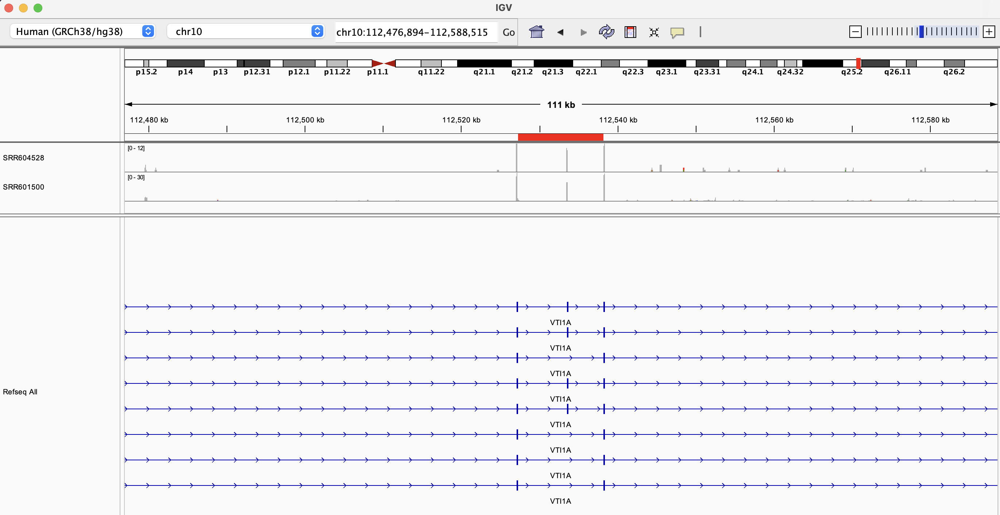
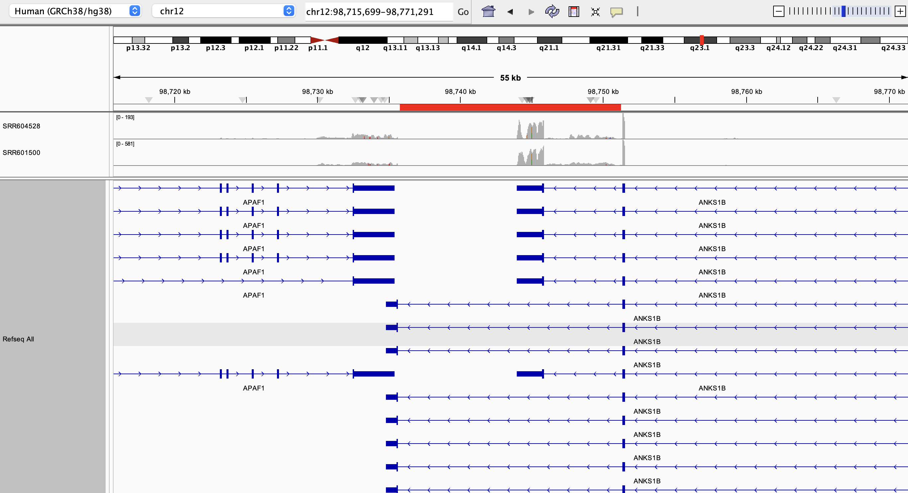
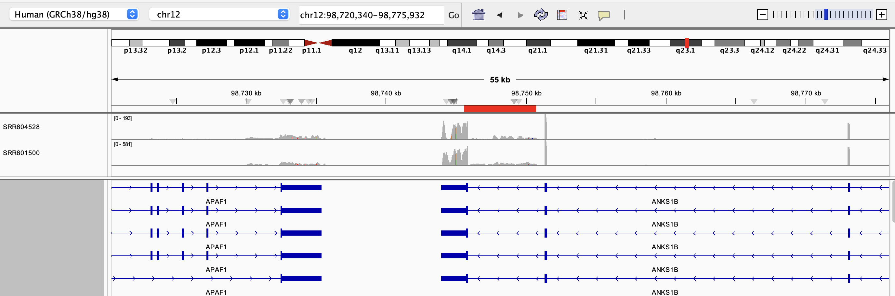
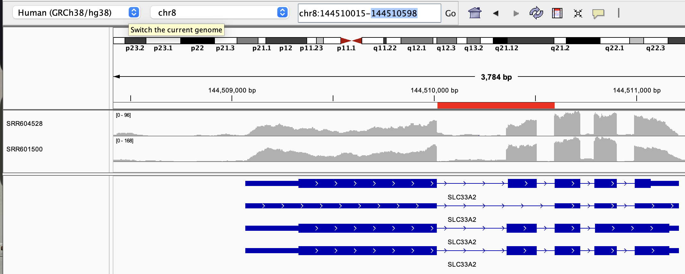
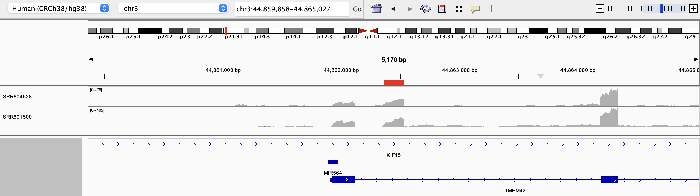
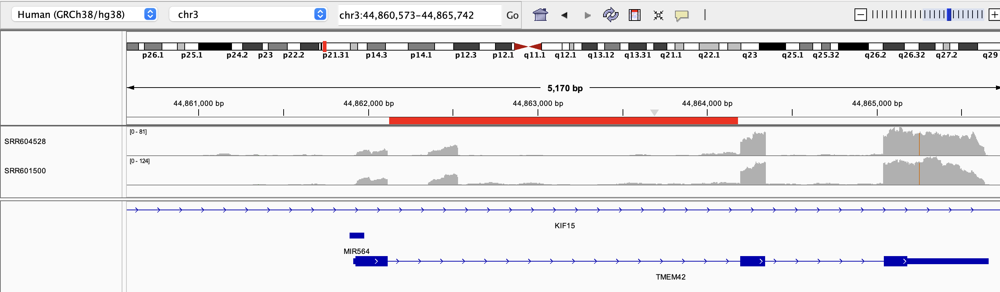

## Set up

## Directories and files

```{r}
# define samples list
samples <- c("SRR601500", "SRR604528")

# define the data directories
# shiba results dir
shiba_dir <- file.path("shiba_results")

# directory of shiba results produced from the same shiba run
combined_dir <- file.path(shiba_dir, "combined_run")
# psi table directory
combined_splice_results_dir <- file.path(combined_dir, "splicing")
# junctions bed file directory
combined_junctions_dir <- file.path(combined_dir, "junctions")
# junctions bed file
combined_junctions_file <- file.path(combined_junctions_dir, "junctions.bed")

# directory of shiba results produced from separate shiba runs
separate_dir <- file.path(shiba_dir, "separate_runs")
# make sample paths to the junctions.bed files for separate splice runs
junction_paths <- file.path(
  separate_dir,
  samples,
  "junctions",
  "junctions.bed"
)
# name the separate junction file paths
names(junction_paths) <- names(samples)

# Directory of PSI table, merged from separate shiba runs
separate_psi_table_dir <- file.path("merged_results")
# merged PSI file of two samples obtained from merge-shiba-psi-tables.qmd
separate_psi_file <- file.path(separate_psi_table_dir, "merged_psi_table.tsv")

# define list of PSI results files corresponding to event types quantified by Shiba bulk analysis
psi_files <- c(
  se = "PSI_SE.txt",
  afe = "PSI_AFE.txt",
  ale = "PSI_ALE.txt",
  five = "PSI_FIVE.txt",
  three = "PSI_THREE.txt",
  mse = "PSI_MSE.txt",
  mxe = "PSI_MXE.txt",
  ri = "PSI_RI.txt"
)

# construct psi table paths of shiba results of two samples run together
shiba_psi_paths <-file.path(combined_splice_results_dir, psi_files)
names(shiba_psi_paths) <- names(psi_files)

```

Define function to read in junctions.bed files

```{r}
# Make function for reading junctions from multiple samples run separately
read_junctions <- function(junction_paths) {
  # read in files
  purrr::map(junction_paths, \(file) {
    read.table(file, 
               header = TRUE, 
               sep="\t",
               stringsAsFactors=FALSE, 
               quote="")
  }) |>
    # merge junctions tables from multiple samples 
    # the resulting table separates junction counts from each sample by columns with the sample ID
    purrr::reduce(\(x, y) dplyr::full_join(x, y, by = c("ID", "start", "end", "chr")))
}
```

Read in files

```{r}

## read in splice data from separate shiba run

# read merged splice table from separate runs
separate_psi_table <- readr::read_tsv(separate_psi_file)

# read and merge junctions bedfile
separate_junctions <- read_junctions(junction_paths)

## read in splice data from combined shiba run

# read junctions file from combined run
combined_junctions <- read.table(combined_junctions_file, header = TRUE, sep = "\t", stringsAsFactors = FALSE, quote = "")

# read in combined splice results to compare against separate results
combined_splice_results_paths <- shiba_psi_paths |>
  purrr::map(\(path){
    readr::read_tsv(path, col_types=readr::cols(.default = "c")) |>
      # select for columns that will be used in downstream analysis
      dplyr::select(pos_id, gene_id, label, contains("_PSI")) |>
      dplyr::mutate(across(contains("_PSI"), as.numeric))
  })

# combine psi values of samples run together into one dataframe to compare against separate PSI dataframe
combined_psi_table <- purrr::list_rbind(combined_splice_results_paths, names_to = "event_type")
```

## Check differences between separate and combined junction files

```{r}
# print head of one chromosome's junctions for separate bed table
separate_junctions |>
  dplyr::filter(chr == "chr1") |>
  dplyr::arrange(start) |>
  head() 
```

Check junction counts of combined junctions.bed file

```{r}
# print head of one chromosome's junctions for merged bed table
combined_junctions |>
  dplyr::filter(chr == "chr1") |>
  dplyr::arrange(start) |>
  head()
```

Generally, when there is a NA value for a junction on the separate junctions bedfile, the combined junctions bedfile will have a value of 0 for that sample and junction.

### Obtain dimensions of the separate and combined junction count tables to compare values

```{r}
# dimensions of separate PSI table (separate)
dim(separate_junctions)
```

```{r}
# dimensions of combined PSI table
dim(combined_junctions)
```

There are only \~50 more junctions in the separate junctions table than the combined table.
One possible explanation is that there are extra junctions represent positions that are very close together (in other words, a fewer number of junctions would have been called if there were better read support from all possible junction regions like in the combined bedfile).

Check if all NAs in one sample turn into 0 in the combined table

```{r}
# filter separate junctions table for events with NAs in either or both samples
# there were no position IDs where both samples had NA junctions
separate_one_na <- separate_junctions |>
  dplyr::filter(is.na(SRR601500) | is.na(SRR604528)) |>
  # convert NAs to 0 to compare to combined junctions
  dplyr::mutate(
    SRR601500 = dplyr::case_when(
      is.na(SRR601500) ~ 0,
      !is.na(SRR601500) ~ SRR601500
    ),
    SRR604528 = dplyr::case_when(
      is.na(SRR604528) ~ 0,
      !is.na(SRR604528) ~ SRR604528
    )
  )

# check dimensions
dim(separate_one_na)

# obtain position IDs of events where one sample has NA junction counts
na_junc_ids <- separate_one_na$ID

# filter combined junctions table for these junction IDs
combined_junctions_to_compare <- combined_junctions |>
  dplyr::filter(ID %in% na_junc_ids)

# check dimensions
dim(combined_junctions_to_compare)

# Because the dimensions of the junctions tables are unequal, not all junctions with NAs are converted exactly to 0 in the combined junctions data frame

```
I could not find function that would do what I want (compare all values in the two dataframes for differences), so I am combining the dataframes here 
```{r}
# combine junctions tables 
compare_zero_junctions <- dplyr::full_join(
  separate_one_na, 
  combined_junctions_to_compare, 
  by = c("ID", "chr", "start", "end"),
  suffix = c("_combined", "_separate")) |>
  # label events that have different junction counts
  dplyr::mutate(
    match_type =
      dplyr::case_when(
        (SRR601500_combined == SRR601500_separate) & 
          (SRR604528_combined == SRR604528_separate) ~ "all same",
        (SRR604528_combined == SRR604528_separate) & 
          (SRR601500_combined != SRR601500_separate) ~ "only SRR604528 same",
        (SRR604528_combined != SRR604528_separate) & 
          (SRR601500_combined == SRR601500_separate) ~ "only SRR601500 same",
        (SRR604528_combined != SRR604528_separate) & 
          (SRR601500_combined != SRR601500_separate) ~ "all different"
      )
  ) 

compare_zero_junctions |>
  dplyr::summarise(
    .by = c("match_type"),
    n = dplyr::n()
  )
```
Investigate what NA means - these correspond to 133 unmatched junction IDs.
From eyeballing these, the unmatched junction IDs appear to be one bp junctions that we don't trust.

```{r}
compare_zero_junctions |>
  dplyr::filter(is.na(match_type)) |>
  head()
```

Try filtering out junctions that are too short to be incorporated into PSI calculation

Below are the default junction length thresholds shiba uses for PSI calculation ([source](https://sika-zheng-lab.github.io/Shiba/quickstart/diff_splicing_bulk/?h=junction+length#1-prepare-inputs)):
minimum_anchor_length:
  6 
minimum_intron_length:
  70 
maximum_intron_length:
  500000 
strand:
  XS 

Filter out junctions less than 6bp in length
```{r}
compare_zero_junctions_lenfiltered <- compare_zero_junctions |>
  dplyr::mutate(
    # calculate junction length
    junc_len = abs(as.numeric(start) - as.numeric(end))
  ) |>
  dplyr::filter(
    junc_len > 6
  )

compare_zero_junctions_lenfiltered |>
  dplyr::summarise(
    .by = c("match_type"),
    n = dplyr::n()
  )
```
Once we filter out junctions greater than 6bp, all junctions match between the tables for values where NAs are repalced with 0.

Comapre full table after filtering for junctions > 6bp
```{r}
# combine junctions tables 
compare_all_junctions <- dplyr::full_join(
  separate_junctions, 
  combined_junctions, 
  by = c("ID", "chr", "start", "end"),
  suffix = c("_separate", "_combined")) |>
  # label events that have different junction counts
  dplyr::mutate(
    # convert NA values in each sample to 0

    SRR601500_separate = dplyr::case_when(
      is.na(SRR601500_separate) ~ 0,
      !is.na(SRR601500_separate) ~ SRR601500_separate
    ),
    
    SRR604528_separate = dplyr::case_when(
      is.na(SRR604528_separate) ~ 0,
      !is.na(SRR604528_separate) ~ SRR604528_separate
    ),
    
    # calculate junction length
    junc_len = abs(as.numeric(start) - as.numeric(end)),
    match_type =
      dplyr::case_when(
        (SRR601500_combined == SRR601500_separate) & 
          (SRR604528_combined == SRR604528_separate) ~ "all same",
        (SRR604528_combined == SRR604528_separate) & 
          (SRR601500_combined != SRR601500_separate) ~ "only SRR604528 same",
        (SRR604528_combined != SRR604528_separate) & 
          (SRR601500_combined == SRR601500_separate) ~ "only SRR601500 same",
        (SRR604528_combined != SRR604528_separate) & 
          (SRR601500_combined != SRR601500_separate) ~ "all different"
      )
  ) |>
  dplyr::filter(
    junc_len > 6
  )

compare_all_junctions |>
  dplyr::summarise(
    .by = c("match_type"),
    n = dplyr::n()
  )
```
Once we filter out junctions < 6bp, and replace the the NA values in the separate jucntions with 0, the values are all the same.


### Filter out junctions that would not make it into PSI calculation

```{r}
# filter out junctions that are below 6bp

separate_junctions_len_filtered <- separate_junctions |> 
  dplyr::mutate(
    # calculate junction length
    junc_len = abs(as.numeric(start) - as.numeric(end))
  ) |>
  dplyr::filter(
    junc_len > 6
  )

dim(separate_junctions_len_filtered)

combined_junctions_len_filtered <- combined_junctions |> 
  dplyr::mutate(
    # calculate junction length
    junc_len = abs(as.numeric(start) - as.numeric(end))
  ) |>
  dplyr::filter(
    junc_len > 6
  )

dim(combined_junctions_len_filtered)

```

Check nas - there are none so I'm not sure about the warning
```{r}
combined_junctions_len_filtered |>
  dplyr::filter(is.na(junc_len))

separate_junctions_len_filtered |>
  dplyr::filter(is.na(junc_len))
```


### Investogate junctions only found in each junction table

Junctions found only in separate junctions table after filtering by length

```{r}
separate_only_junctions <- dplyr::setdiff(separate_junctions_len_filtered$ID, combined_junctions_len_filtered$ID)
length(separate_only_junctions)
```

Junctions found only in combined junctions table

```{r}
combined_only_junctions <- dplyr::setdiff(combined_junctions_len_filtered$ID, separate_junctions_len_filtered$ID)
length(combined_only_junctions)
```

When we remove junctions smaller than 6bp, the tables now have the same IDs

### Check junction counts of junctions only found in separate junctions table

Of the small fraction of unmatched junctions, how many of them would not be turned into a PSI value due to insufficient coverage?

```{r}

# Categorize IDs in combined junctions table according to counts
combined_junctions_categorized <- combined_junctions |>
  dplyr::mutate(
    below_ten = dplyr::case_when(
      SRR601500 < 10 | is.na(SRR601500) ~ "SRR601500",
      SRR601500 < 10 | is.na(SRR604528) ~ "SRR604528",
      SRR601500 < 10 & SRR601500 < 10 ~ "both",
      is.na(SRR601500) & is.na(SRR604528) ~ "both",
      SRR601500 >= 10 ~ "no",
      SRR604528 >= 10 ~ "no"
    )
  )

# create table containing junction IDs found only in the separate junctions table
separate_only_junctions_table <- separate_junctions |>
  dplyr::filter(
    ID %in% separate_only_junctions
  ) |>
  dplyr::mutate(
    below_ten = dplyr::case_when(
      SRR601500 < 10 | is.na(SRR601500) ~ "SRR601500",
      SRR601500 < 10 | is.na(SRR604528) ~ "SRR604528",
      SRR601500 < 10 & SRR601500 < 10 ~ "both",
      is.na(SRR601500) & is.na(SRR604528) ~ "both",
      SRR601500 >= 10 ~ "no",
      SRR604528 >= 10 ~ "no"
    )
  )
  
separate_only_junctions_table |>
  dplyr::summarise(
    .by = c( below_ten),
    n = dplyr::n()
  )
```

For the junctions that exceed the PSI threshold of 10 counts, check if they are close to any junctions in the combined table

```{r}
# examine counts of junctions only in separate junctions table with equal to or over 10 counts
separate_only_junctions_table |>
  dplyr::filter(below_ten == "no")
```

Check combined junctions table for junctions with the same start positions as the junctions from above

```{r}
combined_junctions_categorized |>
  dplyr::filter(
    below_ten == "no",
    # deprioritize nonstandard chromosomes
    chr %in% c("chr3", "chr6"),
    start %in% c(139355790, 139356918, 99400311, 99400543)
  )
```

The combined junctions file appears to assign reads into junctions differently.
For instance, it consolidated the chr3 and chr6 events only found in the separate junctions table into one larger junction (chr3:139355790-139355791 and chr3:139356918-139356919 have been combined to chr3:139355790-139356919).
However, the combined junction counts don't fully add up (63 + 21 != 103) so there may be other reads being consolidated into other junctions.
Since this only impacts a very small number of junctions, we are tentatively OK with moving forward with the separate shiba runs method for now.

## Examine splice events that are consistently present in both combined and separate splice tables

To help us prioritize what splice event types we may be the most confident in after merging separate Shiba PSI tables, we are interested in seeing a breakdown of what event types are most represented in both PSI tables

```{r}
# obtain df of splice events that are shared between both combined and separate tables
shared_events <- dplyr::full_join(
  combined_psi_table, 
  separate_psi_table,
  by = c("event_type", "pos_id", "gene_id", "label"),
  suffix = c("_combined", "_separate")) # label PSI values by table they came from

head(shared_events)

# recording a note that we may want to pivot this table longer so a "method" column tells us whether the values are from the combined or separate table
```

Of the events that are the same between the combined and separate PSI tables, SE, AFE, ALE, and MSE events are the most abundant.

## Examine splice events only found in combined or separate splice tables

### Obtain dimensions of each PSI table

```{r}
# dimensions of separate PSI table 
dim(separate_psi_table)
```

```{r}
# dimensions of combined PSI table
dim(combined_psi_table)
```

There are 1,586 more splice events in the separte PSI table than the combined table.
However, it is still a small fraction of the total number of events.

### Examine splice events only present in each PSI table

```{r}
# produce dataframe of elements in combined splice results reference dataframe
combined_only_list <- setdiff(combined_psi_table$pos_id, separate_psi_table$pos_id)

# produce dataframe of elements in merged splice results dataframe but not in the reference df
separate_only_list <- setdiff(separate_psi_table$pos_id, combined_psi_table$pos_id)
```

### Obtain the number of splice events only found in each table

```{r}
# events only present in separate tables
paste0("Number of splice events only in separate PSI table: ", 
       length(separate_only_list))

paste0("Number of splice events only in combined PSI table: ", 
       length(combined_only_list))
```

### Examine percentage of each splice event type in each PSI table

Print the number of annotated vs. unannotated events across all event types in each table

Fraction of annotated vs. unannotated events in the combined table

```{r}
# filter for pos_ids unique to the shiba dataframe
psi_summary <- shared_events |>
  dplyr::mutate(
    combined_only = pos_id %in% combined_only_list,
    separate_only = pos_id %in% separate_only_list
  ) |>
# print summary of how many unique events with values that are novel vs. unannotated
  dplyr::summarise(.by = c(label, event_type),
                   combined_only = sum(combined_only),
                   separate_only = sum(separate_only),
                   # dplyr::n() gives the size of the group (annotated events or unannotated events)
                   total = dplyr::n(),
                   combined_frac = combined_only / total,
                   separate_frac = separate_only / total)

psi_summary            
```

Together, the unmatched splice events in the separate PSI table make up a small percent of the events.

## Inspect individual position IDs of unique events

We are most concerned if unannotated events have altered positions in the merged table and are unmatched in the shiba table (is Shiba doing something strange to assign reads into position coordinates?)

Check for one event type (SE)

For skipped exon events, the first coordinate spans the exon of the inclusion event and the second coordinate spans the intron of the exclusion event (intron_c of [this diagram](https://sika-zheng-lab.github.io/Shiba/output/shiba/#psi_setxt)).

```{r}
# filter for unannotated SE events only in the merged table
se_only_in_separate <- separate_psi_table |>
  dplyr::filter(
    pos_id %in% separate_only_list,
    event_type == "se",
    label == "unannotated")

se_only_in_separate |>
  # print in markdown format so full values will be printed out instead of truncated
  knitr::kable(format = "markdown")
```

I don't care as much about the events with NA values in both samples (from eyeballing the junction counts tables, it seems like these junctions would just be assigned 0), so I will check cases where there is a PSI value in at least one sample.

## Check splice events where the PSI is low in one sample and NA in the other

### IGV view of alignments at chr10\@112448882-112449019\@112447467-112460524



Above: IGV screenshot of this unannotated skipped exon event (SE\@chr10\@112448882-112449019\@112447467-112460524) sample alignments and Refseq track.
Red highlight indicates the second position coordinate (chr10:112447467-112460524).
An alternate explanation for this event if it is not a real skipped exon is that it is just the last exon in a ZDHHC6 isoform

Look for closest match to this event in the combined PSI table

```{r}
combined_psi_table |>
  dplyr::filter(gene_id == "ENSG00000151532.15") |>
  knitr::kable(format = "markdown")
```

Check junction counts for ENSG00000151532.15 events in the combined junctions table close to the position start

```{r}
combined_junctions |>
  dplyr::filter(chr == "chr10",
                dplyr::between(as.double(start), 112447467 - 20, 112447467 + 20)) |>
  knitr::kable(format = "markdown")
```

Check junction counts for this region on the separate junctions table

```{r}
separate_junctions |>
  dplyr::filter(chr == "chr10",
                dplyr::between(as.double(start), 112447467 - 20, 112447467 + 20)) |>
  knitr::kable(format = "markdown")
```

Check alignments for this locus on IGV for the closest events in the combined table



Above: IGV screenshot of this skipped exon event (SE\@chr10\@112448382-112448489\@112447467-112448882) sample alignments and Refseq track.
Red highlight indicates the second position coordinate (chr10:112447467-112448882).



Above: IGV screenshot of the second kipped exon event detected for VTI1A (SE\@chr10\@112533530-112533550\@112527164-112538246) sample alignments and Refseq track.
Red highlight indicates the second position coordinate.

It seems like this event is not detected in the merged table, so it is not too concerning that this event would be dropped in the merged table (due to PSI values/junctions not being detected at that locus for all samples).

### Check SE\@chr12\@98745524-98750748\@98735634-98751355



Above: IGV views of alignments at the highlighted locus chr12:98735634-98751355 (flanking exons of ANKS1B event from ENSG ID)



Above: IGV views of alignments at the highlighted locus chr12:98745524-98750748 (skipped exon of ANKS1B event)

This event looks like a miscategorized splice event as well (if anything, it looks like an unannotated retained intron in ANKS1B), so it is less of a concern that this event would be filtered out if we select for splice events with numeric PSI values in some minimum number of samples.

Check junction counts for positions nearby in the combined junctions table

```{r}
combined_junctions |>
  dplyr::filter(chr == "chr12",
                dplyr::between(as.double(start), 98735634 - 20, 98735634 + 20)) |>
  knitr::kable(format = "markdown")
```

Check closest junction counts in the separate junctions table

```{r}
separate_junctions |>
  dplyr::filter(chr == "chr12",
                dplyr::between(as.double(start), 98735634 - 20, 98735634 + 20)) |>
  knitr::kable(format = "markdown")
```

## Check event where the PSI is high in one sample but NA in another

### IGV view of alignments at chr8\@144510368-144510507\@144510015-144510598



Above: IGV screenshot of this skipped exon event (SE\@chr8\@144510368-144510507\@144510015-144510598) sample alignments and Refseq track.
Red highlight indicates the second position coordinate (chr10:144510015-144510598).
The first coordinate lands squarely on the second exon in the first, third, and fourth SLC33A2 isoform models, so I'm unsure why this was labeled unannotated.

Look for closest match to this event in the combined PSI table

```{r}
combined_psi_table |>
  dplyr::filter(gene_id == "ENSG00000167700.9") |>
  knitr::kable(format = "markdown")
```

The closest event in the combined table is SE\@chr8\@144510360-144510507\@144510015-144510598, which is an annotated skipped exon event.

We can actually see that the coordinates are very close to the unannotated event in the separate PSI table (SE\@chr8144510368-144510507\@144510015-144510598).
The event has the same second position (junctions of the flanking exons), but the first position (junctions of the exon that is skipped) is just off by 8bp, causing it to be called as unannotated

Check junction counts for ENSG00000167700.9 events in the combined junctions table close to the position start

```{r}
combined_junctions |>
  dplyr::filter(chr == "chr8",
                dplyr::between(as.double(start), 144510015 - 20, 144510015 + 20)) |>
  knitr::kable(format = "markdown")
```

Check junction counts for this region on the separate junctions file

```{r}
separate_junctions |>
  dplyr::filter(chr == "chr8",
                dplyr::between(as.double(start), 144510015 - 20, 144510015 + 20)) |>
  knitr::kable(format = "markdown")
```

The junction counts for events near the start position of this event are the same for both the combined and separate junction tables (specifically chr8:144510015-144510360 and chr8:144510015-144510368).
It seems that when Shiba is run one sample at a time, it will call chr8:144510015-144510368 as its own splice event instead of assigning it to the chr8:144510015-144510360 event.

The chr8:144510015-144510368 event is only found in the separate table, which might be a good sign since it is not a real event and would be dropped from our analysis if we filtered only for events with numeric PSI values in all (or some minimum number of) samples.

## Check IGV alignments at SE\@chr3\@44862358-44862527\@44862116-44864197

|     |                                                |
|-----|------------------------------------------------|
|     | SE\@chr3\@44862358-44862527\@44862116-44864197 |



Above: IGV views of alignments at the highlighted locus chr3:44862358-44862527 (skipped exon of TMEM42 event)



Above: IGV views of alignments at the highlighted locus chr3:44862116-44864197 (flanking exon of TMEM42 event)

This actually looks like a real unannotated exon skipping event that occurs in both samples, so I'm surprised that the PSI value was NA for one of the samples.

Look for closest match in combined PSI table - surprisingly, there are no events for this gene

```{r}
combined_psi_table |>
  dplyr::filter(gene_id == "ENSG00000169964.8") |>
  knitr::kable(format = "markdown")
```

Check junction counts in the separate and combined junctions tables.
This time, I am looking for junctions matching the start and/or end position of the unannotated exon

```{r}
combined_junctions |>
  dplyr::filter(chr == "chr3",
                dplyr::between(as.double(start), 44862527 - 20, 44862527 + 20)) |>
  knitr::kable(format = "markdown")
```

Check the junctions in the separate junctions table

```{r}
separate_junctions |>
  dplyr::filter(chr == "chr3",
                dplyr::between(as.double(start), 44862527 - 20, 44862527 + 20)) |>
  knitr::kable(format = "markdown")
```

Considering that there are high junction counts for this exon, I am surprised that there are no splice events for this gene in the combined PSI table.
But since this was the only skipped exon event that looked real and missed in the combined table, we should continue with running Shiba separately on our files.
