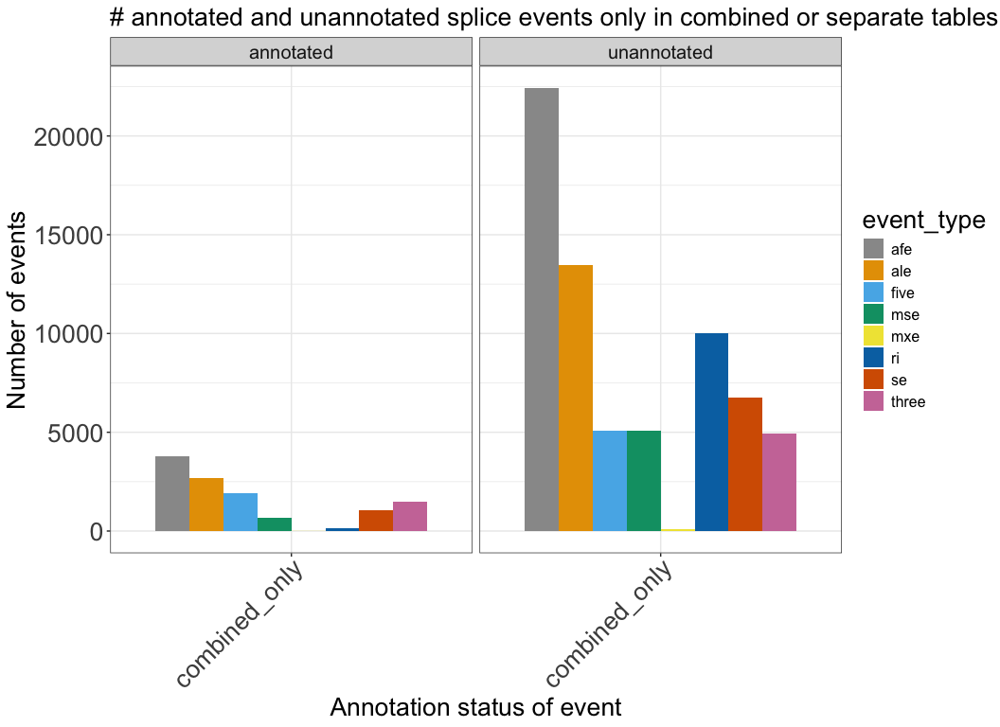
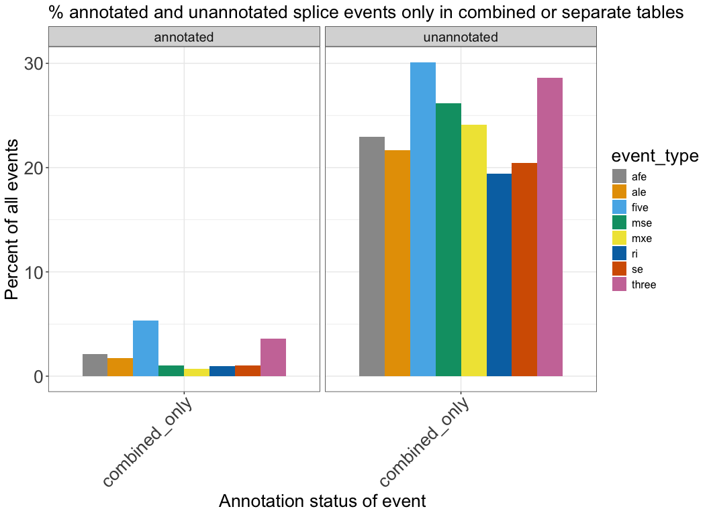
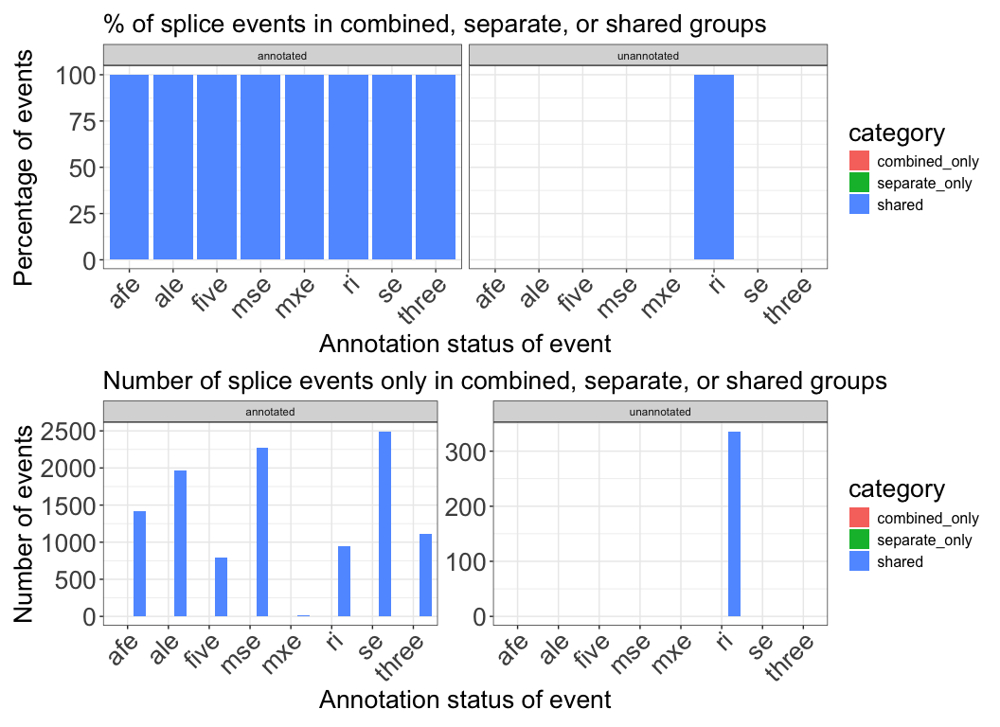
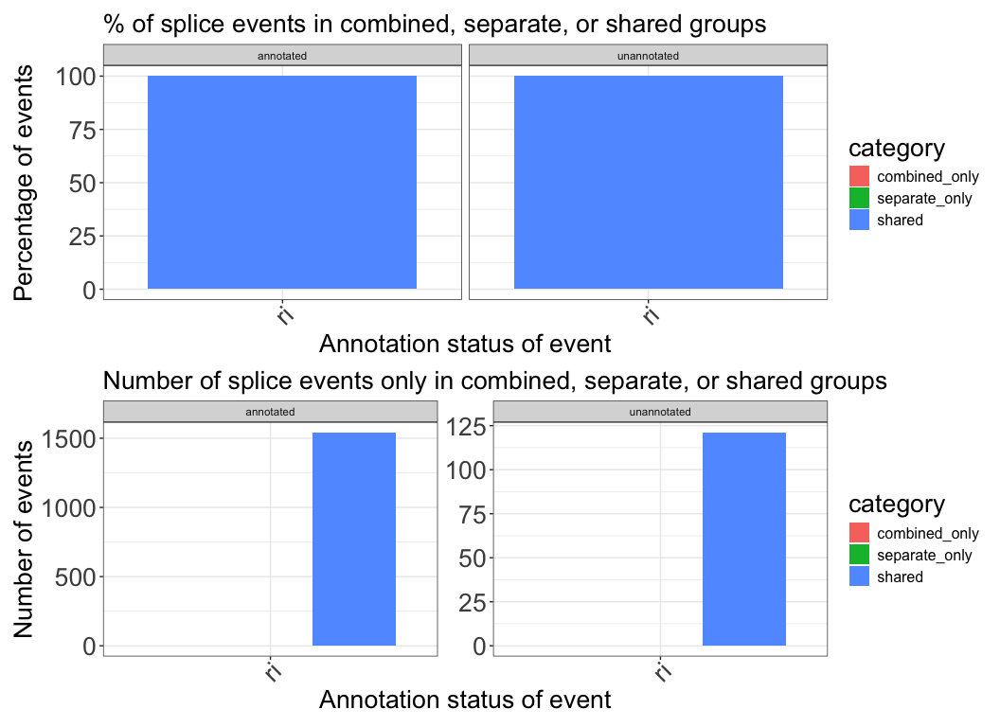
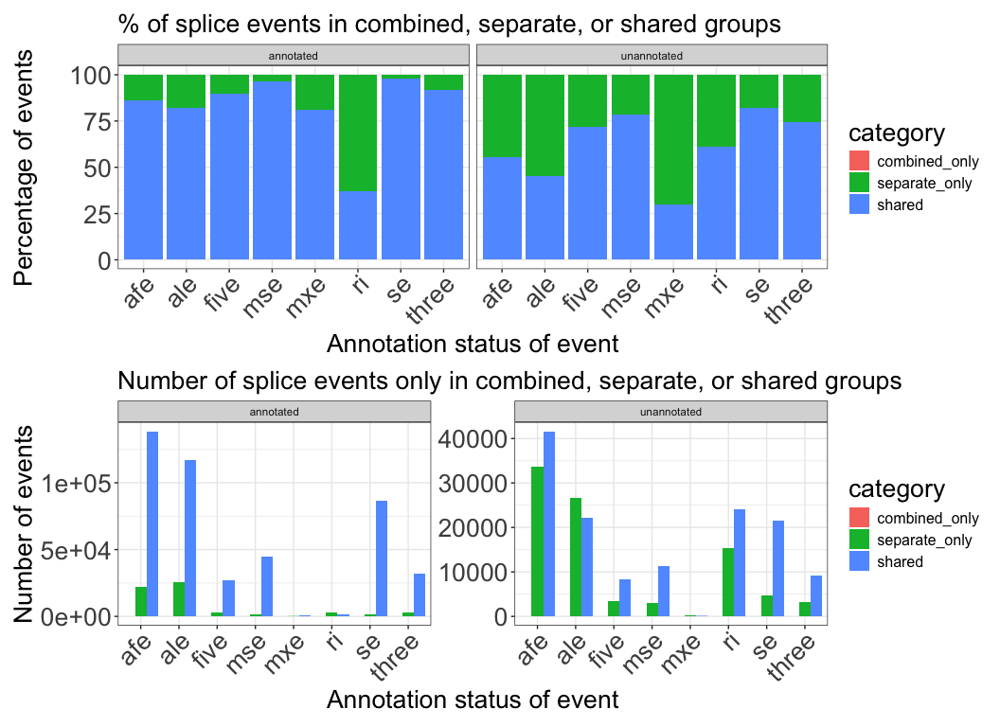
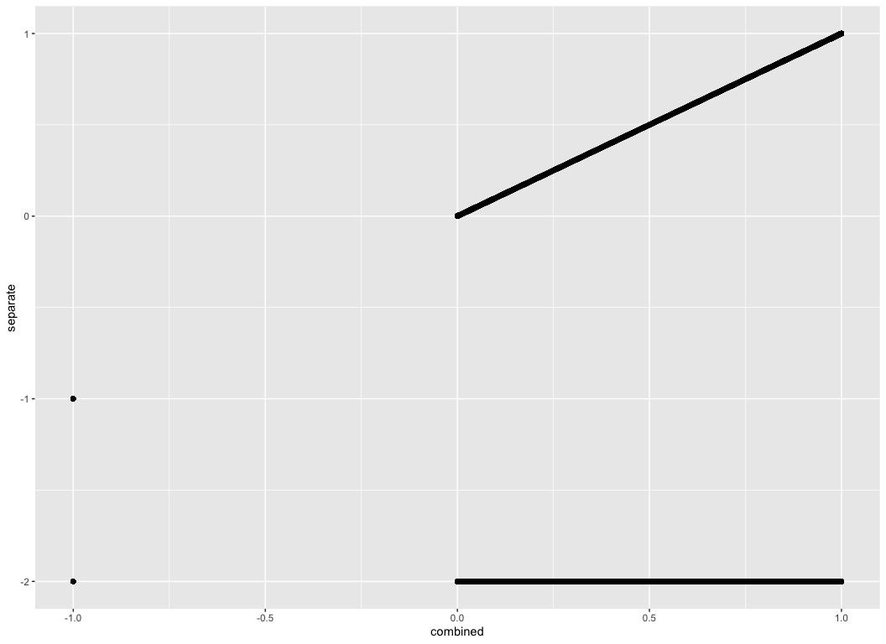
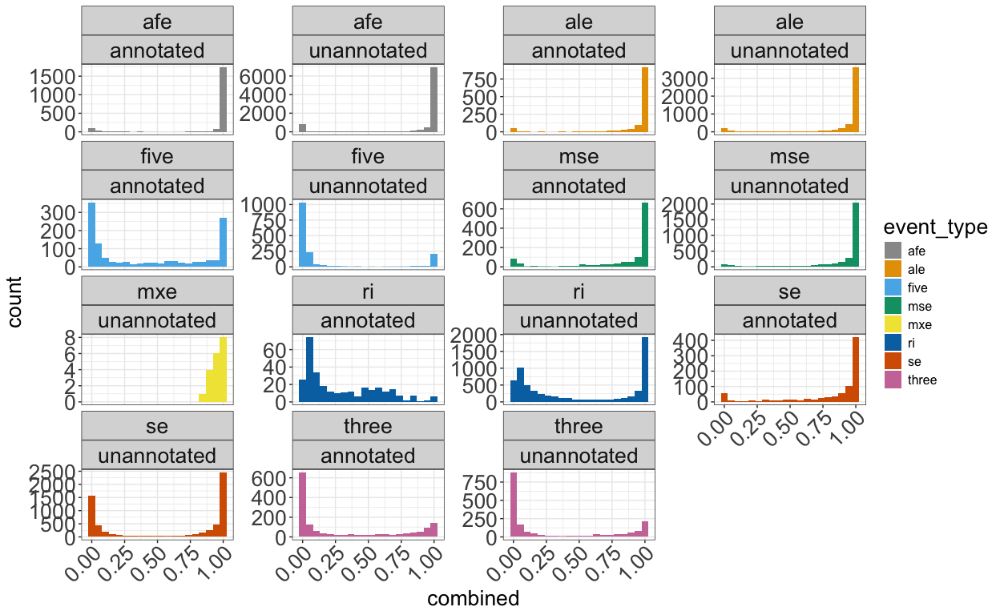
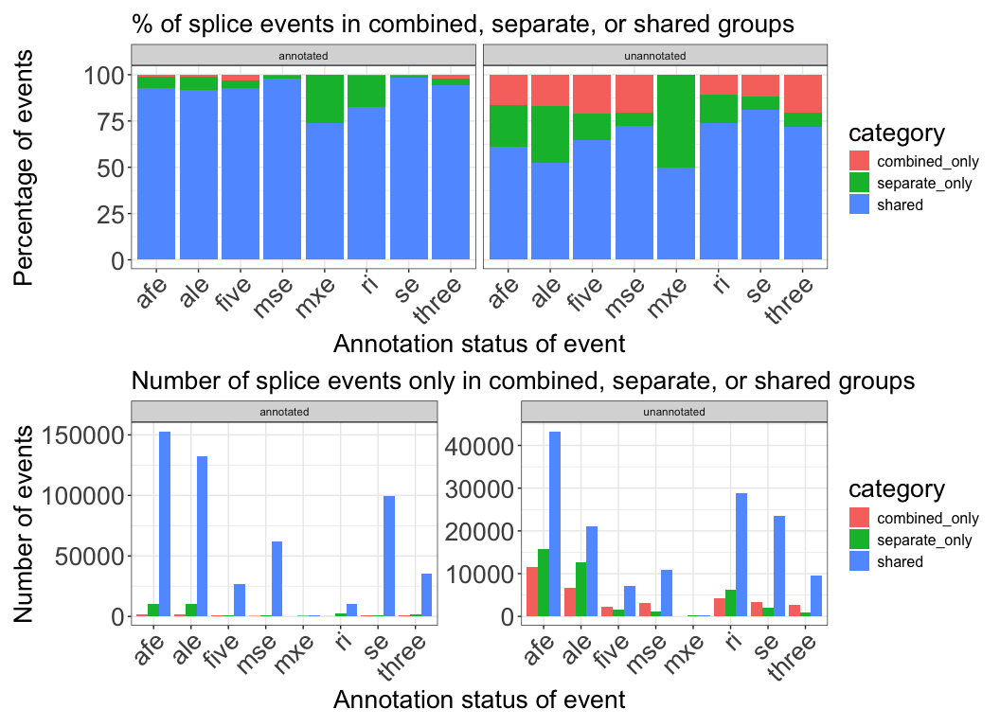
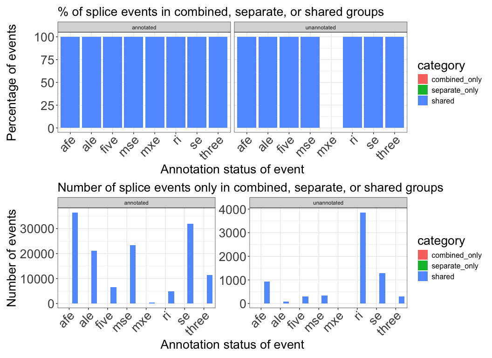
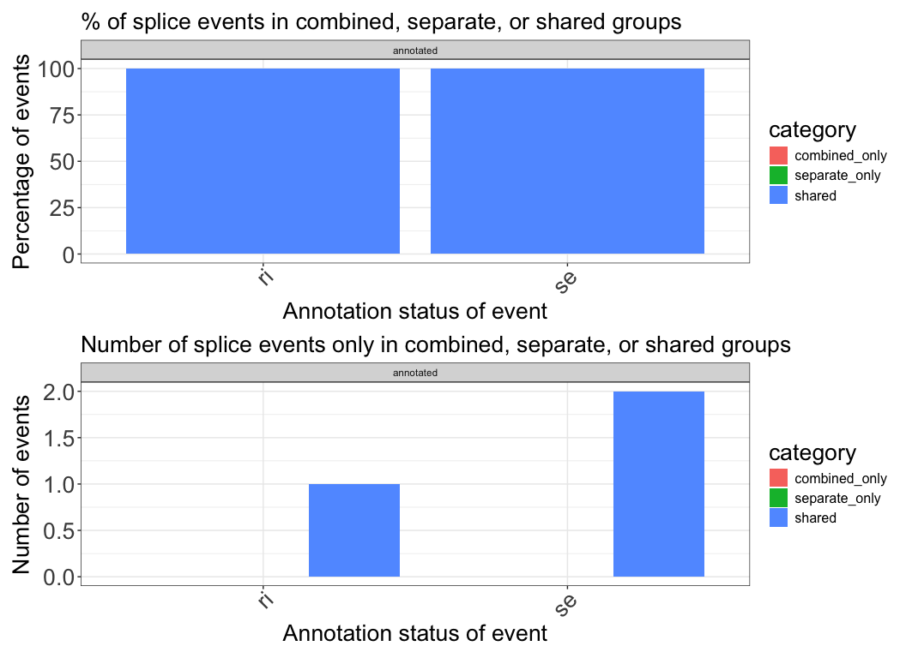

# Compare merged PSI table from TARGET pilot samples
Cindy Liang (celiang@ucsc.edu)
2026-05-06

**Question:** Does merging separate splice tables cause us to lose out
on the trustworthiness of unannotated events to an extent that it
impacts many samples?

As part of our pipeline, we plan to merge Shiba tables created for
individual samples to obtain a final PSI table of all samples. Before
doing so, we use this notebook to test that merging PSI tables from
separate runs will not introduce a large amount of untrustworthy splice
events.

As part of tracking differences between the two tables, we have labeled
NA values introduced at various steps of the data processing pipeline
with different negative values:

- -1: NA values assigned by Shiba (splice events with low coverage)

- -2: NA values from merging the separate tables together (samples have
  a NA value after this step if there are genes dropped by Shiba for
  those samples because there is only one transcript detected for that
  gene)

- NA: NA values from merging the separate and combined tables. These NAs
  represent splice events that are only found in one analysis method
  (combined vs. separate)

We are particularly interested in the impact merging separate tables has
on unannotated event detection, since this is one novelty of using
Shiba.

**Targeted questions this notebook is trying to answer:**

- What splice event types do we miss out on with the separate tables
  method?
- How many unannotated event types remain if we try to drop all NAs in
  the splice table? Dropping all NAs is the easiest option to dealing
  with manually merging the separate splice tables. How bad does it
  look?
- Of splice events with high numbers of NA values, how many of these
  events only have a numeric PSI value in one (or a very low amount of)
  samples?
- How many NA values of different NA types are there in each type of
  splice table? How are they distributed across events? I am more
  concerned with the merge NAs (-2), as there is no good way to replace
  them (they could either be 0 or 1). Another concern is events that are
  only found in the combined table, or only found in the separate table,
  as there is no easy way to correct for those. Can the number of NA
  values be reduced in the separate tables method if we filter for
  events with a minimum number of samples?
- How well correlated are the PSI values and NAs in each splice table
  type? Assuming the Shiba NAs (-1) are from low read support, do the
  separate and combined tables always call the same events as a Shiba
  NA? Merge NAs (-2) should arise from events dropped by Shiba due to
  lack of alternative transcripts for a gene, so we expect these NAs to
  be 0 or 1.
- How well correlated are the number of NA values in each event type for
  each PSI table type? (not done yet)
- How well correlated are the PSI values of events that are shared?

**Exploratory items in notebook:**

This section doesn’t need code review because they don’t answer the main
questions, I’m just trying to learn more about the data

- How many unannotated event types remain if we only filter for one gene
  before trying to drop all NAs in the splice table?
- How many unannotated event types remain if we only filter for two
  cancer types before trying to drop all NAs in the splice table? (to
  do)

## Set up

### Define functions

``` r
# PSI distribution plots of events in each method
psi_distributions <- function(
    df,
    event_type_value) {
  df |>
    dplyr::filter(event_type == event_type_value) |>
    ggplot(aes(PSI, fill = event_status)) +
    geom_histogram(bins = 20) +
    facet_wrap(vars(event_type, label, event_status), scales = "free_y") +
    plot_theme +
    # make facet labels bigger
    theme(strip.text.x = element_text(size = global_size),
          # rotate x axis labels so they don't overlap
          axis.text.x = element_text(angle =45))
}

# event summary plots of frequency of events in each category
event_summary <- function(
    long_df,
    min_sample_value) {
  # filter samples by complete PSI value in min number of samples
  all_events_n_filtered <- long_df |>
    dplyr::group_by(pos_id) |>
    # count number of events are present in each shared status
    dplyr::mutate(
      combined_count = sum(method == "combined"),
      separate_count = sum(method == "separate")
    ) |>
    # filter for events with complete PSI values for minimum number of samples
    dplyr::filter(
      combined_count >= min_sample_value,
      separate_count >= min_sample_value
    ) |>
    dplyr::ungroup() |>
    # create summary table for plotting
    dplyr::summarise(
      .by = c(event_type, label),
      # count number of events in each event type and annotation category
      total = dplyr::n(),
      shared_count = sum(shared_event),
      combined_only_count = sum(combined_event) - shared_count,
      separate_only_count = sum(separate_event) - shared_count,
      shared_percent = shared_count / total * 100,
      combined_only_percent = combined_only_count / total * 100,
      separate_only_percent = separate_only_count / total * 100
    )
}

# plot event summary frequencies as percent and raw counts bar plots
plot_event_summary <- function(
    summary_df) {
  # pivot summary df longer for plotting
  long_summary_df <- summary_df |>
    tidyr::pivot_longer(
      cols = c(
        shared_count,
        shared_percent,
        combined_only_count,
        combined_only_percent,
        separate_only_count,
        separate_only_percent
      ),
      # extract percents and counts into separate columns
      names_to = c("category", ".value"),
      names_pattern = "(.+)_(percent|count)"
    )

  # create percent stacked barplots
  percent_plot <-
    ggplot(long_summary_df, aes(fill = category, x = event_type, y = percent)) +
    geom_bar(position = "stack", stat = "identity") +
    plot_theme +
    labs(
      title = "% of splice events in combined, separate, or shared groups",
      x = "Annotation status of event",
      y = "Percentage of events"
    ) +
    facet_wrap(vars(label)) +
    scale_x_discrete(guide = guide_axis(angle = 45)) +
    plot_theme

  # create raw counts grouped barplot
  counts_plot <-
    ggplot(long_summary_df, aes(fill = category, x = event_type, y = count)) +
    geom_bar(position = "dodge", stat = "identity") +
    plot_theme +
    labs(
      title = "Number of splice events only in combined, separate, or shared groups",
      x = "Annotation status of event",,
      y = "Number of events"
    ) +
    facet_wrap(vars(label), scales = "free_y") +
    scale_x_discrete(guide = guide_axis(angle = 45)) +
    plot_theme

  # arrange plots for printing
  percent_plot /
    counts_plot

}

# created bar plots of splice events by value category (NA, numeric)
event_value_hist <- function (psi_df, category_value, event_value) {
  psi_df |>
  dplyr::filter(category == category_value,
                event_type == event_value) |>
    ggplot(aes(fill = method, x = sample, y = count)) +
    geom_histogram() +
    labs(
      x = "Sample",
      y = "Number of events"
    ) +
    scale_x_discrete(guide = guide_axis(angle = 45)) +
    facet_wrap(vars(label), scales = "free_y", ncol = 1) +
    theme_bw() +
    plot_theme +
      theme(axis.text.x=element_blank()) +
    # make facet labels bigger
    theme(strip.text.x = element_text(size = global_size))
    }
```

## Directories and files

``` r
# find the root-level repo directory so we can access the other files
repo_root <- rprojroot::find_root(rprojroot::is_git_root)

# define the data directories
exploration_dir <- file.path(repo_root, "exploration")
merge_exploration_dir <- file.path(exploration_dir, "merging-psi-tables")
target_pilot_dir <- file.path(merge_exploration_dir, "target_pilot")
metadata_dir <- file.path(repo_root, "metadata", "pilot_shiba_run")

# directory of shiba results produced from the same shiba run
combined_dir <- file.path(target_pilot_dir, "shiba_combined", "results")

# psi table directory
combined_splice_results_dir <- file.path(combined_dir, "splicing")

# Directory of PSI table, merged from separate shiba runs
separate_psi_table_dir <- file.path(target_pilot_dir, "merged_results")

# target subset metadata
target_metadata_file <- file.path(metadata_dir, "target_accessions.tsv")

# merged PSI file of two samples obtained from merge-shiba-psi-tables.qmd
separate_psi_file <- file.path(separate_psi_table_dir, "merged_psi_table.tsv")

# define list of PSI results files corresponding to event types quantified by Shiba bulk analysis
psi_files <- c(
  se = "PSI_SE.txt",
  afe = "PSI_AFE.txt",
  ale = "PSI_ALE.txt",
  five = "PSI_FIVE.txt",
  three = "PSI_THREE.txt",
  mse = "PSI_MSE.txt",
  mxe = "PSI_MXE.txt",
  ri = "PSI_RI.txt"
)

# construct psi table paths of shiba results of two samples run together
shiba_psi_paths <-file.path(combined_splice_results_dir, psi_files)
names(shiba_psi_paths) <- names(psi_files)
```

Read in files

``` r
# read in TARGET sample metadata
target_metadata <- readr::read_tsv(target_metadata_file, col_types = c(.default = "c"))

# read merged splice table from separate runs of Shiba on the TARGET pilot samples
separate_psi_table <- readr::read_tsv(separate_psi_file, col_types=readr::cols(.default = "c")) |>
  # replace remaining NAs from this table representing dropped genes from one sample with no detected splicing for that gene with -2
  dplyr::mutate(across(contains("_PSI"), \(x) tidyr::replace_na(as.numeric(x), -2)))

# read in combined splice results to compare against separate results
combined_splice_results <- shiba_psi_paths |>
  purrr::map(\(path){
    readr::read_tsv(path, col_types=readr::cols(.default = "c")) |>
      # select for columns that will be used in downstream analysis
      dplyr::select(pos_id, gene_id, label, contains("_PSI")) |>
      # convert PSI values to numeric and replace NA values from shiba representing low coverage with -1
      dplyr::mutate(across(contains("_PSI"), \(x) tidyr::replace_na(as.numeric(x), -1)))
  })

# combine PSI values of samples run together into one dataframe to compare against separate PSI dataframe
combined_psi_table <- purrr::list_rbind(combined_splice_results, names_to = "event_type")
```

### Obtain dimensions of each PSI table

``` r
# dimensions of separate PSI table
dim(separate_psi_table)
```

    [1] 818412     92

``` r
# dimensions of combined PSI table
dim(combined_psi_table)
```

    [1] 746601     92

There are 71,811 more splice events in the separate PSI table than the
combined table.

## What splice event types do we miss out on with the separate tables method?

To help us prioritize what splice event types we may be the most
confident in after merging separate Shiba PSI tables, we are interested
in seeing a breakdown of what event types are most represented in PSI
tables constructed from different methods

``` r
# obtain df of splice events that are shared between both combined and separate tables
# event-level dataframe
# each row is a unique splice event (position ID)
# columns are each samples' PSI value (with -1/-2/NA values indicating different NA categories)
# combined_event, seaprate_event, and shared_event columns label what tables the event is present in
all_events <- dplyr::full_join(
  combined_psi_table,
  separate_psi_table,
  by = c("event_type", "pos_id", "gene_id", "label"),
  # label PSI values by table they came from
  suffix = c("_combined", "_separate")) |>
  # categorize events by whether they are in the combined or separate tables
  dplyr::mutate(
    # combined events are counted if the values are not all NA
    combined_event = ! dplyr::if_all(ends_with("_combined"), is.na),
    # separate events are counted if the values for the event are not all NA (indicating the specific position ID is only found in the combined or separate table)
    separate_event = ! dplyr::if_all(ends_with("_separate"), is.na),
    shared_event = combined_event & separate_event
  )
```

Print summary of counts across each method, across all event types

``` r
# number of total events shared or present only in the combined and separate tables
# this table counts events with -1 and -2

all_methods_summary <- all_events |> dplyr::summarise(
    # count number of events in each event type and annotation category
    shared_count = sum(shared_event),
    combined_only_count = sum(combined_event) - shared_count,
    separate_only_count = sum(separate_event) - shared_count
)

all_methods_summary
```

| shared_count | combined_only_count | separate_only_count |
|-------------:|--------------------:|--------------------:|
|       667022 |               79579 |              151390 |

Print summary of counts and percentages across each method, broken down
by event type

``` r
# event-level summary of the number of each splice event type in each splice table
all_events_summary <- all_events |> dplyr::summarise(
    .by = c(event_type, label),
    # count number of events in each event type and annotation category
    total = dplyr::n(),
    shared_count = sum(shared_event),
    combined_only_count = sum(combined_event) - shared_count,
    separate_only_count = sum(separate_event) - shared_count,
    shared_percent = shared_count / total * 100,
    combined_only_percent = combined_only_count / total * 100,
    separate_only_percent = separate_only_count / total * 100,
)

all_events_summary
```

| event_type | label | total | shared_count | combined_only_count | separate_only_count | shared_percent | combined_only_percent | separate_only_percent |
|:---|:---|---:|---:|---:|---:|---:|---:|---:|
| se | annotated | 104872 | 101868 | 1054 | 1950 | 97.13556 | 1.0050347 | 1.859410 |
| se | unannotated | 32912 | 21511 | 6737 | 4664 | 65.35914 | 20.4697375 | 14.171123 |
| afe | unannotated | 97616 | 41615 | 22429 | 33572 | 42.63133 | 22.9767661 | 34.391903 |
| afe | annotated | 180632 | 154880 | 3773 | 21979 | 85.74339 | 2.0887772 | 12.167833 |
| ale | annotated | 156353 | 127408 | 2706 | 26239 | 81.48740 | 1.7306991 | 16.781897 |
| ale | unannotated | 62334 | 22160 | 13488 | 26686 | 35.55042 | 21.6382712 | 42.811307 |
| five | annotated | 35556 | 30435 | 1894 | 3227 | 85.59737 | 5.3268084 | 9.075824 |
| five | unannotated | 16825 | 8424 | 5064 | 3337 | 50.06835 | 30.0980684 | 19.833581 |
| three | annotated | 40691 | 36397 | 1462 | 2832 | 89.44730 | 3.5929321 | 6.959770 |
| three | unannotated | 17214 | 9159 | 4927 | 3128 | 53.20669 | 28.6220518 | 18.171256 |
| mse | annotated | 64124 | 61819 | 653 | 1652 | 96.40540 | 1.0183395 | 2.576258 |
| mse | unannotated | 19434 | 11283 | 5080 | 3071 | 58.05804 | 26.1397551 | 15.802202 |
| mxe | annotated | 963 | 792 | 7 | 164 | 82.24299 | 0.7268951 | 17.030114 |
| mxe | unannotated | 481 | 110 | 116 | 255 | 22.86902 | 24.1164241 | 53.014553 |
| ri | unannotated | 51635 | 26113 | 10031 | 15491 | 50.57229 | 19.4267454 | 30.000968 |
| ri | annotated | 16349 | 13048 | 158 | 3143 | 79.80916 | 0.9664200 | 19.224417 |

Plot event-level (one count per unique event) summary of event frequency
across methods and event types

``` r
plot_event_summary(all_events_summary)
```

<div id="fig-splice_events_breakdown">


Figure 1

</div>

The majority of annotated event types are shared between both tables,
although there are more splice events unique to the separate table
(green) than the combined table (red). Inflated values in the separate
tables may be due to -2 NAs which arise from when genes without multiple
transcripts are dropped in samples analyzed separately.

What specific event types are impacted more by one method or the other?
These following plots answer the question for me better than the above
summary plots.

``` r
test <- all_events_summary |>
  dplyr::select(event_type, label, combined_only_count, total, combined_only_percent)

long_summary_df <- test |>
    tidyr::pivot_longer(
      cols = c(
        combined_only_count,
        combined_only_percent
      ),
      # extract percents and counts into separate columns
      names_to = c("category", ".value"),
      names_pattern = "(.+)_(percent|count)"
    )

# create raw counts grouped barplot
ggplot(long_summary_df, aes(fill = event_type, x = category, y = count)) +
    geom_bar(position = "dodge", stat = "identity") +
      scale_fill_manual(values = cbPalette) +
    plot_theme +
    labs(
      title = "# annotated and unannotated splice events only in combined or separate tables",
      x = "Annotation status of event",,
      y = "Number of events"
    ) +
    facet_wrap(vars(label)) +
    scale_x_discrete(guide = guide_axis(angle = 45)) +
    theme(strip.text = element_text(size = 15))
```

<div id="fig-splice_events_breakdown_unannotated">



Figure 2

</div>

Percentage plots of the event totals (events shared by both methods +
events only in one method)

``` r
# create percents grouped barplot
ggplot(long_summary_df, aes(fill = event_type, x = category, y = percent)) +
    geom_bar(position = "dodge", stat = "identity") +
      scale_fill_manual(values = cbPalette) +
    plot_theme +
    labs(
      title = "% annotated and unannotated splice events only in combined or separate tables",
      x = "Annotation status of event",,
      y = "Percent of all events"
    ) +
    facet_wrap(vars(label)) +
    scale_x_discrete(guide = guide_axis(angle = 45)) +
    theme(strip.text = element_text(size = 15))
```

<div id="fig-splice_events_percents_unannotated">



Figure 3

</div>

I think of these as “percent of each event category missed”. In the
worst cases, 30% of unannotated events might be only in the combined
table (FIVE events). Losing 30% of unannotated real events seems rough.

### Examine how many events across tables have events composed completely of numeric PSI values

- How many unannotated event types remain if we try to drop all NAs in
  the splice table? Dropping all NAs is the easiest option to dealing
  with manually merging the separate splice tables. How bad does it
  look?

This is an event-level summary of how many events in each splice table
method have complete (no NAs) PSi values across all samples.

``` r
# event-level summary of the number of each splice event type in each splice table
all_numeric_events_summary <- all_events |>
  # filter for events where there are numeric PSI values in all samples
  dplyr::filter(dplyr::if_all(dplyr::starts_with("SRR"), ~ . >= 0)) |>
  dplyr::summarise(
    .by = c(event_type, label),
    # count number of events in each event type and annotation category
    total = dplyr::n(),
    shared_count = sum(shared_event),
    combined_only_count = sum(combined_event) - shared_count,
    separate_only_count = sum(separate_event) - shared_count,
    shared_percent = shared_count / total * 100,
    combined_only_percent = combined_only_count / total * 100,
    separate_only_percent = separate_only_count / total * 100,
)

plot_event_summary(all_numeric_events_summary )
```

<div id="fig-complete_splice_events_breakdown">



Figure 4

</div>

I’m not surprised that splice events that have numeric PSI values across
all samples are mostly annotated. These are likely annotated transcripts
that are shared across all samples across the cancer types in the pilot
that have multiple isoforms. It’s surprising that there are a handful of
unannotated retained intron events shared across all samples, but my
takeaway is that we need to unify the tables somehow (whether by
converting all Shiba NAs in the separate tables to 0, or some other
method), Or we need to not drop

- Of splice events with high numbers of NA values, how many of these
  events only have a numeric PSI value in one (or a very low amount of)
  samples?

Filter for minimum of 5 samples with numeric PSI values

``` r
# event-level summary of the number of each splice event type in each splice table
all_numeric_events_summary <- all_events |>
  # filter for events where there are numeric PSI values in at least 5 samples
  # there is probably a more secure way to do this but the only numeric values in this table should be the PSI values per sample so i think this works
  dplyr::filter(rowSums(dplyr::across(where(is.numeric), ~ . >= 0 )) >= 5) |>
  dplyr::summarise(
    .by = c(event_type, label),
    # count number of events in each event type and annotation category
    total = dplyr::n(),
    shared_count = sum(shared_event),
    combined_only_count = sum(combined_event) - shared_count,
    separate_only_count = sum(separate_event) - shared_count,
    shared_percent = shared_count / total * 100,
    combined_only_percent = combined_only_count / total * 100,
    separate_only_percent = separate_only_count / total * 100,
)

plot_event_summary(all_numeric_events_summary )
```

<div id="fig-complete_splice_events_breakdown_5_samples">


Figure 5

</div>

This actually looks all right to me, with the caveat that we lose all
the combined_only events. The number of shared AFE events in
<a href="#fig-splice_events_breakdown" class="quarto-xref">Figure 1</a>
is ~40,000 so we seem to get most of those AFE events if we ask for
splice events that are shared in 5 or more samples. The reduction in SE
events is small too - we go from around 20,000 in
<a href="#fig-splice_events_breakdown" class="quarto-xref">Figure 1</a>,
to slightly under 20,000 here. I do see a small number of MXE events in
the separate_only category but this event type has been the lowest, so I
would be all right dropping it in our later analyses.

### Examine event-level NA values

How many NA values of different NA types are there in each type of
splice table? How are they distributed across events?

Examine the number of each type of NA value (-1 and -2) are present in
each table

What kinds of and how many events have shiba NAs across all samples?

``` r
# event-level summary of the number of each splice event type in each splice table
shiba_na_events_summary <- all_events |>
  # filter for events where there is a shiba NA
  dplyr::filter(
    dplyr::if_all(dplyr::starts_with("SRR"), ~ . == -1)
    ) |>
  dplyr::summarise(
    .by = c(event_type, label),
    # count number of events in each event type and annotation category
    total = dplyr::n(),
    shared_count = sum(shared_event),
    combined_only_count = sum(combined_event) - shared_count,
    separate_only_count = sum(separate_event) - shared_count,
    shared_percent = shared_count / total * 100,
    combined_only_percent = combined_only_count / total * 100,
    separate_only_percent = separate_only_count / total * 100,
)

plot_event_summary(shiba_na_events_summary)
```

<div id="fig-shiba_na_splice_events_breakdown">



Figure 6

</div>

This plot is less useful to me. I think the sample-level breakdown of
Shiba NAs will likely be more informative.

What kinds of and how many events have merge NAs across all samples?

``` r
# event-level summary of the number of each splice event type in each splice table
merge_na_events_summary <- all_events |>
  # filter for events where there are numeric PSI values in all samples
  dplyr::filter(dplyr::if_any(dplyr::starts_with("SRR"), ~ . == -2)) |>
  dplyr::summarise(
    .by = c(event_type, label),
    # count number of events in each event type and annotation category
    total = dplyr::n(),
    shared_count = sum(shared_event),
    combined_only_count = sum(combined_event) - shared_count,
    separate_only_count = sum(separate_event) - shared_count,
    shared_percent = shared_count / total * 100,
    combined_only_percent = combined_only_count / total * 100,
    separate_only_percent = separate_only_count / total * 100,
)

plot_event_summary(merge_na_events_summary)
```

<div id="fig-merge_na_splice_events_breakdown">



Figure 7

</div>

I still don’t think event-level plots of NA values are as useful as the
sample-level plots will be.

## Examine sample-level splice events

Pivot longer for plotting sample-level splice event info

``` r
# Pivot all events df longer
# Each row corresponds to a splice event found in one sample, so there are multiple rows of splice events with the same sample ID
long_all_events <- all_events |>
  dplyr::slice_sample(n = 5000) |>
  tidyr::pivot_longer(
    cols = matches("_combined|_separate"),
    names_to = c("sample", "method"),
    values_to = "PSI",
    names_pattern = "(.*)_(combined|separate)"
  )

# print column names
colnames(long_all_events)
```

     [1] "event_type"     "pos_id"         "gene_id"        "label"         
     [5] "combined_event" "separate_event" "shared_event"   "sample"        
     [9] "method"         "PSI"           

### Examine relationships between of PSI and NA values of combined and separate tables

- How well correlated are the PSI values and NAs in each splice table
  type? Assuming the Shiba NAs (-1) are from low read support, do the
  separate and combined tables always call the same events as a Shiba
  NA? Merge NAs (-2) should arise from events dropped by Shiba due to
  lack of alternative transcripts for a gene, so we expect these NAs to
  be 0 or 1.

I decided to go with a plot instead of a table for this because the
table is 170,000 rows long. From eyeballing the table in R, I saw a
couple values that had -2 PSI values in the separate table and -1 in the
combined table But it was hard to get a sense of all the possible
separate - combined PSI value and NA combinations

``` r
na_comparison_samples <- long_all_events |>
  dplyr::select(pos_id, sample, method, PSI, event_type, label) |>
    tidyr::drop_na() |>
  tidyr::pivot_wider(
    names_from = method,
    values_from = PSI
  )

# plot basic scatterplot to see
ggplot(na_comparison_samples, aes(x = combined, y = separate)) +
  geom_point()
```

    Warning: Removed 107624 rows containing missing values or values outside the scale range
    (`geom_point()`).

<div id="fig-na_corresponding_to_numeric_values">



Figure 8

</div>

From this plot, I see four different categories of splice event matches
between the separate and combined tables:

- Upper dot: We have some splice events that are dropped by Shiba due to
  no alternative splicing in the separate tables (Y = -2) but are also
  dropped in the combined tables because there were too few reads anyway
  (X = -1).
- Lower dot: We have some splice events that had too few reads for a
  numeric PSI in both tables (x = -1, y = -1)
- Diagonal line: We also see events whose PSI values are numeric and
  have a linear relationship in both combined and separate methods
  (these are likley the events that were identical and found in both)
- The most concerning case is the horizontal line at Y=-2, corresponding
  to splice events dropped in the separate tables due to lack of
  transcripts for a gene but was captured in the combined splice table.
  In this section, we can see that the PSI values calculated in the
  combined table span the full PSI value range from 0-1, so there is no
  easy way to replace the -2 NA values in the separate table.

Summarize how many of each of these match categories are present in the
pilot tables

``` r
na_comparison_summary <- na_comparison_samples |>
  # drop NAs from putting together the separate and combined tables
  tidyr::drop_na() |>
  dplyr::mutate(
    match_category =
      dplyr::case_when(
        separate == -1 & combined == -1 ~ "both Shiba NAs",
        separate == -2 & combined == -1 ~ "separate dropped, combined shiba NA",
        separate >= 0 & combined >= 0 ~ "both numeric PSIs",
        separate == -2 & combined >= 0 ~ "numeric PSI dropped in separate table"
      )
  ) |>
  dplyr::summarise(
    .by = c(match_category),
    count = dplyr::n()
  ) |>
  dplyr::mutate(
    total = sum(count),
    percent = count / total * 100
  )

na_comparison_summary
```

| match_category                        |  count |  total |  percent |
|:--------------------------------------|-------:|-------:|---------:|
| separate dropped, combined shiba NA   | 156695 | 332376 | 47.14390 |
| both Shiba NAs                        |  62748 | 332376 | 18.87862 |
| both numeric PSIs                     |  71023 | 332376 | 21.36827 |
| numeric PSI dropped in separate table |  41910 | 332376 | 12.60921 |

So there are only 12% of all samples(?) that have events with a “ground
truth” numeric PSI value which gets dropped in Shiba

### Plot PSI distribution of numeric PSI dropped in separate table

``` r
na_comparison_samples |>
  # drop NAs from putting together the separate and combined tables
  tidyr::drop_na() |>
  dplyr::mutate(
    match_category =
      dplyr::case_when(
        separate == -1 & combined == -1 ~ "both Shiba NAs",
        separate == -2 & combined == -1 ~ "separate dropped, combined shiba NA",
        separate >= 0 & combined >= 0 ~ "both numeric PSIs",
        separate == -2 & combined >= 0 ~ "numeric PSI dropped in separate table"
      )
  ) |>
  dplyr::filter(match_category == "numeric PSI dropped in separate table",) |>
    ggplot(aes(combined, fill = event_type)) +
    geom_histogram(bins = 20) +
    facet_wrap(vars(event_type, label), scales = "free_y") +
  scale_fill_manual(values = cbPalette) +
    plot_theme +
    # make facet labels bigger
    theme(strip.text.x = element_text(size = global_size),
          # rotate x axis labels so they don't overlap
          axis.text.x = element_text(angle =45))
```

<div id="fig-psi_dist_numeric_dropped_annotated">



Figure 9

</div>

Again we see here that the PSI values of -2 events dropped in the
separate tables span the full PSI range

### Examine how many samples have a numeric PSI value per splice event

Drop NAs and make sample-level summary

``` r
# drop NAs of unshared events between combined vs separate tables for analyzing NAs and PSI values shared between at least some combined and separate methods
long_events_shared <- long_all_events |> tidyr::drop_na()

sample_level_all_events_summary <- long_events_shared |> dplyr::summarise(
    .by = c(event_type, label),
    # count number of events in each event type and annotation category
    total = dplyr::n(),
    shared_count = sum(shared_event),
    combined_only_count = sum(combined_event) - shared_count,
    separate_only_count = sum(separate_event) - shared_count,
    shared_percent = shared_count / total * 100,
    combined_only_percent = combined_only_count / total * 100,
    separate_only_percent = separate_only_count / total * 100,
)

# drop all NA types for correlation analysis
long_no_na_all_events <- long_all_events |>
  # drop NA values, including those coded as negative PSI
  dplyr::filter(PSI >= 0)

# create sample-level summary of splice events shared in at least some samples
psi_sample_summary <- long_events_shared |>
  dplyr::summarise(
    .by = c(event_type, label, sample, method),
    total = dplyr::n(),
    shiba_na_count = sum(PSI == -1),
    shiba_na_percent = shiba_na_count / total * 100,
    merge_na_count = sum(PSI == -2),
    merge_na_percent = merge_na_count / total * 100,
    complete_psi_count = sum(PSI >= 0),
    complete_psi_percent = complete_psi_count / total * 100
  ) |>
  # pivot counts longer for plotting
  tidyr::pivot_longer(
    cols = c(
      shiba_na_count,
      shiba_na_percent,
      merge_na_count,
      merge_na_percent,
      complete_psi_count,
      complete_psi_percent),
    # extract percents and counts as separate columns
    names_to = c("category", ".value"),
    names_pattern = "(.+)_(percent|count)"
  )

# print head to spot check so we don't get a bunch of rows
head(psi_sample_summary)
```

| event_type | label     | sample         | method   | total | category     | count |  percent |
|:-----------|:----------|:---------------|:---------|------:|:-------------|------:|---------:|
| se         | annotated | SRR1559043_PSI | combined |   573 | shiba_na     |   370 | 64.57243 |
| se         | annotated | SRR1559043_PSI | combined |   573 | merge_na     |     0 |  0.00000 |
| se         | annotated | SRR1559043_PSI | combined |   573 | complete_psi |   203 | 35.42757 |
| se         | annotated | SRR1559044_PSI | combined |   573 | shiba_na     |   418 | 72.94939 |
| se         | annotated | SRR1559044_PSI | combined |   573 | merge_na     |     0 |  0.00000 |
| se         | annotated | SRR1559044_PSI | combined |   573 | complete_psi |   155 | 27.05061 |

### Plot sample-level (one count per event in each sample) summary of event frequency across methods and event types

We are looking at events that are detected in both the separate and
combined splice tables in at least some samples (combined/separate NAs
dropped)

``` r
plot_event_summary(sample_level_all_events_summary)
```

<div id="fig-sample_level_splice_events_breakdown">



Figure 10

</div>

## Look at splice events present in min number of samples

We are interested in seeing how the splice event breakdown changes if we
filter for events present in at least a fraction of our samples. For
instance, do the number of events onkly found in the separate tables go
down?

Filter splice events for those with complete PSI values in \>=
min_samples samples per method

Note: these plots are of events without ANY NA values (no shiba nor mege
NAs) so we are only looking at distributions of complete splice events
with a minimum samples N These plots are very similar to the event-level
plot filtered for min 5 numeric PSI values, so may be redundant

### min_samples = 5

``` r
sample_filtered_event_summary <- event_summary(long_no_na_all_events, 5)
sample_filtered_event_summary
```

| event_type | label | total | shared_count | combined_only_count | separate_only_count | shared_percent | combined_only_percent | separate_only_percent |
|:---|:---|---:|---:|---:|---:|---:|---:|---:|
| afe | annotated | 36498 | 36498 | 0 | 0 | 100 | 0 | 0 |
| ale | annotated | 21036 | 21036 | 0 | 0 | 100 | 0 | 0 |
| afe | unannotated | 934 | 934 | 0 | 0 | 100 | 0 | 0 |
| five | annotated | 6638 | 6638 | 0 | 0 | 100 | 0 | 0 |
| mse | annotated | 23310 | 23310 | 0 | 0 | 100 | 0 | 0 |
| three | annotated | 11505 | 11505 | 0 | 0 | 100 | 0 | 0 |
| ri | unannotated | 3860 | 3860 | 0 | 0 | 100 | 0 | 0 |
| se | annotated | 32024 | 32024 | 0 | 0 | 100 | 0 | 0 |
| ri | annotated | 4848 | 4848 | 0 | 0 | 100 | 0 | 0 |
| three | unannotated | 296 | 296 | 0 | 0 | 100 | 0 | 0 |
| se | unannotated | 1282 | 1282 | 0 | 0 | 100 | 0 | 0 |
| mxe | annotated | 476 | 476 | 0 | 0 | 100 | 0 | 0 |
| five | unannotated | 296 | 296 | 0 | 0 | 100 | 0 | 0 |
| ale | unannotated | 80 | 80 | 0 | 0 | 100 | 0 | 0 |
| mse | unannotated | 347 | 347 | 0 | 0 | 100 | 0 | 0 |

``` r
plot_event_summary(sample_filtered_event_summary)
```

<div id="fig-splice_events_breakdown_5">



Figure 11

</div>

## Check how similar PSI values of shared events are

- How well correlated are the PSI values of events that are shared?

Pivot wider for correlation analysis

``` r
# pivot wider for correlation calculations
all_events_by_method <- long_no_na_all_events |>
  tidyr:: pivot_wider(
    names_from = method,
    values_from = PSI
  )
```

### Create table of correlation scores for shared event

``` r
correlation_df <- all_events_by_method |>
  dplyr::summarize(
    .by = event_type,
    # correlation coefficients are overestimated here because we remove incomplete observations
    pearson_r = cor(combined, separate, method = "pearson", use = "complete.obs"),
    pearson_r2 = pearson_r ** 2,
    spearman_rho = cor(combined, separate, method = "spearman", use = "complete.obs")
  )

# print correlation table
correlation_df
```

| event_type | pearson_r | pearson_r2 | spearman_rho |
|:-----------|----------:|-----------:|-------------:|
| afe        |         1 |          1 |            1 |
| se         |         1 |          1 |            1 |
| ale        |         1 |          1 |            1 |
| five       |         1 |          1 |            1 |
| mse        |         1 |          1 |            1 |
| ri         |         1 |          1 |            1 |
| three      |         1 |          1 |            1 |
| mxe        |         1 |          1 |            1 |

Check whether shared events have the same PSI values

``` r
# omit NAs
complete_all_events_by_method <- na.omit(all_events_by_method)

# check if shared events are equal
all.equal(complete_all_events_by_method$combined, complete_all_events_by_method$separate)
```

    [1] TRUE

All shared events have identical PSI values in tables created by the two
methods.

## Examine NA values

### Examine frequency of Shiba NA values in each method

label shiba NAs for analysis in sample-level df

``` r
na_long_all_events <- long_events_shared |>
  # label events by if they are shiba NAs (-1)
  dplyr::mutate(
    combined_shiba_na = combined_event & PSI == -1,
    separate_shiba_na = separate_event & PSI == -1,
    shared_shiba_na = shared_event & PSI == -1
  )

# summarize counts and percentage of each NA value type
na_summary <- na_long_all_events |> dplyr::summarise(
    .by = c(event_type, label),
    # count number of events in each event type and annotation category
    total = dplyr::n(),
    shared_shiba_na_count = sum(shared_shiba_na),
    combined_shiba_na_count = sum(combined_shiba_na) - shared_shiba_na_count,
    separate_shiba_na_count = sum(separate_shiba_na) - shared_shiba_na_count,
    shared_shiba_na_percent = shared_shiba_na_count / total * 100,
    combined_shiba_na_percent = combined_shiba_na_count / total * 100,
    separate_shiba_na_percent = separate_shiba_na_count / total * 100
    )

na_summary
```

| event_type | label | total | shared_shiba_na_count | combined_shiba_na_count | separate_shiba_na_count | shared_shiba_na_percent | combined_shiba_na_percent | separate_shiba_na_percent |
|:---|:---|---:|---:|---:|---:|---:|---:|---:|
| se | annotated | 100936 | 43316 | 349 | 105 | 42.91432 | 0.3457637 | 0.1040263 |
| afe | annotated | 164912 | 74537 | 1445 | 1527 | 45.19805 | 0.8762249 | 0.9259484 |
| se | unannotated | 28952 | 5148 | 1685 | 11 | 17.78115 | 5.8199779 | 0.0379939 |
| ale | annotated | 143704 | 70387 | 1332 | 1744 | 48.98054 | 0.9269053 | 1.2136057 |
| afe | unannotated | 70576 | 12239 | 5111 | 87 | 17.34159 | 7.2418386 | 0.1232714 |
| mse | annotated | 63184 | 26319 | 23 | 11 | 41.65453 | 0.0364016 | 0.0174095 |
| five | annotated | 29128 | 11568 | 670 | 24 | 39.71436 | 2.3001923 | 0.0823949 |
| mse | unannotated | 15048 | 2124 | 1105 | 2 | 14.11483 | 7.3431685 | 0.0132908 |
| ri | unannotated | 39160 | 7919 | 2048 | 55 | 20.22217 | 5.2298264 | 0.1404494 |
| three | annotated | 37400 | 13098 | 508 | 55 | 35.02139 | 1.3582888 | 0.1470588 |
| three | unannotated | 13200 | 2889 | 1847 | 3 | 21.88636 | 13.9924242 | 0.0227273 |
| five | unannotated | 10912 | 1823 | 1451 | 4 | 16.70638 | 13.2972874 | 0.0366569 |
| ale | unannotated | 40480 | 5331 | 2827 | 30 | 13.16947 | 6.9836957 | 0.0741107 |
| mxe | annotated | 1672 | 549 | 0 | 106 | 32.83493 | 0.0000000 | 6.3397129 |
| ri | annotated | 12760 | 4876 | 88 | 635 | 38.21317 | 0.6896552 | 4.9764890 |
| mxe | unannotated | 352 | 68 | 0 | 0 | 19.31818 | 0.0000000 | 0.0000000 |

Plot sample-level shiba NA frequency in each method

``` r
11
```

    [1] 11

``` r
# pivot summary df longer for plotting
long_na_summary_df <- na_summary |>
  tidyr::pivot_longer(
      cols = c(
        shared_shiba_na_count,
        shared_shiba_na_percent,
        combined_shiba_na_count,
        combined_shiba_na_percent,
        separate_shiba_na_count,
        separate_shiba_na_percent
      ),
      # extract percents and counts into separate columns
      names_to = c("category", ".value"),
      names_pattern = "(.+)_(percent|count)"
    )

# create percent stacked barplots
percent_plot <-
  ggplot(long_na_summary_df, aes(fill = category, x = event_type, y = percent)) +
  geom_bar(position = "stack", stat = "identity") +
  plot_theme +
  labs(
    title = "% of Shiba NA values in combined, separate, or shared groups",
    x = "Annotation status of event",
    y = "Percentage of events"
  ) +
  facet_wrap(vars(label)) +
  scale_x_discrete(guide = guide_axis(angle = 45)) +
  plot_theme +
  # make facet labels bigger
  theme(strip.text.x = element_text(size = global_size))

# create raw counts grouped barplot
counts_plot <-
  ggplot(long_na_summary_df, aes(fill = category, x = event_type, y = count)) +
  geom_bar(position = "dodge", stat = "identity") +
  plot_theme +
  labs(
    title = "Number of Shiba NA values in combined, separate, or shared groups",
    x = "Annotation status of event",,
    y = "Number of events"
  ) +
  facet_wrap(vars(label)) +
  scale_x_discrete(guide = guide_axis(angle = 45)) +
  plot_theme +
  # make facet labels bigger
  theme(strip.text.x = element_text(size = global_size))

# arrange plots for printing
percent_plot /
counts_plot + plot_layout(guides = "collect")
```

<div id="fig-shiba_na_breakdown">


Figure 12

</div>

I think we get more Shiba NA values in the combined tables because there
are more splice events dropped in the separate tables due to splicing
detected in the GTF for a given gene. I suspect there may be an overlap
of position IDs that have a Shiba (-1) NA value in the combined table
and position IDs that have a dropped gene (-2) NA in the separate
tables.

### Plot sample-level PSI distributions in each method

#### AFE

``` r
# make dataframe of PSI values of splice events only in the combined or separate dataframes
compare_psi_dist_df <- long_no_na_all_events |>
  # label splice events by whether they are only in the combined or separate tables
  dplyr::mutate(
    event_status = dplyr::case_when(
      combined_event == TRUE & separate_event == FALSE ~ "combined_only",
      combined_event == FALSE & separate_event == TRUE ~ "separate_only",
      combined_event == TRUE & separate_event == TRUE ~ "shared"
    )
  ) |>
  # exclude NAs as their PSI values cannot be binned
  na.omit()
```

### Plot PSI distributions of AFE events

``` r
# plot AFE event distributions
psi_distributions(compare_psi_dist_df, "afe")
```

<div id="fig-psi_dist_afe">


Figure 13

</div>

### Plot PSI distributions of ALE events

``` r
# filter df for ALE events
psi_distributions(compare_psi_dist_df, "ale")
```

<div id="fig-psi_dist_ale">


Figure 14

</div>

### Plot PSI distributions of SE events

``` r
psi_distributions(compare_psi_dist_df, "se")
```

<div id="fig-psi_dist_se">


Figure 15

</div>

### Plot PSI distributions of alternative 5’ splice site events

``` r
psi_distributions(compare_psi_dist_df, "five")
```

<div id="fig-psi_dist_five">


Figure 16

</div>

### Plot PSI distributions of alternative 3’ splice site events

``` r
psi_distributions(compare_psi_dist_df, "three")
```

<div id="fig-psi_dist_three">


Figure 17

</div>

### Plot PSI distributions of MSE events

``` r
psi_distributions(compare_psi_dist_df, "mse")
```

<div id="fig-psi_dist_mse">


Figure 18

</div>

### Plot PSI distributions of MXE events

``` r
psi_distributions(compare_psi_dist_df, "mxe")
```

<div id="fig-psi_dist_mxe">


Figure 19

</div>

### Plot PSI distributions of RI events

``` r
psi_distributions(compare_psi_dist_df, "ri")
```

<div id="fig-psi_dist_ri">


Figure 20

</div>

### Takeaways so far

- In the worst case scenario, about 40% of some splice event types
  across all unique events found in both the combined and separate
  (merged) tables are only found in the separate tables. This is
  concerning if we assume all events found only in the separate tables
  are false.

- Most of the events found only in the separate tables are unannotated
  events, which are the event types we are hoping to capture most in the
  splice compendium

- About 30% of unannotated splice events are only found in the combined
  tables, meaning they are missed in the separate tables method

- If we only look at splice events shared between both separate and
  combined PSI tables, the PSI values are identical.

- Unfortunately, PSI values of events only found in the combined or
  separate tables span the entire PSI distribution (0-1) so there is no
  easy way to set a filter to exclude values that are not found in the
  combined table.

A next step for this analysis will be to compare the number of NA values
in each table and examine how many of each type of NA value are present
in each method

## Exploration

This code does not need to be reviewed because I don’t think they help
us answer the main question

### Event level exploration

Can we “rescue” the detection of unannotated splice events if we ask for
the events of only one gene?

``` r
# event-level summary of the number of each splice event type in each splice table
gene_numeric_events_summary <- all_events |>
  # filter for events where there are numeric PSI values in all samples
  dplyr::filter(gene_id == "ENSG00000000419.14",
                dplyr::if_all(dplyr::starts_with("SRR"), ~ . >= 0)) |>
  dplyr::summarise(
    .by = c(event_type, label),
    # count number of events in each event type and annotation category
    total = dplyr::n(),
    shared_count = sum(shared_event),
    combined_only_count = sum(combined_event) - shared_count,
    separate_only_count = sum(separate_event) - shared_count,
    shared_percent = shared_count / total * 100,
    combined_only_percent = combined_only_count / total * 100,
    separate_only_percent = separate_only_count / total * 100,
)

plot_event_summary(gene_numeric_events_summary)
```

<div id="fig-exploratory_gene_numeric_splice_events_breakdown">



Figure 21

</div>

Not really.

What if we only ask for samples from a specific tumor type? Like one
query and one ref group?

``` r
# to do?
```

Another note here is that we assume the splice events in the combined
table are the ground truth, but a separate kind of evaluation would be
needed to truly ask how many “real” splice events are in each of the
tables. For instance, we maybe would need to do this experiment on
simulated reads where we know going in what all the transcripts are,
which may be beyond the scope of this project.
