# Compare merged PSI table from TARGET pilot samples
Cindy Liang (celiang@ucsc.edu)
2026-04-17

As part of our pipeline, we plan to merge Shiba tables created for
individual samples to obtain a final PSI table of all samples. Before
doing so, we use this notebook to test that merging PSI tables from
separate runs will not introduce a large amount of untrustworthy splice
events.

As part of tracking differences between the two tables, we have labeled
NA values introduced at various steps of the data processing pipeline
with different negative values:

- -1: NA values assigned by Shiba (splice events with low coverage)

- -2: NA values from merging the separate tables together (samples have
  a NA value after this step if there are genes dropped by Shiba for
  those samples because there is only one transcript detected for that
  gene)

- NA: NA values from merging the separate and combined tables. These NAs
  represent splice events that are only found in one analysis method
  (combined vs. separate)

## Set up

### Define functions

``` r
# PSI distribution plots of events in each method
psi_distributions <- function(
    df,
    event_type_value) {
  df |>
    dplyr::filter(event_type == event_type_value) |>
    ggplot(aes(PSI, fill = event_status)) +
    geom_histogram(bins = 20) +
    facet_wrap(vars(event_type, label, event_status), scales = "free_y") +
    plot_theme +
    # make facet labels bigger
    theme(strip.text.x = element_text(size = global_size),
          # rotate x axis labels so they don't overlap
          axis.text.x = element_text(angle =45))
}

# event summary plots of frequency of events in each category
event_summary <- function(
    long_df,
    min_sample_value) {
  # filter samples by complete PSI value in min number of samples
  all_events_n_filtered <- long_df |>
    dplyr::group_by(pos_id) |>
    # count number of events are present in each shared status
    dplyr::mutate(
      combined_count = sum(method == "combined"),
      separate_count = sum(method == "separate")
    ) |>
    # filter for events with complete PSI values for minimum number of samples
    dplyr::filter(
      combined_count >= min_sample_value,
      separate_count >= min_sample_value
    ) |>
    dplyr::ungroup() |>
    # create summary table for plotting
    dplyr::summarise(
      .by = c(event_type, label),
      # count number of events in each event type and annotation category
      total = dplyr::n(),
      shared_count = sum(shared_event),
      combined_only_count = sum(combined_event) - shared_count,
      separate_only_count = sum(separate_event) - shared_count,
      shared_percent = shared_count / total * 100,
      combined_only_percent = combined_only_count / total * 100,
      separate_only_percent = separate_only_count / total * 100
    )
}

# plot event summary frequencies as percent and raw counts bar plots
plot_event_summary <- function(
    summary_df) {
  # pivot summary df longer for plotting
  long_summary_df <- summary_df |>
    tidyr::pivot_longer(
      cols = c(
        shared_count,
        shared_percent,
        combined_only_count,
        combined_only_percent,
        separate_only_count,
        separate_only_percent
      ),
      # extract percents and counts into separate columns
      names_to = c("category", ".value"),
      names_pattern = "(.+)_(percent|count)"
    )

  # create percent stacked barplots
  percent_plot <-
    ggplot(long_summary_df, aes(fill = category, x = event_type, y = percent)) +
    geom_bar(position = "stack", stat = "identity") +
    plot_theme +
    labs(
      title = "% of splice events in combined, separate, or shared groups",
      x = "Annotation status of event",
      y = "Percentage of events"
    ) +
    facet_wrap(vars(label)) +
    scale_x_discrete(guide = guide_axis(angle = 45)) +
    plot_theme

  # create raw counts grouped barplot
  counts_plot <-
    ggplot(long_summary_df, aes(fill = category, x = event_type, y = count)) +
    geom_bar(position = "dodge", stat = "identity") +
    plot_theme +
    labs(
      title = "Number of splice events only in combined, separate, or shared groups",
      x = "Annotation status of event",,
      y = "Number of events"
    ) +
    facet_wrap(vars(label)) +
    scale_x_discrete(guide = guide_axis(angle = 45)) +
    plot_theme

  # arrange plots for printing
  percent_plot /
    counts_plot

}
```

## Directories and files

``` r
# find the root-level repo directory so we can access the other files
repo_root <- rprojroot::find_root(rprojroot::is_git_root)

# define the data directories
exploration_dir <- file.path(repo_root, "exploration")
merge_exploration_dir <- file.path(exploration_dir, "merging-psi-tables")
target_pilot_dir <- file.path(merge_exploration_dir, "target_pilot")

# directory of shiba results produced from the same shiba run
combined_dir <- file.path(target_pilot_dir, "shiba_combined", "results")

# psi table directory
combined_splice_results_dir <- file.path(combined_dir, "splicing")

# Directory of PSI table, merged from separate shiba runs
separate_psi_table_dir <- file.path(target_pilot_dir, "merged_results")

# merged PSI file of two samples obtained from merge-shiba-psi-tables.qmd
separate_psi_file <- file.path(separate_psi_table_dir, "merged_psi_table.tsv")

# define list of PSI results files corresponding to event types quantified by Shiba bulk analysis
psi_files <- c(
  se = "PSI_SE.txt",
  afe = "PSI_AFE.txt",
  ale = "PSI_ALE.txt",
  five = "PSI_FIVE.txt",
  three = "PSI_THREE.txt",
  mse = "PSI_MSE.txt",
  mxe = "PSI_MXE.txt",
  ri = "PSI_RI.txt"
)

# construct psi table paths of shiba results of two samples run together
shiba_psi_paths <-file.path(combined_splice_results_dir, psi_files)
names(shiba_psi_paths) <- names(psi_files)
```

Read in files

``` r
# read merged splice table from separate runs of Shiba on the TARGET pilot samples
separate_psi_table <- readr::read_tsv(separate_psi_file, col_types=readr::cols(.default = "c")) |>
  # replace remaining NAs from this table representing dropped genes from one sample with no detected splicing for that gene with -2
  dplyr::mutate(across(contains("_PSI"), \(x) tidyr::replace_na(as.numeric(x), -2)))

# read in combined splice results to compare against separate results
combined_splice_results <- shiba_psi_paths |>
  purrr::map(\(path){
    readr::read_tsv(path, col_types=readr::cols(.default = "c")) |>
      # select for columns that will be used in downstream analysis
      dplyr::select(pos_id, gene_id, label, contains("_PSI")) |>
      # convert PSI values to numeric and replace NA values from shiba representing low coverage with -1
      dplyr::mutate(across(contains("_PSI"), \(x) tidyr::replace_na(as.numeric(x), -1)))
  })

# combine PSI values of samples run together into one dataframe to compare against separate PSI dataframe
combined_psi_table <- purrr::list_rbind(combined_splice_results, names_to = "event_type")
```

### Obtain dimensions of each PSI table

``` r
# dimensions of separate PSI table
dim(separate_psi_table)
```

    [1] 818412     92

``` r
# dimensions of combined PSI table
dim(combined_psi_table)
```

    [1] 746601     92

There are 71,811 more splice events in the separate PSI table than the
combined table.

## Examine splice events that are consistently present in both combined and separate splice tables

To help us prioritize what splice event types we may be the most
confident in after merging separate Shiba PSI tables, we are interested
in seeing a breakdown of what event types are most represented in PSI
tables constructed from different methods

``` r
# obtain df of splice events that are shared between both combined and separate tables
all_events <- dplyr::full_join(
  combined_psi_table,
  separate_psi_table,
  by = c("event_type", "pos_id", "gene_id", "label"),
  # label PSI values by table they came from
  suffix = c("_combined", "_separate")) |>
  # categorize events by whether they are in the combined or separate tables
  dplyr::mutate(
    # combined events are counted if the values are not all NA
    combined_event = ! dplyr::if_all(ends_with("_combined"), is.na),
    # separate events are counted if the values for the event are not all NA (indicating the splice event is only found in the combined or separate table)
    separate_event = ! dplyr::if_all(ends_with("_separate"), is.na),
    shared_event = combined_event & separate_event
  )
```

Print summary of counts across each method, across all event types

``` r
all_methods_summary <- all_events |> dplyr::summarise(
    # count number of events in each event type and annotation category
    shared_count = sum(shared_event),
    combined_only_count = sum(combined_event) - shared_count,
    separate_only_count = sum(separate_event) - shared_count
)

all_methods_summary
```

| shared_count | combined_only_count | separate_only_count |
|-------------:|--------------------:|--------------------:|
|       667022 |               79579 |              151390 |

Print summary of counts and percentages across each method, broken down
by event type

``` r
all_events_summary <- all_events |> dplyr::summarise(
    .by = c(event_type, label),
    # count number of events in each event type and annotation category
    total = dplyr::n(),
    shared_count = sum(shared_event),
    combined_only_count = sum(combined_event) - shared_count,
    separate_only_count = sum(separate_event) - shared_count,
    shared_percent = shared_count / total * 100,
    combined_only_percent = combined_only_count / total * 100,
    separate_only_percent = separate_only_count / total * 100,
)

all_events_summary
```

| event_type | label | total | shared_count | combined_only_count | separate_only_count | shared_percent | combined_only_percent | separate_only_percent |
|:---|:---|---:|---:|---:|---:|---:|---:|---:|
| se | annotated | 104872 | 101868 | 1054 | 1950 | 97.13556 | 1.0050347 | 1.859410 |
| se | unannotated | 32912 | 21511 | 6737 | 4664 | 65.35914 | 20.4697375 | 14.171123 |
| afe | unannotated | 97616 | 41615 | 22429 | 33572 | 42.63133 | 22.9767661 | 34.391903 |
| afe | annotated | 180632 | 154880 | 3773 | 21979 | 85.74339 | 2.0887772 | 12.167833 |
| ale | annotated | 156353 | 127408 | 2706 | 26239 | 81.48740 | 1.7306991 | 16.781897 |
| ale | unannotated | 62334 | 22160 | 13488 | 26686 | 35.55042 | 21.6382712 | 42.811307 |
| five | annotated | 35556 | 30435 | 1894 | 3227 | 85.59737 | 5.3268084 | 9.075824 |
| five | unannotated | 16825 | 8424 | 5064 | 3337 | 50.06835 | 30.0980684 | 19.833581 |
| three | annotated | 40691 | 36397 | 1462 | 2832 | 89.44730 | 3.5929321 | 6.959770 |
| three | unannotated | 17214 | 9159 | 4927 | 3128 | 53.20669 | 28.6220518 | 18.171256 |
| mse | annotated | 64124 | 61819 | 653 | 1652 | 96.40540 | 1.0183395 | 2.576258 |
| mse | unannotated | 19434 | 11283 | 5080 | 3071 | 58.05804 | 26.1397551 | 15.802202 |
| mxe | annotated | 963 | 792 | 7 | 164 | 82.24299 | 0.7268951 | 17.030114 |
| mxe | unannotated | 481 | 110 | 116 | 255 | 22.86902 | 24.1164241 | 53.014553 |
| ri | unannotated | 51635 | 26113 | 10031 | 15491 | 50.57229 | 19.4267454 | 30.000968 |
| ri | annotated | 16349 | 13048 | 158 | 3143 | 79.80916 | 0.9664200 | 19.224417 |

### Visualize breakdown of shared events with stacked bar plots

``` r
# pivot summary plot longer so we can make grouped bar plots of the percentages
long_all_events_summary <- all_events_summary |>
  tidyr::pivot_longer(
    cols = c(
      shared_count,
      shared_percent,
      combined_only_count,
      combined_only_percent,
      separate_only_count,
      separate_only_percent),
    # extract percents and counts as separate columns
    names_to = c("category", ".value"),
    names_pattern = "(.+)_(percent|count)"
  )

ggplot(long_all_events_summary, aes(fill = category, x = event_type, y = percent)) +
  geom_bar(position = "stack", stat = "identity") +
  plot_theme +
  labs(
    title = "% of splice events in combined, separate, or shared groups",
    x = "Annotation status of event",
    y = "Percentage of events"
  ) +
  facet_wrap(vars(label)) +
  scale_x_discrete(guide = guide_axis(angle = 45)) +
  plot_theme
```

<div id="fig-splice_events_breakdown">


Figure 1

</div>

Plot raw counts of number of events captured by each method

``` r
ggplot(long_all_events_summary, aes(fill = category, x = event_type, y = count)) +
  geom_bar(position = "dodge", stat = "identity") +
  plot_theme +
  labs(
    title = "Number of splice events only in combined, separate, or shared groups",
    x = "Annotation status of event",
    y = "Number of events"
  ) +
  facet_wrap(vars(label)) +
  scale_x_discrete(guide = guide_axis(angle = 45)) +
  plot_theme
```

<div id="fig-splice_events_breakdown_counts">

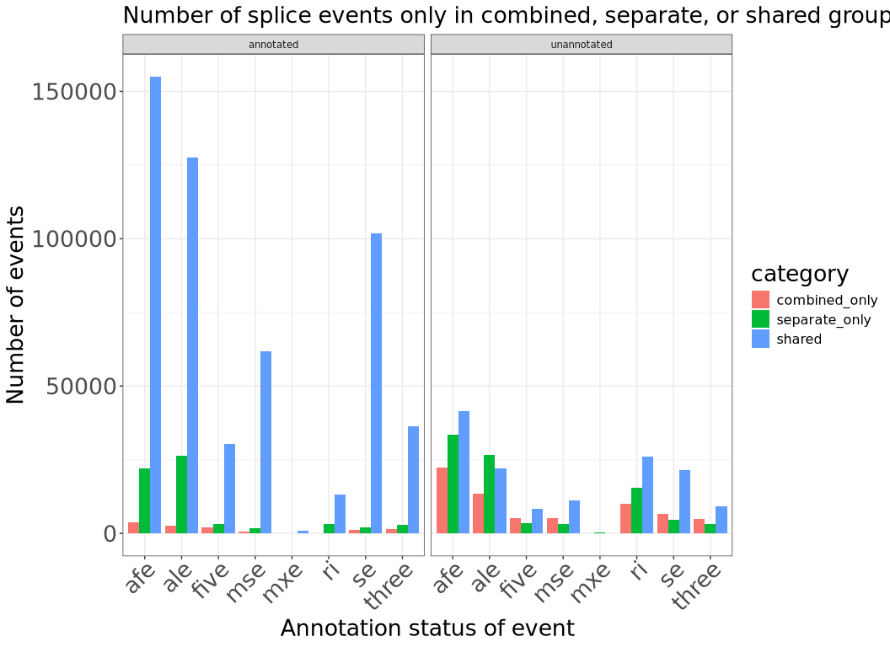

Figure 2

</div>

The majority of annotated event types are shared between both tables,
although there are more splice events unique to the separate table than
combined table. The capturing of unannotated event types suffers more
from merging separate PSI tables. In particular, there are more ALE and
MXE events only found in the separate PSI tables. For other unannotated
events, there are 10-30% that are only found in the separate PSI.

## Examine how many samples have a complete PSI value per splice event

Pivot longer for plotting

``` r
# Pivot all events df longer
long_all_events <- all_events |>
  tidyr::pivot_longer(
    cols = matches("_combined|_separate"),
    names_to = c("sample", "method"),
    values_to = "PSI",
    names_pattern = "(.*)_(combined|separate)"
  )

# drop NAs for later (not now)
long_no_na_all_events <- long_all_events |>
  # drop NA values, including those coded as negative PSI
  dplyr::filter(PSI >= 0)

psi_sample_summary <- long_all_events |>
  tidyr::drop_na() |>
  dplyr::summarise(
    .by = c(event_type, label, sample),
    total = dplyr::n(),
    shiba_na_count = sum(PSI == -1),
    shiba_na_percent = shiba_na_count / total * 100,
    merge_na_count = sum(PSI == -2),
    merge_na_percent = merge_na_count / total * 100,
    complete_psi_count = sum(PSI >= 0),
    complete_psi_percent = complete_psi_count / total * 100
  ) |>
  # pivot counts longer for plotting
  tidyr::pivot_longer(
    cols = c(
      shiba_na_count,
      shiba_na_percent,
      merge_na_count,
      merge_na_percent,
      complete_psi_count,
      complete_psi_percent),
    # extract percents and counts as separate columns
    names_to = c("category", ".value"),
    names_pattern = "(.+)_(percent|count)"
  )

# print head to spot check so we don't get 88 rows
head(psi_sample_summary)
```

| event_type | label     | sample         |  total | category     | count |  percent |
|:-----------|:----------|:---------------|-------:|:-------------|------:|---------:|
| se         | annotated | SRR1559043_PSI | 206740 | shiba_na     | 81289 | 39.31943 |
| se         | annotated | SRR1559043_PSI | 206740 | merge_na     | 54000 | 26.11976 |
| se         | annotated | SRR1559043_PSI | 206740 | complete_psi | 71451 | 34.56080 |
| se         | annotated | SRR1559044_PSI | 206740 | shiba_na     | 96878 | 46.85982 |
| se         | annotated | SRR1559044_PSI | 206740 | merge_na     | 53369 | 25.81455 |
| se         | annotated | SRR1559044_PSI | 206740 | complete_psi | 56493 | 27.32563 |

Plot number of samples for each event type category with complete PSI
events

``` r
psi_sample_summary |>
  dplyr::filter(category == "complete_psi") |>

# facet bar plots of summary of splicing event types detected for each tool
ggplot(aes(fill = event_type, x = sample, y = count)) +
  geom_bar(position = "dodge", stat = "identity") +
  scale_fill_manual(
    name = "Alternative splicing event",
    values = cbPalette
  ) +
  labs(
    title = "Distribution of complete PSI values across all samples",
    x = "Sample",
    y = "Number of events"
  ) +
  scale_x_discrete(guide = guide_axis(angle = 45)) +
  facet_wrap(vars(event_type, label), scales = "free_y") +
  theme_bw() +
  plot_theme +
    theme(axis.text.x=element_blank()) +
  # make facet labels bigger
  theme(strip.text.x = element_text(size = global_size))
```

<div id="fig-sample_complete_psi_breakdown">

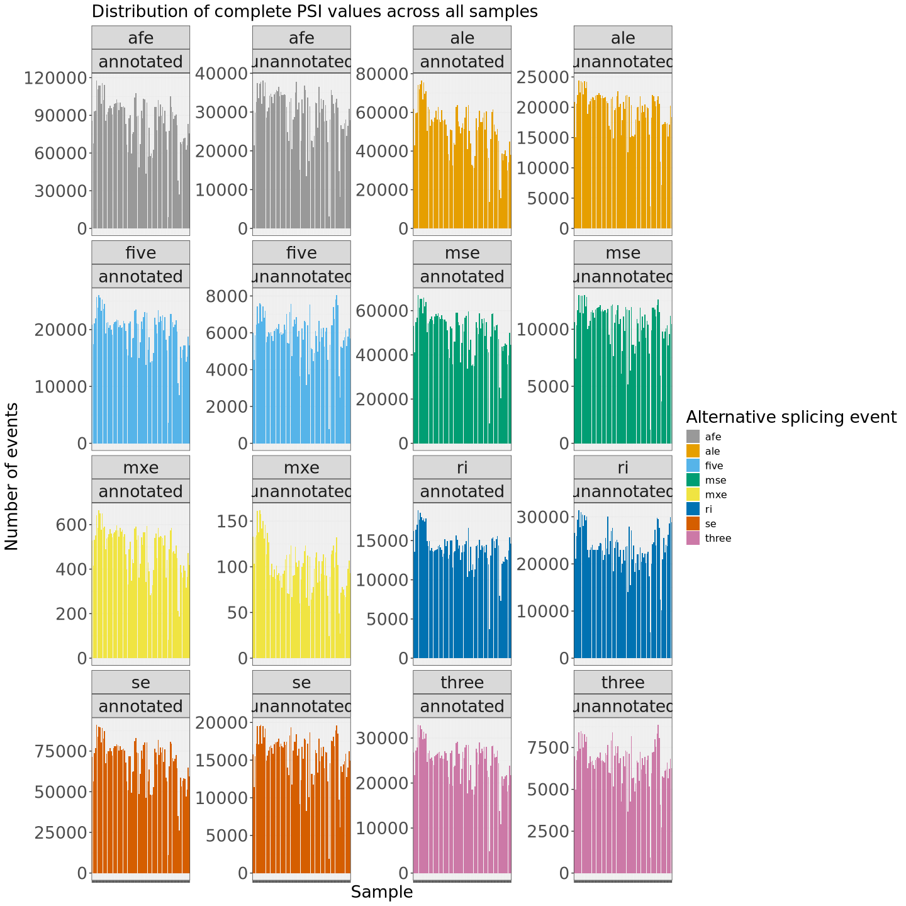

Figure 3

</div>

Plot number of samples for each event type category with shiba NA PSI
events

``` r
psi_sample_summary |>
  dplyr::filter(category == "shiba_na") |>

# facet bar plots of summary of splicing event types detected for each tool
ggplot(aes(fill = event_type, x = sample, y = count)) +
  geom_bar(position = "dodge", stat = "identity") +
  scale_fill_manual(
    name = "Alternative splicing event",
    values = cbPalette
  ) +
  labs(
    title = "Distribution of Shiba NA PSI values across all samples",
    x = "Sample",
    y = "Number of events"
  ) +
  scale_x_discrete(guide = guide_axis(angle = 45)) +
  facet_wrap(vars(event_type, label), scales = "free_y") +
  theme_bw() +
  plot_theme +
    theme(axis.text.x=element_blank()) +
  # make facet labels bigger
  theme(strip.text.x = element_text(size = global_size))
```

<div id="fig-sample_shiba_na_psi_breakdown">

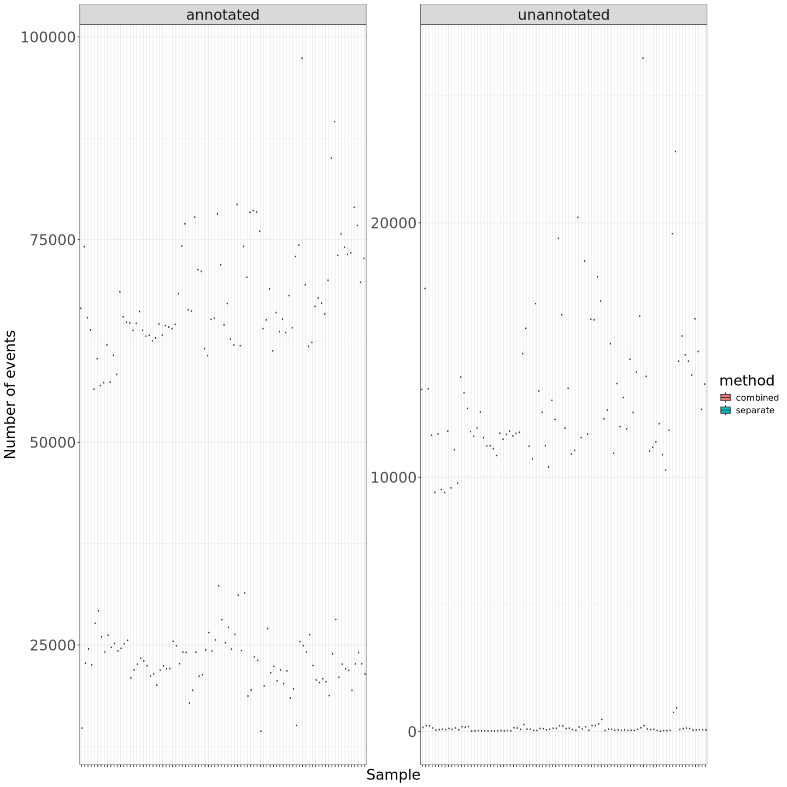

Figure 4

</div>

Plot number of samples for each event type category with merge NA PSI
events

``` r
psi_sample_summary |>
  dplyr::filter(category == "merge_na") |>

# facet bar plots of summary of splicing event types detected for each tool
ggplot(aes(fill = event_type, x = sample, y = count)) +
  geom_bar(position = "dodge", stat = "identity") +
  scale_fill_manual(
    name = "Alternative splicing event",
    values = cbPalette
  ) +
  labs(
    title = "Distribution of merge NA PSI values across all samples",
    x = "Sample",
    y = "Number of events"
  ) +
  scale_x_discrete(guide = guide_axis(angle = 45)) +
  facet_wrap(vars(event_type, label), scales = "free_y") +
  theme_bw() +
  plot_theme +
    theme(axis.text.x=element_blank()) +
  # make facet labels bigger
  theme(strip.text.x = element_text(size = global_size))
```

<div id="fig-sample_merge_na_psi_breakdown">

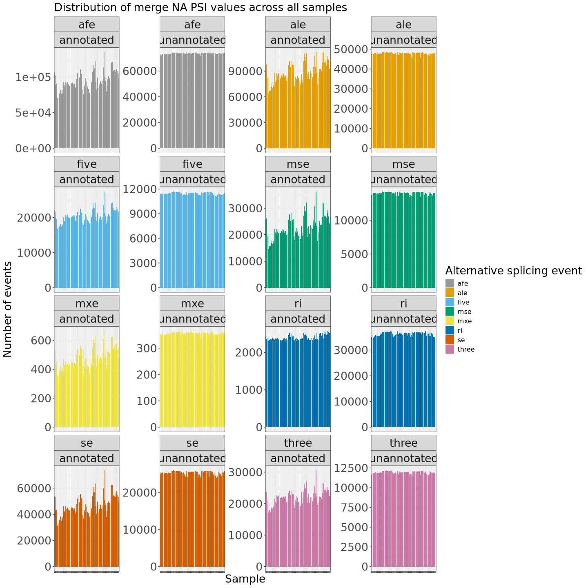

Figure 5

</div>

From <a href="#fig-sample_complete_psi_breakdown"
class="quarto-xref">Figure 3</a>, there are some samples in the pilot
with much fewer complete PSI values than other samples But the number of
splice events with NA values in each sample appears more stable

## Check how similar PSI values of shared events are

Pivot wider for correlation analysis

``` r
# pivot wider for correlation calculations
all_events_by_method <- long_no_na_all_events |>
  tidyr:: pivot_wider(
    names_from = method,
    values_from = PSI
  )
```

### Create table of correlation scores for shared event

``` r
correlation_df <- all_events_by_method |>
  dplyr::summarize(
    .by = event_type,
    # correlation coefficients are overestimated here because we remove incomplete observations
    pearson_r = cor(combined, separate, method = "pearson", use = "complete.obs"),
    pearson_r2 = pearson_r ** 2,
    spearman_rho = cor(combined, separate, method = "spearman", use = "complete.obs")
  )

# print correlation table
correlation_df
```

| event_type | pearson_r | pearson_r2 | spearman_rho |
|:-----------|----------:|-----------:|-------------:|
| se         |         1 |          1 |            1 |
| afe        |         1 |          1 |            1 |
| ale        |         1 |          1 |            1 |
| five       |         1 |          1 |            1 |
| three      |         1 |          1 |            1 |
| mse        |         1 |          1 |            1 |
| mxe        |         1 |          1 |            1 |
| ri         |         1 |          1 |            1 |

Check whether shared events have the same PSI values

``` r
# omit NAs
complete_all_events_by_method <- na.omit(all_events_by_method)

# check if shared events are equal
all.equal(complete_all_events_by_method$combined, complete_all_events_by_method$separate)
```

    [1] TRUE

All shared events have identical PSI values in tables created by the two
methods.

## Examine NA values

### Examine frequency of Shiba NA values in each method

label shiba NAs for analysis

``` r
na_long_all_events <- long_all_events |>
  # we have to drop NA PSI values (events only in combined or separate tables) otherwise they wil propagate into counting the -1 NA values
  tidyr::drop_na() |>
  # label events by if they are shiba NAs (-1)
  dplyr::mutate(
    combined_shiba_na = combined_event & PSI == -1,
    separate_shiba_na = separate_event & PSI == -1,
    shared_shiba_na = shared_event & PSI == -1
  )
 
# summarize counts and percentage of each NA value type
na_summary <- na_long_all_events |> dplyr::summarise(
    .by = c(event_type, label),
    # count number of events in each event type and annotation category
    total = dplyr::n(),
    shared_shiba_na_count = sum(shared_shiba_na),
    combined_shiba_na_count = sum(combined_shiba_na) - shared_shiba_na_count,
    separate_shiba_na_count = sum(separate_shiba_na) - shared_shiba_na_count,
    shared_shiba_na_percent = shared_shiba_na_count / total * 100,
    combined_shiba_na_percent = combined_shiba_na_count / total * 100,
    separate_shiba_na_percent = separate_shiba_na_count / total * 100
    )

na_summary
```

| event_type | label | total | shared_shiba_na_count | combined_shiba_na_count | separate_shiba_na_count | shared_shiba_na_percent | combined_shiba_na_percent | separate_shiba_na_percent |
|:---|:---|---:|---:|---:|---:|---:|---:|---:|
| se | annotated | 18193120 | 7968814 | 42764 | 14709 | 43.80125 | 0.2350559 | 0.0808492 |
| se | unannotated | 4789224 | 858214 | 321933 | 1507 | 17.91969 | 6.7220285 | 0.0314665 |
| afe | unannotated | 12252328 | 2115661 | 1028671 | 15182 | 17.26742 | 8.3957188 | 0.1239111 |
| afe | annotated | 29525056 | 13163788 | 226830 | 279857 | 44.58514 | 0.7682627 | 0.9478627 |
| ale | annotated | 24970968 | 12076812 | 186415 | 410887 | 48.36341 | 0.7465269 | 1.6454588 |
| ale | unannotated | 7435472 | 1018506 | 477767 | 6524 | 13.69793 | 6.4255100 | 0.0877416 |
| five | annotated | 5807208 | 2157938 | 110044 | 5410 | 37.15965 | 1.8949554 | 0.0931601 |
| five | unannotated | 2221912 | 386602 | 304428 | 1350 | 17.39952 | 13.7011727 | 0.0607585 |
| three | annotated | 6783744 | 2565879 | 81961 | 8574 | 37.82394 | 1.2081971 | 0.1263904 |
| three | unannotated | 2320824 | 397678 | 291003 | 1078 | 17.13521 | 12.5387793 | 0.0464490 |
| mse | annotated | 11082984 | 4598336 | 18508 | 3366 | 41.49005 | 0.1669947 | 0.0303709 |
| mse | unannotated | 2703096 | 389217 | 163546 | 521 | 14.39893 | 6.0503216 | 0.0192742 |
| mxe | annotated | 154440 | 66004 | 370 | 2784 | 42.73763 | 0.2395752 | 1.8026418 |
| mxe | unannotated | 52008 | 6182 | 5530 | 62 | 11.88663 | 10.6329795 | 0.1192124 |
| ri | unannotated | 6841824 | 1142757 | 429948 | 7561 | 16.70252 | 6.2841137 | 0.1105115 |
| ri | annotated | 2586936 | 1065713 | 5813 | 73481 | 41.19596 | 0.2247060 | 2.8404645 |

Plot shiba NA frequency in each method

``` r
# pivot summary df longer for plotting
long_na_summary_df <- na_summary |>
  tidyr::pivot_longer(
      cols = c(
        shared_shiba_na_count,
        shared_shiba_na_percent,
        combined_shiba_na_count,
        combined_shiba_na_percent,
        separate_shiba_na_count,
        separate_shiba_na_percent
      ),
      # extract percents and counts into separate columns
      names_to = c("category", ".value"),
      names_pattern = "(.+)_(percent|count)"
    ) 
  
# create percent stacked barplots
percent_plot <- 
  ggplot(long_na_summary_df, aes(fill = category, x = event_type, y = percent)) +
  geom_bar(position = "stack", stat = "identity") +
  plot_theme +
  labs(
    title = "% of Shiba NA values in combined, separate, or shared groups",
    x = "Annotation status of event",
    y = "Percentage of events"
  ) +
  facet_wrap(vars(label)) +
  scale_x_discrete(guide = guide_axis(angle = 45)) +
  plot_theme +
  # make facet labels bigger
  theme(strip.text.x = element_text(size = global_size))
  
# create raw counts grouped barplot
counts_plot <-
  ggplot(long_na_summary_df, aes(fill = category, x = event_type, y = count)) +
  geom_bar(position = "dodge", stat = "identity") +
  plot_theme +
  labs(
    title = "Number of Shiba NA values in combined, separate, or shared groups",
    x = "Annotation status of event",,
    y = "Number of events"
  ) +
  facet_wrap(vars(label)) +
  scale_x_discrete(guide = guide_axis(angle = 45)) +
  plot_theme +
  # make facet labels bigger
  theme(strip.text.x = element_text(size = global_size))
  
# arrange plots for printing
percent_plot / 
counts_plot + plot_layout(guides = "collect")
```

<div id="fig-shiba_na_breakdown">

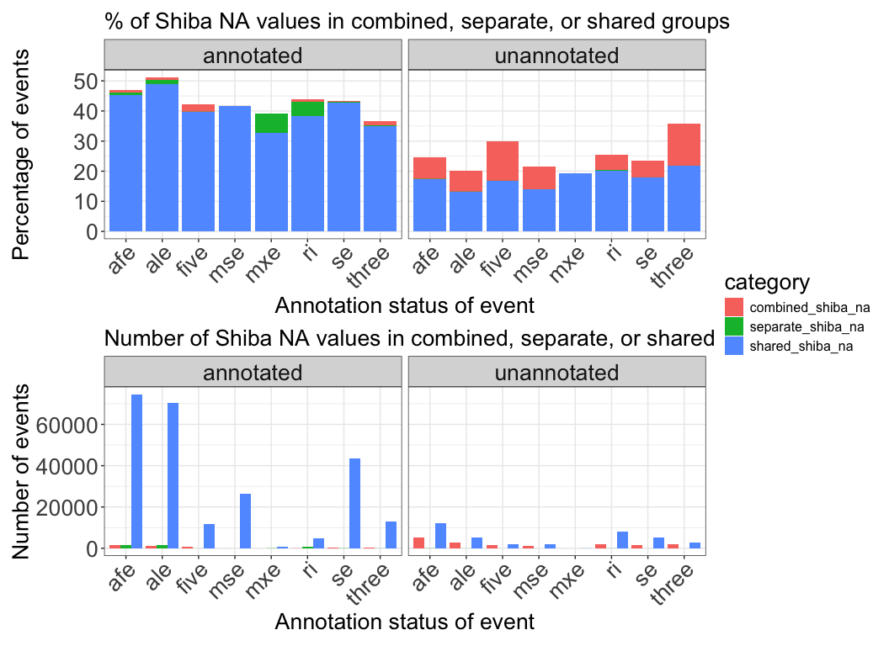

Figure 6

</div>

I think we get more Shiba NA values in the combined tables because there
are more splice events dropped in the separate tables due to splicing
detected in the GTF for a given gene. I suspect there may be an overlap
of position IDs that have a Shiba (-1) NA value in the combined table
and position IDs that have a dropped gene (-2) NA in the separate
tables.

### Examine frequency of only one transcript NA values (-2) in separate tables

To do…

## Look at splice events present in min number of samples

Filter splice events for those with complete PSI values in \>=
min_samples samples per method

min_samples = 0

``` r
sample_filtered_event_summary <- event_summary(long_no_na_all_events, 0)
sample_filtered_event_summary
```

| event_type | label | total | shared_count | combined_only_count | separate_only_count | shared_percent | combined_only_percent | separate_only_percent |
|:---|:---|---:|---:|---:|---:|---:|---:|---:|
| se | annotated | 6007735 | 5912393 | 49988 | 45354 | 98.41301 | 0.8320607 | 0.7549268 |
| se | unannotated | 1377003 | 1097878 | 270923 | 8202 | 79.72953 | 19.6748300 | 0.5956414 |
| afe | unannotated | 2617985 | 1626403 | 945081 | 46501 | 62.12423 | 36.0995575 | 1.7762134 |
| afe | annotated | 7463265 | 6841408 | 105194 | 516663 | 91.66776 | 1.4094904 | 6.9227476 |
| ale | annotated | 4508499 | 3754027 | 51713 | 702759 | 83.26556 | 1.1470115 | 15.5874272 |
| ale | unannotated | 1719648 | 971004 | 709177 | 39467 | 56.46528 | 41.2396607 | 2.2950627 |
| five | annotated | 1727819 | 1654402 | 56628 | 16789 | 95.75089 | 3.2774266 | 0.9716874 |
| five | unannotated | 520753 | 375140 | 141204 | 4409 | 72.03799 | 27.1153503 | 0.8466586 |
| three | annotated | 2177317 | 2108199 | 46695 | 22423 | 96.82554 | 2.1446119 | 1.0298454 |
| three | unannotated | 580015 | 432786 | 142573 | 4656 | 74.61635 | 24.5809160 | 0.8027379 |
| mse | annotated | 4433462 | 4382708 | 38956 | 11798 | 98.85521 | 0.8786813 | 0.2661126 |
| mse | unannotated | 917189 | 629304 | 283494 | 4391 | 68.61225 | 30.9090057 | 0.4787454 |
| mxe | annotated | 42969 | 36642 | 246 | 6081 | 85.27543 | 0.5725058 | 14.1520631 |
| mxe | unannotated | 8781 | 3754 | 4678 | 349 | 42.75140 | 53.2741146 | 3.9744904 |
| ri | unannotated | 2067946 | 1575746 | 452780 | 39420 | 76.19860 | 21.8951559 | 1.9062393 |
| ri | annotated | 1230532 | 1144768 | 8091 | 77673 | 93.03033 | 0.6575205 | 6.3121479 |

``` r
plot_event_summary(sample_filtered_event_summary)
```

<div id="fig-splice_events_breakdown_0">

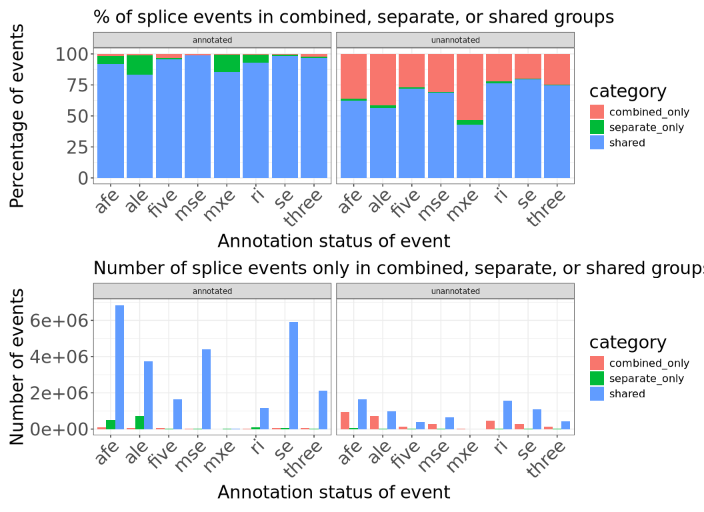

Figure 7

</div>

min_samples = 10

``` r
sample_filtered_event_summary <- event_summary(long_no_na_all_events, 10)
sample_filtered_event_summary
```

| event_type | label | total | shared_count | combined_only_count | separate_only_count | shared_percent | combined_only_percent | separate_only_percent |
|:---|:---|---:|---:|---:|---:|---:|---:|---:|
| se | annotated | 5761350 | 5685747 | 32815 | 42788 | 98.68776 | 0.5695714 | 0.7426732 |
| se | unannotated | 102096 | 96319 | 4476 | 1301 | 94.34160 | 4.3841091 | 1.2742909 |
| afe | annotated | 6303074 | 6284715 | 8710 | 9649 | 99.70873 | 0.1381865 | 0.1530840 |
| afe | unannotated | 55489 | 54160 | 1043 | 286 | 97.60493 | 1.8796518 | 0.5154175 |
| ale | annotated | 3343715 | 3339798 | 1826 | 2091 | 99.88285 | 0.0546099 | 0.0625352 |
| ale | unannotated | 28570 | 28537 | 0 | 33 | 99.88449 | 0.0000000 | 0.1155058 |
| five | annotated | 1381111 | 1362572 | 8290 | 10249 | 98.65767 | 0.6002414 | 0.7420837 |
| five | unannotated | 24357 | 23139 | 896 | 322 | 94.99938 | 3.6786140 | 1.3220019 |
| three | annotated | 1881068 | 1852341 | 12286 | 16441 | 98.47284 | 0.6531396 | 0.8740248 |
| three | unannotated | 36321 | 33297 | 2177 | 847 | 91.67424 | 5.9937777 | 2.3319843 |
| mse | annotated | 4162181 | 4144759 | 8018 | 9404 | 99.58142 | 0.1926394 | 0.2259392 |
| mse | unannotated | 30095 | 28743 | 1139 | 213 | 95.50756 | 3.7846818 | 0.7077588 |
| mxe | annotated | 34857 | 34857 | 0 | 0 | 100.00000 | 0.0000000 | 0.0000000 |
| mxe | unannotated | 417 | 321 | 86 | 10 | 76.97842 | 20.6235012 | 2.3980815 |
| ri | unannotated | 581215 | 547592 | 22137 | 11486 | 94.21505 | 3.8087455 | 1.9762050 |
| ri | annotated | 1181222 | 1104553 | 4366 | 72303 | 93.50935 | 0.3696172 | 6.1210340 |

``` r
plot_event_summary(sample_filtered_event_summary)
```

<div id="fig-splice_events_breakdown_10">

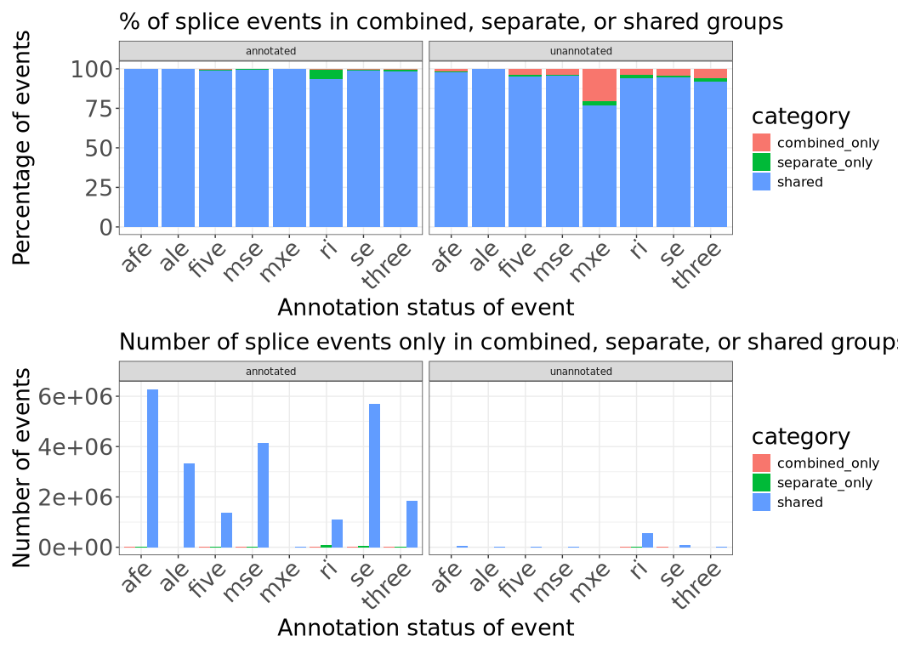

Figure 8

</div>

Examine PSI distributions in combined table of events missed by the
separate table, and then the reverse (is there a threshold of PSI where
events become shared?)

### Plot PSI distributions of AFE events

``` r
# make dataframe of PSI values of splice events only in the combined or separate dataframes
compare_psi_dist_df <- long_no_na_all_events |>
  # label splice events by whether they are only in the combined or separate tables
  dplyr::mutate(
    event_status = dplyr::case_when(
      combined_event == TRUE & separate_event == FALSE ~ "combined_only",
      combined_event == FALSE & separate_event == TRUE ~ "separate_only",
      combined_event == TRUE & separate_event == TRUE ~ "shared"
    )
  ) |>
  # exclude NAs as their PSI values cannot be binned
  na.omit()

# plot AFE event distributions
psi_distributions(compare_psi_dist_df, "afe")
```

<div id="fig-psi_dist_afe">

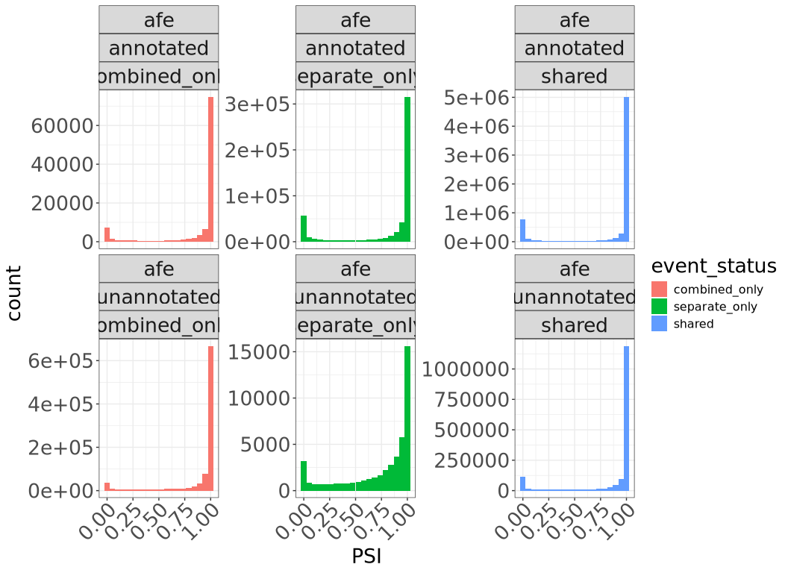

Figure 9

</div>

### Plot PSI distributions of ALE events

``` r
# filter df for ALE events
psi_distributions(compare_psi_dist_df, "ale")
```

<div id="fig-psi_dist_ale">

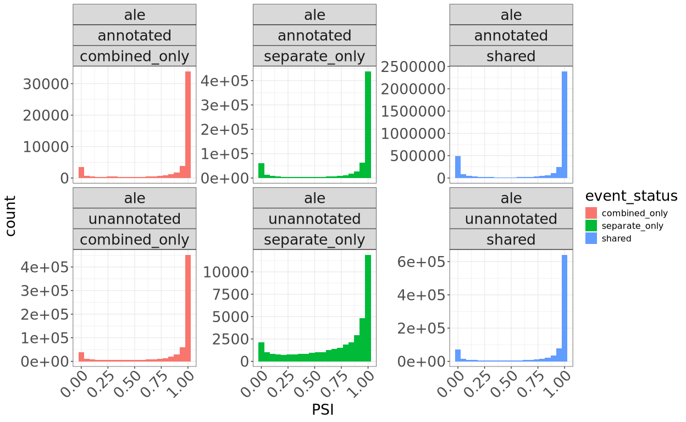

Figure 10

</div>

### Plot PSI distributions of SE events

``` r
psi_distributions(compare_psi_dist_df, "se")
```

<div id="fig-psi_dist_se">

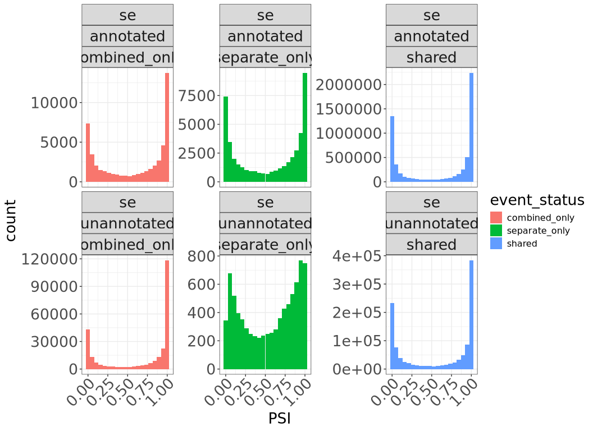

Figure 11

</div>

### Plot PSI distributions of alternative 5’ splice site events

``` r
psi_distributions(compare_psi_dist_df, "five")
```

<div id="fig-psi_dist_five">

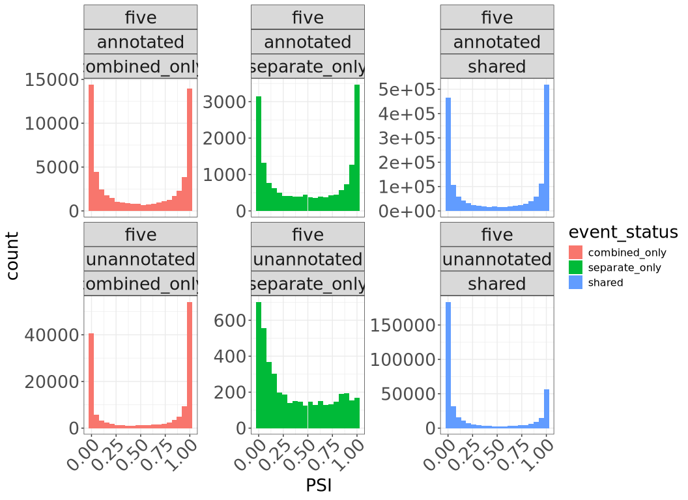

Figure 12

</div>

### Plot PSI distributions of alternative 3’ splice site events

``` r
psi_distributions(compare_psi_dist_df, "three")
```

<div id="fig-psi_dist_three">

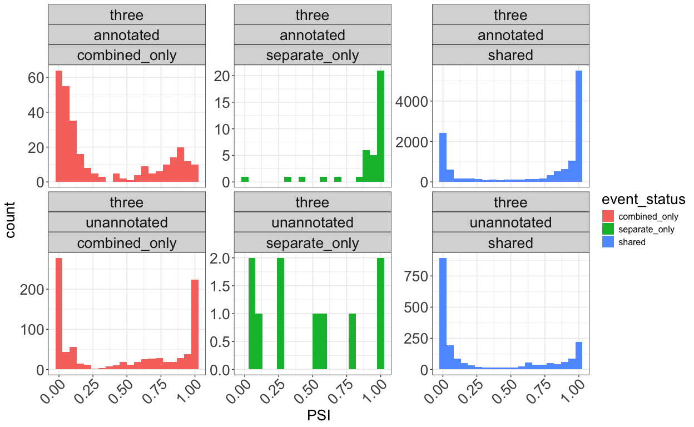

Figure 13

</div>

### Plot PSI distributions of MSE events

``` r
psi_distributions(compare_psi_dist_df, "mse")
```

<div id="fig-psi_dist_mse">

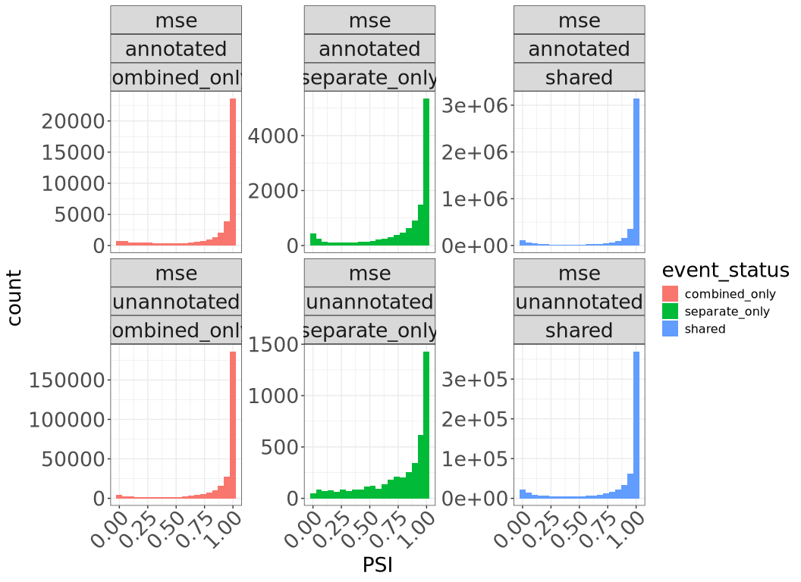

Figure 14

</div>

### Plot PSI distributions of MXE events

``` r
psi_distributions(compare_psi_dist_df, "mxe")
```

<div id="fig-psi_dist_mxe">

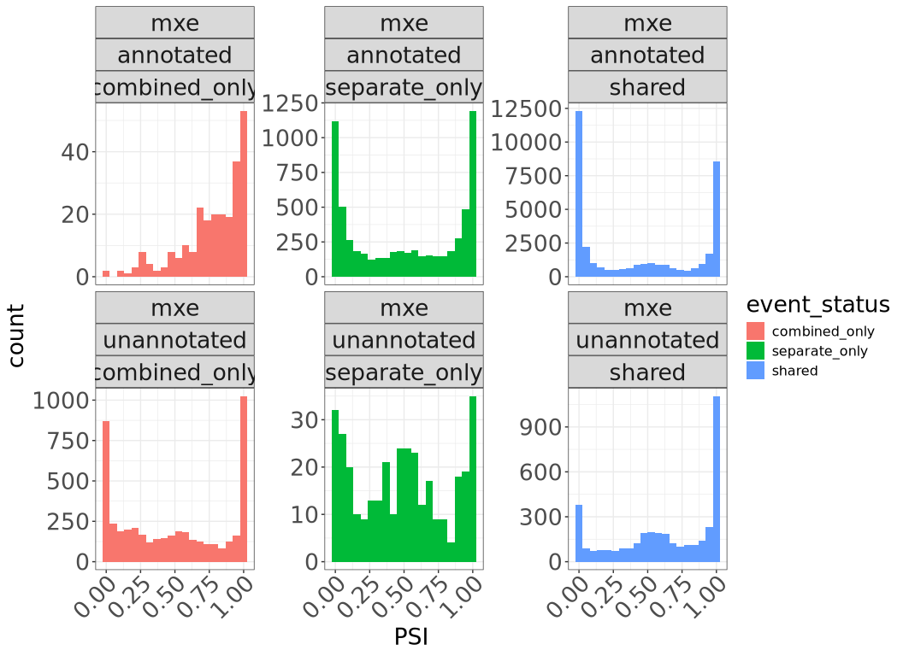

Figure 15

</div>

### Plot PSI distributions of RI events

``` r
psi_distributions(compare_psi_dist_df, "ri")
```

<div id="fig-psi_dist_ri">

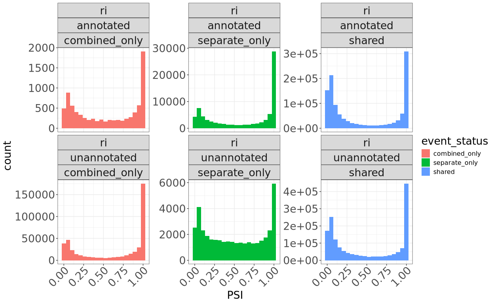

Figure 16

</div>

### Takeaways so far

- In the worst case scenario, about 40% of some splice event types
  across all unique events found in both the combined and separate
  (merged) tables are only found in the separate tables. This is
  concerning if we assume all events found only in the separate tables
  are false.

- Most of the events found only in the separate tables are unannotated
  events, which are the event types we are hoping to capture most in the
  splice compendium

- About 30% of unannotated splice events are only found in the combined
  tables, meaning they are missed in the separate tables method

- If we only look at splice events shared between both separate and
  combined PSI tables, the PSI values are identical.

- Unfortunately, PSI values of events only found in the combined or
  separate tables span the entire PSI distribution (0-1) so there is no
  easy way to set a filter to exclude values that are not found in the
  combined table.

A next step for this analysis will be to compare the number of NA values
in each table and examine how many of each type of NA value are present
in each method

Another note here is that we assume the splice events in the combined
table are the ground truth, but a separate kind of evaluation would be
needed to truly ask how many “real” splice events are in each of the
tables. For instance, we maybe would need to do this experiment on
simulated reads where we know going in what all the transcripts are,
which may be beyond the scope of this project.
