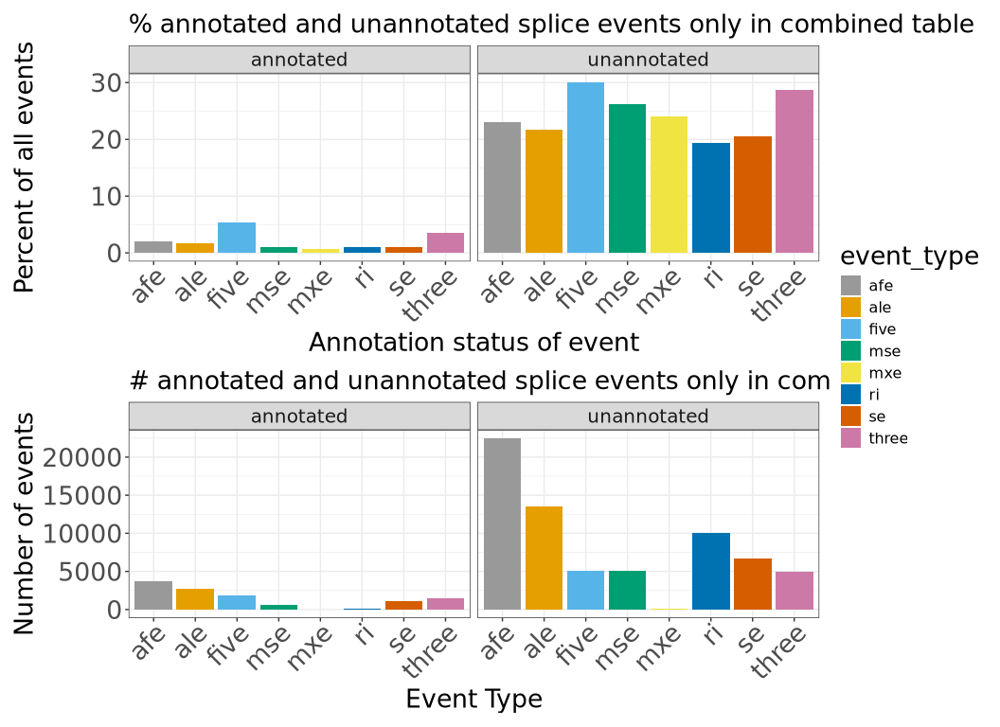

# Compare merged PSI table from TARGET pilot samples
Cindy Liang (celiang@ucsc.edu)
2026-05-10

**Question:** Does merging separate splice tables cause us to lose out
on the trustworthiness of unannotated events to an extent that it
impacts many samples?

As part of our pipeline, we plan to merge Shiba tables created for
individual samples to obtain a final PSI table of all samples. Before
doing so, we use this notebook to test that merging PSI tables from
separate runs will not introduce a large amount of untrustworthy splice
events.

As part of tracking differences between the two tables, we have labeled
NA values introduced at various steps of the data processing pipeline
with different negative values:

- -1: NA values assigned by Shiba (splice events with low coverage)

- -2: NA values from merging the separate tables together (samples have
  a NA value after this step if there are genes dropped by Shiba for
  those samples because there is only one transcript detected for that
  gene)

- NA: NA values from merging the separate and combined tables. These NAs
  represent splice events that are only found in one analysis method
  (combined vs. separate)

We are particularly interested in the impact merging separate tables has
on unannotated event detection, since this is one novelty of using
Shiba.

**Targeted questions this notebook is trying to answer:**

- What splice event types do we miss out on with the separate tables
  method?
- Of splice events with high numbers of NA values, how many of these
  events only have a numeric PSI value in one (or a very low amount of)
  samples?
- How many NA values of different NA types are there in each type of
  splice table? How are they distributed across events? I am more
  concerned with the merge NAs (-2), as there is no good way to replace
  them in the separate tables (they could either be 0 or 1). Another
  concern is events that are only found in the combined table, or only
  found in the separate table, as there is no easy way to correct for
  those.
- Can the number of NA values be reduced in the separate tables method
  if we filter for events with numeric PSI values in a minimum number of
  samples?
- What is the relationship between PSI values and NAs in each splice
  table type?
- What is the relationship between PSI values and NAs in each splice
  table type after filtering for events with numeric PSI values in a
  minimum number of samples? Assuming the Shiba NAs (-1) are from low
  read support, do the separate and combined tables always call the same
  events as a Shiba NA? Merge NAs (-2) should arise from events dropped
  by Shiba due to lack of alternative transcripts for a gene, so we
  expect these NAs to be 0 or 1.
- How well correlated are the number of NA values in each event type for
  each PSI table type?
- How well correlated are the PSI values of events that are shared?

## Set up

### Define functions

``` r
# PSI distribution plots of events in each method
psi_distributions <- function(
    df,
    event_type_value) {
  df |>
    dplyr::filter(event_type == event_type_value) |>
    ggplot(aes(PSI, fill = event_status)) +
    geom_histogram(bins = 20) +
    facet_wrap(vars(event_type, label, event_status), scales = "free_y") +
    plot_theme +
    # make facet labels bigger
    theme(strip.text.x = element_text(size = global_size),
          # rotate x axis labels so they don't overlap
          axis.text.x = element_text(angle =45))
}

# plot event summary frequencies as percent and raw counts bar plots
plot_event_summary <- function(
    summary_df) {
  # pivot summary df longer for plotting
  long_summary_df <- summary_df |>
    tidyr::pivot_longer(
      cols = c(
        shared_count,
        shared_percent,
        combined_only_count,
        combined_only_percent,
        separate_only_count,
        separate_only_percent
      ),
      # extract percents and counts into separate columns
      names_to = c("category", ".value"),
      names_pattern = "(.+)_(percent|count)"
    )

  # create percent stacked barplots
  percent_plot <-
    ggplot(long_summary_df, aes(fill = category, x = event_type, y = percent)) +
    geom_bar(position = "stack", stat = "identity") +
    plot_theme +
    labs(
      title = "% of splice events in combined, separate, or shared groups",
      x = "Annotation status of event",
      y = "Percentage of events"
    ) +
    facet_wrap(vars(label)) +
    scale_x_discrete(guide = guide_axis(angle = 45)) +
    plot_theme

  # create raw counts grouped barplot
  counts_plot <-
    ggplot(long_summary_df, aes(fill = category, x = event_type, y = count)) +
    geom_bar(position = "dodge", stat = "identity") +
    plot_theme +
    labs(
      title = "Number of splice events only in combined, separate, or shared groups",
      x = "Annotation status of event",,
      y = "Number of events"
    ) +
    facet_wrap(vars(label), scales = "free_y") +
    scale_x_discrete(guide = guide_axis(angle = 45)) +
    plot_theme

  # arrange plots for printing
  percent_plot /
    counts_plot

}

## Sample-level functions

# pivot event-level df long
pivot_long <- function (wide_event_df) {
  wide_event_df |>
    dplyr::select(starts_with("SRR"), event_type, pos_id, label) |>
    tidyr::pivot_longer(
      cols = matches("_PSI_(combined|separate)$"),
      names_to = c("sample", ".value"),
      names_pattern = "(.*)_PSI_(combined|separate)"
  )}

# event summary plots of frequency of events in each category
event_summary <- function(
    long_df,
    min_sample_value) {
  # filter samples by complete PSI value in min number of samples
  all_events_n_filtered <- long_df |>
    dplyr::group_by(pos_id) |>
    # count number of events are present in each shared status
    dplyr::mutate(
      combined_count = sum(method == "combined"),
      separate_count = sum(method == "separate")
    ) |>
    # filter for events with complete PSI values for minimum number of samples
    dplyr::filter(
      combined_count >= min_sample_value,
      separate_count >= min_sample_value
    ) |>
    dplyr::ungroup() |>
    # create summary table for plotting
    dplyr::summarise(
      .by = c(event_type, label),
      # count number of events in each event type and annotation category
      total = dplyr::n(),
      shared_count = sum(shared_event),
      combined_only_count = sum(combined_event) - shared_count,
      separate_only_count = sum(separate_event) - shared_count,
      shared_percent = shared_count / total * 100,
      combined_only_percent = combined_only_count / total * 100,
      separate_only_percent = separate_only_count / total * 100
    )
}

# Create summary table of number and percentage of events in each PSI-NA matchup category
na_comparison_summary <- function(long_df) {
  long_df |>
    # try to get rid of the NA NAs here
    tidyr::drop_na() |>
    dplyr::mutate(
      match_category =
        dplyr::case_when(
          separate == -1 & combined == -1 ~ "both Shiba NAs",
          separate == -2 & combined == -1 ~ "separate dropped, combined shiba NA",
          separate >= 0 & combined >= 0 ~ "both numeric PSIs",
          separate == -2 & combined >= 0 ~ "numeric PSI dropped in separate table"
        )
    ) |>
    dplyr::summarise(
      .by = c(match_category),
      count = dplyr::n()
    ) |>
    dplyr::mutate(
      total = sum(count),
      percent = count / total * 100
    )
}

# plot PSI distributions of events with numeric PSI values in combined tables but are dropped in separate tables
psi_values_lost_in_separate <- function(na_comparison_df) {
  na_comparison_df |>
    # drop NAs from putting together the separate and combined tables
    tidyr::drop_na() |>
    # assign match categories
    dplyr::mutate(
      match_category =
        dplyr::case_when(
          separate == -1 & combined == -1 ~ "both Shiba NAs",
          separate == -2 & combined == -1 ~ "separate dropped, combined shiba NA",
          separate >= 0 & combined >= 0 ~ "both numeric PSIs",
          separate == -2 & combined >= 0 ~ "numeric PSI dropped in separate table"
        )
    ) |>
    # plot only events in combined table with numeric PSIs that are dropped in the separate table
    dplyr::filter(match_category == "numeric PSI dropped in separate table",) |>
      ggplot(aes(combined, fill = event_type)) +
      geom_histogram(bins = 20) +
      facet_wrap(vars(event_type, label), scales = "free_y") +
    scale_fill_manual(values = cbPalette) +
      plot_theme +
      # make facet labels bigger
      theme(strip.text.x = element_text(size = global_size),
            # rotate x axis labels so they don't overlap
            axis.text.x = element_text(angle =45))
}
```

## Directories and files

``` r
# find the root-level repo directory so we can access the other files
repo_root <- rprojroot::find_root(rprojroot::is_git_root)

# define the data directories
exploration_dir <- file.path(repo_root, "exploration")
merge_exploration_dir <- file.path(exploration_dir, "merging-psi-tables")
target_pilot_dir <- file.path(merge_exploration_dir, "target_pilot")

# directory of shiba results produced from the same shiba run
combined_dir <- file.path(target_pilot_dir, "shiba_combined", "results")

# psi table directory
combined_splice_results_dir <- file.path(combined_dir, "splicing")

# Directory of PSI table, merged from separate shiba runs
separate_psi_table_dir <- file.path(target_pilot_dir, "merged_results")

# merged PSI file of two samples obtained from merge-shiba-psi-tables.qmd
separate_psi_file <- file.path(separate_psi_table_dir, "merged_psi_table.tsv")

# define list of PSI results files corresponding to event types quantified by Shiba bulk analysis
psi_files <- c(
  se = "PSI_SE.txt",
  afe = "PSI_AFE.txt",
  ale = "PSI_ALE.txt",
  five = "PSI_FIVE.txt",
  three = "PSI_THREE.txt",
  mse = "PSI_MSE.txt",
  mxe = "PSI_MXE.txt",
  ri = "PSI_RI.txt"
)

# construct psi table paths of shiba results of two samples run together
shiba_psi_paths <-file.path(combined_splice_results_dir, psi_files)
names(shiba_psi_paths) <- names(psi_files)
```

Read in files

``` r
# read merged splice table from separate runs of Shiba on the TARGET pilot samples
separate_psi_table <- readr::read_tsv(separate_psi_file, col_types=readr::cols(.default = "c")) |>
  # replace remaining NAs from this table representing dropped genes from one sample with no detected splicing for that gene with -2
  dplyr::mutate(across(contains("_PSI"), \(x) tidyr::replace_na(as.numeric(x), -2)))

# read in combined splice results to compare against separate results
combined_splice_results <- shiba_psi_paths |>
  purrr::map(\(path){
    readr::read_tsv(path, col_types=readr::cols(.default = "c")) |>
      # select for columns that will be used in downstream analysis
      dplyr::select(pos_id, gene_id, label, contains("_PSI")) |>
      # convert PSI values to numeric and replace NA values from shiba representing low coverage with -1
      dplyr::mutate(across(contains("_PSI"), \(x) tidyr::replace_na(as.numeric(x), -1)))
  })

# combine PSI values of samples run together into one dataframe to compare against separate PSI dataframe
combined_psi_table <- purrr::list_rbind(combined_splice_results, names_to = "event_type")
```

### Obtain dimensions of each PSI table

``` r
# dimensions of separate PSI table
dim(separate_psi_table)
```

    [1] 818412     92

``` r
# dimensions of combined PSI table
dim(combined_psi_table)
```

    [1] 746601     92

There are 71,811 more splice events in the separate PSI table than the
combined table.

## What splice event types do we miss out on with the separate tables method?

To help us prioritize what splice event types we may be the most
confident in after merging separate Shiba PSI tables, we are interested
in seeing a breakdown of what event types are most represented in PSI
tables constructed from different methods

``` r
# create df of splice events that are shared between both combined and separate tables
# This is an event-level dataframe (each row is one unique pos_id/event_id)
# columns are each samples' PSI value (with -1/-2/NA values indicating different NA categories)
# combined_event, separate_event, and shared_event columns label what tables the event is present in
all_events <- dplyr::full_join(
  combined_psi_table,
  separate_psi_table,
  by = c("event_type", "pos_id", "gene_id", "label"),
  # label PSI values by table they came from
  suffix = c("_combined", "_separate")) |>
  # categorize events by whether they are in the combined or separate tables
  dplyr::mutate(
    # combined events are counted if the values are not all NA
    combined_event = ! dplyr::if_all(ends_with("_combined"), is.na),
    # separate events are counted if the values for the event are not all NA (indicating the specific position ID is only found in the combined or separate table)
    separate_event = ! dplyr::if_all(ends_with("_separate"), is.na),
    shared_event = combined_event & separate_event
  )
```

Print summary of counts across each method, across all event types

``` r
# number of total events shared or present only in the combined and separate tables
# this table counts events with -1 and -2 PSI values

all_methods_summary <- all_events |> dplyr::summarise(
    # count number of events in each event type and annotation category
    shared_count = sum(shared_event),
    combined_only_count = sum(combined_event) - shared_count,
    separate_only_count = sum(separate_event) - shared_count
)

all_methods_summary
```

| shared_count | combined_only_count | separate_only_count |
|-------------:|--------------------:|--------------------:|
|       667022 |               79579 |              151390 |

Print summary of counts and percentages across each method, broken down
by event type

``` r
# event-level summary of the number of each splice event type in each splice table
all_events_summary <- all_events |> dplyr::summarise(
    .by = c(event_type, label),
    # count number of events in each event type and annotation category
    total = dplyr::n(),
    shared_count = sum(shared_event),
    combined_only_count = sum(combined_event) - shared_count,
    separate_only_count = sum(separate_event) - shared_count,
    shared_percent = shared_count / total * 100,
    combined_only_percent = combined_only_count / total * 100,
    separate_only_percent = separate_only_count / total * 100,
)

all_events_summary
```

| event_type | label | total | shared_count | combined_only_count | separate_only_count | shared_percent | combined_only_percent | separate_only_percent |
|:---|:---|---:|---:|---:|---:|---:|---:|---:|
| se | annotated | 104872 | 101868 | 1054 | 1950 | 97.13556 | 1.0050347 | 1.859410 |
| se | unannotated | 32912 | 21511 | 6737 | 4664 | 65.35914 | 20.4697375 | 14.171123 |
| afe | unannotated | 97616 | 41615 | 22429 | 33572 | 42.63133 | 22.9767661 | 34.391903 |
| afe | annotated | 180632 | 154880 | 3773 | 21979 | 85.74339 | 2.0887772 | 12.167833 |
| ale | annotated | 156353 | 127408 | 2706 | 26239 | 81.48740 | 1.7306991 | 16.781897 |
| ale | unannotated | 62334 | 22160 | 13488 | 26686 | 35.55042 | 21.6382712 | 42.811307 |
| five | annotated | 35556 | 30435 | 1894 | 3227 | 85.59737 | 5.3268084 | 9.075824 |
| five | unannotated | 16825 | 8424 | 5064 | 3337 | 50.06835 | 30.0980684 | 19.833581 |
| three | annotated | 40691 | 36397 | 1462 | 2832 | 89.44730 | 3.5929321 | 6.959770 |
| three | unannotated | 17214 | 9159 | 4927 | 3128 | 53.20669 | 28.6220518 | 18.171256 |
| mse | annotated | 64124 | 61819 | 653 | 1652 | 96.40540 | 1.0183395 | 2.576258 |
| mse | unannotated | 19434 | 11283 | 5080 | 3071 | 58.05804 | 26.1397551 | 15.802202 |
| mxe | annotated | 963 | 792 | 7 | 164 | 82.24299 | 0.7268951 | 17.030114 |
| mxe | unannotated | 481 | 110 | 116 | 255 | 22.86902 | 24.1164241 | 53.014553 |
| ri | unannotated | 51635 | 26113 | 10031 | 15491 | 50.57229 | 19.4267454 | 30.000968 |
| ri | annotated | 16349 | 13048 | 158 | 3143 | 79.80916 | 0.9664200 | 19.224417 |

Plot event-level (one count per unique event) summary of event frequency
across methods and event types

``` r
plot_event_summary(all_events_summary)
```

<div id="fig-splice_events_breakdown">


Figure 1

</div>

The majority of annotated event types are shared between both tables,
although there are more splice events unique to the separate table
(green) than the combined table (red). Inflated values in the separate
tables may be due to -2 NAs which arise in the Shiba processing of
separate samples when when genes without multiple transcripts are
dropped.

### What specific event types are impacted (missed) by the separate tables method?

These following plots answer the question for me better than the above
summary plots.

``` r
combined_only_summary <- all_events_summary |>
  dplyr::select(event_type, label, combined_only_count, total, combined_only_percent)

long_summary_df <- combined_only_summary |>
    tidyr::pivot_longer(
      cols = c(
        combined_only_count,
        combined_only_percent
      ),
      # extract percents and counts into separate columns
      names_to = c("category", ".value"),
      names_pattern = "(.+)_(percent|count)"
    )

# create raw counts grouped barplot
counts_plot <- ggplot(long_summary_df, aes(fill = event_type, x = event_type, y = count)) +
    geom_bar(stat = "identity") +
      scale_fill_manual(values = cbPalette) +
    plot_theme +
    labs(
      title = "# annotated and unannotated splice events only in combined table",
      x = "Event Type",
      y = "Number of events"
    ) +
    facet_wrap(vars(label)) +
    scale_x_discrete(guide = guide_axis(angle = 45)) +
    theme(strip.text = element_text(size = 15))

# create percents grouped barplot
percents_plot <- ggplot(long_summary_df, aes(fill = event_type, x = event_type, y = percent)) +
    geom_bar(position = "dodge", stat = "identity") +
      scale_fill_manual(values = cbPalette) +
    plot_theme +
    labs(
      title = "% annotated and unannotated splice events only in combined table",
      x = "Annotation status of event",
      y = "Percent of all events"
    ) +
    facet_wrap(vars(label)) +
    scale_x_discrete(guide = guide_axis(angle = 45)) +
    theme(strip.text = element_text(size = 15))


percents_plot /
  counts_plot + plot_layout(guides = "collect")
```

<div id="fig-combined_only_splice_events">



Figure 2

</div>

I think of these as “percent of each event category missed in the
separate tables”. In the worst cases, 30% of unannotated events might be
only in the combined table (FIVE events). Losing 30% of unannotated real
events seems rough.

### How many events remain if we filter for events with PSI values in a minimum number of samples?

- Of splice events with high numbers of NA values, how many of these
  events only have a numeric PSI value in one (or a very low amount of)
  samples?

Add summary columns to dataframe

``` r
all_events <- all_events |>
  dplyr::mutate(
    ## count PSI value types in separate table ##
    # count the number of PSI values that are not one of our NA types
    n_quantified = rowSums(
      # select sample PSI values that are not one of our NA types
      dplyr::pick(dplyr::matches("(_PSI_separate)$")) >= 0, 
      # ignore NA values (events only in separate or combined tables)
      na.rm = TRUE),
    # count the number of PSI values dropped due to insufficient reads
    n_shiba_na = rowSums(
      # select sample PSI values that have -1 NA type
      dplyr::pick(dplyr::matches("(_PSI_separate)$")) == -1,
      na.rm = TRUE),
    # count number of PSI values dropped due to lack of transcript diversity in single samples
    n_separate_dropped = rowSums(
      # elect sample PSI values that have -2 NA type
      dplyr::pick(dplyr::matches("(_PSI_separate)$")) == -2
    ),
    ## count PSI value types in combined table ##    
    # count the number of PSI values that are not one of our NA types
    n_quantified_combined = rowSums(
      # select sample PSI values that are not one of our NA types
      dplyr::pick(dplyr::matches("(_PSI_combined)$")) >= 0, 
      # ignore NA values (events only in separate or combined tables)
      na.rm = TRUE),
    # count the number of PSI values dropped due to insufficient reads
    n_shiba_na_combined = rowSums(
      # select sample PSI values that have -1 NA type
      dplyr::pick(dplyr::matches("(_PSI_combined)$")) == -1,
      na.rm = TRUE),
    # count number of PSI values dropped due to lack of transcript diversity in single samples
    n_separate_dropped_combined = rowSums(
      # elect sample PSI values that have -2 NA type
      dplyr::pick(dplyr::matches("(_PSI_combined)$")) == -2
    )
  )

# check what summary looks like
all_events |>
  dplyr::select(pos_id, n_quantified, n_shiba_na, n_separate_dropped, 
                n_quantified_combined, n_shiba_na_combined, n_separate_dropped_combined) |>
  head()
```

| pos_id | n_quantified | n_shiba_na | n_separate_dropped | n_quantified_combined | n_shiba_na_combined | n_separate_dropped_combined |
|:---|---:|---:|---:|---:|---:|---:|
| SE@GL000008.2@129985-130583@85625-155430 | 2 | 24 | 62 | 2 | 86 | 0 |
| SE@GL000008.2@135134-135173@85625-155430 | 1 | 19 | 68 | 1 | 87 | 0 |
| SE@GL000008.2@154869-154964@154715-156667 | 2 | 30 | 56 | 2 | 86 | 0 |
| SE@GL000008.2@155430-155531@135173-156721 | 3 | 24 | 61 | 3 | 85 | 0 |
| SE@GL000008.2@156667-156758@154715-157528 | 1 | 25 | 62 | 1 | 87 | 0 |
| SE@GL000008.2@156667-156761@154715-157528 | 1 | 28 | 59 | 1 | 87 | 0 |

Filter for minimum samples with numeric PSI values in the separate table
and check n_quantified

``` r
# event-level summary of the number of each splice event type in each splice table
all_events_min_samples <- all_events |>
  # filter for events where there are numeric PSI values in at least 5 samples
  dplyr::filter(n_quantified >= min_samples)

# check what summary columns look like
all_events_min_samples  |>
  dplyr::select(pos_id, n_quantified, n_shiba_na, n_separate_dropped,
                n_quantified_combined, n_shiba_na_combined, n_separate_dropped_combined) |>
  dplyr::arrange((n_quantified)) |>
  head()
```

| pos_id | n_quantified | n_shiba_na | n_separate_dropped | n_quantified_combined | n_shiba_na_combined | n_separate_dropped_combined |
|:---|---:|---:|---:|---:|---:|---:|
| SE@GL000008.2@197587-197618@194536-198476 | 5 | 23 | 60 | 5 | 83 | 0 |
| SE@GL000008.2@88636-88695@85625-129985 | 5 | 23 | 60 | 5 | 83 | 0 |
| SE@GL000195.1@143414-143629@142240-172694 | 5 | 46 | 37 | 5 | 83 | 0 |
| SE@GL000195.1@143515-143629@142240-172694 | 5 | 45 | 38 | 5 | 83 | 0 |
| SE@GL000195.1@149032-149164@142240-172694 | 5 | 45 | 38 | 5 | 83 | 0 |
| SE@GL000195.1@151955-152034@142240-172694 | 5 | 53 | 30 | 5 | 83 | 0 |

Plot event distributions of the filtered table

``` r
# event-level summary of the number of each splice event type in each splice table
all_events_summary_min_samples <- all_events_min_samples |>
  # this data frame still may include -1 and -2 NA values for other splice events but the sample-level analysis later will tell us more
  dplyr::summarise(
    .by = c(event_type, label),
    # count number of events in each event type and annotation category
    total = dplyr::n(),
    shared_count = sum(shared_event),
    combined_only_count = sum(combined_event) - shared_count,
    separate_only_count = sum(separate_event) - shared_count,
    shared_percent = shared_count / total * 100,
    combined_only_percent = combined_only_count / total * 100,
    separate_only_percent = separate_only_count / total * 100,
)

plot_event_summary(all_events_summary_min_samples)
```

<div id="fig-splice_events_breakdown_5_samples">


Figure 3

</div>

Observations: - Although most events are shared after applying this
filter and we still have unannotated events, we also still have events
only found in the separate table. These events are harder to deal with
because they may be real events mislabeled by Shiba, or they may be
unreal events (we cannot easily tell)

Print table of splice event counts of filtered table

``` r
all_events_summary_min_samples |>
  dplyr::select(event_type, label, shared_count, separate_only_count, combined_only_count)
```

| event_type | label       | shared_count | separate_only_count | combined_only_count |
|:-----------|:------------|-------------:|--------------------:|--------------------:|
| se         | annotated   |        55020 |                 813 |                   0 |
| se         | unannotated |         2820 |                 312 |                   0 |
| afe        | annotated   |        70759 |               10601 |                   0 |
| afe        | unannotated |         2148 |                1566 |                   0 |
| ale        | annotated   |        43524 |               13828 |                   0 |
| ale        | unannotated |         1123 |                1289 |                   0 |
| five       | annotated   |        13783 |                 423 |                   0 |
| five       | unannotated |          756 |                 145 |                   0 |
| three      | annotated   |        18014 |                 472 |                   0 |
| three      | unannotated |          941 |                 140 |                   0 |
| mse        | annotated   |        38267 |                 229 |                   0 |
| mse        | unannotated |         1064 |                 123 |                   0 |
| mxe        | annotated   |          346 |                 115 |                   0 |
| mxe        | unannotated |            8 |                   9 |                   0 |
| ri         | annotated   |         9585 |                1675 |                   0 |
| ri         | unannotated |         6692 |                1139 |                   0 |

Observations: - Although most events are shared after applying this
filter and we still have unannotated events, we also still have events
only found in the separate table. These events are harder to deal with
because they may be real events mislabeled by Shiba, or they may be
unreal events (we cannot easily tell)

## How many of each splice event types are quantified?
