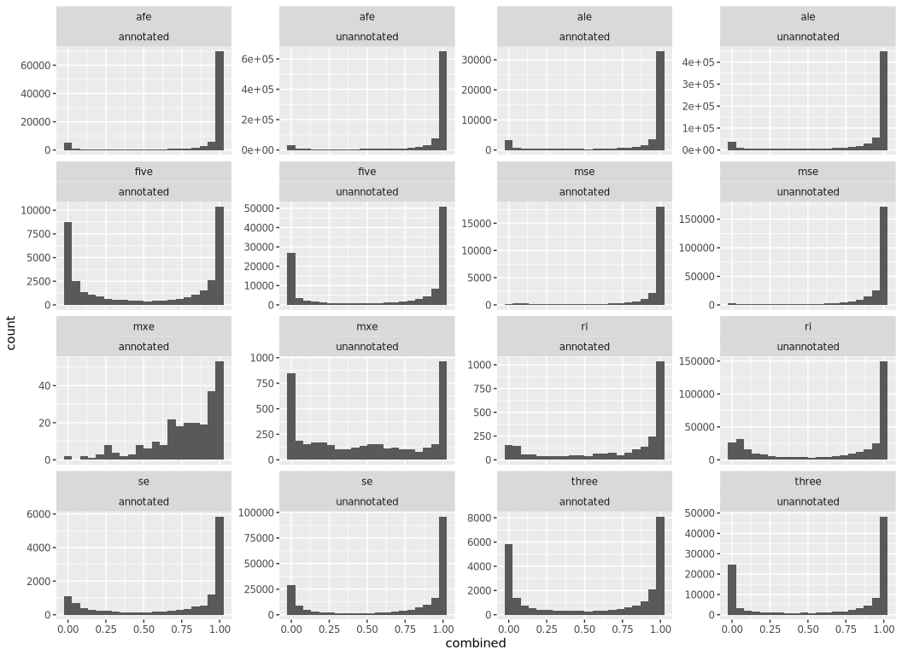
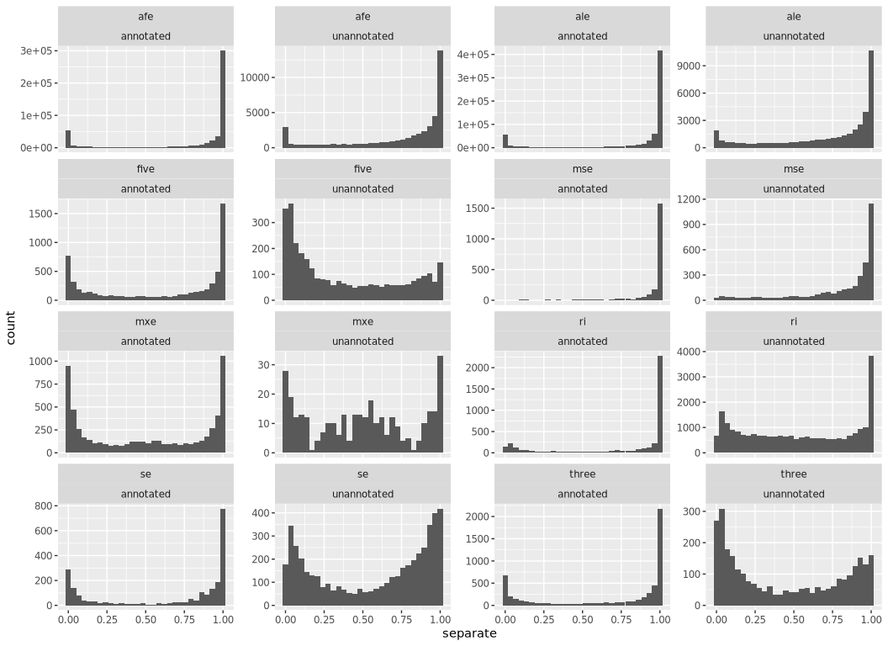
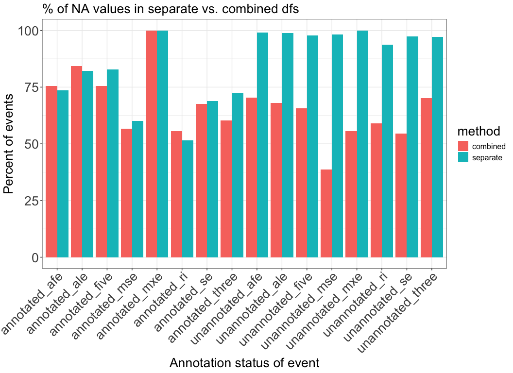
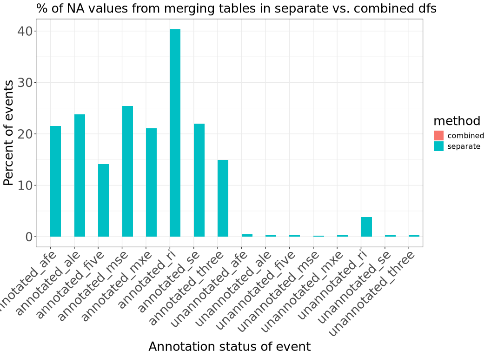

# Compare merged PSI table from TARGET pilot samples
Cindy Liang (celiang@ucsc.edu)
2026-04-15

As part of our pipeline, we plan to merge Shiba tables created for
individual samples to obtain a final PSI table of all samples. Before
doing so, we use this notebook to test that merging PSI tables from
separate runs will not introduce a large amount of untrustworthy splice
events.

As part of tracking differences between the two tables, we have labeled
NA values introduced at various steps of the data processing pipeline
with different negative values:

- -1: NA values assigned by Shiba (splice events with low coverage)

- -2: NA values from merging the separate tables together (samples have
  a NA value after this step if there are genes dropped by Shiba for
  those samples because there is only one transcript detected for that
  gene)

- NA: NA values from merging the separate and combined tables. These NAs
  represent splice events that are only found in one analysis method
  (combined vs. separate)

## Set up

## Directories and files

``` r
# find the root-level repo directory so we can access the other files
repo_root <- rprojroot::find_root(rprojroot::is_git_root)
exploration_dir <- file.path(repo_root, "exploration")
merge_exploration_dir <- file.path(exploration_dir, "merging-psi-tables")

# define the data directories
# shiba results dir
shiba_dir <- file.path(merge_exploration_dir, "shiba_results")

# directory of shiba results produced from the same shiba run
combined_dir <- file.path(shiba_dir, "combined_run", "target_pilot", "results")

# psi table directory
combined_splice_results_dir <- file.path(combined_dir, "splicing")

# Directory of PSI table, merged from separate shiba runs
separate_psi_table_dir <- file.path(merge_exploration_dir, "target_pilot", "merged_results")

# merged PSI file of two samples obtained from merge-shiba-psi-tables.qmd
separate_psi_file <- file.path(separate_psi_table_dir, "merged_psi_table.tsv")

# define list of PSI results files corresponding to event types quantified by Shiba bulk analysis
psi_files <- c(
  se = "PSI_SE.txt",
  afe = "PSI_AFE.txt",
  ale = "PSI_ALE.txt",
  five = "PSI_FIVE.txt",
  three = "PSI_THREE.txt",
  mse = "PSI_MSE.txt",
  mxe = "PSI_MXE.txt",
  ri = "PSI_RI.txt"
)

# construct psi table paths of shiba results of two samples run together
shiba_psi_paths <-file.path(combined_splice_results_dir, psi_files)
names(shiba_psi_paths) <- names(psi_files)
```

Read in files

``` r
# read merged splice table from separate runs of Shiba on the TARGET pilot samples
separate_psi_table <- readr::read_tsv(separate_psi_file, col_types=readr::cols(.default = "c")) |>
  # replace remaining NAs from this table representing dropped genes from one sample with no detected splicing for that gene with -2
  dplyr::mutate(across(contains("_PSI"), \(x) tidyr::replace_na(as.numeric(x), -2)))

# read in combined splice results to compare against separate results
combined_splice_results <- shiba_psi_paths |>
  purrr::map(\(path){
    readr::read_tsv(path, col_types=readr::cols(.default = "c")) |>
      # select for columns that will be used in downstream analysis
      dplyr::select(pos_id, gene_id, label, contains("_PSI")) |>
      # convert PSI values to numeric and replace NA values from shiba representing low coverage with -1
      dplyr::mutate(across(contains("_PSI"), \(x) tidyr::replace_na(as.numeric(x), -1)))
  })

# combine PSI values of samples run together into one dataframe to compare against separate PSI dataframe
combined_psi_table <- purrr::list_rbind(combined_splice_results, names_to = "event_type")
```

### Obtain dimensions of each PSI table

``` r
# dimensions of separate PSI table
dim(separate_psi_table)
```

    [1] 818412     92

``` r
# dimensions of combined PSI table
dim(combined_psi_table)
```

    [1] 746601     92

There are 71,811 more splice events in the separate PSI table than the
combined table.

## Examine splice events that are consistently present in both combined and separate splice tables

To help us prioritize what splice event types we may be the most
confident in after merging separate Shiba PSI tables, we are interested
in seeing a breakdown of what event types are most represented in PSI
tables constructed from different methods

``` r
# obtain df of splice events that are shared between both combined and separate tables
all_events <- dplyr::full_join(
  combined_psi_table,
  separate_psi_table,
  by = c("event_type", "pos_id", "gene_id", "label"),
  # label PSI values by table they came from
  suffix = c("_combined", "_separate")) |>
  # categorize events by whether they are in the combined or separate tables
  dplyr::mutate(
    combined_event = ! dplyr::if_all(ends_with("_combined"), is.na),
    # separate events are counted if the values for the event are not all NA (indicating the splice event is only found in the combined or separate table)
    separate_event = ! dplyr::if_all(ends_with("_separate"), is.na),
    shared_event = combined_event & separate_event
  )
```

Print summary of counts across each method, across all event types

``` r
all_methods_summary <- all_events |> dplyr::summarise(
    # count number of events in each event type and annotation category
    shared_count = sum(shared_event),
    combined_only_count = sum(combined_event) - shared_count,
    separate_only_count = sum(separate_event) - shared_count
)

all_methods_summary
```

| shared_count | combined_only_count | separate_only_count |
|-------------:|--------------------:|--------------------:|
|       667022 |               79579 |              151390 |

Print summary of counts and percentages across each method, broken down
by event type

``` r
all_events_summary <- all_events |> dplyr::summarise(
    .by = c(event_type, label),
    # count number of events in each event type and annotation category
    total = dplyr::n(),
    shared_count = sum(shared_event),
    combined_only_count = sum(combined_event) - shared_count,
    separate_only_count = sum(separate_event) - shared_count,
    shared_percent = shared_count / total * 100,
    combined_only_percent = combined_only_count / total * 100,
    separate_only_percent = separate_only_count / total * 100,
)

all_events_summary
```

| event_type | label | total | shared_count | combined_only_count | separate_only_count | shared_percent | combined_only_percent | separate_only_percent |
|:---|:---|---:|---:|---:|---:|---:|---:|---:|
| se | annotated | 104872 | 101868 | 1054 | 1950 | 97.13556 | 1.0050347 | 1.859410 |
| se | unannotated | 32912 | 21511 | 6737 | 4664 | 65.35914 | 20.4697375 | 14.171123 |
| afe | unannotated | 97616 | 41615 | 22429 | 33572 | 42.63133 | 22.9767661 | 34.391903 |
| afe | annotated | 180632 | 154880 | 3773 | 21979 | 85.74339 | 2.0887772 | 12.167833 |
| ale | annotated | 156353 | 127408 | 2706 | 26239 | 81.48740 | 1.7306991 | 16.781897 |
| ale | unannotated | 62334 | 22160 | 13488 | 26686 | 35.55042 | 21.6382712 | 42.811307 |
| five | annotated | 35556 | 30435 | 1894 | 3227 | 85.59737 | 5.3268084 | 9.075824 |
| five | unannotated | 16825 | 8424 | 5064 | 3337 | 50.06835 | 30.0980684 | 19.833581 |
| three | annotated | 40691 | 36397 | 1462 | 2832 | 89.44730 | 3.5929321 | 6.959770 |
| three | unannotated | 17214 | 9159 | 4927 | 3128 | 53.20669 | 28.6220518 | 18.171256 |
| mse | annotated | 64124 | 61819 | 653 | 1652 | 96.40540 | 1.0183395 | 2.576258 |
| mse | unannotated | 19434 | 11283 | 5080 | 3071 | 58.05804 | 26.1397551 | 15.802202 |
| mxe | annotated | 963 | 792 | 7 | 164 | 82.24299 | 0.7268951 | 17.030114 |
| mxe | unannotated | 481 | 110 | 116 | 255 | 22.86902 | 24.1164241 | 53.014553 |
| ri | unannotated | 51635 | 26113 | 10031 | 15491 | 50.57229 | 19.4267454 | 30.000968 |
| ri | annotated | 16349 | 13048 | 158 | 3143 | 79.80916 | 0.9664200 | 19.224417 |

### Visualize breakdown of shared events with stacked bar plots

``` r
# pivot summary plot longer so we can make grouped bar plots of the percentages
long_all_events_summary <- all_events_summary |>
  tidyr::pivot_longer(
    cols = c(
      shared_count,
      shared_percent,
      combined_only_count, 
      combined_only_percent,
      separate_only_count,
      separate_only_percent),
    # extract percents and counts as separate columns
    names_to = c("category", ".value"),
    names_pattern = "(.+)_(percent|count)"
  )

ggplot(long_all_events_summary, aes(fill = category, x = event_type, y = percent)) +
  geom_bar(position = "stack", stat = "identity") +
  plot_theme +
  labs(
    title = "% of splice events in combined, separate, or shared groups",
    x = "Annotation status of event",
    y = "Percentage of events"
  ) +
  facet_wrap(vars(label)) +
  scale_x_discrete(guide = guide_axis(angle = 45)) +
  plot_theme
```

<div id="fig-splice_events_breakdown">


Figure 1

</div>

Plot raw counts of number of events captured by each method

``` r
ggplot(long_all_events_summary, aes(fill = category, x = event_type, y = count)) +
  geom_bar(position = "dodge", stat = "identity") +
  plot_theme +
  labs(
    title = "Number of splice events only in combined, separate, or shared groups",
    x = "Annotation status of event",
    y = "Number of events"
  ) +
  facet_wrap(vars(label)) +
  scale_x_discrete(guide = guide_axis(angle = 45)) +
  plot_theme
```

<div id="fig-splice_events_breakdown_counts">


Figure 2

</div>

The majority of annotated event types are shared between both tables,
although there are more splice events unique to the separate table than
combined table. The capturing of unannotated event types suffers more
from merging separate PSI tables. In particular, there are more ALE and
MXE events only found in the separate PSI tables. For other unannotated
events, there are 10-30% that are only found in the separate PSI.

### Check how similar PSI values of shared events are

Pivot longer for correlation calculations

``` r
# Pivot all events df longer
long_all_events <- all_events |>
  tidyr::pivot_longer(
    cols = matches("_combined|_separate"),
    names_to = c("sample", "method"),
    values_to = "PSI",
    names_pattern = "(.*)_(combined|separate)"
  ) |>
  # drop NA values, including those coded as negative PSI
  dplyr::filter(PSI >= 0)

# pivot wider for correlation calculations
all_events_by_method <- long_all_events |> 
  tidyr:: pivot_wider(
    names_from = method,
    values_from = PSI
  )
```

### Create table of correlation scores for shared event

``` r
correlation_df <- all_events_by_method |>
  dplyr::summarize(
    .by = event_type,
    # correlation coefficients are overestimated here because we remove incomplete observations
    pearson_r = cor(combined, separate, method = "pearson", use = "complete.obs"),
    pearson_r2 = pearson_r ** 2,
    spearman_rho = cor(combined, separate, method = "spearman", use = "complete.obs")
  )
  
# print correlation table
correlation_df
```

| event_type | pearson_r | pearson_r2 | spearman_rho |
|:-----------|----------:|-----------:|-------------:|
| se         |         1 |          1 |            1 |
| afe        |         1 |          1 |            1 |
| ale        |         1 |          1 |            1 |
| five       |         1 |          1 |            1 |
| three      |         1 |          1 |            1 |
| mse        |         1 |          1 |            1 |
| mxe        |         1 |          1 |            1 |
| ri         |         1 |          1 |            1 |

Check whether shared events have the same PSI values

``` r
# omit NAs 
complete_all_events_by_method <- na.omit(all_events_by_method)

# check if shared events are equal
all.equal(complete_all_events_by_method$combined, complete_all_events_by_method$separate)
```

    [1] TRUE

All shared events have identical PSI values in tables created by the two
methods.

## Check PSI distributions of combined events missed in the separate table

Examine PSI distributions in combined table of events missed by the
separate table, and then the reverse (is there a threshold of PSI where
events become shared?)

note/to do: Plot shared, combined_only, and separate_only PSI values
together, faceted by event types.

### Plot PSI distributions of events only found in combined table

``` r
# create list of pos_ids only in combined df
combined_only_list <- setdiff(combined_psi_table$pos_id, separate_psi_table$pos_id)

# make dataframe of unannotated PSI values of splice events only in the combined dataframe
combined_only_df <- all_events_by_method |>
  dplyr::filter(pos_id %in% combined_only_list) |>
  dplyr::select(-separate) |>
  na.omit()

# plot distributions of unannotated and annotated PSI values only found in the combined table
ggplot(combined_only_df, aes(combined)) + 
  geom_histogram(bins = 20) +
  facet_wrap(vars(event_type, label), scales = "free_y")
```

<div id="fig-combined_only_psi_dist">



Figure 3

</div>

### Plot PSI distributions of events only found in separate table

``` r
# make list of pos_ids only in separate df
separate_only_list <- setdiff(separate_psi_table$pos_id, combined_psi_table$pos_id)

# make df of splice events only in separate dataframes that have been merged
separate_only_df <- all_events_by_method |>
  dplyr::filter(pos_id %in% separate_only_list) |>
  dplyr::select(-combined) |>
  na.omit()

# plot distributions of unannotated and annotated PSI values only found in the combined table
ggplot(separate_only_df, aes(separate)) + geom_histogram() +
  facet_wrap(vars(event_type, label), scales = "free_y")
```

    `stat_bin()` using `bins = 30`. Pick better value `binwidth`.

<div id="fig-separate_only_psi_dist">



Figure 4

</div>

### Takeaways so far

- In the worst case scenario, about 40% of some splice event types
  across all unique events found in both the combined and separate
  (merged) tables are only found in the separate tables. This is
  concerning if we assume all events found only in the separate tables
  are false.

- Most of the events found only in the separate tables are unannotated
  events, which are the event types we are hoping to capture most in the
  splice compendium

- About 30% of unannotated splice events are only found in the combined
  tables, meaning they are missed in the separate tables method

- If we only look at splice events shared between both separate and
  combined PSI tables, the PSI values are identical.

- Unfortunately, PSI values of events only found in the combined or
  separate tables span the entire PSI distribution (0-1) so there is no
  easy way to set a filter to exclude values that are not found in the
  combined table.

A next step for this analysis will be to compare the number of NA values
in each table and examine how many of each type of NA value are present
in each method

Another note here is that we assume the splice events in the combined
table are the ground truth, but a separate kind of evaluation would be
needed to truly ask how many “real” splice events are in each of the
tables. For instance, we maybe would need to do this experiment on
simulated reads where we know going in what all the transcripts are,
which may be beyond the scope of this project.

## Compare NA values in each table

Create summary table of % NAs from shiba or from merging

``` r
na_summary_df <- long_all_events |>
  dplyr::summarise(
    .by = c(event_type, label, method),
    na_count = sum(is.na(dplyr::across(everything()))),
    merge_na_count = sum(PSI == -1, na.rm = TRUE),
    total = dplyr::n(),
    percent_na = na_count / total * 100,
    percent_merge_na = merge_na_count / total * 100
  ) |>
  # concatenate label and event type columns into one again for easy plotting
  tidyr::unite(label_event_type, c("label", "event_type"))

na_summary_df
```

| label_event_type | method | na_count | merge_na_count | total | percent_na | percent_merge_na |
|:---|:---|---:|---:|---:|---:|---:|
| annotated_se | combined | 6166179 | 0 | 9228736 | 66.81499 | 0.0000000 |
| annotated_se | separate | 4251850 | 2031708 | 9228736 | 46.07186 | 22.0150192 |
| unannotated_se | combined | 1581150 | 0 | 2896256 | 54.59290 | 0.0000000 |
| unannotated_se | separate | 2823423 | 10936 | 2896256 | 97.48527 | 0.3775909 |
| unannotated_afe | combined | 6076921 | 0 | 8590208 | 70.74242 | 0.0000000 |
| unannotated_afe | separate | 8448581 | 36929 | 8590208 | 98.35130 | 0.4298965 |
| annotated_afe | combined | 12185042 | 0 | 15895616 | 76.65662 | 0.0000000 |
| annotated_afe | separate | 8723340 | 3419585 | 15895616 | 54.87891 | 21.5127555 |
| annotated_ale | combined | 11709340 | 0 | 13759064 | 85.10274 | 0.0000000 |
| annotated_ale | separate | 8026483 | 3273806 | 13759064 | 58.33597 | 23.7938133 |
| unannotated_ale | combined | 3836807 | 0 | 5485392 | 69.94590 | 0.0000000 |
| unannotated_ale | separate | 5399971 | 14358 | 5485392 | 98.44275 | 0.2617498 |
| annotated_five | combined | 2114960 | 0 | 3128928 | 67.59376 | 0.0000000 |
| annotated_five | separate | 1972669 | 442408 | 3128928 | 63.04616 | 14.1392835 |
| unannotated_five | combined | 980836 | 0 | 1480600 | 66.24585 | 0.0000000 |
| unannotated_five | separate | 1454411 | 5200 | 1480600 | 98.23119 | 0.3512090 |
| annotated_three | combined | 2369673 | 0 | 3580808 | 66.17705 | 0.0000000 |
| annotated_three | separate | 2078669 | 535957 | 3580808 | 58.05028 | 14.9674878 |
| unannotated_three | combined | 959643 | 0 | 1514832 | 63.34980 | 0.0000000 |
| unannotated_three | separate | 1484626 | 5380 | 1514832 | 98.00598 | 0.3551549 |
| annotated_mse | combined | 3329604 | 0 | 5642912 | 59.00507 | 0.0000000 |
| annotated_mse | separate | 2086776 | 1435982 | 5642912 | 36.98048 | 25.4475349 |
| unannotated_mse | combined | 820135 | 0 | 1710192 | 47.95573 | 0.0000000 |
| unannotated_mse | separate | 1679663 | 3397 | 1710192 | 98.21488 | 0.1986327 |
| annotated_mxe | combined | 65729 | 0 | 84744 | 77.56183 | 0.0000000 |
| annotated_mxe | separate | 42929 | 17861 | 84744 | 50.65727 | 21.0764184 |
| unannotated_mxe | combined | 34108 | 0 | 42328 | 80.58023 | 0.0000000 |
| unannotated_mxe | separate | 41661 | 106 | 42328 | 98.42421 | 0.2504253 |
| unannotated_ri | combined | 2768640 | 0 | 4543880 | 60.93119 | 0.0000000 |
| unannotated_ri | separate | 4076340 | 174834 | 4543880 | 89.71056 | 3.8476808 |
| annotated_ri | combined | 841155 | 0 | 1438712 | 58.46584 | 0.0000000 |
| annotated_ri | separate | 225301 | 580436 | 1438712 | 15.65991 | 40.3441411 |

Plot % NAs from shiba

``` r
ggplot(na_summary_df, aes(fill = method, x = label_event_type, y = percent_na)) +
  geom_bar(position = "dodge", stat = "identity") +
  plot_theme +
  labs(
    title = "% of NA values in separate vs. combined dfs",
    x = "Annotation status of event",
    y = "Percent of events"
  ) +
  scale_x_discrete(guide = guide_axis(angle = 45)) +
  plot_theme
```

<div id="fig-percent_na_comparison">



Figure 4

</div>

Similar to unannotated event types being overrepresented in the separate
PSI table, we see the NA values becoming more of an issue in unannotated
event types in the separate PSI table.

Plot % NAs from merging tables

``` r
ggplot(na_summary_df, aes(fill = method, x = label_event_type, y = percent_merge_na)) +
  geom_bar(position = "dodge", stat = "identity") +
  plot_theme +
  labs(
    title = "% of NA values from merging tables in separate vs. combined dfs",
    x = "Annotation status of event",
    y = "Percent of events"
  ) +
  scale_x_discrete(guide = guide_axis(angle = 45)) +
  plot_theme
```

<div id="fig-percent_merge_na_comparison">



Figure 5

</div>

A good portion of NA values come from merging in the separate PSI tables
