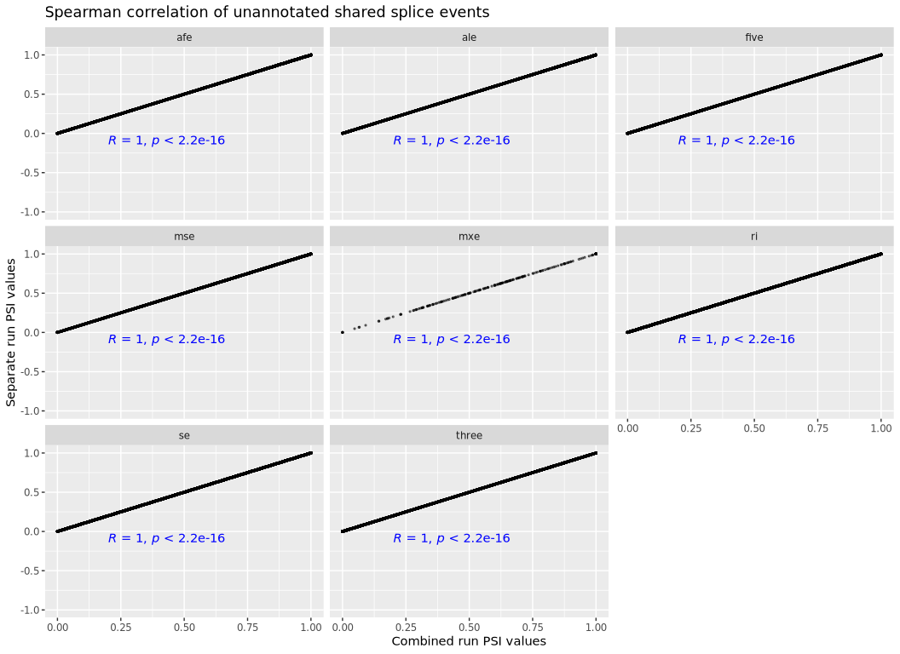
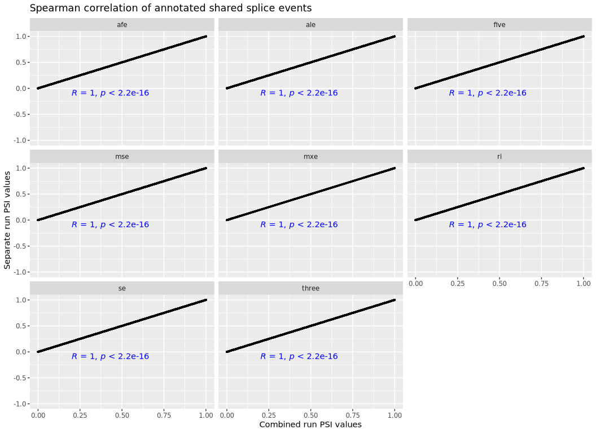

# Compare merged PSI table from TARGET pilot samples
Cindy Liang (celiang@ucsc.edu)
2026-04-10

As part of our pipeline, we plan to merge Shiba tables created for
individual samples to obtain a final PSI table of all samples. Before
doing so, we use this notebook to test that merging PSI tables from
separate runs will not introduce a large amount of untrustworthy splice
events or junction counts.

## Set up

## Directories and files

``` r
# find the root-level repo directory so we can access the other files
repo_root <- rprojroot::find_root(rprojroot::is_git_root)
exploration_dir <- file.path(repo_root, "exploration")
merge_exploration_dir <- file.path(exploration_dir, "merging-psi-tables")

# define the data directories
# shiba results dir
shiba_dir <- file.path(merge_exploration_dir, "shiba_results")

# directory of shiba results produced from the same shiba run
combined_dir <- file.path(shiba_dir, "combined_run", "target_pilot", "results")

# psi table directory
combined_splice_results_dir <- file.path(combined_dir, "splicing")

# Directory of PSI table, merged from separate shiba runs
separate_psi_table_dir <- file.path(merge_exploration_dir, "target_pilot", "merged_results")

# merged PSI file of two samples obtained from merge-shiba-psi-tables.qmd
separate_psi_file <- file.path(separate_psi_table_dir, "merged_psi_table.tsv")

# define list of PSI results files corresponding to event types quantified by Shiba bulk analysis
psi_files <- c(
  se = "PSI_SE.txt",
  afe = "PSI_AFE.txt",
  ale = "PSI_ALE.txt",
  five = "PSI_FIVE.txt",
  three = "PSI_THREE.txt",
  mse = "PSI_MSE.txt",
  mxe = "PSI_MXE.txt",
  ri = "PSI_RI.txt"
)

# construct psi table paths of shiba results of two samples run together
shiba_psi_paths <-file.path(combined_splice_results_dir, psi_files)
names(shiba_psi_paths) <- names(psi_files)
```

Read in files

``` r
# read merged splice table from separate runs of Shiba on the TARGET pilot samples
separate_psi_table <- readr::read_tsv(separate_psi_file)
```

    Rows: 818412 Columns: 92
    ── Column specification ────────────────────────────────────────────────────────
    Delimiter: "\t"
    chr  (4): pos_id, gene_id, label, event_type
    dbl (88): SRR1559043_PSI, SRR1559044_PSI, SRR1559052_PSI, SRR1559054_PSI, SR...

    ℹ Use `spec()` to retrieve the full column specification for this data.
    ℹ Specify the column types or set `show_col_types = FALSE` to quiet this message.

``` r
# read in combined splice results to compare against separate results
combined_splice_results_paths <- shiba_psi_paths |>
  purrr::map(\(path){
    readr::read_tsv(path, col_types=readr::cols(.default = "c")) |>
      # select for columns that will be used in downstream analysis
      dplyr::select(pos_id, gene_id, label, contains("_PSI")) |>
      dplyr::mutate(across(contains("_PSI"), as.numeric))
  })

# combine psi values of samples run together into one dataframe to compare against separate PSI dataframe
combined_psi_table <- purrr::list_rbind(combined_splice_results_paths, names_to = "event_type")
```

### Obtain dimensions of each PSI table

``` r
# dimensions of separate PSI table
dim(separate_psi_table)
```

    [1] 818412     92

``` r
# dimensions of combined PSI table
dim(combined_psi_table)
```

    [1] 746601     92

There are 71,811 more splice events in the separate PSI table than the
combined table.

## Examine splice events that are consistently present in both combined and separate splice tables

To help us prioritize what splice event types we may be the most
confident in after merging separate Shiba PSI tables, we are interested
in seeing a breakdown of what event types are most represented in both
PSI tables

``` r
# obtain df of splice events that are shared between both combined and separate tables
all_events <- dplyr::full_join(
  combined_psi_table,
  separate_psi_table,
  by = c("event_type", "pos_id", "gene_id", "label"),
  # label PSI values by table they came from
  suffix = c("_combined", "_separate")) |>
  # categorize events by whether they are in the combined or separate tables
  dplyr::mutate(
    combined_event = ! dplyr::if_all(ends_with("_combined"), is.na),
    # separate events are counted if the values for the event are not all NA or -1 (indicating NA introduced from merging)
    separate_event = ! dplyr::if_all(ends_with("_separate"), ~ sign(.) < 0 | is.na(.)),
    shared_event = combined_event & separate_event
  )
```

Print summary of percentage of each event types found in both methods,
or in only one

``` r
all_events_summary <- all_events |> dplyr::summarise(
    .by = c(event_type, label),
    # count number of events in each event type and annotation category
    count = dplyr::n(),
    shared_percent = sum(shared_event) / count * 100,
    combined_only_percent = ( sum(combined_event) - sum(shared_event) ) / count * 100,
    separate_only_percent = ( sum(separate_event) - sum(shared_event) ) / count * 100,
)

all_events_summary
```

| event_type | label | count | shared_percent | combined_only_percent | separate_only_percent |
|:---|:---|---:|---:|---:|---:|
| se | annotated | 104872 | 66.72134 | 1.2548631 | 1.634373 |
| se | unannotated | 32912 | 54.06235 | 27.8773700 | 11.758629 |
| afe | unannotated | 97616 | 30.59642 | 27.9544337 | 26.050033 |
| afe | annotated | 180632 | 54.49976 | 1.5301829 | 9.966673 |
| ale | annotated | 156353 | 43.09863 | 1.1384495 | 14.160905 |
| ale | unannotated | 62334 | 27.25960 | 24.9382360 | 36.280361 |
| five | annotated | 35556 | 59.19395 | 5.6277422 | 7.728653 |
| five | unannotated | 16825 | 39.04903 | 33.3551263 | 14.882615 |
| three | annotated | 40691 | 62.40201 | 4.1704554 | 5.755573 |
| three | unannotated | 17214 | 42.11688 | 33.0138260 | 14.238411 |
| mse | annotated | 64124 | 74.94074 | 1.4269228 | 2.336099 |
| mse | unannotated | 19434 | 50.31903 | 32.9679942 | 13.908614 |
| mxe | annotated | 963 | 47.66355 | 0.9345794 | 15.991693 |
| mxe | unannotated | 481 | 16.63202 | 27.6507277 | 43.866944 |
| ri | unannotated | 51635 | 44.64026 | 22.8914496 | 27.105645 |
| ri | annotated | 16349 | 68.07144 | 1.3578812 | 15.756315 |

### Visualize breakdown of shared events with stacked bar plots

``` r
# pivot summary plot longer so we can make grouped bar plots of the percentages
long_all_events_summary <- all_events_summary |>
  tidyr::pivot_longer(
    cols = c(shared_percent, combined_only_percent, separate_only_percent),
    names_to = "category",
    values_to = "percent"
  ) |>
  # concatenate event type and label so unannotated and annotated events can be plotted together
  tidyr::unite(label_event_type, c("label", "event_type"))

ggplot(long_all_events_summary, aes(fill = category, x = label_event_type, y = percent)) +
  geom_bar(position = "dodge", stat = "identity") +
  plot_theme +
  labs(
    title = "% of splice events only in combined PSI tables",
    x = "Annotation status of event",
    y = "Percentage of events"
  ) +
  scale_x_discrete(guide = guide_axis(angle = 45)) +
  plot_theme
```

<div id="fig-splice_events_breakdown">


Figure 1

</div>

The majority of annotated event types are shared between both tables,
although there are more splice events unique to the separate table than
combined table. The capturing of unannotated event types suffers more
from merging separate PSI tables. In particular, there are more ALE and
MXE events only found in the separate PSI tables. For other unannotated
events, there are 10-30% that are only found in the separate PSI.

### Obtain the number of splice events only found in each table

``` r
# produce dataframe of elements in combined splice results reference dataframe
combined_only_list <- setdiff(combined_psi_table$pos_id, separate_psi_table$pos_id)

# produce dataframe of elements in merged splice results dataframe but not in the reference df
separate_only_list <- setdiff(separate_psi_table$pos_id, combined_psi_table$pos_id)

# events only present in separate tables
# Number of splice events only in separate PSI table
length(separate_only_list)
```

    [1] 139412

``` r
# Number of splice events only in combined PSI table
length(combined_only_list)
```

    [1] 72021

### Check how similar PSI values of shared events are

Pivot longer to create scatter plots

``` r
long_all_events <- all_events |>
  tidyr::pivot_longer(
    cols = matches("_combined|_separate"),
    names_to = c("sample", "method"),
    values_to = "PSI",
    names_pattern = "(.*)_(combined|separate)"
  )

# pivot wider for scatterplots

all_events_by_method <- long_all_events |> tidyr:: pivot_wider(
    names_from = method,
    values_from = PSI
  )
```

Make scatter plot of unannotated events

``` r
long_unannotated <- all_events_by_method |>
  dplyr::filter(label == "unannotated")

  ggplot(long_unannotated) +
    aes(
      # read in columns to use for x and y from input
      x = combined,
      y = separate,
    ) +
    geom_point(size = 0.5, alpha = 0.5) +
    labs(
      title = "Spearman correlation of unannotated shared splice events",
      x = "Combined run PSI values",
      y = "Separate run PSI values") +
    facet_wrap(vars(event_type)) +

    ggpubr::stat_cor(method = "spearman", label.x = 0.2, label.y = -0.1, color = "blue")
```

    Warning: Removed 25807211 rows containing non-finite outside the scale range
    (`stat_cor()`).

    Warning: Removed 25807211 rows containing missing values or values outside the scale
    range (`geom_point()`).

<div id="fig-unannotated_psi_correlation">



Figure 2

</div>

Make scatterplot of annotated events

``` r
long_annotated <- all_events_by_method |>
  dplyr::filter(label == "annotated")


  ggplot(long_annotated) +
    aes(
      # read in columns to use for x and y from input
      x = combined,
      y = separate,
    ) +
    geom_point(size = 0.5, alpha = 0.5) +
    labs(
      title = "Spearman correlation of annotated shared splice events",
      x = "Combined run PSI values",
      y = "Separate run PSI values") +
    facet_wrap(vars(event_type)) +

    ggpubr::stat_cor(method = "spearman", label.x = 0.2, label.y = -0.1, color = "blue")
```

    Warning: Removed 40545300 rows containing non-finite outside the scale range
    (`stat_cor()`).

    Warning: Removed 40545300 rows containing missing values or values outside the scale
    range (`geom_point()`).

<div id="fig-annotated_psi_correlation">



Figure 3

</div>

### Takeaways so far

- In the worst case scenario, about 40% of some splice event types
  across all unique events found in both the combined and separate
  (merged) tables are only found in the separate tables. This is
  concerning if we assume all events found only in the separate tables
  are false.

- Most of the events found only in the separate tables are unannotated
  events, which are the event types we are hoping to capture most in the
  splice compendium

- If we only look at splice events shared between both separate and
  combined PSI tables, the PSI values appear identical. We may be able
  to be more confident in our splice table if we filter out everything
  with NA values (limit ourselves to PSI values of events found in all
  samples), but this may severely shrink down the number of splice
  events in the compendium.

A next step for this notebook will be to compare the number of NA values
in each table (I suspect there will be many more NAs in the separate
tables)

Another note here is that we assume the splice events in the combined
table are the ground truth, but a separate kind of evaluation would be
needed to truly ask how many “real” splice events are in each of the
tables. For instance, we maybe would need to do this experiment on
simulated reads where we know going in what all the transcripts are,
which may be beyond the scope of this project.
