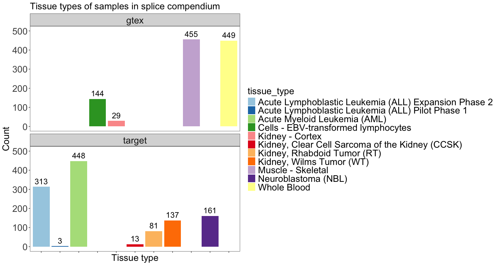
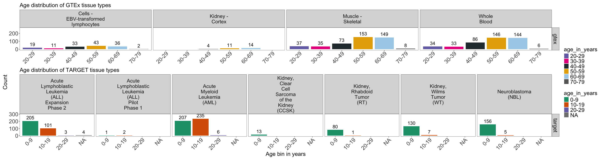
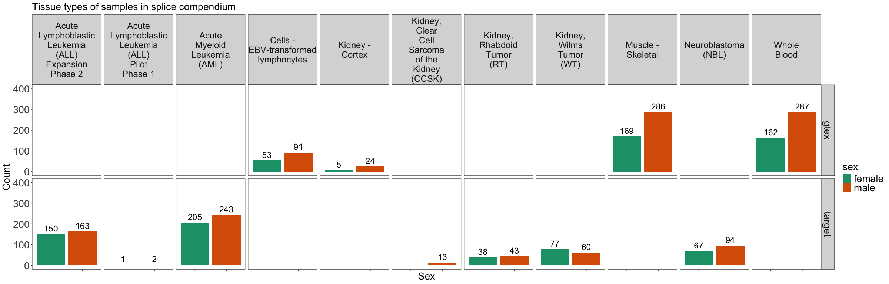

# Summary of samples on splice compendium v1
Cindy Liang (celiang@ucsc.edu)
2026-07-27

## Introduction

Splice compendium v1 contains data from TARGET and GTEx datasets. This
notebook summarizes the distribution of tissue types, demographic
information, and sequencing center of origin information of samples
analyzed in the compendium.

Metadata used for this analysis are:

- [sample_sheet.tsv](https://github.com/UCSC-Treehouse/splicing-compendium/blob/main/config/sample_sheet.tsv):
  Accessions list of samples processed in splice compendium v1. Columns
  include accession ID (“sample”) and dataset (“group”).
- [gtex_accessions.tsv](https://github.com/UCSC-Treehouse/splicing-compendium/blob/main/metadata/filter_target_gtex/gtex_accessions.tsv):
  metadata file of GTEX sample accession IDs, along with age, sex of
  donor and tissue type of the sample.
- [target_accessions_clinical.tsv](https://github.com/UCSC-Treehouse/splicing-compendium/blob/celiang/new-clinical-metadata/metadata/filter_target_gtex/target_accessions_clinical.tsv):
  metadata file of TARGET sample accession IDs, along with age, sex of
  donor, cancer type of the sample, and sequencing center of origin of
  the sample.

## Setup

## Define functions

``` r
# faceted geom_bar plots of each dataset's sample demographics
facet_plot_samples <- function(
    df, 
    x_value,
    colors,
    title,
    xtitle,
    ylim_upper) {
      ggplot(df, aes(x = .data[[x_value]], fill = .data[[x_value]])) +
  geom_bar() +
  labs(title = title, 
       x = xtitle, 
       y = "Count") +
  # manually add to ylim so that there is space for over-bar labels
  ylim(0, ylim_upper) +
  plot_theme +
  facet_grid(vars(.data[["dataset"]]), vars(.data[["tissue_type"]]),
             labeller = label_wrap_gen(width = 10)) +
  theme(
    # make facet labels bigger
    strip.text.x = element_text(size = global_size - 2),
    strip.text.y = element_text(size = global_size),
    # make legend text bigger
    legend.text = element_text(size = global_size),
    axis.text.x = if (x_value != "age_in_years") {
      # if not, can omit x axis labels because legend is sufficient
      element_blank() } else {
        # if we are plotting age in years, need x axis labels because bars are too short to tell color
        axis.text.x = element_text(angle = 45)
      }
    ) +
  # add N observations to bars
  geom_text(
    # count number of observations in each tissue type
    stat = "count",
    aes(label = paste0(after_stat(count))), 
    vjust = -0.5,
    size = global_size - 14
  ) +
    # if named color palette is provided, use manual scale fill
    if (is.vector(colors) & length(colors) > 1) {
  scale_fill_manual(values = colors)
      } else {
    scale_fill_brewer(palette = colors) 
    }
  }
```

## Read in input and output paths

Read in directory and file paths

``` r
# find the root-level repo directory so we can access the other files
repo_root <- rprojroot::find_root(rprojroot::is_git_root)

# find the project directory (splicing-compendium)
# working directory is in scripts
base_dir <- here::here()

## Directories ##
# define metadata directory
metadata_dir <- file.path(base_dir, "metadata")
gtex_target_metadata_dir <- file.path(metadata_dir, "filter_target_gtex")

# config directory of compendium
config_dir <- file.path(repo_root, "config")

### Files ##
# gtex metadata with age info
gtex_metadata_file <- file.path(gtex_target_metadata_dir, "gtex_accessions.tsv")
# target metadata with age info
target_metadata_file <- file.path(gtex_target_metadata_dir, "target_accessions_clinical.tsv")
# sample sheet of compendium files 
compendium_sample_file <- file.path(config_dir, "sample_sheet.tsv")

## Read in files ##
gtex_metadata <- readr::read_tsv(
  gtex_metadata_file, 
  col_types = readr::cols(
    Bytes = "d", 
    cumulative_tb = "d",
    .default = "c"
  )
)

target_metadata <- readr::read_tsv(
  target_metadata_file,
  col_types = readr::cols(
    age_at_earliest_diagnosis_in_years.diagnoses.xena_derived = "d",
    age_at_diagnosis_days = "d",
    .default = "c")
)

sample_df <- readr::read_tsv(
  compendium_sample_file,
  col_types = readr::cols(.default = "c")
)
```

## Filter TARGET and GTEx samples for what’s in the compendium

Not all samples filtered for downloading are processed as part of the
compendium due to `fasterq-dump` download issues or the file size being
too large to align in a timely manner.

``` r
# obtain list of accessions in compendium for each group

target_accessions_list <- sample_df |>
  dplyr::filter(group == "target") |>
  dplyr::pull(sample)

gtex_accessions_list <- sample_df |>
  dplyr::filter(group == "gtex") |>
  dplyr::pull(sample)

# filter gtex and target metadata for those corresponding to samples in compendium

target_compendium_df <- target_metadata |>
  dplyr::filter(Run %in% target_accessions_list) |>
  # the xena browser metadata's "name.project" has the cancer type in a prettier format 
  # (no "TARGET:" prefix) 
  # but since some ALL phase 2 samples were miscategorized as  ALL phase 3 in the xena metadata, 
  # we will use thee study_name column from dbGaP metadata
  dplyr::mutate(
    # add dataset column to facet plots by
    dataset = "target",
    # remove TARGET prefix from study_name values
    study_name = stringr::str_remove(study_name, "^TARGET: ")) |>
  # clean up TARGET metadata by selecting clinically relevant and batch-relevant information
  dplyr::select(
    # fields shared with gtex metadata
    dataset,
    Run, # accession ID, same format as GTEx,
    BioSample, # sample-specific accession ID from dbgap
    center_name = `Center Name`, # sequencing center of origin
    sex = gender.demographic, # in "male" / "female" values,
    tissue_type = study_name, # cancer type of sample
    # fields specific to target metadata
    age_at_earliest_diagnosis_in_years.diagnoses.xena_derived, # in continuous floating point numbers, to be binned
    target_patient_id = `_PATIENT`, # ID of patient sample came from - some samples came from the same patient
    # in cases where patient ID is missing, the ID can be derived from the biospecimen sample ID (first three fields separated by hyphens)
    target_biospecimen_sample_id = biospecimen_repository_sample_id, # specific replicate ID for a sample
    # additional demographic info only in target metadata
    target_race = race.demographic,
    target_ethnicity = ethnicity.demographic,
    # clinical metadata specific to target samples
    target_OS = OS,
    target_OS_time = OS.time,
    target_disease_type = disease_type,
    target_project_id = project_id.project,
    target_project_name = name.project,
    target_tumor_class = classification_of_tumor.diagnoses,
    target_primary_diagnosis = primary_diagnosis.diagnoses,
    target_sample_type = sample_type.samples,
    target_tissue_type = tissue_type.samples,
    target_histological_type = histological_type,
    target_body_site = body_site
  )

gtex_compendium_df <- gtex_metadata |>
  dplyr::filter(Run %in% gtex_accessions_list) |>
  dplyr::mutate(
    # add dataset column to facet plots by
    dataset = "gtex"
  ) |>
  # clean up gtex metadata by selecting clinically relevant and batch-relevant information
  dplyr::select(
    # fields shared with target metadata
    dataset,
    Run, # accession ID
    BioSample, # sample-specific accession ID from dbgap
    age_in_years = AGE, # in 10-year bins (characters)
    sex = SEX, # coded as 1 or 2, to be converted to 'male' and 'female'
    center_name = `Center Name`,
    tissue_type = body_site, # tissue type of sample
    # gtex-specific metadata fields
    gtex_batch_id = batch_id,
    gtex_version = version, # gtex version sample was added
    gtex_subject_id = SUBJID # ID of the individual the sample came from - some samples come from the same subject
  )
```

Merge GTEx and TARGET metadata tables for analysis and unify format of
common column values. GTEx sex information is coded in values of 1 and
2, while TARGET values are in ‘male’ and ‘female’ format. According to
`GTEx_Analysis_v10_Annotations_SampleAttributesDD.xlsx` on the [GTEx
portal metadata download
page](https://gtexportal.org/home/downloads/adult-gtex/metadata), 1 =
Male and 2 = Female.

``` r
# ensure shared column values are in a consistent format before merging
cleaned_target_df <- target_compendium_df |>
   dplyr::mutate(
     # bin TARGET sample age in years into 10 year blocks to make data closer to GTEx representation
     age_in_years = cut(
       age_at_earliest_diagnosis_in_years.diagnoses.xena_derived,
       breaks = seq(0, 100, by = 10),
       left = TRUE,
       right = FALSE,
       labels = c(
         "0-9",
         "10-19",
         "20-29",
         "30-39",
         "40-49",
         "50-59",
         "60-69",
         "70-79",
         "80-89",
         "90-99"
       )
       )
    )

cleaned_gtex_df <- gtex_compendium_df |>
  dplyr::mutate(
    # relabel sex column values according to what they represent
    sex =
      dplyr::case_when(
        sex == 1 ~ "male",
        sex == 2 ~ "female"
  )
  )

merged_compendium_df <- dplyr::bind_rows(
  cleaned_target_df,
  cleaned_gtex_df
)
```

## clean up merged df for plotting

``` r
# clean up weirdly formatted names
for_plot_merged_compendium_df <- merged_compendium_df |>
  # remove slashes from target kidney tissue types
  dplyr::mutate(
    tissue_type = dplyr::replace_when(
      tissue_type,
      tissue_type == 
      "Kidney\\, Clear Cell Sarcoma of the Kidney (CCSK)"   ~ "Kidney, Clear Cell Sarcoma of the Kidney (CCSK)",
      tissue_type == "Kidney\\, Rhabdoid Tumor (RT)"    ~ "Kidney, Rhabdoid Tumor (RT)" ,
      tissue_type == "Kidney\\, Wilms Tumor (WT)" ~ "Kidney, Wilms Tumor (WT)"
    )
  )

# filter for gtex samples
gtex_plot_df <- for_plot_merged_compendium_df |>
  dplyr::filter(dataset == "gtex")

# filter for target samples
target_plot_df <- for_plot_merged_compendium_df |>
  dplyr::filter(dataset == "target")
```

## Summaries of sample composition of GTEx and TARGET accessions

### Table of number of samples in each GTEx tissue type

Print a table summarizing number of samples in each tissue type in
compendium

``` r
# summarize number of samples in each GTEx tissue type
gtex_plot_df |>
  dplyr::group_by(tissue_type) |>
  dplyr::summarise(
    n = dplyr::n()
    )
```

| tissue_type                         |   n |
|:------------------------------------|----:|
| Cells - EBV-transformed lymphocytes | 144 |
| Kidney - Cortex                     |  29 |
| Muscle - Skeletal                   | 455 |
| Whole Blood                         | 449 |

Our curated GTEx compendium dataset is primarily composed of whole blood
(for leukemia comparisons) and skeletal muscle (for soft tissue
comparison) samples.

### Table of number of samples in each TARGET cancer type

``` r
# summarize number of samples in each TARGET tissue type
target_plot_df |>
  dplyr::group_by(tissue_type) |>
  dplyr::summarise(
    n = dplyr::n()
    )
```

| tissue_type                                          |   n |
|:-----------------------------------------------------|----:|
| Acute Lymphoblastic Leukemia (ALL) Expansion Phase 2 | 313 |
| Acute Lymphoblastic Leukemia (ALL) Pilot Phase 1     |   3 |
| Acute Myeloid Leukemia (AML)                         | 448 |
| Kidney, Clear Cell Sarcoma of the Kidney (CCSK)      |  13 |
| Kidney, Rhabdoid Tumor (RT)                          |  81 |
| Kidney, Wilms Tumor (WT)                             | 137 |
| Neuroblastoma (NBL)                                  | 161 |

### Plot sample distribution in each dataset

``` r
ggplot(for_plot_merged_compendium_df, aes(x = tissue_type, fill = tissue_type)) +
  geom_bar() +
  scale_fill_brewer(palette = "Paired") +
  labs(title = "Tissue types of samples in splice compendium", 
       x = "Tissue type", 
       y = "Count") +
  # manually add to ylim so that there is space for over-bar labels
  ylim(0, 500) +
  plot_theme +
  facet_wrap(~ dataset,
             ncol = 1) +
  theme(
    # make facet labels bigger
    strip.text.x = element_text(size = global_size),
    # remove x axis tick labels (spell out in legend instead)
    axis.text.x = element_blank(),
    # make legend text bigger
    legend.text = element_text(size = global_size)) +
  # add N observations to bars
  geom_text(
    # count number of observations in each tissue type
    stat = "count",
    aes(label = paste0(after_stat(count))), 
    vjust = -0.5,
    size = global_size - 14
  )
```

<div id="fig-sample_dist_bar">



Figure 1

</div>

**?@fig-sample_dist_stacked_bar** looks ok so it makes sense to me to
facet the plots this way. Faceting the plots by dataset and tissue type
for the sex/age distribution plots becomes horrible, so instead I make a
new dataframe per dataset

Print tables summarizing number of samples in each age bin in compendium

### Table of ages in GTEx dataset

``` r
# summarize number of samples in each GTEx tissue type
gtex_plot_df |>
  dplyr::group_by(tissue_type, age_in_years) |>
  dplyr::summarise(
    n = dplyr::n()
    )
```

    `summarise()` has regrouped the output.
    ℹ Summaries were computed grouped by tissue_type and age_in_years.
    ℹ Output is grouped by tissue_type.
    ℹ Use `summarise(.groups = "drop_last")` to silence this message.
    ℹ Use `summarise(.by = c(tissue_type, age_in_years))` for per-operation
      grouping (`?dplyr::dplyr_by`) instead.

| tissue_type                         | age_in_years |   n |
|:------------------------------------|:-------------|----:|
| Cells - EBV-transformed lymphocytes | 20-29        |  19 |
| Cells - EBV-transformed lymphocytes | 30-39        |  11 |
| Cells - EBV-transformed lymphocytes | 40-49        |  33 |
| Cells - EBV-transformed lymphocytes | 50-59        |  43 |
| Cells - EBV-transformed lymphocytes | 60-69        |  36 |
| Cells - EBV-transformed lymphocytes | 70-79        |   2 |
| Kidney - Cortex                     | 40-49        |   4 |
| Kidney - Cortex                     | 50-59        |  11 |
| Kidney - Cortex                     | 60-69        |  14 |
| Muscle - Skeletal                   | 20-29        |  37 |
| Muscle - Skeletal                   | 30-39        |  35 |
| Muscle - Skeletal                   | 40-49        |  73 |
| Muscle - Skeletal                   | 50-59        | 153 |
| Muscle - Skeletal                   | 60-69        | 149 |
| Muscle - Skeletal                   | 70-79        |   8 |
| Whole Blood                         | 20-29        |  34 |
| Whole Blood                         | 30-39        |  33 |
| Whole Blood                         | 40-49        |  86 |
| Whole Blood                         | 50-59        | 146 |
| Whole Blood                         | 60-69        | 144 |
| Whole Blood                         | 70-79        |   6 |

### Table of ages in TARGET dataset

``` r
# summarize number of samples in each GTEx tissue type
target_plot_df |>
  dplyr::group_by(tissue_type, age_in_years) |>
  dplyr::summarise(
    n = dplyr::n()
    )
```

    `summarise()` has regrouped the output.
    ℹ Summaries were computed grouped by tissue_type and age_in_years.
    ℹ Output is grouped by tissue_type.
    ℹ Use `summarise(.groups = "drop_last")` to silence this message.
    ℹ Use `summarise(.by = c(tissue_type, age_in_years))` for per-operation
      grouping (`?dplyr::dplyr_by`) instead.

| tissue_type                                          | age_in_years |   n |
|:-----------------------------------------------------|:-------------|----:|
| Acute Lymphoblastic Leukemia (ALL) Expansion Phase 2 | 0-9          | 205 |
| Acute Lymphoblastic Leukemia (ALL) Expansion Phase 2 | 10-19        | 101 |
| Acute Lymphoblastic Leukemia (ALL) Expansion Phase 2 | 20-29        |   3 |
| Acute Lymphoblastic Leukemia (ALL) Expansion Phase 2 | NA           |   4 |
| Acute Lymphoblastic Leukemia (ALL) Pilot Phase 1     | 0-9          |   1 |
| Acute Lymphoblastic Leukemia (ALL) Pilot Phase 1     | 10-19        |   2 |
| Acute Myeloid Leukemia (AML)                         | 0-9          | 207 |
| Acute Myeloid Leukemia (AML)                         | 10-19        | 235 |
| Acute Myeloid Leukemia (AML)                         | 20-29        |   6 |
| Kidney, Clear Cell Sarcoma of the Kidney (CCSK)      | 0-9          |  13 |
| Kidney, Rhabdoid Tumor (RT)                          | 0-9          |  80 |
| Kidney, Rhabdoid Tumor (RT)                          | 10-19        |   1 |
| Kidney, Wilms Tumor (WT)                             | 0-9          | 130 |
| Kidney, Wilms Tumor (WT)                             | 10-19        |   7 |
| Neuroblastoma (NBL)                                  | 0-9          | 156 |
| Neuroblastoma (NBL)                                  | 10-19        |   5 |

4 ALL Phase 2 samples have missing age metadata, but other clinical
metadata fields are present.

### Plot age distribution of tissues in TARGET and GTEx dataset

``` r
gtex_age_plot <- facet_plot_samples(
    gtex_plot_df, 
    "age_in_years", 
    age_palette,
    "Age distribution of GTEx tissue types",
    "Age bin in years",
    260) 

target_age_plot <- facet_plot_samples(
    target_plot_df, 
    "age_in_years", 
    age_palette,
    "Age distribution of TARGET tissue types",
    "Age bin in years",
    290) 

# print plots together
gtex_age_plot / target_age_plot +
  plot_layout(
    guides = "collect",
    axis_titles = "collect")
```

<div id="fig-sample_age_dist_bar">



Figure 2

</div>

This is kind of bad but is the best I can do to meet the “geom bar +
facet” plan we discussed

### Table of sex distribution in GTEx dataset

``` r
# summarize number of samples in each GTEx tissue type
gtex_plot_df |>
  dplyr::group_by(tissue_type, sex) |>
  dplyr::summarise(
    n = dplyr::n()
    )
```

    `summarise()` has regrouped the output.
    ℹ Summaries were computed grouped by tissue_type and sex.
    ℹ Output is grouped by tissue_type.
    ℹ Use `summarise(.groups = "drop_last")` to silence this message.
    ℹ Use `summarise(.by = c(tissue_type, sex))` for per-operation grouping
      (`?dplyr::dplyr_by`) instead.

| tissue_type                         | sex    |   n |
|:------------------------------------|:-------|----:|
| Cells - EBV-transformed lymphocytes | female |  53 |
| Cells - EBV-transformed lymphocytes | male   |  91 |
| Kidney - Cortex                     | female |   5 |
| Kidney - Cortex                     | male   |  24 |
| Muscle - Skeletal                   | female | 169 |
| Muscle - Skeletal                   | male   | 286 |
| Whole Blood                         | female | 162 |
| Whole Blood                         | male   | 287 |

### Table of sex distribution in TARGET dataset

``` r
# summarize number of samples in each GTEx tissue type
target_plot_df |>
  dplyr::group_by(tissue_type, sex) |>
  dplyr::summarise(
    n = dplyr::n()
    )
```

    `summarise()` has regrouped the output.
    ℹ Summaries were computed grouped by tissue_type and sex.
    ℹ Output is grouped by tissue_type.
    ℹ Use `summarise(.groups = "drop_last")` to silence this message.
    ℹ Use `summarise(.by = c(tissue_type, sex))` for per-operation grouping
      (`?dplyr::dplyr_by`) instead.

| tissue_type                                          | sex    |   n |
|:-----------------------------------------------------|:-------|----:|
| Acute Lymphoblastic Leukemia (ALL) Expansion Phase 2 | female | 150 |
| Acute Lymphoblastic Leukemia (ALL) Expansion Phase 2 | male   | 163 |
| Acute Lymphoblastic Leukemia (ALL) Pilot Phase 1     | female |   1 |
| Acute Lymphoblastic Leukemia (ALL) Pilot Phase 1     | male   |   2 |
| Acute Myeloid Leukemia (AML)                         | female | 205 |
| Acute Myeloid Leukemia (AML)                         | male   | 243 |
| Kidney, Clear Cell Sarcoma of the Kidney (CCSK)      | male   |  13 |
| Kidney, Rhabdoid Tumor (RT)                          | female |  38 |
| Kidney, Rhabdoid Tumor (RT)                          | male   |  43 |
| Kidney, Wilms Tumor (WT)                             | female |  77 |
| Kidney, Wilms Tumor (WT)                             | male   |  60 |
| Neuroblastoma (NBL)                                  | female |  67 |
| Neuroblastoma (NBL)                                  | male   |  94 |

### Plot sex distribution of tissues in TARGET and GTEx dataset

``` r
facet_plot_samples (
    for_plot_merged_compendium_df, 
    "sex", 
    "Dark2",
    "Tissue types of samples in splice compendium",
    "Sex",
    400)
```

<div id="fig-sample_sex_dist_stacked_bar">



Figure 3

</div>

CCSK samples in the compendium are the most sex-imbalanced, being
composed completely of male samples.

This plot is more OK to me because there are fewer max number of columns
per facet, making it more readable.

### Table of sequencing center of origin for compendium TARGET samples

``` r
# summarize number of samples in each tissue type come from what sequencing center
gtex_plot_df |>
  dplyr::group_by(tissue_type, center_name) |>
  dplyr::summarise(
    n = dplyr::n()
    )
```

    `summarise()` has regrouped the output.
    ℹ Summaries were computed grouped by tissue_type and center_name.
    ℹ Output is grouped by tissue_type.
    ℹ Use `summarise(.groups = "drop_last")` to silence this message.
    ℹ Use `summarise(.by = c(tissue_type, center_name))` for per-operation grouping
      (`?dplyr::dplyr_by`) instead.

| tissue_type                         | center_name     |   n |
|:------------------------------------|:----------------|----:|
| Cells - EBV-transformed lymphocytes | BI              | 136 |
| Cells - EBV-transformed lymphocytes | Broad Institute |   8 |
| Kidney - Cortex                     | BI              |  29 |
| Muscle - Skeletal                   | BI              | 453 |
| Muscle - Skeletal                   | Broad Institute |   2 |
| Whole Blood                         | BI              | 439 |
| Whole Blood                         | Broad Institute |  10 |

GTEx samples all come from the same sequencing center.

``` r
# summarize number of samples in each tissue type come from what sequencing center
target_plot_df |>
  dplyr::group_by(tissue_type, center_name) |>
  dplyr::summarise(
    n = dplyr::n()
    )
```

    `summarise()` has regrouped the output.
    ℹ Summaries were computed grouped by tissue_type and center_name.
    ℹ Output is grouped by tissue_type.
    ℹ Use `summarise(.groups = "drop_last")` to silence this message.
    ℹ Use `summarise(.by = c(tissue_type, center_name))` for per-operation grouping
      (`?dplyr::dplyr_by`) instead.

| tissue_type                                          | center_name |   n |
|:-----------------------------------------------------|:------------|----:|
| Acute Lymphoblastic Leukemia (ALL) Expansion Phase 2 | BCCAGSC     | 307 |
| Acute Lymphoblastic Leukemia (ALL) Expansion Phase 2 | STJUDE      |   6 |
| Acute Lymphoblastic Leukemia (ALL) Pilot Phase 1     | STJUDE      |   3 |
| Acute Myeloid Leukemia (AML)                         | BCCAGSC     | 382 |
| Acute Myeloid Leukemia (AML)                         | HAIB        |  66 |
| Kidney, Clear Cell Sarcoma of the Kidney (CCSK)      | NCI-KHAN    |  13 |
| Kidney, Rhabdoid Tumor (RT)                          | BCCAGSC     |  81 |
| Kidney, Wilms Tumor (WT)                             | BCCAGSC     | 137 |
| Neuroblastoma (NBL)                                  | NCI-KHAN    | 161 |

TARGET AML samples come from two different sequencing centers, so may
have batch effects associated with their sequences.

## Print session info

``` r
sessionInfo()
```

    R version 4.4.3 (2025-02-28)
    Platform: aarch64-apple-darwin20
    Running under: macOS 26.5.2

    Matrix products: default
    BLAS:   /Library/Frameworks/R.framework/Versions/4.4-arm64/Resources/lib/libRblas.0.dylib 
    LAPACK: /Library/Frameworks/R.framework/Versions/4.4-arm64/Resources/lib/libRlapack.dylib;  LAPACK version 3.12.0

    locale:
    [1] en_US.UTF-8/en_US.UTF-8/en_US.UTF-8/C/en_US.UTF-8/en_US.UTF-8

    time zone: America/Los_Angeles
    tzcode source: internal

    attached base packages:
    [1] stats     graphics  grDevices utils     datasets  methods   base     

    other attached packages:
    [1] patchwork_1.3.2 ggplot2_4.0.3  

    loaded via a namespace (and not attached):
     [1] bit_4.6.0          gtable_0.3.6       jsonlite_2.0.0     crayon_1.5.3      
     [5] dplyr_1.2.1        compiler_4.4.3     tidyselect_1.2.1   stringr_1.6.0     
     [9] parallel_4.4.3     scales_1.4.0       yaml_2.3.12        fastmap_1.2.0     
    [13] here_1.0.2         readr_2.2.0        R6_2.6.1           labeling_0.4.3    
    [17] generics_0.1.4     knitr_1.51         tibble_3.3.1       rprojroot_2.1.1   
    [21] pillar_1.11.1      RColorBrewer_1.1-3 tzdb_0.5.0         rlang_1.3.0       
    [25] stringi_1.8.7      xfun_0.60          S7_0.2.2           bit64_4.8.2       
    [29] otel_0.2.0         cli_3.6.6          withr_3.0.3        magrittr_2.0.5    
    [33] digest_0.6.39      grid_4.4.3         vroom_1.7.1        rstudioapi_0.18.0 
    [37] hms_1.1.4          lifecycle_1.0.5    vctrs_0.7.3        evaluate_1.0.5    
    [41] glue_1.8.1         farver_2.1.2       rmarkdown_2.31     tools_4.4.3       
    [45] pkgconfig_2.0.3    htmltools_0.5.9   
