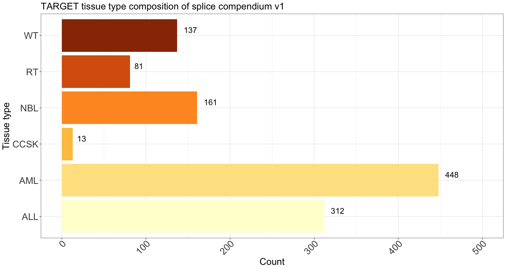

# Summary of samples on splice compendium v1
Cindy Liang (celiang@ucsc.edu)
2026-08-09

## Introduction

Splice compendium v1 contains data from TARGET and GTEx datasets. This
notebook summarizes the distribution of tissue types, demographic
information, and sequencing center of origin information of samples
analyzed in the compendium.

Metadata used for this analysis are:

- [sample_sheet.tsv](https://github.com/UCSC-Treehouse/splicing-compendium/blob/main/config/sample_sheet.tsv):
  Accessions list of samples processed in splice compendium v1. Columns
  include accession ID (“sample”) and dataset (“group”).
- `GTEX_SraRunTable.csv`: metadata file of dbGaP accession IDs
  containing GTEX samples.
- `SraRunTable-TARGET.csv`: metadata file of accession IDs for dbGaP
  samples with the TARGET dataset. Created by downloading the SRA run
  table on dbGaP, with the “phs000218” filter (parent phs ID for TARGET
  dataset)
- [gtex_accessions.tsv](https://github.com/UCSC-Treehouse/splicing-compendium/blob/main/metadata/filter_target_gtex/gtex_accessions.tsv):
  metadata file of GTEX sample accession IDs, along with age, sex of
  donor and tissue type of the sample.
- [target_accessions_clinical.tsv](https://github.com/UCSC-Treehouse/splicing-compendium/blob/celiang/new-clinical-metadata/metadata/filter_target_gtex/target_accessions_clinical.tsv):
  metadata file of TARGET sample accession IDs, along with age, sex of
  donor, cancer type of the sample, and sequencing center of origin of
  the sample.

## Setup

## Read in input and output paths

Read in directory and file paths

``` r
# find the root-level repo directory so we can access the other files
repo_root <- rprojroot::find_root(rprojroot::is_git_root)

# find the project directory (splicing-compendium)
# working directory is in scripts
base_dir <- here::here()

## Directories ##
# define metadata directory
metadata_dir <- file.path(base_dir, "metadata")
gtex_target_metadata_dir <- file.path(metadata_dir, "filter_target_gtex")
# pilot sample metadata dir
pilot_dir <- file.path(metadata_dir, "pilot_shiba_run")

# config directory of compendium
config_dir <- file.path(repo_root, "config")

### Files ##
# gtex dbgap and demographic metadata
gtex_sra_file <- file.path(gtex_target_metadata_dir, "GTEX_SraRunTable.csv")
# metadata containing ages of gtex samples
gtex_ages_file <- file.path(gtex_target_metadata_dir, "GTEx_Analysis_v10_Annotations_SubjectPhenotypesDS.txt")

# target dbgap metadata
target_sra_file <- file.path(gtex_target_metadata_dir, "SraRunTable-TARGET.csv")
# target metadata with age info
target_metadata_file <- file.path(gtex_target_metadata_dir, "target_accessions_clinical.tsv")
# sample sheet of compendium files 
compendium_sample_file <- file.path(config_dir, "sample_sheet.tsv")

# pilot gtex accessions to exclude from summary plots
pilot_gtex_file <- file.path(pilot_dir, "gtex_accessions.tsv")

# output metadata file 
output_combined_metadata_file <- file.path(metadata_dir, "combined_compendium_metadata.tsv")

## Read in files ##
gtex_sra_metadata <- readr::read_csv(
  gtex_sra_file, 
  col_types = readr::cols(
    .default = "c"
  )
) |>
  # ensure subject id column is name the same as demographic metadata
  dplyr::rename(SUBJID = submitted_subject_id)

gtex_demographic_metadata <- readr::read_tsv(
  gtex_ages_file,
  col_types = readr::cols(
    .default = "c"
  )
)

target_sra_metadata <- readr::read_csv(
  target_sra_file,
  col_types = readr::cols(
    .default = "c"
  )
)

target_metadata <- readr::read_tsv(
  target_metadata_file,
  col_types = readr::cols(
    age_at_earliest_diagnosis_in_years.diagnoses.xena_derived = "d",
    age_at_diagnosis_days = "d",
    .default = "c")
)

sample_df <- readr::read_tsv(
  compendium_sample_file,
  col_types = readr::cols(.default = "c")
)

gtex_pilot <- readr::read_tsv(pilot_gtex_file, col_types = readr::cols(.default = "c"))
```

## Filter TARGET and GTEx samples for what’s in the compendium

Check number of expected samples in metadata

``` r
nrow(sample_df)
```

    [1] 2581

2581 samples should be in the final metadata file.

Not all samples filtered for downloading are processed as part of the
compendium due to `fasterq-dump` download issues or the file size being
too large to align in a timely manner.

``` r
# obtain list of accessions in compendium for each group

target_accessions_list <- sample_df |>
  dplyr::filter(group == "target") |>
  dplyr::pull(sample)

gtex_accessions_list <- sample_df |>
  dplyr::filter(group == "gtex") |>
  dplyr::pull(sample)

# Filter target SRA/dbgap metadata to obtain ReleaseDate and version columns
target_sra_cleaned_metadata <- target_sra_metadata |>
  dplyr::select(Run, version, ReleaseDate)

# merge target metadata with cleaned sra metadata columns
target_metadata_with_version <- dplyr::left_join(
  target_sra_cleaned_metadata,
  target_metadata
)
```

    Joining with `by = join_by(Run)`

``` r
# merge GTEx SRA with demographic metadata by accession ID
gtex_sra_ages_df <- gtex_sra_metadata |>
  dplyr::left_join(gtex_demographic_metadata, by = "SUBJID") |>
  dplyr::filter(
    analyte_type == "RNA:Total RNA",
    # filter for paired-end samples
    LibraryLayout == "PAIRED",
    # filter for accessions with fastqs
    stringr::str_detect(`DATASTORE filetype`, "sra")
  )

# filter gtex and target metadata for those corresponding to samples in compendium

target_compendium_df <- target_metadata_with_version |>
  dplyr::filter(Run %in% target_accessions_list) |>
  # the xena browser metadata's "name.project" has the cancer type in a prettier format 
  # (no "TARGET:" prefix) 
  # but since some ALL phase 2 samples were miscategorized as  ALL phase 3 in the xena metadata, 
  # we will use thee study_name column from dbGaP metadata
  dplyr::mutate(
    # add dataset column to facet plots by
    dataset = "target",
    # remove TARGET prefix from study_name values
    study_name = stringr::str_remove(study_name, "^TARGET: ")) |>
  # clean up TARGET metadata by selecting clinically relevant and batch-relevant information
  dplyr::select(
    # fields shared with gtex metadata
    dataset,
    version,
    ReleaseDate,
    Run, # accession ID, same format as GTEx,
    BioSample, # sample-specific accession ID from dbgap
    center_name = `Center Name`, # sequencing center of origin
    sex = gender.demographic, # in "male" / "female" values,
    tissue_type = study_name, # cancer type of sample, to be used in combining columns
    # fields specific to target metadata
    age_at_earliest_diagnosis_in_years.diagnoses.xena_derived, # in continuous floating point numbers, to be binned
    target_patient_id = `_PATIENT`, # ID of patient sample came from - some samples came from the same patient
    # in cases where patient ID is missing, the ID can be derived from the biospecimen sample ID (first three fields separated by hyphens)
    target_biospecimen_sample_id = biospecimen_repository_sample_id, # specific replicate ID for a sample
    # additional demographic info only in target metadata
    target_race = race.demographic,
    target_ethnicity = ethnicity.demographic,
    # clinical metadata specific to target samples
    target_OS = OS,
    target_OS_time = OS.time,
    target_disease_type = disease_type,
    target_project_id = project_id.project,
    target_project_name = name.project,
    target_tumor_class = classification_of_tumor.diagnoses,
    target_primary_diagnosis = primary_diagnosis.diagnoses,
    target_sample_type = sample_type.samples,
    target_tissue_type = tissue_type.samples,
    target_histological_type = histological_type,
    body_site
  )

gtex_compendium_df <- gtex_sra_ages_df |>
  # gtex compendium df contains pilot samples (subset of all tissues) and compendium samples from select tissue types
  dplyr::filter(Run %in% gtex_accessions_list) |>
  dplyr::mutate(
    # add dataset column to facet plots by
    dataset = "gtex"
  ) |>
  # clean up gtex metadata by selecting clinically relevant and batch-relevant information
  dplyr::select(
    # fields shared with target metadata
    dataset,
    Run, # accession ID
    BioSample, # sample-specific accession ID from dbgap
    age_in_years = AGE, # in 10-year bins (characters)
    sex = SEX, # coded as 1 or 2, to be converted to 'male' and 'female'
    center_name = `Center Name`,
    tissue_type = body_site, # tissue type of sample, to be used in combining columns
    version = version, # gtex version of the sample
    ReleaseDate, # release date of sample
    # gtex-specific metadata fields
    gtex_subject_id = SUBJID # ID of the individual the sample came from - some samples come from the same subject
  )
```

Check for duplicates in TARGET metadata

``` r
dup_accessions <- target_compendium_df$Run[duplicated(target_compendium_df$Run)]

target_compendium_df |>
  dplyr::filter(Run %in% dup_accessions) |>
  dplyr::select(
    Run, 
    age_at_earliest_diagnosis_in_years.diagnoses.xena_derived,
    center_name,
    sex)
```

| Run | age_at_earliest_diagnosis_in_years.diagnoses.xena_derived | center_name | sex |
|:---|---:|:---|:---|
| SRR3162212 | 14.290411 | STJUDE | male |
| SRR3162212 | NA | STJUDE | male |
| SRR1791002 | 14.331507 | BCCAGSC | female |
| SRR1791002 | NA | BCCAGSC | female |
| SRR1791034 | 1.783562 | BCCAGSC | male |
| SRR1791034 | NA | BCCAGSC | male |
| SRR1791087 | 8.219178 | BCCAGSC | female |
| SRR1791087 | NA | BCCAGSC | female |

TARGET duplicated accessions are 4 ALL phase 2 samples that are present
in the xena phase 3 metadata, but have no age demographic info.

Merge GTEx and TARGET metadata tables for analysis and unify format of
common column values. GTEx sex information is coded in values of 1 and
2, while TARGET values are in ‘male’ and ‘female’ format. According to
`GTEx_Analysis_v10_Annotations_SampleAttributesDD.xlsx` on the [GTEx
portal metadata download
page](https://gtexportal.org/home/downloads/adult-gtex/metadata), 1 =
Male and 2 = Female.

``` r
# ensure shared column values are in a consistent format before merging
cleaned_target_df <- target_compendium_df |>
   dplyr::mutate(
     # bin TARGET sample age in years into 10 year blocks to make data closer to GTEx representation
     age_in_years = cut(
       age_at_earliest_diagnosis_in_years.diagnoses.xena_derived,
       breaks = seq(0, 100, by = 10),
       left = TRUE,
       right = FALSE,
       labels = c(
         "0-9",
         "10-19",
         "20-29",
         "30-39",
         "40-49",
         "50-59",
         "60-69",
         "70-79",
         "80-89",
         "90-99"
       )
       ),
     tissue_type = stringr::str_replace_all(tissue_type, stringr::fixed("\\"), "")
    ) |>
  # there are 4 TARGET ALL phase 2 samples duplicated as ALL phase 3 with no age information
  # all other TARGET accessions have age info
  # remove these duplicate rows
  dplyr::filter(
    !is.na(age_at_earliest_diagnosis_in_years.diagnoses.xena_derived)
  )

cleaned_gtex_df <- gtex_compendium_df |>
  dplyr::mutate(
    # relabel sex column values according to what they represent
    sex =
      dplyr::case_when(
        sex == 1 ~ "male",
        sex == 2 ~ "female"
  )
  )

merged_compendium_df <- dplyr::bind_rows(
  cleaned_target_df,
  cleaned_gtex_df
)
  
# check number of rows
nrow(merged_compendium_df)
```

    [1] 2581

``` r
# print column names in merged df tom spot-check
colnames(merged_compendium_df)
```

     [1] "dataset"                                                  
     [2] "version"                                                  
     [3] "ReleaseDate"                                              
     [4] "Run"                                                      
     [5] "BioSample"                                                
     [6] "center_name"                                              
     [7] "sex"                                                      
     [8] "tissue_type"                                              
     [9] "age_at_earliest_diagnosis_in_years.diagnoses.xena_derived"
    [10] "target_patient_id"                                        
    [11] "target_biospecimen_sample_id"                             
    [12] "target_race"                                              
    [13] "target_ethnicity"                                         
    [14] "target_OS"                                                
    [15] "target_OS_time"                                           
    [16] "target_disease_type"                                      
    [17] "target_project_id"                                        
    [18] "target_project_name"                                      
    [19] "target_tumor_class"                                       
    [20] "target_primary_diagnosis"                                 
    [21] "target_sample_type"                                       
    [22] "target_tissue_type"                                       
    [23] "target_histological_type"                                 
    [24] "body_site"                                                
    [25] "age_in_years"                                             
    [26] "gtex_subject_id"                                          

Check for duplicates in Run

``` r
duplicated(merged_compendium_df$Run) |> unique()
```

    [1] FALSE

No duplicate accession IDs remain in the metadata. Additionally,
metadata rows match the number of samples in the sample sheet (2581).

Pilot GTEx samples consist of a random subset of all GTEx tissue types
(not just select comparator tissue types). Filter for only GTEx samples
from comparator groups for summary tables and plots.

``` r
# define tissue types within GTEx dataset for TARGET comparators 
tissue_types <- c(
  "Kidney - Cortex",
  "Muscle - Skeletal",
  "Whole Blood",
  "Cells - EBV-transformed lymphocytes"
)

for_summary_gtex_df <- cleaned_gtex_df |>
  dplyr::filter(
    tissue_type %in% tissue_types
      )

for_summary_compendium_df <- dplyr::bind_rows(
  cleaned_target_df,
  for_summary_gtex_df
)

for_summary_compendium_df |>
  dplyr::summarise(
    .by = dataset,
    n = dplyr:: n()
  )
```

| dataset |    n |
|:--------|-----:|
| target  | 1152 |
| gtex    | 1098 |

## Summaries of sample composition of GTEx and TARGET accessions

### Table of number of samples in each GTEx tissue type

Print a table summarizing number of samples in each tissue type in
compendium

``` r
# summarize number of samples in each GTEx tissue type
for_summary_compendium_df |>
  dplyr::filter(dataset == "gtex") |>
  dplyr::group_by(tissue_type) |>
  dplyr::summarise(
    n = dplyr::n()
    )
```

| tissue_type                         |   n |
|:------------------------------------|----:|
| Cells - EBV-transformed lymphocytes | 144 |
| Kidney - Cortex                     |  36 |
| Muscle - Skeletal                   | 462 |
| Whole Blood                         | 456 |

Our curated GTEx compendium dataset is primarily composed of whole blood
(for leukemia comparisons) and skeletal muscle (for soft tissue
comparison) samples.

### Table of number of samples in each TARGET cancer type

``` r
# summarize number of samples in each TARGET tissue type
for_summary_compendium_df |>
  dplyr::filter(dataset == "target") |>
  dplyr::group_by(tissue_type) |>
  dplyr::summarise(
    n = dplyr::n()
    )
```

| tissue_type                                          |   n |
|:-----------------------------------------------------|----:|
| Acute Lymphoblastic Leukemia (ALL) Expansion Phase 2 | 309 |
| Acute Lymphoblastic Leukemia (ALL) Pilot Phase 1     |   3 |
| Acute Myeloid Leukemia (AML)                         | 448 |
| Kidney, Clear Cell Sarcoma of the Kidney (CCSK)      |  13 |
| Kidney, Rhabdoid Tumor (RT)                          |  81 |
| Kidney, Wilms Tumor (WT)                             | 137 |
| Neuroblastoma (NBL)                                  | 161 |

Print a table summarizing number of samples in each age bin in
compendium

### Table of ages in GTEx dataset

``` r
# summarize number of samples in each GTEx tissue type
for_summary_compendium_df |>
  dplyr::filter(dataset == "gtex") |>
  dplyr::group_by(tissue_type, age_in_years) |>
  dplyr::summarise(
    n = dplyr::n()
    )
```

    `summarise()` has regrouped the output.
    ℹ Summaries were computed grouped by tissue_type and age_in_years.
    ℹ Output is grouped by tissue_type.
    ℹ Use `summarise(.groups = "drop_last")` to silence this message.
    ℹ Use `summarise(.by = c(tissue_type, age_in_years))` for per-operation
      grouping (`?dplyr::dplyr_by`) instead.

| tissue_type                         | age_in_years |   n |
|:------------------------------------|:-------------|----:|
| Cells - EBV-transformed lymphocytes | 20-29        |  19 |
| Cells - EBV-transformed lymphocytes | 30-39        |  11 |
| Cells - EBV-transformed lymphocytes | 40-49        |  33 |
| Cells - EBV-transformed lymphocytes | 50-59        |  43 |
| Cells - EBV-transformed lymphocytes | 60-69        |  36 |
| Cells - EBV-transformed lymphocytes | 70-79        |   2 |
| Kidney - Cortex                     | 20-29        |   2 |
| Kidney - Cortex                     | 30-39        |   4 |
| Kidney - Cortex                     | 40-49        |   5 |
| Kidney - Cortex                     | 50-59        |  11 |
| Kidney - Cortex                     | 60-69        |  14 |
| Muscle - Skeletal                   | 20-29        |  44 |
| Muscle - Skeletal                   | 30-39        |  35 |
| Muscle - Skeletal                   | 40-49        |  73 |
| Muscle - Skeletal                   | 50-59        | 153 |
| Muscle - Skeletal                   | 60-69        | 149 |
| Muscle - Skeletal                   | 70-79        |   8 |
| Whole Blood                         | 20-29        |  41 |
| Whole Blood                         | 30-39        |  33 |
| Whole Blood                         | 40-49        |  86 |
| Whole Blood                         | 50-59        | 146 |
| Whole Blood                         | 60-69        | 144 |
| Whole Blood                         | 70-79        |   6 |

### Table of ages in TARGET dataset

``` r
# summarize number of samples in each GTEx tissue type
for_summary_compendium_df |>
  dplyr::filter(dataset == "target") |>
  dplyr::group_by(tissue_type, age_in_years) |>
  dplyr::summarise(
    n = dplyr::n()
    )
```

    `summarise()` has regrouped the output.
    ℹ Summaries were computed grouped by tissue_type and age_in_years.
    ℹ Output is grouped by tissue_type.
    ℹ Use `summarise(.groups = "drop_last")` to silence this message.
    ℹ Use `summarise(.by = c(tissue_type, age_in_years))` for per-operation
      grouping (`?dplyr::dplyr_by`) instead.

| tissue_type                                          | age_in_years |   n |
|:-----------------------------------------------------|:-------------|----:|
| Acute Lymphoblastic Leukemia (ALL) Expansion Phase 2 | 0-9          | 205 |
| Acute Lymphoblastic Leukemia (ALL) Expansion Phase 2 | 10-19        | 101 |
| Acute Lymphoblastic Leukemia (ALL) Expansion Phase 2 | 20-29        |   3 |
| Acute Lymphoblastic Leukemia (ALL) Pilot Phase 1     | 0-9          |   1 |
| Acute Lymphoblastic Leukemia (ALL) Pilot Phase 1     | 10-19        |   2 |
| Acute Myeloid Leukemia (AML)                         | 0-9          | 207 |
| Acute Myeloid Leukemia (AML)                         | 10-19        | 235 |
| Acute Myeloid Leukemia (AML)                         | 20-29        |   6 |
| Kidney, Clear Cell Sarcoma of the Kidney (CCSK)      | 0-9          |  13 |
| Kidney, Rhabdoid Tumor (RT)                          | 0-9          |  80 |
| Kidney, Rhabdoid Tumor (RT)                          | 10-19        |   1 |
| Kidney, Wilms Tumor (WT)                             | 0-9          | 130 |
| Kidney, Wilms Tumor (WT)                             | 10-19        |   7 |
| Neuroblastoma (NBL)                                  | 0-9          | 156 |
| Neuroblastoma (NBL)                                  | 10-19        |   5 |

All TARGET samples have age metadata and are composed primarily of \< 30
year old samples

### Table of sequencing center of origin of GTEx dataset

``` r
for_summary_compendium_df |>
  dplyr::filter(dataset == "gtex") |>
  dplyr::summarise(
    .by = c(tissue_type, center_name),
    n = dplyr::n()
  )
```

| tissue_type                         | center_name     |   n |
|:------------------------------------|:----------------|----:|
| Muscle - Skeletal                   | BI              | 460 |
| Whole Blood                         | BI              | 446 |
| Cells - EBV-transformed lymphocytes | BI              | 136 |
| Kidney - Cortex                     | BI              |  36 |
| Whole Blood                         | Broad Institute |  10 |
| Cells - EBV-transformed lymphocytes | Broad Institute |   8 |
| Muscle - Skeletal                   | Broad Institute |   2 |

“BI” stands for Broad Institute; all GTEx samples originate from the
same sequencing center.

### Table of sequencing center of origin of TARGET dataset

``` r
for_summary_compendium_df |>
  dplyr::filter(dataset == "target") |>
  dplyr::summarise(
    .by = c(tissue_type, center_name),
    n = dplyr::n()
  )
```

| tissue_type                                          | center_name |   n |
|:-----------------------------------------------------|:------------|----:|
| Acute Lymphoblastic Leukemia (ALL) Expansion Phase 2 | BCCAGSC     | 304 |
| Acute Lymphoblastic Leukemia (ALL) Expansion Phase 2 | STJUDE      |   5 |
| Acute Lymphoblastic Leukemia (ALL) Pilot Phase 1     | STJUDE      |   3 |
| Acute Myeloid Leukemia (AML)                         | HAIB        |  66 |
| Acute Myeloid Leukemia (AML)                         | BCCAGSC     | 382 |
| Kidney, Clear Cell Sarcoma of the Kidney (CCSK)      | NCI-KHAN    |  13 |
| Kidney, Wilms Tumor (WT)                             | BCCAGSC     | 137 |
| Kidney, Rhabdoid Tumor (RT)                          | BCCAGSC     |  81 |
| Neuroblastoma (NBL)                                  | NCI-KHAN    | 161 |

TARGET samples come from multiple different sequencing centers. In
particular, ALL Phase 2 and AML samples come from two different
sequencing centers.

### Table of versions and release dates in GTEx dataset

``` r
for_summary_compendium_df |>
  dplyr::filter(dataset == "gtex") |>
  dplyr::summarise(
    .by = c(tissue_type, version),
    n = dplyr::n()
  )
```

| tissue_type                         | version |   n |
|:------------------------------------|:--------|----:|
| Muscle - Skeletal                   | 2       | 449 |
| Whole Blood                         | 2       | 429 |
| Cells - EBV-transformed lymphocytes | 2       | 131 |
| Kidney - Cortex                     | 3       |   2 |
| Kidney - Cortex                     | 2       |  34 |
| Whole Blood                         | 3       |  17 |
| Cells - EBV-transformed lymphocytes | 3       |   5 |
| Muscle - Skeletal                   | 3       |  11 |
| Whole Blood                         | 1       |  10 |
| Cells - EBV-transformed lymphocytes | 1       |   8 |
| Muscle - Skeletal                   | 1       |   2 |

All GTEx tissue types in the compendium come from multiple versions.

### Table of versions and release dates in TARGET dataset

``` r
for_summary_compendium_df |>
  dplyr::filter(dataset == "target") |>
  dplyr::summarise(
    .by = c(tissue_type, version),
    n = dplyr::n()
  )
```

| tissue_type                                          | version |   n |
|:-----------------------------------------------------|:--------|----:|
| Acute Lymphoblastic Leukemia (ALL) Expansion Phase 2 | 1       | 307 |
| Acute Lymphoblastic Leukemia (ALL) Expansion Phase 2 | 2       |   2 |
| Acute Lymphoblastic Leukemia (ALL) Pilot Phase 1     | 1       |   3 |
| Acute Myeloid Leukemia (AML)                         | 1       | 448 |
| Kidney, Clear Cell Sarcoma of the Kidney (CCSK)      | 1       |  13 |
| Kidney, Wilms Tumor (WT)                             | 1       | 137 |
| Kidney, Rhabdoid Tumor (RT)                          | 1       |  81 |
| Neuroblastoma (NBL)                                  | 3       |  32 |
| Neuroblastoma (NBL)                                  | 1       | 128 |
| Neuroblastoma (NBL)                                  | 2       |   1 |

ALL Phase 2 and neuroblastoma samples in the compendium come from
multiple versions.

## Prep TARGET dataframe for plot

Combine ALL phase 1 and 2 categories for plotting

Additionally, create shorter tissue type names for plotting

``` r
for_plot_target_df <- cleaned_target_df |>
  dplyr::mutate(
    plot_tissue_type = dplyr::case_when(
      tissue_type == "Acute Lymphoblastic Leukemia (ALL) Expansion Phase 2" | 
        tissue_type == "Acute Lymphoblastic Leukemia (ALL) Pilot Phase 1" ~
        "ALL",
      tissue_type == "Acute Myeloid Leukemia (AML)" ~ "AML",
      tissue_type == "Kidney, Clear Cell Sarcoma of the Kidney (CCSK)" ~ "CCSK",
      tissue_type == "Kidney, Wilms Tumor (WT)" ~ "WT",
      tissue_type == "Kidney, Rhabdoid Tumor (RT)" ~ "RT",
      tissue_type == "Neuroblastoma (NBL)" ~ "NBL"
    )
  )
```

## Plot sample composition of v1 compendium

``` r
ggplot(for_plot_target_df, aes(y = plot_tissue_type, fill = plot_tissue_type)) +
  geom_bar() +
  labs(title = "TARGET tissue type composition of splice compendium v1", 
        y = "Tissue type", 
        x = "Count") +
  # manually add to ylim so that there is space for over-bar labels
  xlim(0, 500) +
  plot_theme +
  theme(
    # make facet labels bigger
    strip.text.x = element_text(size = global_size - 2),
    strip.text.y = element_text(size = global_size),
    axis.text.x = element_text(angle = 45),
    legend.position = "none"
    ) +
    # add N observations to bars
    geom_text(
      # count number of observations in each tissue type
      stat = "count",
      aes(label = paste0(after_stat(count))), 
      hjust = -0.5,
      vjust = -0.5,
      size = global_size - 14
    ) +
  scale_fill_brewer(palette = "YlOrBr")
```

<div id="fig-target_sample_dist_bar">



Figure 1

</div>

## Write output

``` r
readr::write_tsv(merged_compendium_df, output_combined_metadata_file)
```

## Print session info

``` r
sessionInfo()
```

    R version 4.4.3 (2025-02-28)
    Platform: aarch64-apple-darwin20
    Running under: macOS 26.5.2

    Matrix products: default
    BLAS:   /Library/Frameworks/R.framework/Versions/4.4-arm64/Resources/lib/libRblas.0.dylib 
    LAPACK: /Library/Frameworks/R.framework/Versions/4.4-arm64/Resources/lib/libRlapack.dylib;  LAPACK version 3.12.0

    locale:
    [1] en_US.UTF-8/en_US.UTF-8/en_US.UTF-8/C/en_US.UTF-8/en_US.UTF-8

    time zone: America/Los_Angeles
    tzcode source: internal

    attached base packages:
    [1] stats     graphics  grDevices utils     datasets  methods   base     

    other attached packages:
    [1] patchwork_1.3.2 ggplot2_4.0.3  

    loaded via a namespace (and not attached):
     [1] bit_4.6.0          gtable_0.3.6       jsonlite_2.0.0     crayon_1.5.3      
     [5] dplyr_1.2.1        compiler_4.4.3     tidyselect_1.2.1   stringr_1.6.0     
     [9] parallel_4.4.3     scales_1.4.0       yaml_2.3.12        fastmap_1.2.0     
    [13] here_1.0.2         readr_2.2.0        R6_2.6.1           labeling_0.4.3    
    [17] generics_0.1.4     knitr_1.51         tibble_3.3.1       rprojroot_2.1.1   
    [21] pillar_1.11.1      RColorBrewer_1.1-3 tzdb_0.5.0         rlang_1.3.0       
    [25] stringi_1.8.7      xfun_0.60          S7_0.2.2           bit64_4.8.2       
    [29] otel_0.2.0         cli_3.6.6          withr_3.0.3        magrittr_2.0.5    
    [33] digest_0.6.39      grid_4.4.3         vroom_1.7.1        rstudioapi_0.18.0 
    [37] hms_1.1.4          lifecycle_1.0.5    vctrs_0.7.3        evaluate_1.0.5    
    [41] glue_1.8.1         farver_2.1.2       rmarkdown_2.31     tools_4.4.3       
    [45] pkgconfig_2.0.3    htmltools_0.5.9   
