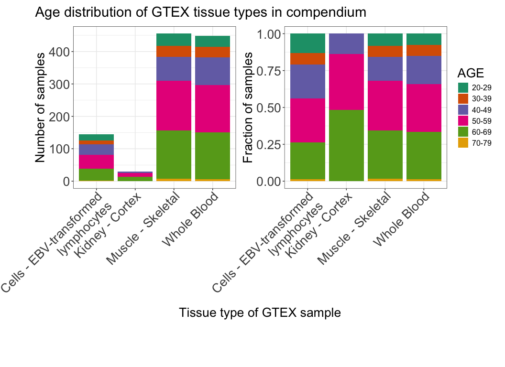
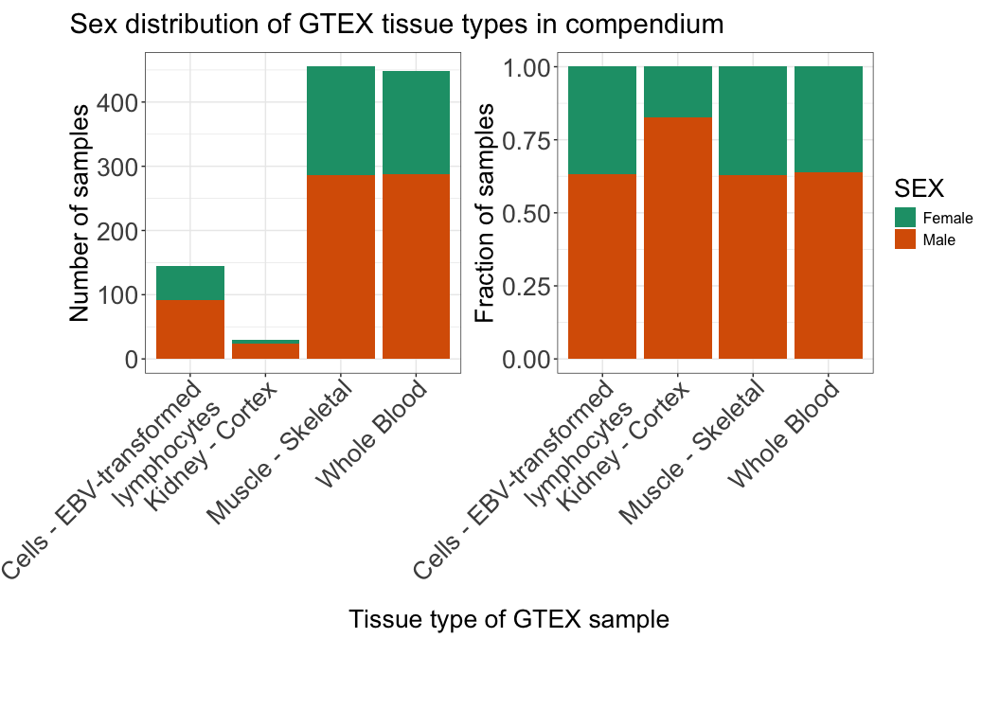

# Summary of samples on splice compendium v1
Cindy Liang (celiang@ucsc.edu)
2026-07-23

## Introduction

Splice compendium v1 contains data from TARGET and GTEx datasets. This
notebook summarizes the distribution of tissue types, age, sex, and
sequencing center of origin information of samples analyzed in the
compendium.

Metadata used for this analysis are:

- [sample_sheet.tsv](https://github.com/UCSC-Treehouse/splicing-compendium/blob/main/config/sample_sheet.tsv):
  Accessions list of samples processed in splice compendium v1. Columns
  include accession ID (“sample”) and dataset (“group”).
- [gtex_accessions.tsv](https://github.com/UCSC-Treehouse/splicing-compendium/blob/main/metadata/filter_target_gtex/gtex_accessions.tsv):
  metadata file of GTEX sample accession IDs, along with age, sex of
  donor and tissue type of the sample.
- [target_accessions_clinical.tsv](https://github.com/UCSC-Treehouse/splicing-compendium/blob/celiang/new-clinical-metadata/metadata/filter_target_gtex/target_accessions_clinical.tsv):
  metadata file of TARGET sample accession IDs, along with age, sex of
  donor, cancer type of the sample, and sequencing center of origin of
  the sample.

## Setup

## Define functions

``` r
## GTEx stacked sample summary plots ##
gtex_sample_summary_plots <- function(df, fill_value, y_value, title_value) {
  frac_plot <- ggplot(df, aes(
    fill = .data[[fill_value]], 
    x = body_site, 
    y = .data[[y_value]])
    ) +
  geom_bar(position = "fill", stat = "identity") +
  scale_fill_brewer(palette = "Dark2") +
  plot_theme +
  labs(
    x = "Tissue type of GTEX sample",
    y = "Fraction of samples"
  ) +
  scale_x_discrete(guide = guide_axis(angle = 45),
                   labels = function(x){stringr::str_wrap(x, 30)}) 

  number_plot <- ggplot(df, aes(
    fill = .data[[fill_value]], 
    x = body_site, 
    y = .data[[y_value]]
    )
    ) +
    geom_bar(position = "stack", stat = "identity") +
    scale_fill_brewer(palette = "Dark2") +
    plot_theme +
    labs(
      x = "Tissue type of GTEX sample",
      y = "Number of samples"
    ) +
    scale_x_discrete(guide = guide_axis(angle = 45), 
                     labels = function(x){stringr::str_wrap(x, 30)}) 
  
  # Print plots together
  combined_plot <- number_plot +
    frac_plot +
      plot_annotation(
        title = title_value,
        theme = theme(plot.title = element_text(size = 22),
                      plot.margin = margin(t = 10, r = 10, b = 70, l = 50)
      )
      )
  # print plots side by side and use same x axes label, legend  
  combined_plot + plot_layout(guides = "collect") + plot_layout(axes = "collect")
}
```

## Read in input and output paths

Read in directory and file paths

``` r
# find the root-level repo directory so we can access the other files
repo_root <- rprojroot::find_root(rprojroot::is_git_root)

# find the project directory (splicing-compendium)
# working directory is in scripts
base_dir <- here::here()

## Directories ##
# define metadata directory
metadata_dir <- file.path(base_dir, "metadata")
gtex_target_metadata_dir <- file.path(metadata_dir, "filter_target_gtex")

# config directory of compendium
config_dir <- file.path(repo_root, "config")

### Files ##
# gtex metadata with age info
gtex_metadata_file <- file.path(gtex_target_metadata_dir, "gtex_accessions.tsv")
# target metadata with age info
target_metadata_file <- file.path(gtex_target_metadata_dir, "target_accessions_clinical.tsv")
# sample sheet of compendium files 
compendium_sample_file <- file.path(config_dir, "sample_sheet.tsv")

## Read in files ##
gtex_metadata <- readr::read_tsv(
  gtex_metadata_file, 
  col_types = readr::cols(Bytes = "d", 
                          .default = "c")
)

target_metadata <- readr::read_tsv(
  target_metadata_file,
  col_types = readr::cols(age_at_earliest_diagnosis_in_years.diagnoses.xena_derived = "d",
  .default = "c")
)

sample_df <- readr::read_tsv(
  compendium_sample_file,
  col_types = readr::cols(.default = "c")
)
```

## Filter TARGET and GTEx samples for what’s in the compendium

Not all samples filtered for downloading made it to the compendium due
to `fasterq-dump` download issues or the file size being too large to
align in a timely manner.

``` r
# obtain list of accessions in compendium for each group

target_accessions_list <- sample_df |>
  dplyr::filter(group == "target") |>
  dplyr::pull(sample)

gtex_accessions_list <- sample_df |>
  dplyr::filter(group == "gtex") |>
  dplyr::pull(sample)

# filter gtex and target metadata for those corresponding to samples in compendium

target_compendium_df <- target_metadata |>
  dplyr::filter(Run %in% target_accessions_list) |>
  # the xena browser metadata's "name.project" has the cancer type in a prettier format 
  # (no "TARGET:" prefix) 
  # but since some ALL phase 2 samples were in ALL phase 3 xena metadata , use study_name column from dbGaP metadata
  # Remove "TARGET:" prefix for ease of reading
  dplyr::mutate(
    # remove TARGET prefix from study_name values
    study_name = stringr::str_remove(study_name, "TARGET: "))

gtex_compendium_df <- gtex_metadata |>
  dplyr::filter(Run %in% gtex_accessions_list)
```

## Summarize sample composition of GTEx accessions

### Table of number of samples in each tissue type

Print a table summarizing number of samples in each tissue type in
compendium

``` r
# summarize number of samples in each tissue type
gtex_compendium_df |>
  dplyr::group_by(body_site) |>
  dplyr::summarise(
    n = dplyr::n()
    )
```

| body_site                           |   n |
|:------------------------------------|----:|
| Cells - EBV-transformed lymphocytes | 144 |
| Kidney - Cortex                     |  29 |
| Muscle - Skeletal                   | 455 |
| Whole Blood                         | 449 |

Our curated GTEx compendium dataset is primarily composed of whole blood
(for leukemia comparisons) and skeletal muscle (for soft tissue
comparison) samples.

### Table of age distribution for the GTEx samples in the compendium

Print a table of the age distribution breakdown of GTEx compendium
samples

``` r
# Summarize number of samples per tissue type in each age bracket
gtex_ages_summary <- gtex_compendium_df |>
  dplyr::group_by(body_site, AGE) |>
  dplyr::summarise(age_count = dplyr::n())
```

    `summarise()` has regrouped the output.
    ℹ Summaries were computed grouped by body_site and AGE.
    ℹ Output is grouped by body_site.
    ℹ Use `summarise(.groups = "drop_last")` to silence this message.
    ℹ Use `summarise(.by = c(body_site, AGE))` for per-operation grouping
      (`?dplyr::dplyr_by`) instead.

``` r
gtex_ages_summary
```

| body_site                           | AGE   | age_count |
|:------------------------------------|:------|----------:|
| Cells - EBV-transformed lymphocytes | 20-29 |        19 |
| Cells - EBV-transformed lymphocytes | 30-39 |        11 |
| Cells - EBV-transformed lymphocytes | 40-49 |        33 |
| Cells - EBV-transformed lymphocytes | 50-59 |        43 |
| Cells - EBV-transformed lymphocytes | 60-69 |        36 |
| Cells - EBV-transformed lymphocytes | 70-79 |         2 |
| Kidney - Cortex                     | 40-49 |         4 |
| Kidney - Cortex                     | 50-59 |        11 |
| Kidney - Cortex                     | 60-69 |        14 |
| Muscle - Skeletal                   | 20-29 |        37 |
| Muscle - Skeletal                   | 30-39 |        35 |
| Muscle - Skeletal                   | 40-49 |        73 |
| Muscle - Skeletal                   | 50-59 |       153 |
| Muscle - Skeletal                   | 60-69 |       149 |
| Muscle - Skeletal                   | 70-79 |         8 |
| Whole Blood                         | 20-29 |        34 |
| Whole Blood                         | 30-39 |        33 |
| Whole Blood                         | 40-49 |        86 |
| Whole Blood                         | 50-59 |       146 |
| Whole Blood                         | 60-69 |       144 |
| Whole Blood                         | 70-79 |         6 |

As expected, there is a small fraction of filtered GTEx samples under
the PEDAYA (\< 30 years) category. A future addition of value for the
compendium will be to include tissue samples from the developmental GTEx
project.

### Plot of age distribution of GTEx samples in compendium

``` r
gtex_sample_summary_plots(gtex_ages_summary, "AGE", "age_count", "Age distribution of GTEX tissue types in compendium") 
```

<div id="fig-compendium_gtex_age_stacked_bar">



Figure 1

</div>

### Table of sex distribution of compendium GTEx samples

``` r
# summarize number of samples in each tissue type of a specific sex
gtex_sex_summary <- gtex_compendium_df |>
  # relabel sex column values according to what they represent
  dplyr::mutate(SEX = 
                  dplyr::case_when(
                   SEX == 1 ~ "Male",
                   SEX == 2 ~ "Female"
                  )) |>
  dplyr::group_by(body_site, SEX) |>
  dplyr::summarise(
    n = dplyr::n()
    )
```

    `summarise()` has regrouped the output.
    ℹ Summaries were computed grouped by body_site and SEX.
    ℹ Output is grouped by body_site.
    ℹ Use `summarise(.groups = "drop_last")` to silence this message.
    ℹ Use `summarise(.by = c(body_site, SEX))` for per-operation grouping
      (`?dplyr::dplyr_by`) instead.

``` r
gtex_sex_summary
```

| body_site                           | SEX    |   n |
|:------------------------------------|:-------|----:|
| Cells - EBV-transformed lymphocytes | Female |  53 |
| Cells - EBV-transformed lymphocytes | Male   |  91 |
| Kidney - Cortex                     | Female |   5 |
| Kidney - Cortex                     | Male   |  24 |
| Muscle - Skeletal                   | Female | 169 |
| Muscle - Skeletal                   | Male   | 286 |
| Whole Blood                         | Female | 162 |
| Whole Blood                         | Male   | 287 |

### Plot of sex distribution of GTEx samples in compendium

``` r
gtex_sample_summary_plots(gtex_sex_summary, "SEX", "n", "Sex distribution of GTEX tissue types in compendium") 
```

<div id="fig-compendium_gtex_sex_stacked_bar">



Figure 2

</div>

All GTEx tissue types in the compendium have higher male representation
than female representation.

### Table of sequencing center of origin for compendium GTEx samples

Print a table of the breakdown of what sequencing center the tissue
types are sequenced from. This information is for checking what sorts of
batch effects may be expected within tissue types.

``` r
# summarize number of samples in each tissue type come from what sequencing center
gtex_compendium_df |>
  dplyr::group_by(body_site, `Center Name`) |>
  dplyr::summarise(
    n = dplyr::n()
    )
```

    `summarise()` has regrouped the output.
    ℹ Summaries were computed grouped by body_site and Center Name.
    ℹ Output is grouped by body_site.
    ℹ Use `summarise(.groups = "drop_last")` to silence this message.
    ℹ Use `summarise(.by = c(body_site, Center Name))` for per-operation grouping
      (`?dplyr::dplyr_by`) instead.

| body_site                           | Center Name     |   n |
|:------------------------------------|:----------------|----:|
| Cells - EBV-transformed lymphocytes | BI              | 136 |
| Cells - EBV-transformed lymphocytes | Broad Institute |   8 |
| Kidney - Cortex                     | BI              |  29 |
| Muscle - Skeletal                   | BI              | 453 |
| Muscle - Skeletal                   | Broad Institute |   2 |
| Whole Blood                         | BI              | 439 |
| Whole Blood                         | Broad Institute |  10 |

All tissue types in the GTEx datasets come from the same sequencing
center.

## Summarize sample composition of TARGET accessions in compendium

### Table of number of samples in each cancer type

Print a table summarizing number of samples in each cancer type in
compendium

``` r
# summarize number of samples in each tissue type
target_compendium_df |>
  dplyr::group_by(study_name) |>
  dplyr::summarise(
    n = dplyr::n()
    )
```

| study_name                                           |   n |
|:-----------------------------------------------------|----:|
| Acute Lymphoblastic Leukemia (ALL) Expansion Phase 2 | 313 |
| Acute Lymphoblastic Leukemia (ALL) Pilot Phase 1     |   3 |
| Acute Myeloid Leukemia (AML)                         | 448 |
| Kidney, Clear Cell Sarcoma of the Kidney (CCSK)      |  13 |
| Kidney, Rhabdoid Tumor (RT)                          |  81 |
| Kidney, Wilms Tumor (WT)                             | 137 |
| Neuroblastoma (NBL)                                  | 161 |

``` r
sessionInfo()
```

    R version 4.4.3 (2025-02-28)
    Platform: aarch64-apple-darwin20
    Running under: macOS 26.5.2

    Matrix products: default
    BLAS:   /Library/Frameworks/R.framework/Versions/4.4-arm64/Resources/lib/libRblas.0.dylib 
    LAPACK: /Library/Frameworks/R.framework/Versions/4.4-arm64/Resources/lib/libRlapack.dylib;  LAPACK version 3.12.0

    locale:
    [1] en_US.UTF-8/en_US.UTF-8/en_US.UTF-8/C/en_US.UTF-8/en_US.UTF-8

    time zone: America/Los_Angeles
    tzcode source: internal

    attached base packages:
    [1] stats     graphics  grDevices utils     datasets  methods   base     

    other attached packages:
    [1] patchwork_1.3.2 ggplot2_4.0.3  

    loaded via a namespace (and not attached):
     [1] bit_4.6.0          gtable_0.3.6       jsonlite_2.0.0     crayon_1.5.3      
     [5] dplyr_1.2.1        compiler_4.4.3     tidyselect_1.2.1   stringr_1.6.0     
     [9] parallel_4.4.3     scales_1.4.0       yaml_2.3.12        fastmap_1.2.0     
    [13] here_1.0.2         readr_2.2.0        R6_2.6.1           labeling_0.4.3    
    [17] generics_0.1.4     knitr_1.51         tibble_3.3.1       rprojroot_2.1.1   
    [21] pillar_1.11.1      RColorBrewer_1.1-3 tzdb_0.5.0         rlang_1.3.0       
    [25] stringi_1.8.7      xfun_0.60          S7_0.2.2           bit64_4.8.2       
    [29] otel_0.2.0         cli_3.6.6          withr_3.0.3        magrittr_2.0.5    
    [33] digest_0.6.39      grid_4.4.3         vroom_1.7.1        rstudioapi_0.18.0 
    [37] hms_1.1.4          lifecycle_1.0.5    vctrs_0.7.3        evaluate_1.0.5    
    [41] glue_1.8.1         farver_2.1.2       rmarkdown_2.31     tools_4.4.3       
    [45] pkgconfig_2.0.3    htmltools_0.5.9   
