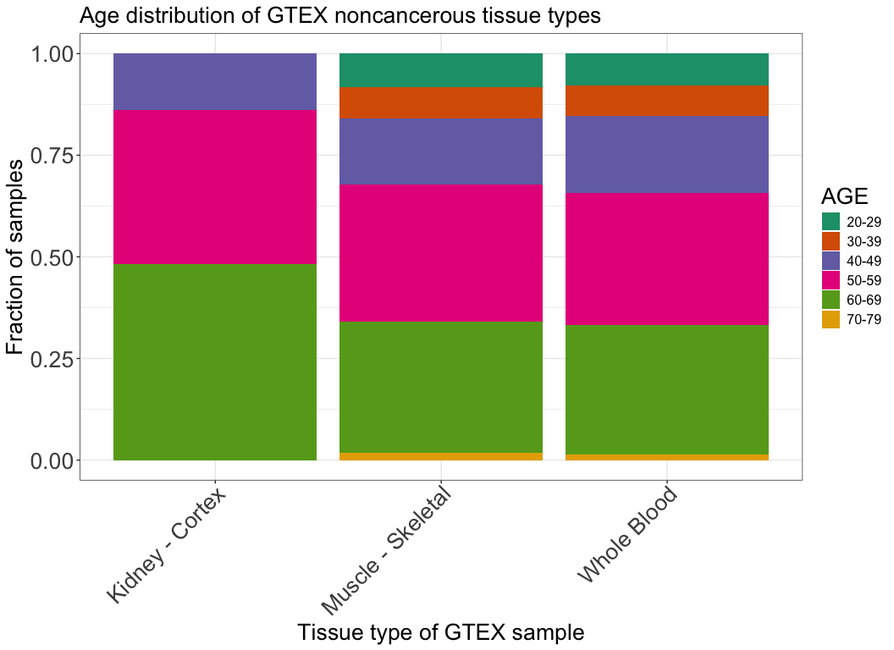

# Filtering GTEX samples from SRA
Cindy Liang (celiang@ucsc.edu)
2026-04-21

## Introduction

The goals of this notebook are to filter the following SRA tables for
files to download:

- GTEx SRA table and metadata matching ages to subject IDs

Additionally, this notebook obtains an estimate of how much space files
will take up. There is 2.64Tb of free space on the huge OpenStack
instance.

Metadata used for this analysis are:

- `GTEX_SraRunTable.csv`, metadata file of dbGaP accession IDs
  containing GTEX samples.
- `GTEx_Analysis_v10_Annotations_SubjectPhenotypesDS.txt`, public
  annotation file consisting of GTEX sample IDs and their ages in
  10-year brackets, obtained from
  <https://storage.googleapis.com/adult-gtex/annotations/v10/metadata-files/GTEx_Analysis_v10_Annotations_SubjectPhenotypesDS.txt>
  , which is accessible by clicking the download icon next to
  “GTEx_Analysis_v10_Annotations_SubjectPhenotypesDS.txt” on the [GTEx
  v10 metadata
  page](https://gtexportal.org/home/downloads/adult-gtex/metadata). The
  download command for this is in
  `data/scripts/00-reference_download.sh`.
- `metadata/pilot_shiba_run/gtex_accessions.tsv` accessions file of GTEx
  sequences downloaded and analyzed from the pilot Shiba run, to exclude
  from the final list of accessions to download.

## Setup

## Read in input and output paths

Read in directory and file paths

``` r
# find the project directory (splicing-compendium)
# working directory is in scripts
base_dir <- here::here()
# define metadata directory
metadata_dir <- file.path(base_dir, "metadata")
pilot_dir <- file.path(metadata_dir, "pilot_shiba_run")
gtex_target_metadata_dir <- file.path(metadata_dir, "filter_target_gtex")

# define paths to input files
gtex_sra_file <- file.path(gtex_target_metadata_dir, "GTEX_SraRunTable.csv")
# metadata containing ages of gtex samples
gtex_ages_file <- file.path(gtex_target_metadata_dir, "GTEx_Analysis_v10_Annotations_SubjectPhenotypesDS.txt")
# pilot gtex accessions to exclude
pilot_gtex_file <- file.path(pilot_dir, "gtex_accessions.tsv")
# list of muscle gtex accessions that have already been downloaded to exclude
gtex_muscle_accessions <- file.path(gtex_target_metadata_dir, "downloaded_gtex_muscle_ids.txt") 
# define path to output files
gtex_accession_path <- file.path(gtex_target_metadata_dir, "gtex_accessions.tsv")

# read in files
gtex_sra <- readr::read_csv(gtex_sra_file, col_types = readr::cols(Bytes = "d", .default = "c")) |>
  dplyr::rename(SUBJID = submitted_subject_id)
gtex_ages <- readr::read_tsv(gtex_ages_file, col_types = readr::cols(.default = "c"))
gtex_pilot <- readr::read_tsv(pilot_gtex_file, col_types = readr::cols(.default = "c"))
gtex_muscle_to_exclude <- readr::read_tsv(gtex_muscle_accessions, col_names = FALSE)
```

    Rows: 46 Columns: 1
    ── Column specification ────────────────────────────────────────────────────────
    Delimiter: "\t"
    chr (1): X1

    ℹ Use `spec()` to retrieve the full column specification for this data.
    ℹ Specify the column types or set `show_col_types = FALSE` to quiet this message.

## Filtering GTEx samples for download

Combine GTEx age table with GTEx accessions so that we can check how
many samples of each age bracket are represented by each tumor type
after filtering

``` r
# Define tissue types of interest
# kidney, muscle, and blood samples
tissue_types <- c(
  "Kidney - Cortex",
  "Muscle - Skeletal",
  "Whole Blood"
)

# Merge GTEx SRA table with ages metadata to associate IDs with ages
# then filter tables for our criteria (RNA, paired-end, select tissue types)
gtex_sra_ages <- gtex_sra |>
  dplyr::left_join(gtex_ages, by = "SUBJID") |>
  dplyr::filter(
    analyte_type == "RNA:Total RNA",
    # Exclude cell line samples
    !grepl("Cells", body_site),
    # filter for paired-end samples
    LibraryLayout == "PAIRED",
    # filter for tissue types in select list
    body_site %in% tissue_types,
    # filter for accessions with fastqs
    stringr::str_detect(`DATASTORE filetype`, "sra"),
    # exclude accessions already processed from pilot
    !Run %in% gtex_pilot$Run,
    # exclude accessions of muscle samples that are already downloaded
    !Run %in% gtex_muscle_to_exclude
  ) |>
  dplyr::select(AGE, Run, body_site, Bytes, SUBJID, BioProject, BioSample, `SRA Study`, LibraryLayout, version, create_date, ReleaseDate, `DATASTORE filetype`, LibrarySelection, `Center Name`)

dim(gtex_sra_ages)
```

    [1] 952  15

Check library selection method of GTEx samples that are paired:

``` r
unique(gtex_sra_ages$LibrarySelection)
```

    [1] "cDNA"

The metadata says cDNA, but the [GTEx
methods](https://www.gtexportal.org/home/methods) site says all their
versions are polyA selected.

### Check GTEx versions in filtered samples

GTEx v8 and above are also [only accessible on
anvil](https://www.gtexportal.org/home/protectedDataAccess). We must
filter out samples that come from GTEx v8 and above.

Check number of samples in each GTEx version after filtering.

``` r
gtex_sra_ages |>
  dplyr::group_by(version) |>
  dplyr::summarise(version_count = dplyr::n())
```

| version | version_count |
|:--------|--------------:|
| 1       |            15 |
| 2       |           906 |
| 3       |            31 |

Only versions up to 3 are recorded in these samples.

The release date for version 8p2 is 2019-07-18
([source](https://www.ncbi.nlm.nih.gov/projects/gap/cgi-bin/study.cgi?study_id=phs000424.v8.p2)),
so these values represent samples from later versions that are only
accessible on AnVIL. We should filter out samples with release dates
greater than or equal to 2018.

``` r
gtex_sra_ages |>
  dplyr::mutate(ReleaseDate = stringr::str_remove(ReleaseDate, "-.*")) |>
  dplyr::group_by(ReleaseDate) |>
  dplyr::summarise(date_count = dplyr::n())
```

| ReleaseDate | date_count |
|:------------|-----------:|
| 2012        |        117 |
| 2013        |        202 |
| 2014        |        610 |
| 2015        |         11 |
| 2016        |         12 |

All 973 filtered GTEx samples should be downloadable outside of AnVIL
because their release dates are below 2018.

Estimate amount of space filtered GTEx samples will take up

``` r
# estimate amount of space files will take up
gtex_sra_ages_space <- (sum(gtex_sra_ages$Bytes) / 1e12)
paste0("About ", gtex_sra_ages_space, " terabytes of space will be taken up by file downloads.")
```

    [1] "About 3.936128535992 terabytes of space will be taken up by file downloads."

### Plot sample composition of filtered GTEx accessions

Plot distribution of ages in the filtered GTEx samples as a percent
stacked bar plot.

``` r
# Summarize number of samples per tissue type in each age bracket
gtex_ages_summary <- gtex_sra_ages |>
  dplyr::group_by(body_site, AGE) |>
  dplyr::summarise(age_count = dplyr::n())
```

    `summarise()` has regrouped the output.
    ℹ Summaries were computed grouped by body_site and AGE.
    ℹ Output is grouped by body_site.
    ℹ Use `summarise(.groups = "drop_last")` to silence this message.
    ℹ Use `summarise(.by = c(body_site, AGE))` for per-operation grouping
      (`?dplyr::dplyr_by`) instead.

``` r
ggplot(gtex_ages_summary, aes(fill = AGE, x = body_site, y = age_count)) +
  geom_bar(position = "fill", stat = "identity") +
  scale_fill_brewer(palette = "Dark2") +
  plot_theme +
  labs(
    title = "Age distribution of GTEX noncancerous tissue types",
    x = "Tissue type of GTEX sample",
    y = "Fraction of samples"
  ) +
  scale_x_discrete(guide = guide_axis(angle = 45)) +
  plot_theme
```

<div id="fig-gtex_age_dist_stacked_bar">



Figure 1

</div>

As expected, there is a very small fraction of filtered GTEx samples
under the PEDAYA (\< 30 years) category.

Check breakdown of what sequencing center the tissue types are sequenced
from

``` r
# summarize number of samples in each tissue type come from what sequencing center
gtex_sra_ages |>
  dplyr::group_by(body_site, `Center Name`) |>
  dplyr::summarise(
    n = dplyr::n()
    )
```

    `summarise()` has regrouped the output.
    ℹ Summaries were computed grouped by body_site and Center Name.
    ℹ Output is grouped by body_site.
    ℹ Use `summarise(.groups = "drop_last")` to silence this message.
    ℹ Use `summarise(.by = c(body_site, Center Name))` for per-operation grouping
      (`?dplyr::dplyr_by`) instead.

| body_site         | Center Name     |   n |
|:------------------|:----------------|----:|
| Kidney - Cortex   | BI              |  29 |
| Muscle - Skeletal | BI              | 465 |
| Muscle - Skeletal | Broad Institute |   2 |
| Whole Blood       | BI              | 446 |
| Whole Blood       | Broad Institute |  10 |

All samples appear to come from the Broad Institute.

Print table of the number of samples in all tissue types in the filtered
GTEx set

``` r
gtex_sra_ages |>
  dplyr::group_by(body_site) |>
  dplyr::summarize(n_samples = dplyr::n())
```

| body_site         | n_samples |
|:------------------|----------:|
| Kidney - Cortex   |        29 |
| Muscle - Skeletal |       467 |
| Whole Blood       |       456 |

## Divide GTEx accessions into groups of 1.2TB samples

For partitioning data onto OpenStack instances, we need to divide the
accessions based on how much space they will take up. So that there will
be enough space for holding raw fastqs and alignments, we will aim to
download a little under half the available space on the huge OpenStack
instance (~1.2TB)

``` r
# define target sum of data
max_tb <- 1.2

gtex_select_batched <- gtex_sra_ages |>
  dplyr::mutate(
    # calculate cumulative sum of Bytes column
    cumulative_tb = cumsum(Bytes) / 1e12,
    # assign batch number of data by dividing cumulative tb by max tb of interest and round to nearest integer
    batch_id = ceiling(cumulative_tb / 1.2)
  ) 
```

Summarize number of accessions in each batch

``` r
gtex_select_batched |>
  dplyr::summarise(
    .by = batch_id,
    n = dplyr::n()
  )
```

| batch_id |   n |
|---------:|----:|
|        1 | 343 |
|        2 | 289 |
|        3 | 265 |
|        4 |  55 |

### Export filtered GTEX accession file

``` r
# Move run ID to first column, like in TARGET accessions file
gtex_select <- gtex_select_batched |>
  dplyr::relocate(Run)

readr::write_tsv(gtex_select, file = gtex_accession_path)
```

Print session info

``` r
sessionInfo()
```

    R version 4.4.3 (2025-02-28)
    Platform: aarch64-apple-darwin20
    Running under: macOS 26.4.1

    Matrix products: default
    BLAS:   /Library/Frameworks/R.framework/Versions/4.4-arm64/Resources/lib/libRblas.0.dylib 
    LAPACK: /Library/Frameworks/R.framework/Versions/4.4-arm64/Resources/lib/libRlapack.dylib;  LAPACK version 3.12.0

    locale:
    [1] en_US.UTF-8/en_US.UTF-8/en_US.UTF-8/C/en_US.UTF-8/en_US.UTF-8

    time zone: America/Los_Angeles
    tzcode source: internal

    attached base packages:
    [1] stats     graphics  grDevices utils     datasets  methods   base     

    other attached packages:
    [1] ggplot2_4.0.2

    loaded via a namespace (and not attached):
     [1] bit_4.6.0          gtable_0.3.6       jsonlite_2.0.0     crayon_1.5.3      
     [5] dplyr_1.2.0        compiler_4.4.3     tidyselect_1.2.1   stringr_1.6.0     
     [9] parallel_4.4.3     scales_1.4.0       yaml_2.3.12        fastmap_1.2.0     
    [13] here_1.0.2         readr_2.2.0        R6_2.6.1           labeling_0.4.3    
    [17] generics_0.1.4     knitr_1.51         tibble_3.3.1       rprojroot_2.1.1   
    [21] pillar_1.11.1      RColorBrewer_1.1-3 tzdb_0.5.0         rlang_1.1.7       
    [25] stringi_1.8.7      xfun_0.57          S7_0.2.1           bit64_4.6.0-1     
    [29] otel_0.2.0         cli_3.6.5          withr_3.0.2        magrittr_2.0.4    
    [33] digest_0.6.39      grid_4.4.3         vroom_1.7.0        rstudioapi_0.18.0 
    [37] hms_1.1.4          lifecycle_1.0.5    vctrs_0.7.2        evaluate_1.0.5    
    [41] glue_1.8.0         farver_2.1.2       rmarkdown_2.31     tools_4.4.3       
    [45] pkgconfig_2.0.3    htmltools_0.5.9   
