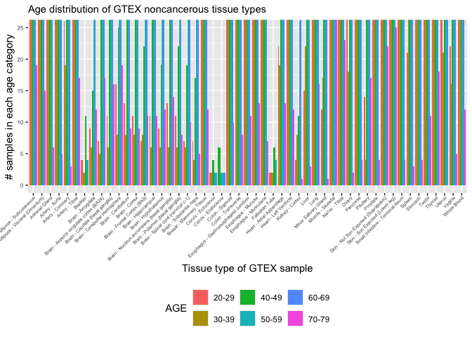
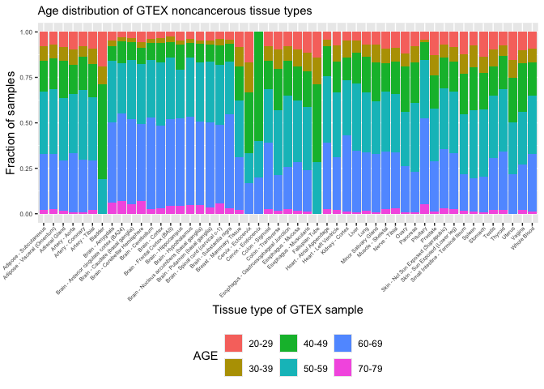

# Filtering GTEX and TARGET samples from SRA
Cindy Liang (celiang@ucsc.edu)
2025-09-17

## Introduction

The goals of this notebook are to filter the following SRA tables for
files to download:

- TARGET SRA table, for pediatric cancer bulk RNA-seq to download. These
  sequences will be used as a query group for performing splicing

- GTEX SRA table and metadata matching ages to subject IDs, for samples
  from the youngest donors

Additionally, this notebook obtains an estimate of how much space files
will take up. There is 2.64Tb of free space on the huge OpenStack
instance.

Metadata used for this analysis are:

- `SraRunTable-TARGET.csv`, metadata file of accession IDs for dbGaP
  samples with the TARGET dataset. Created by downloading the SRA run
  table on dbGaP, with the “phs000218” filter (parent phs ID for TARGET
  dataset)
- `GTEX_SraRunTable.csv`, metadata file of dbGaP accession IDs
  containing GTEX samples.
- `GTEx_Analysis_v10_Annotations_SubjectPhenotypesDS.txt`, public
  annotation file consisting of GTEX sample IDs and their ages in
  10-year brackets, obtained from
  <https://storage.googleapis.com/adult-gtex/annotations/v10/metadata-files/GTEx_Analysis_v10_Annotations_SubjectPhenotypesDS.txt>
  , which is accessible by clicking the download icon next to
  “GTEx_Analysis_v10_Annotations_SubjectPhenotypesDS.txt” on the [GTEX
  v10 metadata
  page](https://gtexportal.org/home/downloads/adult-gtex/metadata). The
  download command for this is in
  `data/scripts/00-reference_download.sh`.

## Setup

## Read in input and output paths

Read in directory and file paths

``` r
# find the project directory
base_dir <- here::here()

# find the root-level repo directory
repo_root <- rprojroot::find_root(rprojroot::is_git_root)

# define metadata directory
metadata_dir <- file.path(repo_root, "data/metadata")
gtex_target_metadata_dir <- file.path(metadata_dir, "filter_target_gtex")

# define paths to input files
target_sra_file <- file.path(gtex_target_metadata_dir, "SraRunTable-TARGET.csv")
gtex_sra_file <- file.path(gtex_target_metadata_dir, "GTEX_SraRunTable.csv")
gtex_ages_file <- file.path(gtex_target_metadata_dir, "GTEx_Analysis_v10_Annotations_SubjectPhenotypesDS.txt")

# define path to output files
target_accession_path <- file.path(gtex_target_metadata_dir, "target_accessions.tsv")
gtex_accession_path <- file.path(gtex_target_metadata_dir, "gtex_accessions.tsv")

# read in files as variables
target_sra <- readr::read_csv(target_sra_file, col_types = readr::cols(Bytes = "d", .default = "c"))

gtex_sra <- readr::read_csv(gtex_sra_file, col_types = readr::cols(Bytes = "d", .default = "c")) |>
  dplyr::rename(SUBJID = submitted_subject_id)

gtex_ages <- readr::read_tsv(gtex_ages_file, col_types = readr::cols(.default = "c"))
```

# Filtering GTEX samples for download

Combine GTEX age table with GTEX accessions to filter by age and check
how many samples of each age bracket are represented by each tumor type

``` r
# Merge GTEX SRA table with ages metadata to associate IDs with ages
gtex_sra_ages <- gtex_sra |>
  dplyr::left_join(gtex_ages, by = "SUBJID") |>
  dplyr::filter(
    analyte_type == "RNA:Total RNA",
    # Exclude cell line samples
    !grepl("Cells", body_site)
  ) |>
  dplyr::select(AGE, Run, body_site, Bytes, SUBJID, BioProject, BioSample, `SRA Study`, LibraryLayout, version, create_date, ReleaseDate)

# Summarize number of samples per tissue type in each age bracket
gtex_ages_summary <- gtex_sra_ages |>
  dplyr::group_by(body_site, AGE) |>
  dplyr::summarise(age_count = dplyr::n())
```

    `summarise()` has grouped output by 'body_site'. You can override using the
    `.groups` argument.

check distribution of accession IDs in each version number before
filtering out cell lines. Only versions up to 4 are recorded, all others
are NA

``` r
gtex_sra |>
  dplyr::group_by(version) |>
  dplyr::summarise(version_count = dplyr::n())
```

| version | version_count |
|:--------|--------------:|
| 1       |          1192 |
| 2       |          9572 |
| 3       |           267 |
| 4       |             6 |
| NA      |         13418 |

Check distribution of GTEX create dates for accessions without version
number, after filtering out cell line data. Unfortunately, no creation
date is recorded for versions above 4.

``` r
gtex_sra_ages |>
  dplyr::filter(is.na(version)) |>
  dplyr::group_by(create_date) |>
  dplyr::summarise(date_count = dplyr::n())
```

| create_date | date_count |
|:------------|-----------:|
| NA          |      12121 |

Check distribution of GTEX release dates of accession IDs without
version numbers. The release date for version 6p1 is 2015
([source](https://www.ncbi.nlm.nih.gov/projects/gap/cgi-bin/study.cgi?study_id=phs000424.v6.p1)),
so these values represent samples from later versions that are only
accessible on AnVIL.

``` r
gtex_sra_ages |>
  dplyr::mutate(ReleaseDate = stringr::str_remove(ReleaseDate, "-.*")) |>
  dplyr::group_by(ReleaseDate) |>
  dplyr::summarise(date_count = dplyr::n())
```

| ReleaseDate | date_count |
|:------------|-----------:|
| 2012        |        598 |
| 2013        |       1120 |
| 2014        |       7322 |
| 2015        |         58 |
| 2016        |        127 |
| 2018        |      12121 |

Plot distribution of ages across tissue types in GTEX to visually check
age bins in each tissue type.

There appear to be samples in the youngest age bracket (20-29 years) for
every tissue type, except for “Cervix - Endocervix”. Additionally, the
next youngest age bracket for “Cervix - Endocervix” samples is 40-49
years, instead of 30-39 years.

``` r
ggplot(gtex_ages_summary, aes(fill = AGE, x = body_site, y = age_count)) +
  geom_bar(position = "dodge", stat = "identity") +
  scale_color_brewer(palette = "Set1") +
  theme(
    legend.position = "bottom",
    plot.title = element_text(size = 11),
    axis.text = element_text(size = 6),
    axis.text.x = element_text(
      hjust = 1,
      margin = margin(t = 0, r = 80, b = 0, l = 0),
      size = 5
    )
  ) +
  labs(
    title = "Age distribution of GTEX noncancerous tissue types",
    x = "Tissue type of GTEX sample",
    y = "# samples in each age category"
  ) +
  scale_x_discrete(guide = guide_axis(angle = 45)) +
  coord_cartesian(
    xlim = NULL,
    ylim = c(0, 25),
    expand = TRUE,
    default = FALSE,
    clip = "on"
  )
```

<div id="fig-gtex_age_distribution">




Figure 1

</div>

Plot distribution of ages as a percent stacked bar plot.

``` r
ggplot(gtex_ages_summary, aes(fill = AGE, x = body_site, y = age_count)) +
  geom_bar(position = "fill", stat = "identity") +
  scale_color_brewer(palette = "Set1") +
  theme(
    legend.position = "bottom",
    plot.title = element_text(size = 11),
    axis.text = element_text(size = 6),
    axis.text.x = element_text(
      hjust = 1,
      margin = margin(t = 0, r = 80, b = 0, l = 0),
      size = 5
    )
  ) +
  labs(
    title = "Age distribution of GTEX noncancerous tissue types",
    x = "Tissue type of GTEX sample",
    y = "Fraction of samples"
  ) +
  scale_x_discrete(guide = guide_axis(angle = 45))
```

<div id="fig-gtex_age_dist_stacked_bar">




Figure 2

</div>

Estimate amount of space GTEX samples will take up if cell lines and
version numbers above 4 are excluded

``` r
gtex_sra_version_filtered <- gtex_sra_ages |>
  dplyr::filter(version <= 6)

# estimate amount of space files will take up
gtex_sra_version_filtered_space <- (sum(gtex_sra_version_filtered$Bytes) / 1e12)
paste0("About ", gtex_sra_version_filtered_space, " terabytes of space will be taken up by file downloads.")
```

    [1] "About 33.07779200409 terabytes of space will be taken up by file downloads."

Print number of samples in all tissue types after excluding cell lines
and version numbers above 4

``` r
gtex_sra_ages |>
  dplyr::filter(version <= 6) |>
  dplyr::group_by(body_site) |>
  dplyr::summarize(n_after_excluding_versions = dplyr::n())
```

| body_site                                 | n_after_excluding_versions |
|:------------------------------------------|---------------------------:|
| Adipose - Subcutaneous                    |                        385 |
| Adipose - Visceral (Omentum)              |                        235 |
| Adrenal Gland                             |                        161 |
| Artery - Aorta                            |                        250 |
| Artery - Coronary                         |                        144 |
| Artery - Tibial                           |                        362 |
| Bladder                                   |                         10 |
| Brain - Amygdala                          |                         83 |
| Brain - Anterior cingulate cortex (BA24)  |                        101 |
| Brain - Caudate (basal ganglia)           |                        138 |
| Brain - Cerebellar Hemisphere             |                        120 |
| Brain - Cerebellum                        |                        151 |
| Brain - Cortex                            |                        133 |
| Brain - Frontal Cortex (BA9)              |                        120 |
| Brain - Hippocampus                       |                        109 |
| Brain - Hypothalamus                      |                        106 |
| Brain - Nucleus accumbens (basal ganglia) |                        127 |
| Brain - Putamen (basal ganglia)           |                        105 |
| Brain - Spinal cord (cervical c-1)        |                         76 |
| Brain - Substantia nigra                  |                         75 |
| Breast - Mammary Tissue                   |                        220 |
| Cervix - Ectocervix                       |                          6 |
| Cervix - Endocervix                       |                          5 |
| Colon - Sigmoid                           |                        172 |
| Colon - Transverse                        |                        206 |
| Esophagus - Gastroesophageal Junction     |                        176 |
| Esophagus - Mucosa                        |                        333 |
| Esophagus - Muscularis                    |                        290 |
| Fallopian Tube                            |                          7 |
| Heart - Atrial Appendage                  |                        219 |
| Heart - Left Ventricle                    |                        272 |
| Kidney - Cortex                           |                         36 |
| Liver                                     |                        138 |
| Lung                                      |                        379 |
| Minor Salivary Gland                      |                         70 |
| Muscle - Skeletal                         |                        475 |
| Nerve - Tibial                            |                        337 |
| Ovary                                     |                        112 |
| Pancreas                                  |                        198 |
| Pituitary                                 |                        130 |
| Prostate                                  |                        120 |
| Skin - Not Sun Exposed (Suprapubic)       |                        275 |
| Skin - Sun Exposed (Lower leg)            |                        401 |
| Small Intestine - Terminal Ileum          |                        104 |
| Spleen                                    |                        118 |
| Stomach                                   |                        208 |
| Testis                                    |                        206 |
| Thyroid                                   |                        360 |
| Uterus                                    |                         96 |
| Vagina                                    |                        100 |
| Whole Blood                               |                        465 |

Estimate amount of space GTEX samples will take up if only cell lines
are excluded

``` r
# estimate amount of space files will take up
gtex_sra_space <- (sum(gtex_sra_ages$Bytes) / 1e12)
paste0("About ", gtex_sra_space, " terabytes of space will be taken up by file downloads.")
```

    [1] "About 78.394417091648 terabytes of space will be taken up by file downloads."

Print number of samples in each tissue type of full GTEX dataset,
excluding cell lines only

``` r
gtex_sra_ages |>
  dplyr::group_by(body_site) |>
  dplyr::summarize(n = dplyr::n())
```

| body_site                                 |    n |
|:------------------------------------------|-----:|
| Adipose - Subcutaneous                    |  870 |
| Adipose - Visceral (Omentum)              |  599 |
| Adrenal Gland                             |  366 |
| Artery - Aorta                            |  564 |
| Artery - Coronary                         |  328 |
| Artery - Tibial                           |  826 |
| Bladder                                   |   21 |
| Brain - Amygdala                          |  191 |
| Brain - Anterior cingulate cortex (BA24)  |  235 |
| Brain - Caudate (basal ganglia)           |  314 |
| Brain - Cerebellar Hemisphere             |  275 |
| Brain - Cerebellum                        |  346 |
| Brain - Cortex                            |  308 |
| Brain - Frontal Cortex (BA9)              |  265 |
| Brain - Hippocampus                       |  244 |
| Brain - Hypothalamus                      |  244 |
| Brain - Nucleus accumbens (basal ganglia) |  288 |
| Brain - Putamen (basal ganglia)           |  241 |
| Brain - Spinal cord (cervical c-1)        |  178 |
| Brain - Substantia nigra                  |  170 |
| Breast - Mammary Tissue                   |  526 |
| Cervix - Ectocervix                       |   12 |
| Cervix - Endocervix                       |   10 |
| Colon - Sigmoid                           |  425 |
| Colon - Transverse                        |  491 |
| Esophagus - Gastroesophageal Junction     |  439 |
| Esophagus - Mucosa                        |  776 |
| Esophagus - Muscularis                    |  684 |
| Fallopian Tube                            |   14 |
| Heart - Atrial Appendage                  |  528 |
| Heart - Left Ventricle                    |  623 |
| Kidney - Cortex                           |   86 |
| Liver                                     |  326 |
| Lung                                      |  852 |
| Minor Salivary Gland                      |  174 |
| Muscle - Skeletal                         | 1099 |
| Nerve - Tibial                            |  779 |
| Ovary                                     |  250 |
| Pancreas                                  |  462 |
| Pituitary                                 |  321 |
| Prostate                                  |  278 |
| Skin - Not Sun Exposed (Suprapubic)       |  685 |
| Skin - Sun Exposed (Lower leg)            |  921 |
| Small Intestine - Terminal Ileum          |  247 |
| Spleen                                    |  287 |
| Stomach                                   |  481 |
| Testis                                    |  486 |
| Thyroid                                   |  850 |
| Uterus                                    |  213 |
| Vagina                                    |  223 |
| Whole Blood                               |  925 |

Filter for GTEX samples in the youngest age brackets for each tissue
type. Subset samples by sorting data by age and taking lowest 7 values
per tissue type by minimum age.

``` r
gtex_age_subsampled <- gtex_sra_ages |>
  # filter for samples from GTEX version 6 or below (versions above this value are stored in AnVIL and cannot be accessed through sra-toolkit)
  # Only versions up to 4 are recorded in this metadata, all other samples have an NA value for this column
  dplyr::filter(version <= 6) |>
  # take smallest age in each bracket and convert to numeric for slicing
  dplyr::mutate(
    age_min = as.numeric(stringr::str_split_i(AGE, "-", 1))
  ) |>
  # select rows with smallest age_min while ignoring ties
  dplyr::slice_min(age_min, n = 7, with_ties = FALSE, by = body_site)

# count how many rows there are
paste0("There are ", nrow(gtex_age_subsampled), " accessions matching the filters.")
```

    [1] "There are 354 accessions matching the filters."

``` r
# estimate amount of space files will take up
subsampled_gtex_space <- (sum(gtex_age_subsampled$Bytes) / 1e12)
paste0("About ", subsampled_gtex_space, " terabytes of space will be taken up by file downloads.")
```

    [1] "About 1.253700160294 terabytes of space will be taken up by file downloads."

Print breakdown of number of samples per tissue type after subsampling
GTEX

The majority of samples have 7 replicates, but one has 6 (ectocervix)
and one has 5 (endocervix)

``` r
gtex_age_subsampled |>
  dplyr::count(body_site) |>
  tidyr::pivot_wider(
    names_from = n,
    values_from = body_site
  )
```

    Warning: Values from `body_site` are not uniquely identified; output will contain
    list-cols.
    • Use `values_fn = list` to suppress this warning.
    • Use `values_fn = {summary_fun}` to summarise duplicates.
    • Use the following dplyr code to identify duplicates.
      {data} |>
      dplyr::summarise(n = dplyr::n(), .by = c(n)) |>
      dplyr::filter(n > 1L)

| 7 | 6 | 5 |
|:---|:---|:---|
| Adipose - Subcutaneous , Adipose - Visceral (Omentum) , Adrenal Gland , Artery - Aorta , Artery - Coronary , Artery - Tibial , Bladder , Brain - Amygdala , Brain - Anterior cingulate cortex (BA24) , Brain - Caudate (basal ganglia) , Brain - Cerebellar Hemisphere , Brain - Cerebellum , Brain - Cortex , Brain - Frontal Cortex (BA9) , Brain - Hippocampus , Brain - Hypothalamus , Brain - Nucleus accumbens (basal ganglia), Brain - Putamen (basal ganglia) , Brain - Spinal cord (cervical c-1) , Brain - Substantia nigra , Breast - Mammary Tissue , Colon - Sigmoid , Colon - Transverse , Esophagus - Gastroesophageal Junction , Esophagus - Mucosa , Esophagus - Muscularis , Fallopian Tube , Heart - Atrial Appendage , Heart - Left Ventricle , Kidney - Cortex , Liver , Lung , Minor Salivary Gland , Muscle - Skeletal , Nerve - Tibial , Ovary , Pancreas , Pituitary , Prostate , Skin - Not Sun Exposed (Suprapubic) , Skin - Sun Exposed (Lower leg) , Small Intestine - Terminal Ileum , Spleen , Stomach , Testis , Thyroid , Uterus , Vagina , Whole Blood | Cervix - Ectocervix | Cervix - Endocervix |

Summarize size of samples in GTEX subset

``` r
gtex_age_subsampled |>
  dplyr::summarise(mean(Bytes), max(Bytes))
```

| mean(Bytes) |  max(Bytes) |
|------------:|------------:|
|  3541525877 | 22530369665 |

Summarize library type (paired or unpaired) to inform alignment approach

``` r
table(gtex_age_subsampled$LibraryLayout)
```


    PAIRED 
       354 

Export filtered and subsampled GTEX accession file

``` r
# Move run ID to first column, like in TARGET accessions file
gtex_age_subsampled <- gtex_age_subsampled |>
  dplyr::relocate(Run)

readr::write_tsv(gtex_age_subsampled, file = file.path(gtex_accession_path))
```

# Filter TARGET dataset for download

Estimate amount of space all of TARGET will take up, only excluding cell
line samples

``` r
target_no_cell_line_sra <- target_sra |>
  # filter only for accession IDs with sequence files associated with them
  dplyr::filter(
    # Filter for TARGET samples
    biospecimen_repository == "NCI_TARGET",
    # exclude cell line RNA-seq
    study_name != "TARGET: Cancer Model Systems (MDLS): Cell Lines and Xenografts (including PPTP)",
    # filter for samples with fastqs
    grepl("fastq", `DATASTORE filetype`)
  ) |>
  # transform Bytes column to numeric for estimating space
  dplyr::mutate_at(dplyr::vars(Bytes), as.numeric) |>
  # select for only relevant columns
  dplyr::select(
    Run, biospecimen_repository, `DATASTORE filetype`, body_site, Bytes, study_name, `DATASTORE provider`, analyte_type, `Assay Type`, `SRA Study`, BioProject, BioSample, LibraryLayout
  )

# count how many rows there are
paste0("There are ", nrow(target_no_cell_line_sra), " accessions matching the filters.")
```

    [1] "There are 1604 accessions matching the filters."

``` r
# estimate amount of space files will take up
file_space <- sum(target_no_cell_line_sra$Bytes) / 1e12
paste0("About ", file_space, " terabytes of space will be taken up by file downloads.")
```

    [1] "About 14.392203318626 terabytes of space will be taken up by file downloads."

Filter accession metadata for TARGET RNA-seq datasets

``` r
# filter accession table for accession IDs of TARGET samples with fastqs
target_filtered_sra <- target_sra |>
  # filter only for accession IDs with sequence files associated with them
  dplyr::filter(
    # Filter for TARGET samples
    biospecimen_repository == "NCI_TARGET",
    # exclude osteosarcomas due to their complex transcriptome
    study_name != "TARGET: Osteosarcoma (OS)",
    # also exclude the pilot phase 1 ALL samples because there are far more ALL samples in pilot phase 2
    study_name != "TARGET: Acute Lymphoblastic Leukemia (ALL) Pilot Phase 1",
    # exclude cell line RNA-seq
    study_name != "TARGET: Cancer Model Systems (MDLS): Cell Lines and Xenografts (including PPTP)",
    # filter for samples with fastqs
    grepl("fastq", `DATASTORE filetype`)
  ) |>
  # transform Bytes column to numeric for estimating space
  dplyr::mutate_at(dplyr::vars(Bytes), as.numeric) |>
  # select for only relevant columns
  dplyr::select(
    Run, biospecimen_repository, `DATASTORE filetype`, body_site, Bytes, study_name, `DATASTORE provider`, analyte_type, `Assay Type`, `SRA Study`, BioProject, BioSample, LibraryLayout
  )

# count how many rows there are
paste0("There are ", nrow(target_filtered_sra), " accessions matching the filters.")
```

    [1] "There are 1421 accessions matching the filters."

``` r
# estimate amount of space files will take up
file_space <- sum(target_filtered_sra$Bytes) / 1e12
paste0("About ", file_space, " terabytes of space will be taken up by file downloads.")
```

    [1] "About 13.599346454039 terabytes of space will be taken up by file downloads."

Summarize distribution of analyte type for TARGET samples (RNA, DNA, or
both)

``` r
target_filtered_sra |> dplyr::count(analyte_type)
```

| analyte_type |    n |
|:-------------|-----:|
| RNA          | 1421 |

Summarize distribution of assay type for TARGET samples

``` r
target_filtered_sra |> dplyr::count(`Assay Type`)
```

| Assay Type |    n |
|:-----------|-----:|
| RNA-Seq    | 1421 |

Conclusions: All TARGET samples appear to be RNA-seq. Another dataset
with matched DNA & RNA sequencing will be needed to examine SNV status
of pediatric cancers.

Summarize distribution of tumor types across TARGET samples:

``` r
target_filtered_sra |> dplyr::count(study_name)
```

| study_name                                                   |   n |
|:-------------------------------------------------------------|----:|
| TARGET: Acute Lymphoblastic Leukemia (ALL) Expansion Phase 2 | 579 |
| TARGET: Acute Myeloid Leukemia (AML)                         | 450 |
| TARGET: Kidney, Clear Cell Sarcoma of the Kidney (CCSK)      |  13 |
| TARGET: Kidney, Rhabdoid Tumor (RT)                          |  81 |
| TARGET: Kidney, Wilms Tumor (WT)                             | 137 |
| TARGET: Neuroblastoma (NBL)                                  | 161 |

Conclusions: The predominant cancer type in the TARGET dataset consist
of leukemias (ALL and AML).

Subsample TARGET dataset to obtain a max of 20 samples per tumor type
(aiming to take up ~ half the space of the huge OpenStack instance,
~1.3TB

``` r
subsampled_target <- target_filtered_sra |>
  dplyr::slice_sample(n = 15, by = study_name)

# count how many rows there are
paste0("There are ", nrow(subsampled_target), " accessions matching the filters.")
```

    [1] "There are 88 accessions matching the filters."

``` r
# estimate amount of space files will take up
subsampled_file_space <- (sum(subsampled_target$Bytes) / 1e12)
paste0("About ", subsampled_file_space, " terabytes of space will be taken up by file downloads.")
```

    [1] "About 0.91495914964 terabytes of space will be taken up by file downloads."

Summarize distribution of tumor types across TARGET samples, to confirm
subsampling:

``` r
subsampled_target |> dplyr::count(study_name)
```

| study_name                                                   |   n |
|:-------------------------------------------------------------|----:|
| TARGET: Acute Lymphoblastic Leukemia (ALL) Expansion Phase 2 |  15 |
| TARGET: Acute Myeloid Leukemia (AML)                         |  15 |
| TARGET: Kidney, Clear Cell Sarcoma of the Kidney (CCSK)      |  13 |
| TARGET: Kidney, Rhabdoid Tumor (RT)                          |  15 |
| TARGET: Kidney, Wilms Tumor (WT)                             |  15 |
| TARGET: Neuroblastoma (NBL)                                  |  15 |

Note: Clear Cell Sarcoma samples are the least represented in this
subsampled dataset, since it has the smallest N.

Check max Bytes of dataset to estimate max filesize to enable for
download

``` r
subsampled_target |>
  dplyr::summarise(mean(Bytes), max(Bytes))
```

| mean(Bytes) |  max(Bytes) |
|------------:|------------:|
| 10397263064 | 16362056410 |

Print Byte info of accession ID that was filling the cache:

``` r
subsampled_target |>
  dplyr::filter(Run == "SRR1559070") |>
  dplyr::select(Run, Bytes, study_name)
```

| Run | Bytes | study_name |
|:----|------:|:-----------|

SRR1559070 is the sample that produced the prefetch and fasterq-dump
errors due to its large file size. Since it is the largest file in the
subset I am downloading, set the max prefetch file size to a value well
above this sample’s estimated bytes (50000000 Bytes, or 50 GB).

Check whether libraries are paired or unpaired for alignment

``` r
table(subsampled_target$LibraryLayout)
```


    PAIRED 
        88 

Export filtered and subsampled TARGET accession file

``` r
target_accessions <- subsampled_target |>
  dplyr::select(Run, `SRA Study`, BioProject, BioSample, study_name)

readr::write_tsv(target_accessions, file = file.path(target_accession_path))
```

Print session info

``` r
sessionInfo()
```

    R version 4.4.3 (2025-02-28)
    Platform: aarch64-apple-darwin20
    Running under: macOS Sequoia 15.6.1

    Matrix products: default
    BLAS:   /Library/Frameworks/R.framework/Versions/4.4-arm64/Resources/lib/libRblas.0.dylib 
    LAPACK: /Library/Frameworks/R.framework/Versions/4.4-arm64/Resources/lib/libRlapack.dylib;  LAPACK version 3.12.0

    locale:
    [1] en_US.UTF-8/en_US.UTF-8/en_US.UTF-8/C/en_US.UTF-8/en_US.UTF-8

    time zone: America/Los_Angeles
    tzcode source: internal

    attached base packages:
    [1] stats     graphics  grDevices utils     datasets  methods   base     

    other attached packages:
    [1] ggplot2_3.5.2

    loaded via a namespace (and not attached):
     [1] bit_4.6.0          gtable_0.3.6       jsonlite_2.0.0     dplyr_1.1.4       
     [5] compiler_4.4.3     renv_1.0.11        crayon_1.5.3       tidyselect_1.2.1  
     [9] stringr_1.5.1      parallel_4.4.3     tidyr_1.3.1        scales_1.4.0      
    [13] yaml_2.3.10        fastmap_1.2.0      here_1.0.1         readr_2.1.5       
    [17] R6_2.6.1           labeling_0.4.3     generics_0.1.4     knitr_1.50        
    [21] tibble_3.3.0       rprojroot_2.0.4    pillar_1.11.0      RColorBrewer_1.1-3
    [25] tzdb_0.5.0         rlang_1.1.6        stringi_1.8.7      xfun_0.52         
    [29] bit64_4.6.0-1      cli_3.6.5          withr_3.0.2        magrittr_2.0.3    
    [33] digest_0.6.37      grid_4.4.3         vroom_1.6.5        hms_1.1.3         
    [37] lifecycle_1.0.4    vctrs_0.6.5        evaluate_1.0.4     glue_1.8.0        
    [41] farver_2.1.2       purrr_1.0.4        rmarkdown_2.29     tools_4.4.3       
    [45] pkgconfig_2.0.3    htmltools_0.5.8.1 
