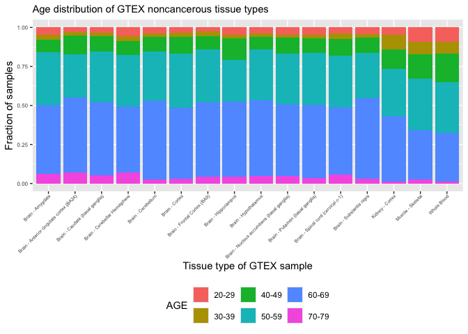

# Filtering GTEX and TARGET samples from SRA
Cindy Liang (celiang@ucsc.edu)
2026-03-18

## Introduction

The goals of this notebook are to filter the following SRA tables for
files to download:

- TARGET SRA table, for pediatric cancer bulk RNA-seq to download. These
  sequences will be used as a query group for performing splicing

- GTEX SRA table and metadata matching ages to subject IDs, for samples
  from the youngest donors

Additionally, this notebook obtains an estimate of how much space files
will take up. There is 2.64Tb of free space on the huge OpenStack
instance.

Metadata used for this analysis are:

- `SraRunTable-TARGET.csv`, metadata file of accession IDs for dbGaP
  samples with the TARGET dataset. Created by downloading the SRA run
  table on dbGaP, with the “phs000218” filter (parent phs ID for TARGET
  dataset)
- `GTEX_SraRunTable.csv`, metadata file of dbGaP accession IDs
  containing GTEX samples.
- `GTEx_Analysis_v10_Annotations_SubjectPhenotypesDS.txt`, public
  annotation file consisting of GTEX sample IDs and their ages in
  10-year brackets, obtained from
  <https://storage.googleapis.com/adult-gtex/annotations/v10/metadata-files/GTEx_Analysis_v10_Annotations_SubjectPhenotypesDS.txt>
  , which is accessible by clicking the download icon next to
  “GTEx_Analysis_v10_Annotations_SubjectPhenotypesDS.txt” on the [GTEX
  v10 metadata
  page](https://gtexportal.org/home/downloads/adult-gtex/metadata). The
  download command for this is in
  `data/scripts/00-reference_download.sh`.

## Setup

## Read in input and output paths

Read in directory and file paths

``` r
# find the project directory (splicing-compendium)
# working directory is in scripts
base_dir <- here::here()

# define metadata directory
metadata_dir <- file.path(base_dir, "metadata")
gtex_target_metadata_dir <- file.path(metadata_dir, "filter_target_gtex")

# define paths to input files
target_sra_file <- file.path(gtex_target_metadata_dir, "SraRunTable-TARGET.csv")
gtex_sra_file <- file.path(gtex_target_metadata_dir, "GTEX_SraRunTable.csv")
gtex_ages_file <- file.path(gtex_target_metadata_dir, "GTEx_Analysis_v10_Annotations_SubjectPhenotypesDS.txt")

# define path to output files
target_accession_path <- file.path(gtex_target_metadata_dir, "target_accessions.tsv")
gtex_accession_path <- file.path(gtex_target_metadata_dir, "gtex_accessions.tsv")

# read in files
target_sra <- readr::read_csv(target_sra_file, col_types = readr::cols(Bytes = "d", .default = "c"))

gtex_sra <- readr::read_csv(gtex_sra_file, col_types = readr::cols(Bytes = "d", .default = "c")) |>
  dplyr::rename(SUBJID = submitted_subject_id)

gtex_ages <- readr::read_tsv(gtex_ages_file, col_types = readr::cols(.default = "c"))
```

## Filtering GTEX samples for download

Combine GTEX age table with GTEX accessions so that we can check how
many samples of each age bracket are represented by each tumor type
after filtering

``` r
# Define tissue types of interest
# kidney, brain (CNS), muscle, and blood samples
tissue_types <- c("Brain - Nucleus accumbens (basal ganglia)",
                  "Brain - Caudate (basal ganglia)",
                  "Brain - Spinal cord (cervical c-1)",
                  "Brain - Hypothalamus",
                  "Kidney - Cortex",
                  "Brain - Frontal Cortex (BA9)",
                  "Muscle - Skeletal",
                  "Brain - Cerebellum",
                  "Whole Blood",
                  "Brain - Cerebellar Hemisphere",
                  "Brain - Hippocampus",
                  "Brain - Anterior cingulate cortex (BA24)",
                  "Brain - Cortex",
                  "Brain - Putamen (basal ganglia)",
                  "Brain - Substantia nigra",
                  "Brain - Amygdala"
                  )

# Merge GTEX SRA table with ages metadata to associate IDs with ages
# then filter tables for our criteria (RNA, paired-end, select tissue types)
gtex_sra_ages <- gtex_sra |>
  dplyr::left_join(gtex_ages, by = "SUBJID") |>
  dplyr::filter(
    analyte_type == "RNA:Total RNA",
    # Exclude cell line samples
    !grepl("Cells", body_site),
    # filter for polyA samples
    LibraryLayout == "PAIRED",
    # filter for tissue types in select list
    body_site %in% tissue_types
  ) |>
  dplyr::select(AGE, Run, body_site, Bytes, SUBJID, BioProject, BioSample, `SRA Study`, LibraryLayout, version, create_date, ReleaseDate, `DATASTORE filetype`, LibrarySelection)

dim(gtex_sra_ages)
```

    [1] 5405   14

We end up with 5405 samples after this filtering.

Note that I do not filter for GTEx samples with fastq under the
`DATASTORE filetype` column because there are none (I was still able to
download fastqs without this filter)

``` r
unique(gtex_sra_ages$`DATASTORE filetype`)
```

     [1] "sra,bam,run.zq" "sra,run.zq,bam" "bam,sra,run.zq" "run.zq,bam,sra"
     [5] "run.zq,sra,bam" "bam,run.zq,sra" "crai,cram"      "cram,crai"     
     [9] "sra,run.zq"     "run.zq,sra"    

Check library selection method of GTEx samples that are paired:

``` r
unique(gtex_sra_ages$LibrarySelection)
```

    [1] "cDNA"

The metadata says cDNA, but the GTex website says all their versions are
polyA selected: <https://www.gtexportal.org/home/methods>

### Check GTEx versions in filtered samples

Gtex v8 and above are also only accessible on anvil:
<https://www.gtexportal.org/home/protectedDataAccess> So we must filter
out samples that come from GTEx v8 and above

Check number of samples in each GTEx version after filtering.

``` r
gtex_sra_ages |>
  dplyr::group_by(version) |>
  dplyr::summarise(version_count = dplyr::n())
```

| version | version_count |
|:--------|--------------:|
| 1       |            53 |
| 2       |          2288 |
| 3       |            70 |
| 4       |             5 |
| NA      |          2989 |

Only versions up to 4 are recorded, all others are NA.

Check distribution of GTEx create dates for accessions without version
number. Can we associate a GTEx version with these samples based on when
each version was released? No creation date is recorded for samples from
unrecorded versions, so we will just filter those out

``` r
gtex_sra_ages |>
  dplyr::filter(is.na(version)) |>
  dplyr::group_by(create_date) |>
  dplyr::summarise(date_count = dplyr::n())
```

| create_date | date_count |
|:------------|-----------:|
| NA          |       2989 |

The release date for version 8p2 is 2019-07-18
[source](https://www.ncbi.nlm.nih.gov/projects/gap/cgi-bin/study.cgi?study_id=phs000424.v8.p2),
so these values represent samples from later versions that are only
accessible on AnVIL. We should filter out samples with release dates
greater than or equal to 2018.

``` r
gtex_sra_ages |>
  dplyr::mutate(ReleaseDate = stringr::str_remove(ReleaseDate, "-.*")) |>
  dplyr::group_by(ReleaseDate) |>
  dplyr::summarise(date_count = dplyr::n())
```

| ReleaseDate | date_count |
|:------------|-----------:|
| 2012        |        281 |
| 2013        |        391 |
| 2014        |       1681 |
| 2015        |         17 |
| 2016        |         46 |
| 2018        |       2989 |

Filter GTEx samples for accessions downloadable outside of AnVIL

``` r
gtex_sra_downloadable <- gtex_sra_ages |>
  dplyr::filter(ReleaseDate < 2018)

dim(gtex_sra_downloadable)
```

    [1] 2416   14

2416 GTEx samples remain that are downloadable outside of AnVIL.

Estimate amount of space filtered GTEX samples will take up

``` r
# estimate amount of space files will take up
gtex_sra_downloadable_space <- (sum(gtex_sra_downloadable$Bytes) / 1e12)
paste0("About ", gtex_sra_downloadable_space, " terabytes of space will be taken up by file downloads.")
```

    [1] "About 9.53255759503 terabytes of space will be taken up by file downloads."

### Plot fraction of filtered GTEx samples in each age group

Plot distribution of ages in the filtered GTEx samples as a percent
stacked bar plot.

``` r
# Summarize number of samples per tissue type in each age bracket
gtex_ages_summary <- gtex_sra_downloadable |>
  dplyr::group_by(body_site, AGE) |>
  dplyr::summarise(age_count = dplyr::n())
```

    `summarise()` has regrouped the output.
    ℹ Summaries were computed grouped by body_site and AGE.
    ℹ Output is grouped by body_site.
    ℹ Use `summarise(.groups = "drop_last")` to silence this message.
    ℹ Use `summarise(.by = c(body_site, AGE))` for per-operation grouping
      (`?dplyr::dplyr_by`) instead.

``` r
ggplot(gtex_ages_summary, aes(fill = AGE, x = body_site, y = age_count)) +
  geom_bar(position = "fill", stat = "identity") +
  scale_color_brewer(palette = "Dark2") +
  scale_fill_brewer(palette = "Dark2") +
  theme(
    legend.position = "bottom",
    plot.title = element_text(size = 11),
    axis.text = element_text(size = 6),
    axis.text.x = element_text(
      hjust = 1,
      margin = margin(t = 0, r = 80, b = 0, l = 0),
      size = 5
    )
  ) +
  labs(
    title = "Age distribution of GTEX noncancerous tissue types",
    x = "Tissue type of GTEX sample",
    y = "Fraction of samples"
  ) +
  scale_x_discrete(guide = guide_axis(angle = 45)) +
  plot_theme
```

<div id="fig-gtex_age_dist_stacked_bar">



Figure 1

</div>

As expected, there is a very small fraction of filtered GTEx samples
under the PEDAYA (\< 30 years) category.

Print number of samples in all tissue types after excluding cell lines
and version numbers above 8

``` r
gtex_sra_downloadable |>
  dplyr::group_by(body_site) |>
  dplyr::summarize(n_samples = dplyr::n())
```

| body_site                                 | n_samples |
|:------------------------------------------|----------:|
| Brain - Amygdala                          |        83 |
| Brain - Anterior cingulate cortex (BA24)  |       101 |
| Brain - Caudate (basal ganglia)           |       137 |
| Brain - Cerebellar Hemisphere             |       120 |
| Brain - Cerebellum                        |       151 |
| Brain - Cortex                            |       133 |
| Brain - Frontal Cortex (BA9)              |       120 |
| Brain - Hippocampus                       |       109 |
| Brain - Hypothalamus                      |       106 |
| Brain - Nucleus accumbens (basal ganglia) |       127 |
| Brain - Putamen (basal ganglia)           |       105 |
| Brain - Spinal cord (cervical c-1)        |        76 |
| Brain - Substantia nigra                  |        75 |
| Kidney - Cortex                           |        36 |
| Muscle - Skeletal                         |       474 |
| Whole Blood                               |       463 |

Just from eyeballing the numbers, our filtered GTEx is predominantly
made up of brain samples, which may impact splice comparison results.

### Export filtered GTEX accession file

``` r
# Move run ID to first column, like in TARGET accessions file
gtex_select <- gtex_sra_downloadable |>
  dplyr::relocate(Run)

readr::write_tsv(gtex_select, file = file.path(gtex_accession_path))
```

## Filter TARGET dataset for download

Estimate amount of space filtered TARGET samples will take up

``` r
target_filtered_sra <- target_sra |>
  # filter for TARGET accessions
  dplyr::filter(
    # Filter for TARGET samples
    biospecimen_repository == "NCI_TARGET",
    # exclude cell line RNA-seq
    study_name != "TARGET: Cancer Model Systems (MDLS): Cell Lines and Xenografts (including PPTP)",
    # exclude osteosarcomas because they have a complex transcriptome and we have no bone GTEx comparator
    study_name != "TARGET: Osteosarcoma (OS)",
    # filter for samples with fastqs
    grepl("fastq", `DATASTORE filetype`),
    # filter for paired end reads
    LibraryLayout == "PAIRED",
    # Filter for RNA-seq
    analyte_type == "RNA",
    # filter out ssRNA-seq
    `Assay Type`!= "ssRNA-seq"
  ) |>
  # transform Bytes column to numeric for estimating space
  dplyr::mutate_at(dplyr::vars(Bytes), as.numeric) |>
  # select for only relevant columns
  dplyr::select(
    Run, biospecimen_repository, `DATASTORE filetype`, body_site, Bytes, study_name, `DATASTORE provider`, analyte_type, `Assay Type`, `SRA Study`, BioProject, BioSample, LibraryLayout, LibrarySelection
  )

# count how many rows there are
paste0("There are ", nrow(target_filtered_sra), " accessions matching the filters.")
```

    [1] "There are 1424 accessions matching the filters."

``` r
# estimate amount of space files will take up
file_space <- sum(target_filtered_sra$Bytes) / 1e12
paste0("About ", file_space, " terabytes of space will be taken up by file downloads.")
```

    [1] "About 13.623308180979 terabytes of space will be taken up by file downloads."

Summarize distribution of library selection type for TARGET samples
(when I filter for “polyA”, no results show up)

``` r
target_filtered_sra |> dplyr::count(LibrarySelection)
```

| LibrarySelection |    n |
|:-----------------|-----:|
| RANDOM PCR       |    3 |
| cDNA             | 1247 |
| other            |  174 |

This information unfortunately tells me nothing. For now, I will just
export the SRA table of the TARGET samples under my existing filters
(don’t filter by library selection).

Summarize distribution of tumor types across TARGET samples:

``` r
target_filtered_sra |> dplyr::count(study_name)
```

| study_name                                                   |   n |
|:-------------------------------------------------------------|----:|
| TARGET: Acute Lymphoblastic Leukemia (ALL) Expansion Phase 2 | 579 |
| TARGET: Acute Lymphoblastic Leukemia (ALL) Pilot Phase 1     |   3 |
| TARGET: Acute Myeloid Leukemia (AML)                         | 450 |
| TARGET: Kidney, Clear Cell Sarcoma of the Kidney (CCSK)      |  13 |
| TARGET: Kidney, Rhabdoid Tumor (RT)                          |  81 |
| TARGET: Kidney, Wilms Tumor (WT)                             | 137 |
| TARGET: Neuroblastoma (NBL)                                  | 161 |

Export filtered and subsampled TARGET accession file

``` r
target_accessions <- target_filtered_sra |>
  dplyr::select(Run, `SRA Study`, BioProject, BioSample, study_name)

readr::write_tsv(target_accessions, file = file.path(target_accession_path))
```

Print session info

``` r
sessionInfo()
```

    R version 4.4.3 (2025-02-28)
    Platform: aarch64-apple-darwin20
    Running under: macOS 26.3.1

    Matrix products: default
    BLAS:   /Library/Frameworks/R.framework/Versions/4.4-arm64/Resources/lib/libRblas.0.dylib 
    LAPACK: /Library/Frameworks/R.framework/Versions/4.4-arm64/Resources/lib/libRlapack.dylib;  LAPACK version 3.12.0

    locale:
    [1] en_US.UTF-8/en_US.UTF-8/en_US.UTF-8/C/en_US.UTF-8/en_US.UTF-8

    time zone: America/Los_Angeles
    tzcode source: internal

    attached base packages:
    [1] stats     graphics  grDevices utils     datasets  methods   base     

    other attached packages:
    [1] ggplot2_4.0.2

    loaded via a namespace (and not attached):
     [1] bit_4.6.0          gtable_0.3.6       jsonlite_2.0.0     dplyr_1.2.0       
     [5] compiler_4.4.3     renv_1.0.11        crayon_1.5.3       tidyselect_1.2.1  
     [9] stringr_1.6.0      parallel_4.4.3     scales_1.4.0       yaml_2.3.12       
    [13] fastmap_1.2.0      here_1.0.2         readr_2.2.0        R6_2.6.1          
    [17] labeling_0.4.3     generics_0.1.4     knitr_1.51         tibble_3.3.1      
    [21] rprojroot_2.1.1    pillar_1.11.1      RColorBrewer_1.1-3 tzdb_0.5.0        
    [25] rlang_1.1.7        stringi_1.8.7      xfun_0.56          S7_0.2.1          
    [29] bit64_4.6.0-1      cli_3.6.5          withr_3.0.2        magrittr_2.0.4    
    [33] digest_0.6.39      grid_4.4.3         vroom_1.7.0        hms_1.1.4         
    [37] lifecycle_1.0.5    vctrs_0.7.1        evaluate_1.0.5     glue_1.8.0        
    [41] farver_2.1.2       rmarkdown_2.30     tools_4.4.3        pkgconfig_2.0.3   
    [45] htmltools_0.5.9   
